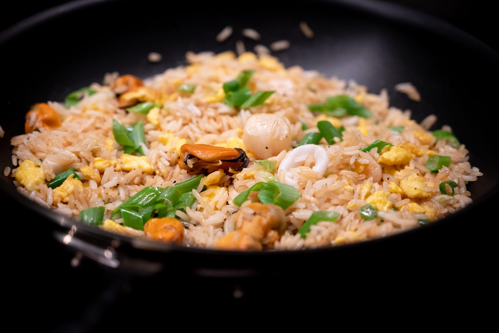
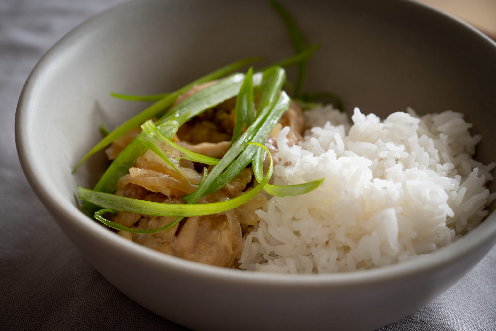
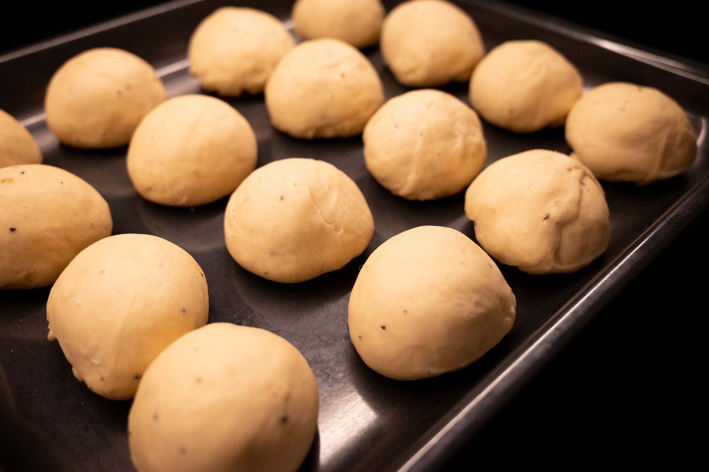
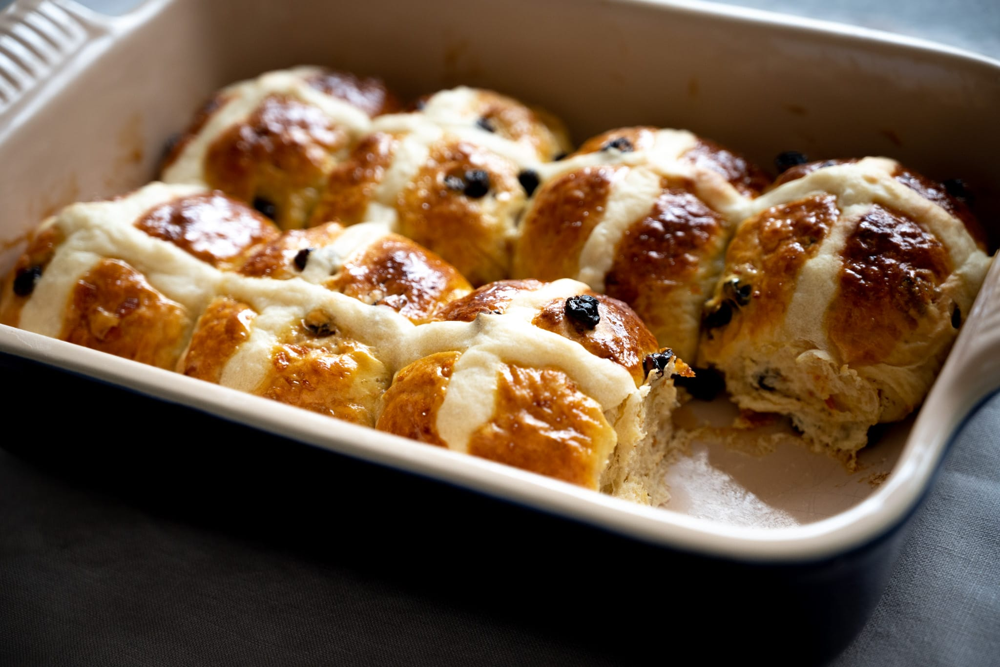
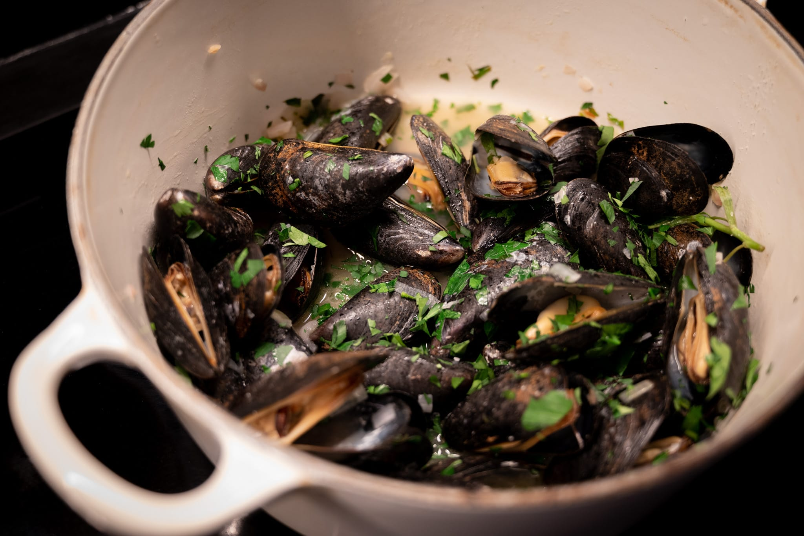
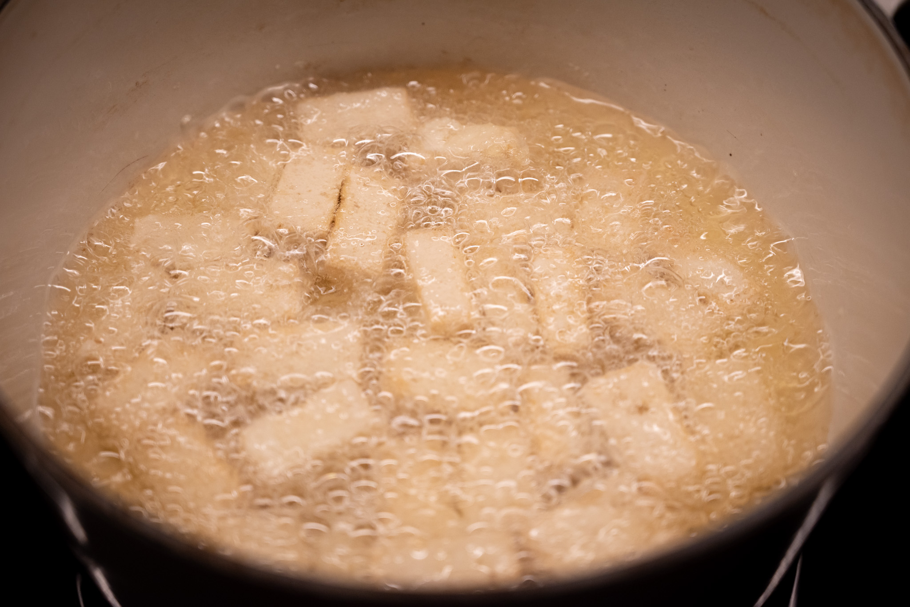
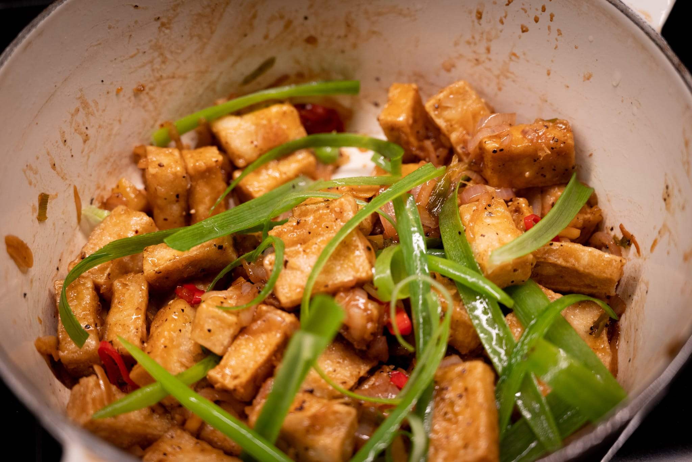
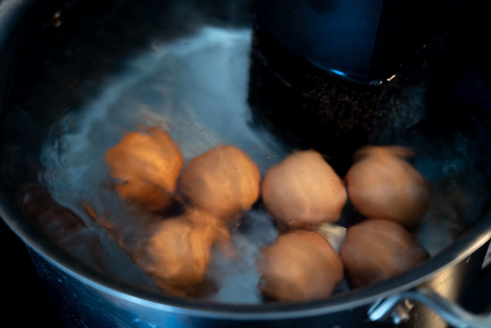

In my obliviousness, I completely missed the fact daylight saving time returned a few weeks ago. What a difference that makes. Both because it's nice the sun doesn't set at 5 PM, and also as it means I have more potential for getting lots of natural light for photos when I'm throwing together dinner in the evenings.

Before we get into what I've been up to for the last month, I wanted to highlight [a great piece of food writing](https://www.ft.com/content/6ac009d5-dbfd-4a86-839e-28bb44b2b64c) from a few weeks ago in the FT. One of their community editors wrote a great story about Alberto Grandi, who's caused a stir by showing people that Italian food history isn't quite what people imagine.

Early spring also brings to mind the not-so-fun events that got me into this periodic writing groove. A bout of nostalgia made me look back at what was [going on in 2020](https://tinyletter.com/pandemicmenus/letters/confinement-cooking-week-five) around this time of year. It's funny how quickly our memories fade. I had forgotten that for the first few weeks of lockdown, I couldn't even go out to get lunch and had to make it at home. Also fun to be reminded that we got to the stage where the FT ran a feature called [Bunker Food](https://www.ft.com/bunkerfood) and the [Dalgona coffee](https://www.youtube.com/watch?v=WHmpgMsW-aA) craze of early 2020.

True to plan, I spent some time calibrating myself against my new cooktop with several batches of fried rice. It worked reasonably well. Steaming the rice following the advice from the team at [Chinese Cooking Demystified](https://www.youtube.com/@ChineseCookingDemystified) makes such a big difference. It may be time for me to invest in a piece of carbon steel cookware, however. I was afraid of cranking the heat up too much on my delicate nonstick pans, and so I suspect I didn't get quite as much char as theoretically possible on some of the steps.

A gentler exercise was a batch of the wonderful poached ginger chicken from the Slanted Door. There's something very satisfying about the kick from the paper-thin slices of ginger in the sauce. Here too I found myself thinking a piece of carbon steel cookware would be nice. I paired the chicken and rice with some aggressively seared baby bok choy, and it's a real pain to get my pans clean after doing that.

In the baking department, I had another run at [_kardemommeboller_](https://madensverden.dk/kardemommeboller-god-opskrift/). I've come to really love cardamom as a flavor, and I love the idea of a slightly leaner, less decadent version of the cardamom twists I've made before that are more like cinnamon buns.

This time I tried infusing the milk and butter with the ground cardamom before mixing up the dough. I'm still not satisfied with the amount of cardamom pop the buns deliver. It's more of a whisper when I want it screaming in your face. More experimentation required.

My annual batch of hot cross buns for Good Friday was, on the other hand, a resounding success. This year I finally remembered to buy a tip with a smaller aperture for adding the crosses, so they looked halfway decent. I tried to restrain my greed by only making half a batch, which I immediately regretted. While I don't know what prompted me to make this into a bit of a tradition, it's been a nice addition to my calendar. Apparently I'm not alone either: the concept has really taken off in [Australia](https://www.nytimes.com/2023/04/03/dining/hot-cross-buns-australia.html).

Back in the savory world, the mood struck to make black pepper tofu. It was the first time I've done any deep frying since the new kitchen became usable. My past experience has been that deep frying is a fraught task. It's not fun to have oil spray everywhere and make my apartment smell like a fast food restaurant for a week.

Much to my surprise, frying with my new cooktop wasn't a problem at all. I'm not totally clear on why. My vent hood is still recirculating only --- it wasn't possible to get permission to join it up with an existing fresh air vent due to the risk of a grease buildup --- so that wasn't it. Better heat control thanks to the precision of the induction cooktop is my best guess. In any case, it's taken a lot of the fear out of doing fried food at home.

Last but not least, I dragged out the immersion circulator for the first time since going into storage for the kitchen renovation. I needed to make poached eggs, and there's no better way.

Looking forward to the month ahead, I'd say spring has finally arrived. I'm looking forward to going a bit lighter and more, well, spring-y.

I'd really love to find some great asparagus. It should be at its peak about now. As I've probably written before, the best I've been able to find in retails settings comes from New Jersey of all places. And it's surprisingly good. There's a recipe from Septime I'd like to try with salmon, or of course, it's always nice gently cooked and served with a poached egg.

I have it in mind to try a recipe for rye gnocchi from the kitchens of SPQR in San Francisco. Theirs is one of those cookbooks that I can't quite summon the energy to cook from. There's a lovely recipe for fluke crudo, but I can't be bothered to segment three kinds of citrus to put one piece of each gently on the cured fish. At the same time, I know those little touches are what make the dish. In any case, I think there's a more straightforward way to try out the gnocchi.

I'm still on my quest to make a halfway decent tourte auvergnate. Putting aside my parallel struggle to find a reasonable source for rye flour, the loaf itself is incredibly tricky. My experience with baguettes suggests that unless I start making an entire loaf of bread every day --- way more than I can eat --- this is going to require many more months of work.

Keeping with the baking theme, a few days ago, something struck me to go on an early morning walk, grab a croissant, and have a relaxing breakfast in the park by the river. The croissant I bought was surprisingly good. It also cost $5.

My cooking and baking at home is as much a hobby as anything. I'm certainly not doing it with an obvious financial goal in mind. Being forced to live on takeout for most of last year brought that home. Yes, it hurt a bit to spend so much on takeout. The pain of eating the same food with mass-market appeal over and over again was so much greater. I cook for variety and quality as much as anything. Something about the $5 maybe-better-than-average croissant set me off, though.

Which is my very long-winded way of saying I'll be making some croissants and other PLF-based items in the month ahead.