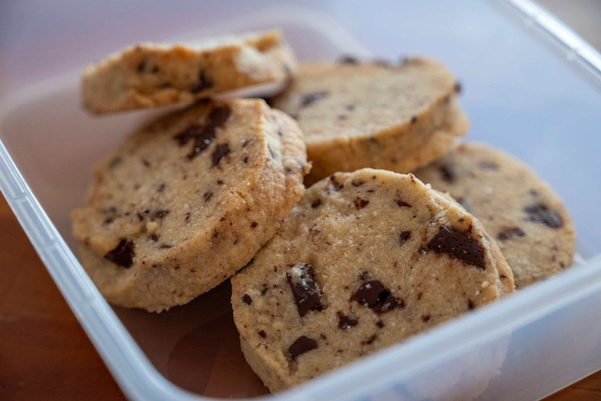

Spring has arrived in its usual noncommittal way over the last few weeks. It's been cold and wet, and sometimes difficult to motivate myself in food as in other areas.

Outside the kitchen, I had to pop down to New York for a few days, and I took the opportunity to do some food exploration. One outing in particular stood out: a little place called Via Carota in the West Village. (Little did I know that the day after it would be ranked fifth on Sam Sifton's top 100 places to eat in the city! Apparently it's a hot ticket. I had no idea.) It's not eye-opening the way some of the Copenhagen restaurants were, but everything I had was really well-executed.

Back at home, I had a few more runs at pizza _in teglia_ as planned. It should be an easier to do at home than the Neapolitan-style that's hands-down my favorite. For starters, unlike the Neapolitan-style pizza, you can get very close to the ideal conditions with a domestic oven. It's also much easier to do same-day, at least in theory.

In practice, my first attempt this month still didn't hit the mark. It's really difficult to make pizza you can't enjoy. I'd hardly call that run a real failure. Even so, in terms of what I want out of a Roman-style pizza, it wasn't quite there. The bottom of the crust wasn't brown and crispy. The cheese didn't quite melt the way I wanted it to.

This despite taking a slightly different tack from my first few attempts a few months ago.

I put my oven in the mode that only used the bottom element without the convection fan, which let me also get the temperature up to 280 °C versus the maximum 250 °C in the convection modes. Most reference recipes for Roman-style pizza suggest 300 °C, which is beyond what my oven can do.

Still, by the time everything else was nicely baked, the bottom of my first batch still lacked the crispiness I was looking for.

On my second attempt this month, I did a bit better, and developed a hunch.

The _teglie_ typically used for making Roman-style pizza in Italy are made out of very dark steel. Whereas I've been using light silvery aluminum quarter sheet pans.

So after letting the pizza set a bit in the sheet pan, I transferred it onto my baking steel. While this still didn't get the crispiness I'm looking for, it was a lot closer than any attempt I'd made before.

I'm not dedicated enough to this project to buy a _teglia_ from Italy. But for my next batch I'm planning to try making it on the roasting tray that came with my oven. It's dark gray and made of steel. If I finally get nice crispy pizza _in teglia_, then I'll have confirmed my hypothesis.

On a smaller scale, I had some leftover pasta from a group dinner that inspired more experimentation.

Cooked pasta does not reheat well, but equally I can't bring myself to throw away perfectly good food when I do wind up with leftovers. Then it struck me that I could try something more transformative by turning it into a pasta bake. Which also gave me a perfect use for a bit of fresh cheese I needed to use. It works surprisingly well. Certainly a lot better than popping it in a microwave.

Less experimentally, and in keeping with my inadvertently very Italian month, I used up a little more of my giant stash of dried beans to do mushrooms with heirloom white beans over some polenta.

Over in the world of pastry, I needed something to do with chocolate.

While I was rearranging my kitchen after (finally) getting the shelves for my upper cabinets, I discovered several rogue bars of couverture chocolate. They had been wedged way in the back behind some plates, and I had completely forgotten they were there.

Not that chocolate goes out of date that quickly, but they had to be at least two or three years old. It was as good a reason as any to making something chocolate-y.

With some of it, I did a batch of Alison Roman's great [salted chocolate chunk shortbread](https://cooking.nytimes.com/recipes/1019152-salted-chocolate-chunk-shortbread-cookies). I wasn't really in the mood to go to the trouble of making, say, a cake, let alone the rigamarole of tempering chocolate for something even more fanciful. The shortbread is a nice alternative to the usual chocolate chip cookie.

And then of course I had to do a batch of hot cross buns for Good Friday. Looking back, I think I was a little parsimonious with the flour-water mixture to make the crosses. Appearance-wise, my buns were more non-uniform than I'd have liked. They were still tasty enough. It took a lot of restraint for me not to eat them all in one by myself.

Looking to the month to come, while I was at Via Carota, I struck up a conversation with a regular who happened to be seated next to me at the bar. He strongly recommended the restaurant's somewhat recently published cookbook, so I got my hands on a copy.

For sure I plan to make a batch of their famous roast carrots. The regular who gave me some background on the restaurant said it was a favorite. In the cookbook the people behind the restaurant suggest it's a firm favorite more broadly.

Thumbing through the book, it's definitely aimed at beginners and leans into Italy-as-exotic. The sourdough starter is _La Madre_ rather than, say, a sourdough starter. It's hard not to see it as a pale imitation of the original blue-covered version of the River Cafe cookbook that's a treasured possession. Still, there are still a few ideas that seem fun and potentially worth trying. I like the idea of trying to make a sugo without trying to replace the meat, and there's a ricotta cheesecake that caught my notice.

I didn't quite have the time or opportunity to try out this [Ottolenghi twist on Swedish meatballs](https://www.theguardian.com/food/2024/mar/30/yotam-ottolenghi-meatball-recipes-pork-peanut-gravy-ricotta-lamb-polpette). After having them in Sweden last fall --- and realizing there's more to the dish than what you get in the Ikea café --- I've been wanting to do some at home. The slightly North African peanut twist caught my eye.

I'm also continuing to keep my eyes out for local in-season asparagus. It's become a favorite, and is one of those products that's so much better when you can get it really fresh rather than flown in from Peru. I saw some from California on a recent shopping trip. Better, but not quite there. I hold out hope.



At the liminal sweet-savory boundary, I ordered some pH strips a few weeks ago so I can re-run my blueberry fermentation experiment with slightly better measurement. I'd like to think I'll be able to slot that project in over the next month, and can hopefully share some of the data on that recipe page.

More firmly in the pastry column, something dislodged a memory from my trip to Sweden last fall. I've been meaning to try recreating the excellent cookies I had at one of my friend's favorite bakeries in Stockholm. The next month could be a good time to dive back in on that effort.

### What I'm Reading and Watching

* [In the _FT_](https://www.ft.com/content/83755db1-ef83-493b-9101-664510a8fea0), Tim Hayward has an excellent guide to useful knives

* A look at [the debate between volume and mass measurement](https://www.theguardian.com/food/2024/apr/02/cups-v-grams-why-cant-american-and-british-cooks-agree-on-food-measurements) in _The Guardian_ --- obviously I'm an unambiguous supporter of team mass

* In _The New York Times_ a great compilation from their restaurant critic of the [top 100 places to try](https://www.nytimes.com/interactive/2024/dining/best-nyc-restaurants.html) in New York City

* A favorite spread gets [the Food Checking treatment](https://www.youtube.com/watch?v=blbJIttwfl4) in _Le Parisien_

* Lessons from the [Paris food scene](https://www.ft.com/content/0e600c68-f873-47d0-ab0c-904a90505e71) in the _FT_

* Thinking of kitchen organization, an interesting take on the [cult of organization](https://www.youtube.com/watch?v=nlTLd0hj7Mg)

_[Subscribe](/subscribe) to get notified every month when new issues go out_

