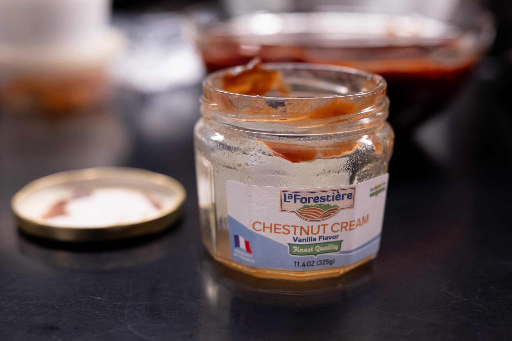

The weather has been a bit gray and indecisive as we've moved to spring from winter. I got a bit of a respite on a flying visit to San Francisco and the Bay Area.

I don't love repeating dishes, and have a perhaps unfounded fear of becoming a Taco Tuesday person. But sometimes you want a nice bold ragù with some pasta. I'm still not convinced it's possible to make it look good in a photo. As ever, though, it was pretty tasty.

On the pasta front, I did more of one of my favorites, orecchiette with sausage and broccoli. It's a really easy way to toss dinner together in about 15 minutes from a cold start. Sadly, I couldn't get my hands on broccoli rabe when the need struck --- my preferred vegetable for the dish --- but tenderstem broccoli did the trick.

I did a red lentil dal in an effort to be more virtuous. It's also a wonderfully simple dish --- at least my weeknight version --- that comes together in about 20 or 30 minutes with very little effort.

On the pastry side, I sacrificed a bit of my stash of _crème de marrons_ to finally do the FRG chestnut-chocolate cake I've been meaning to try for a couple months. I love the flavor of chestnuts, and the cake is good. I do slightly wish the chocolate wasn't quite as dominant a flavor, and you could taste the chestnut-ness a bit more.

The current US government's tariff regime notwithstanding, it really irritates me that it's so hard to get chestnut cream in the US. It's so good, and in France a small can only costs a few Euros. It's not that expensive. Yet, it's virtually impossible to find here at any price.

I tried [a recipe](https://www.ft.com/content/2c0aa3e1-5319-4a26-aecd-52a7b8a9c28b) for butter cookies from the team at Honey & Co in London. Like a few other cookie recipes I've come across lately, I really like their almost modular approach. I followed one of their suggestions, using flaked almonds and vanilla. Though with my own twist: I picked my own size and shape. It's a good recipe. I'd recommend it.

I had a chance to spend a few days in San Francisco this month, and did probably more than my fair share of eating.

While there are many reasons I don't live in San Francisco, it's hard to deny that the food culture is great. It's so much easier to find interesting, innovative food.

I got a chance to make a trip to SPQR, the great Roman-Italian restaurant. My favorite dish of the meal was unquestionably the sunchoke starter. Everything else was great. This starter was a cut above even that high standard. It's hard to go wrong with what I suspect were deep-fried Brussels sprouts bathed in a light and earthy sauce.

Nari was also a treat. Everything was great. I could have used a bit more dessert at the end. But it must also be said that it's the kind of place where everything is so complicated, it's a bit ridiculous to imagine recreating anything at home. I do think 

Looking forward to the month ahead, I got an interesting bit of inspiration at a Scandinavian bakery-café in San Francisco.

When I'm visiting another city, I indulge a bit, and decided to get a bit of a sweet treat with my lunch one afternoon. I also love everything and anything ginger. This bakery does a ginger cookie "slice" by making (if I were making a guess) a very large diameter cookie, and then cutting it into wedges like a pie. It was an interesting twist on a ginger snap. By baking one giant cookie, you get a really nice gradient of texture with every bite.

Unlike so many of the things I discover when I travel (or simply eat at fun restaurants), recreating this feels doable.

It almost goes without saying that, with Good Friday approaching, I'll be making a batch of hot cross buns. As I say every year, I may not be super religious, but I like the ceremony and rituals. Especially those that involve delicious food.



### What I'm Reading and Watching

* A review of alcohol-free wine from [Eric Asimov](https://www.nytimes.com/2025/03/28/dining/drinks/nonalcoholic-wine.html) at _The New York Times_

* Tips for [dining peacefully at home](https://www.theguardian.com/commentisfree/2025/mar/30/never-ask-whats-for-dinner-and-hide-food-from-teenagers-my-essential-rules-for-happy-home-dining), a riff on the recent _FT_ column about restaurant behavior

* [Latte art for beginners](https://www.youtube.com/watch?v=20HxMMSqRyg) from James Hoffman

* The difficult task of [reworking the food options](https://www.nytimes.com/2025/03/31/dining/robert-irvine-army-food.html) served up by the US military

* Exploring the [apparent dearth](https://www.ft.com/content/abad3812-b3c4-48cc-8e7d-6de851e595d4) of walk-in tables at popular restaurants

* Yotam Ottolenghi on the [problems with modern diet culture](https://www.theguardian.com/food/2025/mar/22/yotam-ottolenghi-i-tried-intermittent-fasting-and-hated-it-this-is-why-we-need-to-ditch-the-diets-and-go-back-to-basics)

* A [mysterious decline](https://www.nytimes.com/2025/03/18/dining/restaurant-leftovers.html) in the popularity of the proverbial doggie bag

* Considering the ["middle-class" restaurant](https://www.nytimes.com/2025/04/04/dining/middle-class-restaurant.html)

_[Subscribe](/subscribe) to get notified every month when new issues go out_
