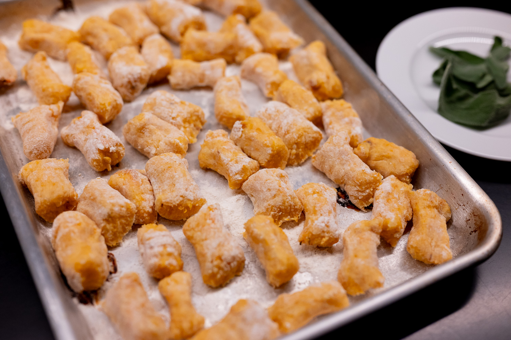
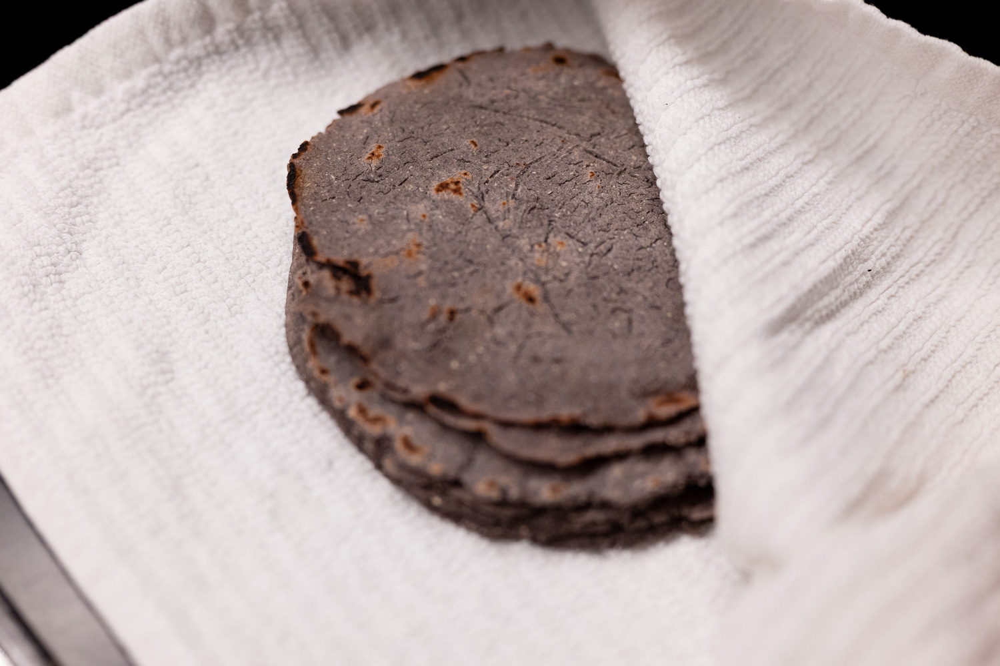
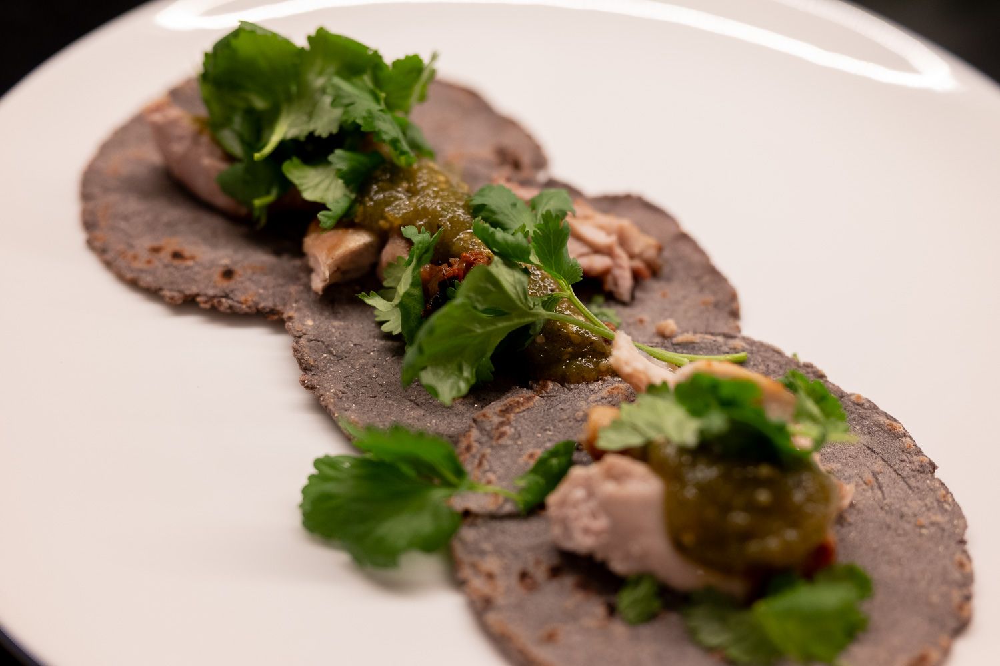
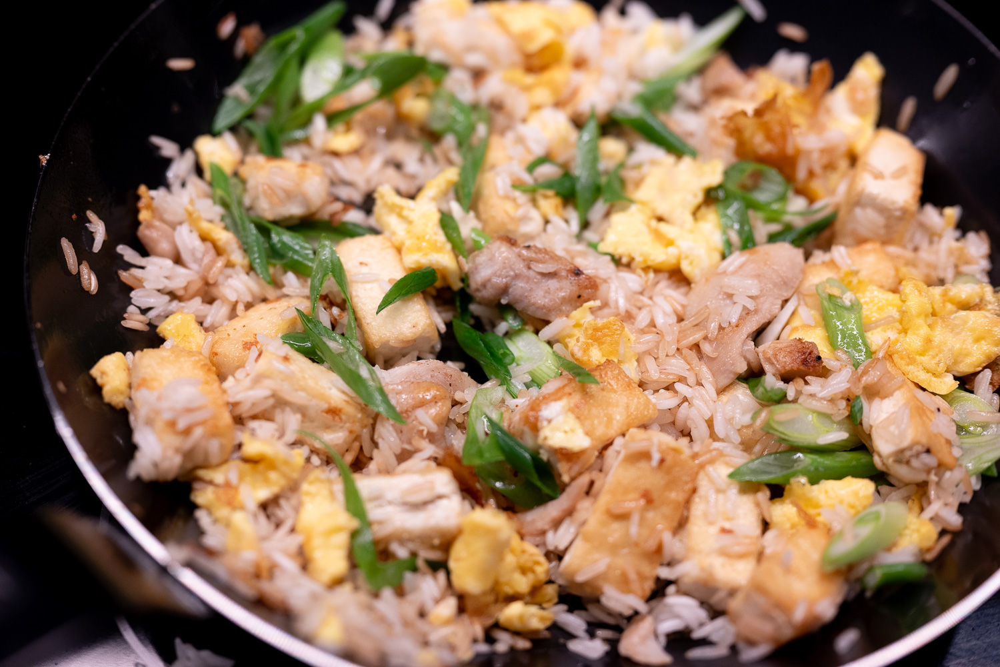
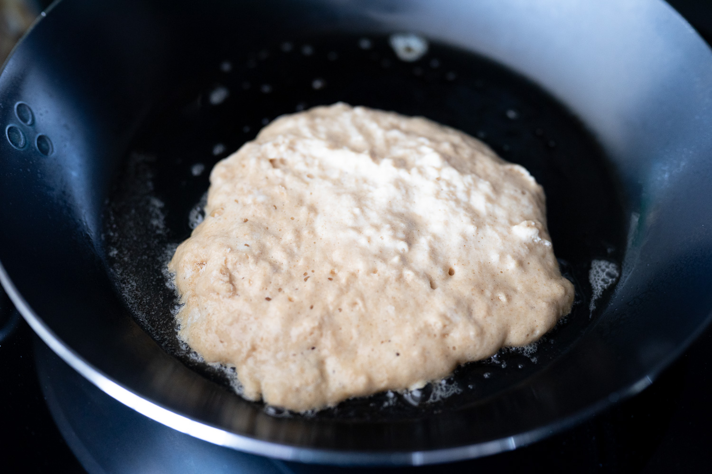
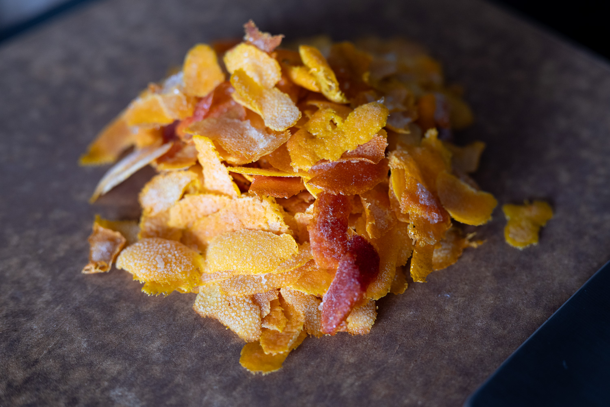
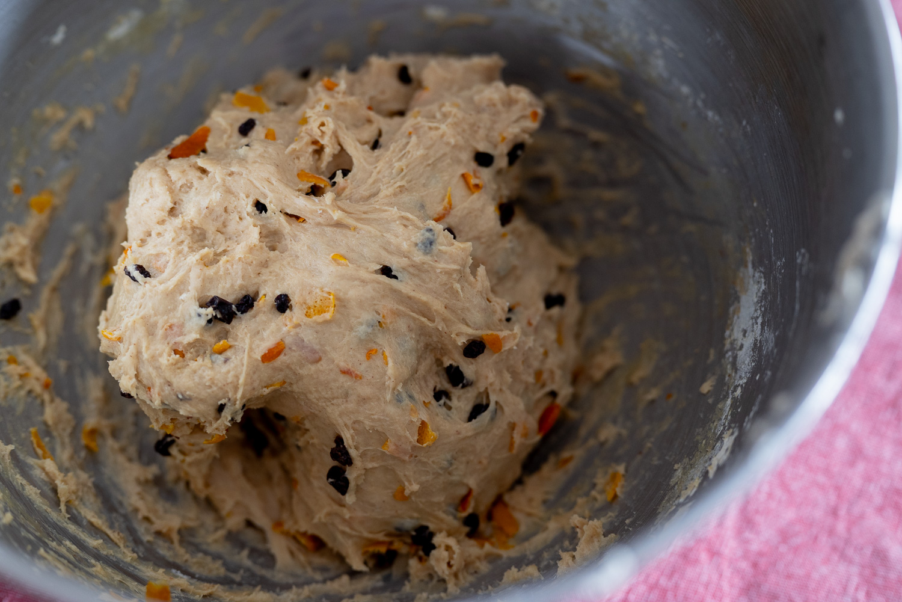
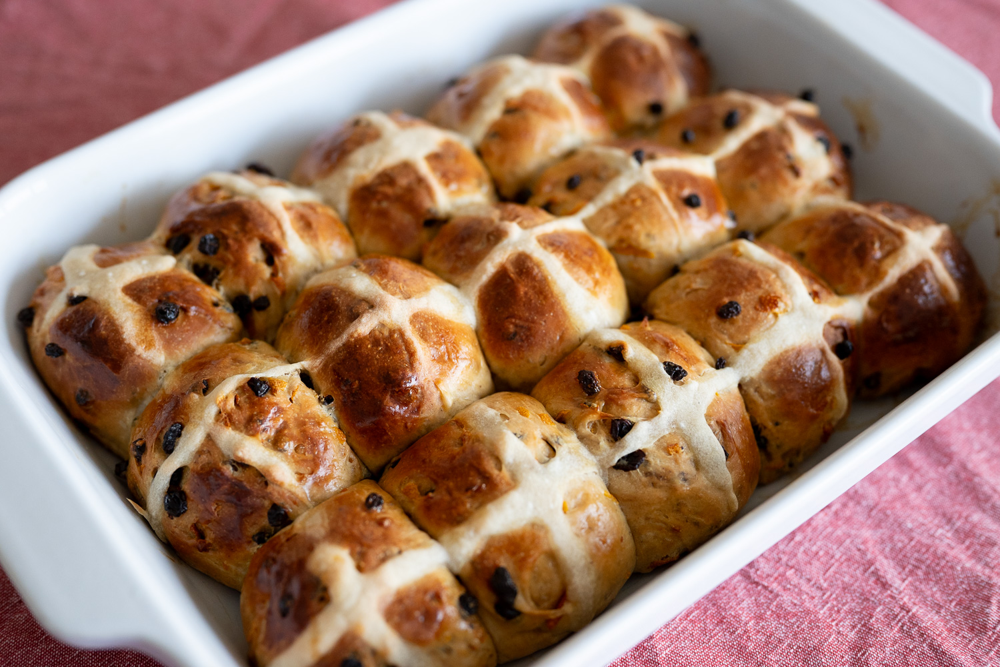

The last month began in a bit of a whirlwind, and I found myself eating out or getting takeout out of necessity more than anything.

On a whirlwind trip to New York, I stopped by a few favorites, including Balthazar. People may claim it's a bit spendy, but it's that rare restaurant that's the whole package. The food is great, the atmosphere is good, and you truly feel taken care of.

Back home, I followed through on a few longstanding project ideas and at least one tradition.

I finally got around to doing a first run at squash gnocchi, inspired by something I had just before Christmas visiting family in Portland. My attempt wasn't awful, but neither was it great. The gnocchi held together, just. They survived a dunk in boiling water for the first phase of cooking. They weren't cohesive enough to hold together when I tried to toss them in a browned butter-sage sauce.

For the next attempt, I think I need to get more moisture out of the the squash before ricing it into the potatoes. In my more traditional gnocchi experimentation, you can add more flour or egg to improve the structural integrity of each piece, but it begins to dull the flavor and make the gnocchi too gummy. Baking the potatoes necessarily drives moisture out, whereas boiling them only adds more water to the system.

After laboriously cleaning a stainless steel pan following a batch of tortillas, I finally broke down and bought myself a carbon steel pan.

As much as I love my enameled cast iron cocottes, I've never been a fan of the traditional seasoned cast iron pan. They're heavy and messy to store. But there are certain places where I really want something with anti-stick properties that I can also heat up aggressively. For example, when I'm making tortillas.

So I tried a few preparations that could take advantage of that. Partly to get comfortable using it. Partly to give the seasoning process a head start. I'm still not sure I got it right on that second count.

I did some great fried rice, and experimented with doing pancakes. I wasn't surprised that the pan helped with the fried rice. (Yes, I know, I should be using a wok.) I was surprised at how well the pan worked for pancakes.

In the more traditional corner, I did my annual batch of hot cross buns for Good Friday. It's become a fun tradition, and I've become a bit of a hot cross bun obsessive. They're an underappreciated element of British food culture.

Trying to toss them together in the morning and then during a pause for lunch, I didn't quite give them the level of attention I would've liked. By construction, Good Friday is always on a Friday, and sometimes you have plans Friday night.

I didn't get the consistency of the flour-water mixture right, so the crosses were a bit uneven. And, more annoyingly, I forgot to apply the egg wash to the buns until after the second rise and I'd applied the crosses. That further affected the crosses and gave the buns a bit of an uneven finish.

In the eating, though, they were as delicious as ever. If I may say, I'm a big fan of my accidentally more fruit-forward and less sweet variant using a truly spectacular quantity of citrus peel.

Looking to the month ahead, a friend got me a copy of _Viet Kieu_, from the chef behind Anchovy, in Melbourne.

In the best way, it's a great and very frustrating book at the same time. Good in the sense it's Vietnamese food that looks great and that I have zero familiarity with. Frustrating in that it's written for an Aussie audience and unconcerned with how you'll find ingredients that aren't in the US mainstream. It's a similar issue that I've run into with Josh Niland's books on fish: even if you want to attempt one of the recipes, he suggests you use fish that are effectively (for understandable reasons) impossible to find in the US.

So there may be an adventure in store to find a good Vietnamese supermarket that's a bit out of my way, and where I won't necessarily be able to understand any of the labels.

### What I'm Reading and Watching

* Nigella Lawson is back with a [regular food column](https://www.ft.com/content/48198cee-407c-4675-adb5-b5cf7e2d6cbb) in the _FT_

* Restaurants coming to terms with a [seeming trend away](https://www.nytimes.com/2026/03/16/dining/us-alcohol-restaurants.html) from big spending on drinks

* A [fun writeup](https://www.nytimes.com/2026/03/25/t-magazine/aperitif-dinatoire-party.html) about the _apéro dînatoire_ in _T Magazine_

_[Subscribe](/subscribe) to get notified every month when new issues go out_
