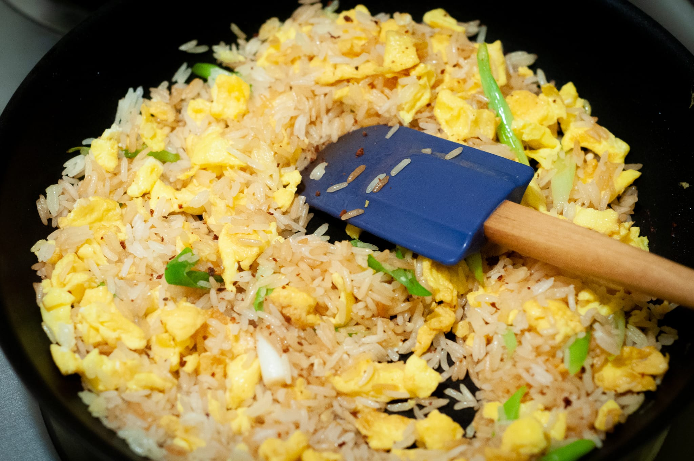
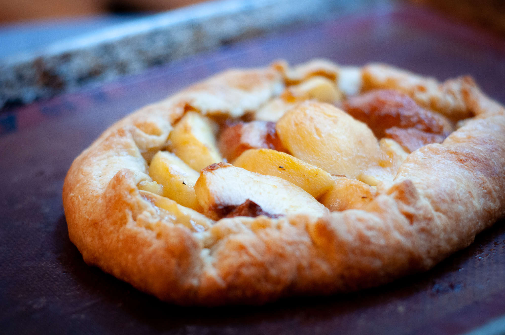
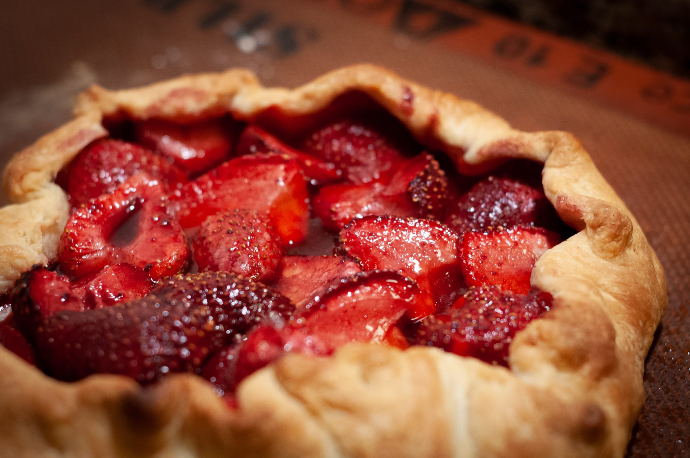

The last month has been a blend of anxiety and relief. The world continues opening, cautiously. But neither has the pandemic really ended, even in the protective Massachusetts bubble. Indeed, my food adventures have been somewhat curtailed by a not-the-coronavirus respiratory infection.

At home, I've successfully restarted my liquid levain --- a death I'm blaming on my vacation last month --- though it was a little dicey for the first few days. The characteristic yeast-ethanol aroma is one of the most telling signs the culture is healthy. Mine went through a strange intermediate phase that smelled more like rotting food. Fortunately the bread-friendly yeasts won out over whatever other organisms they were competing with.

In the meantime, I tried baking bread with only baker's yeast. It was pretty disappointing. When I'm doing something like a baguette (_pain courant_ for those in the know), I'm not making a "sourdough" bread. You don't taste the absence of a levain in the way you might if they left the starter out of a tourist-friendly loaf of sourdough bread at Fisherman's Wharf in San Francisco. But in the same way forgetting the salt makes bread taste flat, not having anything long-fermented in the bread makes it taste almost banal.

On the breakfast front, I've decided to take a pancake break. For the last few years, I've done pancakes on Sunday mornings if there wasn't anything else happening. It goes without saying, I definitely didn't have anything to do on most Sunday mornings for the last 18 months, so I've eaten a lot of pancakes. My taste buds are exhausted.

Making this choice left me with a lot of milk I wasn't going to use. The idea of drinking milk straight has never really made sense to me, so I really only use it when I'm baking or in black tea, depending on the morning.

Thus I decided to drag my Nespresso machine out of storage. I bought it several years ago for the handful of times a month someone asked for a cup of coffee. At least back in the days when people came to visit. According to a few people I spoke to, the espresso they produce is not bad if not exceptional. Unfortunately, leaving the machine in the closet for 18 months or so clogged up the internal pipework. It took a straw and an improvised descaling solution to get the machine working again.

My brief foray into morning café au lait was a nice change, but my first loyalty is and remains to tea.

Before I got derailed by a mystery respiratory infection, I did manage to try a few new dishes. Looking back as I was sitting down to write this, I realized the photos don't really do the food justice, so take my word that the food was good.

There was yet another Ottolenghi recipe, this time a [cumin-scented lentil dish](https://ottolenghi.co.uk/recipes/crushed-puy-lentils-with-tahini-and-cumin). It was a cinch to prepare, and at the recipe's suggestion I devoured with pita from the wonderful people at Clover Food Lab.

I also gave the halibut-artichoke-olive-tomato dish a try, inspired by the kernel of an idea, however imperfectly executed at the restaurant, from my Seattle trip. My photo needed something green and probably better lighting to look appetizing, but the dish was delicious. Faced with paying $30 per pound for halibut, I swapped in the more economical striped bass they had at the fish counter. Still delicious, and more tenable as weeknight fare.

Watching Kenji Lopez-Alt on his [YouTube channel](https://www.youtube.com/c/JKenjiLopezAlt), I was inspired to dabble further in fried rice. A few weeks ago I tried steaming the rice rather than letting it dry out overnight in the refrigerator. It made a surprisingly big difference, even if that my not be obvious in the photos.

As a prelude to my annual peach tart attempt, I did a couple of galettes. The peach galette was delicious though not up to the standard of the sacred reference. The experiment did give me a few new ideas for how to treat the more time-consuming tart when I get around to this year's attempt.

The strawberry galette was more of a mixed bag. I bought promising strawberries that were good, but not good enough to eat mostly unmodified either on a cream base in a tart or completely by themselves. It seemed worth seeing what would happen if I baked them. The result wasn't bad. It was very edible. But I couldn't help wishing I'd had better strawberries that hadn't been baked. The concept tasted like what it was: a way to mask substandard produce.

Looking ahead to the dregs of summer, there will be my annual attempt at recreating the mythical _tarte aux pêches_ from the unassuming roadside bistro in Nice. I also have every intention of making more that highlights summer fare, like seafood paella, heirloom tomato salads, and maybe another cherry clafoutis.

I'm also looking forward to the latest Ottolenghi cookbook, [_Shelf Love_](https://www.waterstones.com/book/ottolenghi-test-kitchen-shelf-love/yotam-ottolenghi/noor-murad/9781529109481). I love the concept: dishes that draw on more quotidian ingredients, a natural constraint of the various lockdowns and supply chain disruptions of the last 18 months. It may also be good for anyone too intimidated by the idea of hunting down rosewater or pomegranate molasses. I feel like I could've been more inventive during the lockdown, and I'm eager to see what people whose full-time job is recipe development managed to do.

Then of course, there is the looming prospect of my kitchen renovation finally happening. Maddeningly, I still haven't found a contractor. But the last two takeout-heavy weeks --- there was lots of cheap and cheerful ramen --- were perhaps a foretaste of what's to come there.
