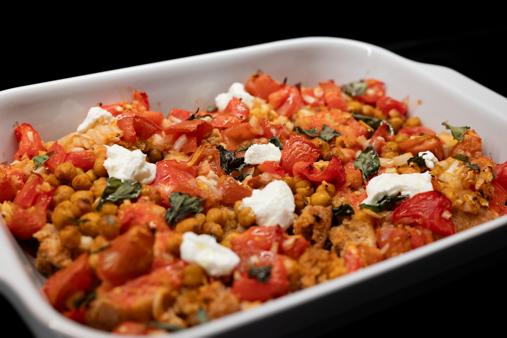
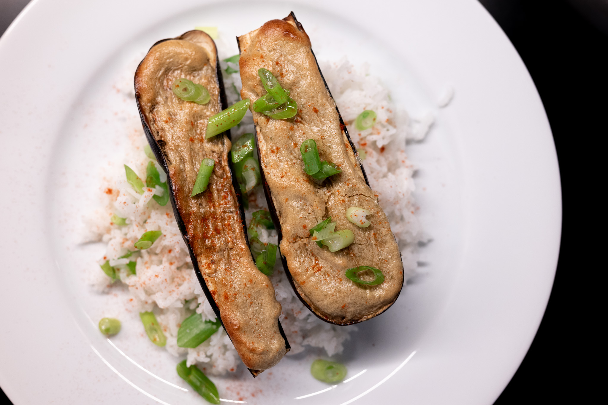
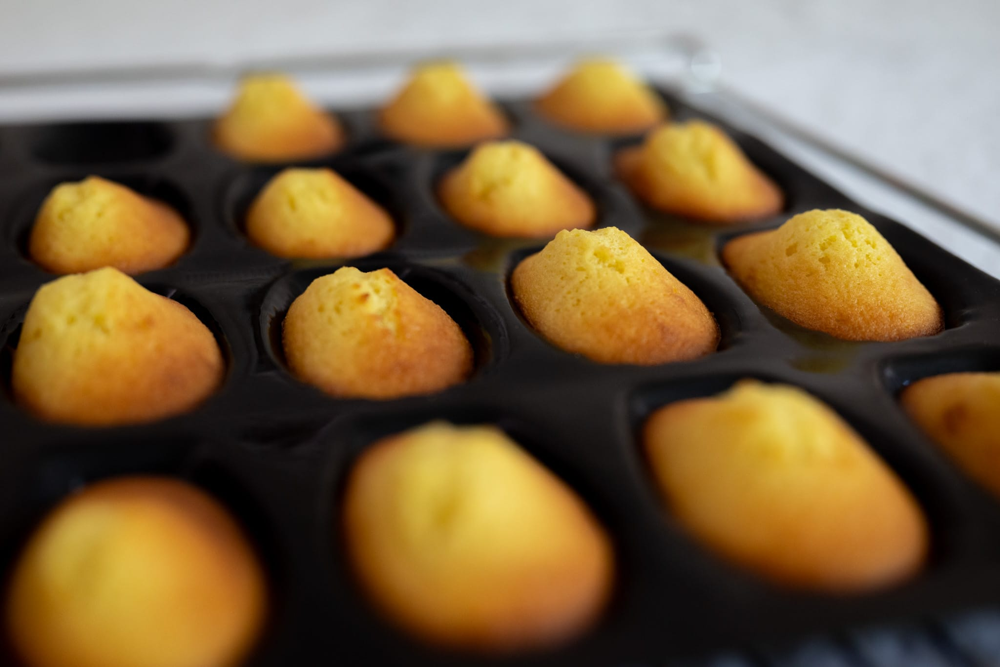
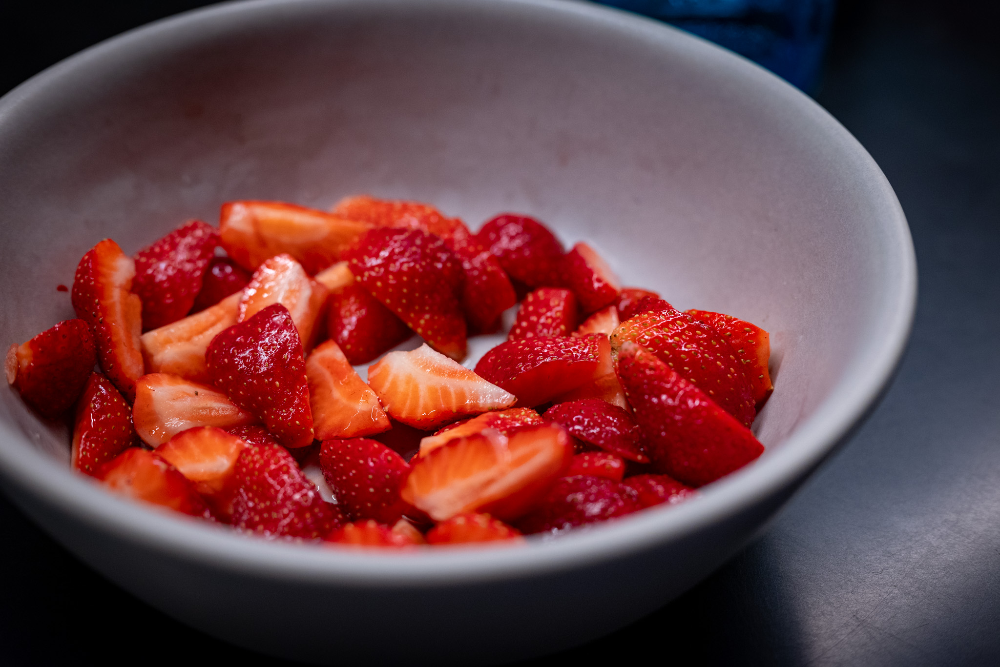
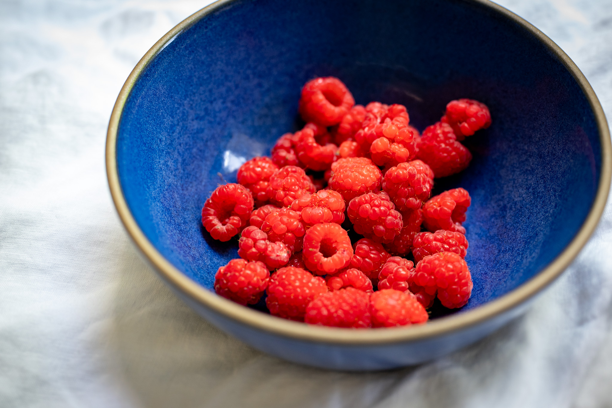

I've settled into something like a lazy summer pattern. I needed a bit of a break after a few frenetic weeks squeezing in a bit of travel and a few group events I decided to organize. It takes real effort on my part to embrace the joy of an otherwise ordinary summer evening with a nice breeze.

Stepping into my food world, much as I love French bread, I thought it might be fun to try my hand at something a bit different. I've been experimenting a bit with Turkish menemen after seeing it in [Felicty Cloake's _Guardian_ column](https://www.theguardian.com/food/2023/may/24/how-to-cook-the-perfect-menemen-recipe-turkish-eggs-breakfast-peppers-felicity-cloake) a few months ago, and thought a Turkish bread might be interesting to go with it. Unfortunately, my first attempts at making Turkish _pide_ were not very successful. I'm on the fence whether to continue.

As planned, I had some fun playing with the idea of Cretan _dakos_ after finally finding a source for the bread piece at a local Greek fast casual restaurant, of all places.

I did some more straightforward dakos --- tomatoes, olive oil, cheese, and a bit of dried oregano --- which were great. More ambitiously, I tried something I saw ages ago on a Yotam Ottolenghi TV vehicle, [a baked version](/recipes/baked-dakos) of the dish. I'm a fan. It's light, summery, and --- if you omit the dairy component --- even vegan. But it has enough heft I think it could easily work as a main course.

For no particular reason, I dug out an excellent recipe for tahini-crusted egpplant I got from Honey and Co. It's a wonderfully simple technique that gives the roasted eggplant a certain something extra. I even had a bit of leftover tahini crust material that I was able to use on some fish the next day.

After feeling good about madeleines --- more on that below --- I thought I'd spend some time diving into the world of making sushi as my next challenge. While it's something I've been around my entire life, I haven't spent much time learning how to do make it myself.

It reminds me a lot of my journey to figure out how to bake French bread. My first attempt was pretty mediocre. Flavor-wise, I was actually pretty happy. But in terms of the visual and textural elements, I fell pretty flat. Getting pieces of nigiri to hold together, look good, and have the right texture is incredibly difficult. From what I can tell, it's really not a question of one step going wrong or another. Everything has to go right for it to work well. You can have the best shaping technique in the world, but if the rice isn't exactly right, it doesn't really matter.

I've been able to find some good videos to guide me, but I'm still a fair distance from having the gestures feel natural and reflexive rather than needing to re-watch the video between every piece.



As with so much else, I feel like it's mostly a question of practice. But I could feel myself getting better even between my first and second attempts. If it weren't such a palaver to rinse, soak, cook, season, and cool the rice, I'd toss myself into this with more abandon.

Meanwhile, it's been a busy month on the pastry side.

After several more batches of making madeleines, I think I finally cracked it. My base recipe, from the excellent [_Je pense donc je cuis_ blog](http://jepensedoncjecuis.com), suggested baking the cakes in a 180 °C oven if you're using the fan (convection) mode. In my testing, boosting the temperature to 200 °C (400 °F) did the trick.

It's hard to describe my sense of relief watching the first batch I did at that higher temperature, and seeing each and every little cake begin to form a hump. I've been working on this for such a long time, getting it to work was a great feeling.

The only real unknown is why this was the change that made the difference. My best guess is something to do with the baking powder. I'm not quite curious enough to import French baking powder, but I've made a mental note to buy a box the next time I find myself with access to a Monoprix.

I've [uploaded the recipe](/recipes/madeleines) with these notes and more, including my findings so far about their history.

It's also been a good month on the peach tart front. I don't think I'm quite there in terms of recapturing the magic of the place in Nice, but I've gotten very close.

After my reasonably successful 4th of July attempt --- which was a bit too wet with the custard mixture from my favorite [apple tart recipe](/recipes/apple-tart-doubienne) --- I first tried doing a tart with peaches alone and a small dusting of cornflower to absorb the peach juices. That wasn't quite right. The tart felt a bit empty without anything to "bind" peaches together. And the bottom of the tart was still a bit soggy.

Eventually, searching for ideas, I decided to see what was on the INA vintage recipe channel. (INA is the national audiovisual archive in France.) I found a recipe for a _tarte aux mirabelles flambées_ from a 1994 episode of _Goûtez-moi ça_. There, the young chef suggests using almond flour to soak up the juices from the plums during baking.



I decided to take that idea and run with it. To my great pleasure, it worked. My first attempt validated the concept, but the peaches weren't quite ripe enough. On a second run, with some borderline overripe peaches, it got there. Short of flying back to France, I'm happy enough that I've added [the recipe](/recipes/peach-tart) to my virtual notebook.

I was able to get my hands on more of the excellent strawberries, too. I don't know what to say other than when they're good, they're rhapsodically good. Potentially even more exciting, I tracked down some incredible jumbo raspberries, with, it must be said, a similarly jumbo price tag. They were good, though.

In the end, I couldn't quite bring myself to do the baked olive oil ganache. It felt too heavy for the time of year, and I had all the wonderful summer fruit to play with.

Looking to the month ahead, I'm clinging on to summer.

Call it optimism, call it hubris: I made a ton of shortcakes in the hope that the strawberries hold out a few more weeks. They're so good.

A friend of mine brought me some great Spanish saffron I'd like to use a bit more of. I've used it to make a paella, but I feel like there are other possibilities as well. I'm not sure I have the energy to do a [bouillabaisse](https://www.youtube.com/watch?v=e0fwOtdIi8c), but there are some other fish stews from around the Mediterranean that incorporate saffron. If nothing else, I may do a [_rouille_](https://en.wikipedia.org/wiki/Rouille) to serve with bread.

Riffing on the Mediterranean theme, I realized that I still haven't done a [_pan bagnat_](https://www.papillesetpupilles.fr/2021/09/pan-bagnat-maison-le-sandwich-nicois-estival.html/) in the new kitchen or this summer. It's the emblematic summer sandwich of the Côte d'Azur, perhaps more specifically the area around Nice. Aside perhaps from cooking the eggs, it's a heat-free recipe and served at room temperature, which is perfect for hot summer evenings. It's worth getting really good tinned tuna for this. I wouldn't use basic tinned tuna ever, really, but here --- rather than, say, drowned in mayonnaise --- using a high-quality product makes a big difference.



I'm still hoping to make some international travel happen either in the summer, or the very early fall. The circumstances are somewhat out of my control. There may be some interesting surprises in next month's edition.

### Experimental: What I'm Reading and Watching

* [How cooking videos took over the world](https://www.nytimes.com/interactive/2023/08/07/dining/cooking-videos-tiktok.html) in the New York _Times_

* In the _Guardian_, Emma Beddington contemplates [a US-Europe divide](https://www.theguardian.com/travel/commentisfree/2023/aug/13/are-europeans-actually-less-enthusiastic-than-americans-or-just-dehydrated) over hydration

* [A profile](https://lifeandthyme.com/food/star-in-screen-and-guide-helene-darroze/) of the amazing French chef Hélène Darroze

* The excellent [Akira-san's Sushi at Home](https://www.youtube.com/@AkirasansSushiatHome) YouTube channel that I discovered looking for tips on, well, sushi at home

* In the _Observer_, Sunday with one of my favorite food writers, [Nigella Lawson](https://www.theguardian.com/food/2023/aug/13/sunday-with-nigella-lawson-i-spend-much-of-the-day-pottering-)

_[Subscribe](https://landing.mailerlite.com/webforms/landing/k5w5z0) to get notified every month when new issues go out_
