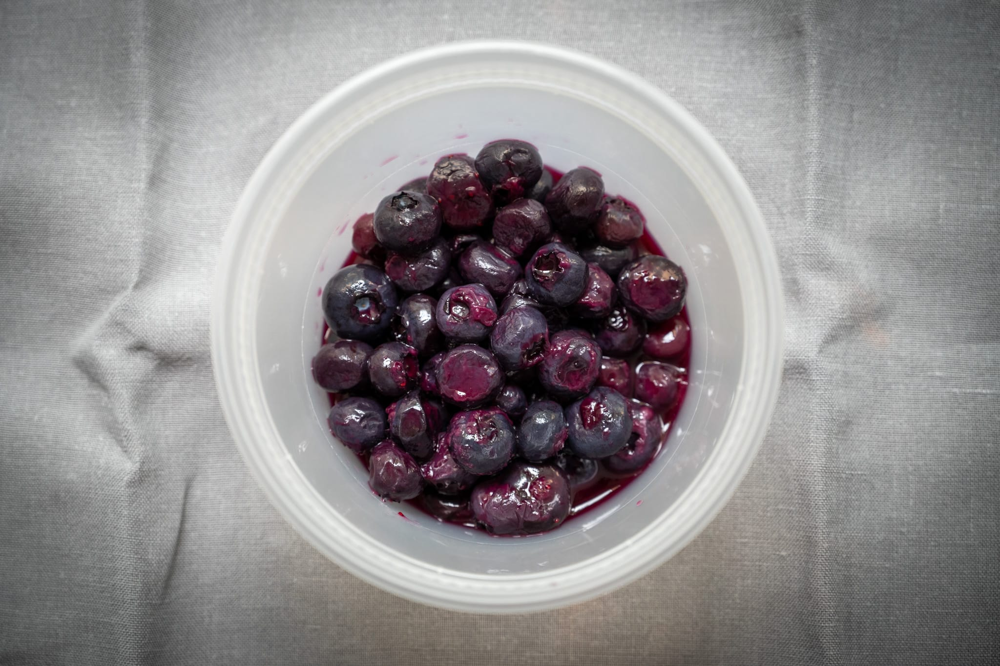
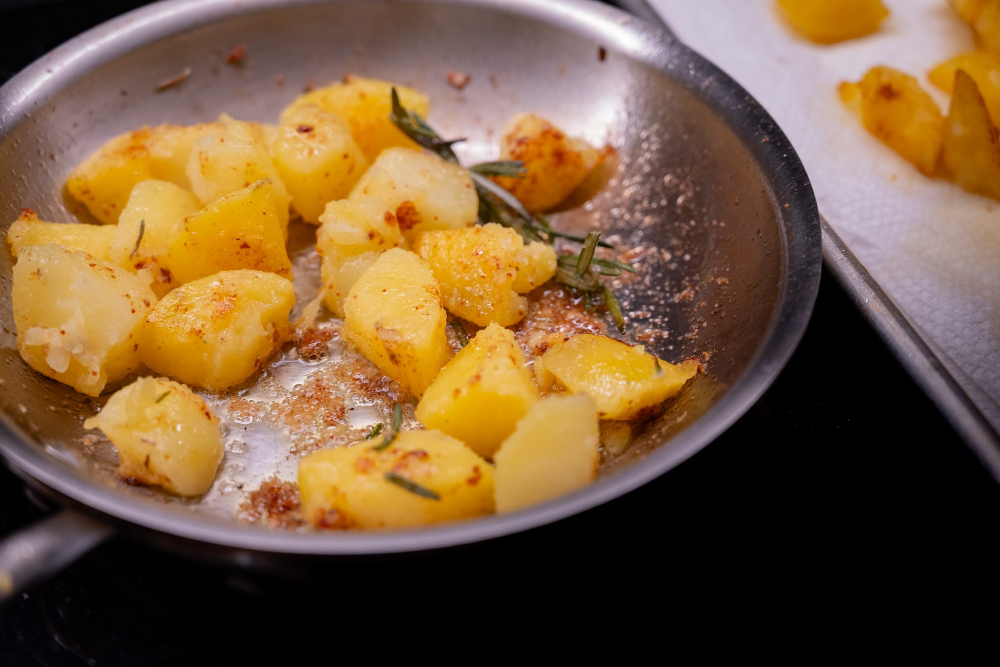

While our food culture here in the United States still hasn't quite caught up with other places I've visited, I'm lucky enough to have at least a little exposure to seasonal products. I've been trying to work with those patterns as much as possible over the last month.

I found some locally-grown blueberries. Local doesn't always mean good --- some of the hydroponic produce grown in New England in the winter months is very disappointing --- but in this case, I was pretty happy with what I got home.

I make so many tarts in the summer, I thought it might be nice to mix things up a bit with a blueberry crumble. Much as I love the concept, the crumble can lack of texture. It's a combination of soft fruit with a basically soft streusel topping in lieu of a pastry shell. The crumble topping adds something, but it's not crunchy crunchy the way a tart shell is.

So I had the idea of borrowing an ideas from a raspberry frangipane tart I made earlier in the year, and ran some flaked almonds through the topping. It's definitely an improvement. I'm still not sure I'm completely satisfied.

Riffing on my pizza experiments, this was also an opportunity to experiment with the impact of different baking media. In this case, I wondered what would happen if baked the crumble in a metal pan rather than the usual ceramic baking dishes that I usually use. Then I realized I don't really own any metal bakeware deep enough for a crumble, so wound up using a frying pan. The slight awkwardness of the handle aside, it did the trick for my purposes.

I've persuaded myself it made for a better crumble. But don't rush out and try it yourself. Putting aside a theoretical double-blind evaluation with a tasting panel, I didn't even make two batches to compare side-by-side.

You can only eat so much dessert. Further experimentation will be required.

With the same blueberries, I took this as an opportunity to develop another arm of my ongoing exploration of lacto fermenting fruit. Earlier in the year, I used blueberries to begin teasing out the impact of different salts. While this was incredibly informative --- it turns out the salt definitely does make a difference --- I was left wondering about something pretty fundamental. Namely, the impact of the quality of the fruit.

Back when I first started dabbling with this process after my visit to Copenhagen last year, my first lacto ferment took advantage of the last of the year's in-season local strawberries. It was this that really got me hooked on the process. It took something great and made it even better.

The ho-hum blueberries I was able to buy in the dead of winter, shipped thousands of miles from a nondescript field in California and engineered to survive shipping, aren't something I'd ever be overjoyed to get my hands on.

So these much better local blueberries were a great opportunity to see if better blueberries made for a better ferment. Perhaps unsurprisingly, they made for a much better end product.

Back on the savory side of things, I don't always have the energy to make something complicated on evenings in. Though I did take the time to snap a photo when I did a quick spaghetti with shellfish, white wine, and parsley.

While I couldn't quite get a photo I liked, I did get around to making a pan bagnat or two. It's an underappreciated sandwich concept.

I'm still using up the enormous quantity of sous vide pork shoulder that I made last month, and then dropped in the deep freeze. Carnitas reheats (reheat?) surprisingly well, and can make taco night a cinch. If you've got everything else prepared, it's as simple as crisping up the pork and making some tortillas.

In the same way warm weather makes me think of tacos, something about it also recalls Spain in my mind. I thought it might be fun to try making some tapas-style dishes. I did potatoes _bravas_, lemony beans with a little something extra via roasted red peppers, herb-y bread, romesco sauce with focaccia on the turn, and tinned fish. For the last component, I wish I'd had the energy to search out some fun tinned fish from Spain. But I think the Bela brand sardines --- imported by a Cambridge, MA company --- are actually pretty good, and don't require me to go to the ends of the earth.



I finally got my hands on some tomatoes that felt worth buying, and did those both raw in a simple salad and steam-confit in the classic "in-a-bag" concept popularized in the early aughts with some fish.

After much searching, I managed to hunt down a bottle of Pernod. When I think summer, I think pastis. It's still unclear why it's been so hard to find this year. I'm pretty sure when I ordered some at a bar they gave me chartreuse instead. And even when I was able to find a bottle, I paid dearly. I'm resigned to paying $40 for a good bottle of gin. The bottle of Pernod I managed to track down was almost $60.

I also had a little fun experimenting with different cocktails. I used the last of my leftover strawberry lacto ferment medium to do a variation on the charmingly named rourou, a cocktail of strawberry syrup, water, and pastis.

### Out and About

Some friends hosted an interesting taco evening. Sadly, we weren't able to use their smoker to recreate a Oaxacan taco recipe. Weather doesn't always cooperate. But I was treated to some lovingly prepared mole, made in the Mexican sun and re-hydrated to top off the tacos. It was pretty tasty.

In less cheerful news, I was surprised to learn that the cheap and cheerful Thai restaurant down the street decided to close its doors. As much as I like to cook, sometimes there's an evening when you want a no-nonsense massaman curry. My inner optimist holds out hope it will get replaced with a fun, new innovative restaurant. My inner realist fears it will be another outfit selling magic crystals to the hapless tourists that invade my neighborhood nine months of the year.

### What's Next

Looking forward to the month ahead, I'm once again continuing to cling to all the great summer food.

I still haven't done a peach tart this summer for fault of ingredients. A peach tart lives and dies by the peaches. And while I've found some pretty decent yellow peaches, my inspiration for the tart makes me feel compelled to use white peaches. There may come a point where I give up and buy what I can get my hands on. I'm holding out hope for now that something great will make an appearance at one of my regular sources.

Though on a related note, I have a batch of lacto fermented (yellow) peaches on the go that didn't quite make the cut for this month. It's the first time I've done peaches, so I'm curious what possibilities they'll offer.

Assuming I can get more of the good strawberries, I like the idea of returning to an Eton mess. Or perhaps a nice pavlova. Whatever a younger Nigella may say, they're more or less the same thing. I think a strawberry pavlova works a treat.



Riffing on the summer theme, I'm rolling around the idea of trying my hand a socca --- another specialty from Nice -- at home for the first time.



Now that I've managed to succeed in finding some pastis, there's a part of me that wants to take on the challenge of doing a bouillabaisse. I may not have the requisite willpower.

If I've done my math right, I think the new Ottolenghi cookbook [_Comfort_](https://ottolenghi.co.uk/blogs/stories/ottolenghi-comfort) will have been published. I'm pretty unashamed about my appreciation of him and his team's work. It should be fun to see what they've put together and give it a try.

I'm also in the early stages of planning some interesting travel that opens culinary possibilities. That likely won't happen for the next installment here, and I'd prefer not to say too much more for reasons of operational security. But it's definitely something I'm looking forward to food-wise.

### What I'm Reading and Watching

* A slightly tongue-in-cheek look at [current food trends](https://www.ft.com/content/e3e2796a-01e1-42cc-9757-30fae584b124)

* [Fun research](https://arstechnica.com/science/2024/07/astronauts-find-their-tastes-dulled-and-a-vr-iss-hints-at-why) from the ISS on the impact of space travel on flavor

* [A fun review](https://www.ft.com/content/70b70fd1-df0f-4af0-980e-12d13d9fed4b) of another of Copenhagen's bleeding-edge dining experiences

* In the _Guardian_ a look at [how we fall victim to ultra-processed food](https://www.bbc.co.uk/sounds/play/m001xzrx)

* Gouda is at risk from the effects of [climate change](https://www.nytimes.com/2024/08/01/world/europe/netherlands-gouda-climate.html)

* [A look behind the scenes](https://www.youtube.com/watch?v=yG8vp_UkCVg) of what it takes and what happens when a celebrity decides to launch a line of coffee beans

* When [a billionaire takes over](https://www.ft.com/content/7af3f4d2-5e51-4079-b223-81dd66702b3c) a beloved restaurant, things go a little haywire

* While I was stuck in bed with a fever, I got through Noma impresario René Redzepi's new Apple TV series [Omnivore](https://www.imdb.com/title/tt18225192/)

* The always excellent Bee Wilson argues we should be [eating more beans](https://www.nytimes.com/2024/08/12/opinion/beans-chickpeas-plant-based-food-meat.html)

_[Subscribe](/subscribe) to get notified every month when new issues go out_
