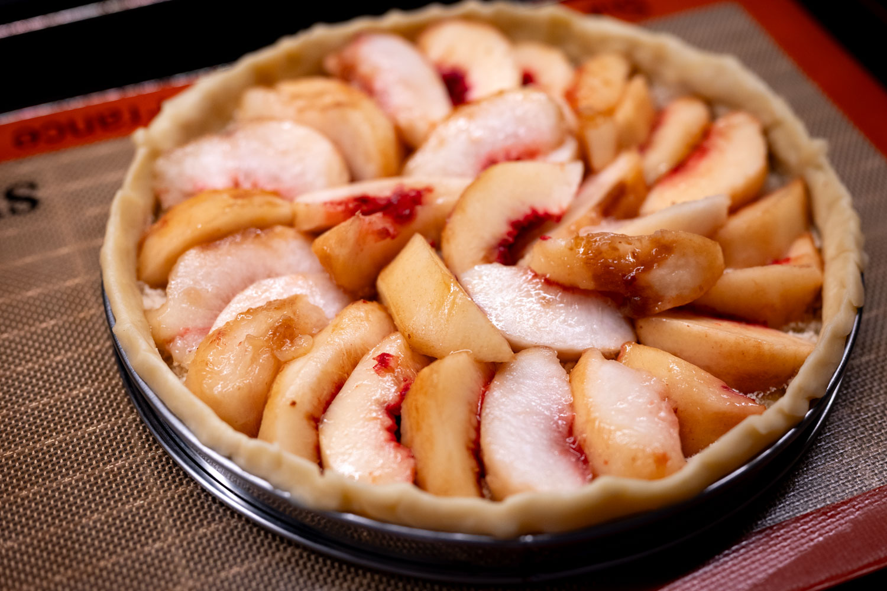

In the last month I've once again had to remind myself to take advantage of the summer.

With a bit of a time lag, I finally started seeing the peak summer produce.

I got some pretty decent blueberries, and used them in a couple different ways. First, in a crumble cake, riffing on a recipe from the latest Ottolenghi cookbook. It was definitely very good. If I were to do it again, it needs a bit of a tweak to introduce an acid hit somewhere.

This year's peaches have been an object lesson in the sad reality that you get what you pay for. I was so optimistic when I saw New Jersey peaches for sale at a reasonable price. Especially with summer fruit, local tends to mean better. Alas, those peaches were very mediocre. I was a bit underwhelmed. Whereas, when I spent a slightly staggering $10 on four peaches --- locally grown in small batches on a family farm --- they were sublime.

The disappointing peaches went into a crumble. I had topping left over from doing the blueberry cake. The excellent peaches went into a tart. With the benefit of hindsight, I sightly under-baked it. The base wasn't quite as well-browned as I'd have liked. But that was a minor error, and, irrespective, the peaches were so good, it really didn't matter.

Sticking with the fruit theme, much later than I would have liked, the excellent strawberries made an appearance in early August. Here too, I kept things relatively simple. The first batch was tossed with salt for a lacto ferment. (Excellent in savory dishes as well as on top of oatmeal or yogurt for breakfast.)

The rest were served minimally adjusted with shortcake, whipped cream, or as part of a pavlova. It slightly kills me to pay $10 for each container. On the other hand, there are much less salubrious ways to spend my money.

This felt like a moment to finally spring for a chamber vacuum packer; I couldn't quite bring myself to do it. Maybe as a Christmas gift for myself in a few months. It's slightly frightening that we're now well over halfway through the year already.

On the savory side, one of my favorite food blogs did [a treatment of focaccia](https://jepensedoncjecuis.com/2025/07/comment-reussir-une-focaccia-moelleuse-et-croustillante.html), and I felt like I had to give it a try. It wasn't really that different from my usual recipe, but I still got a deeper understanding of the process. Most helpful was his rule of thumb for figuring out how much flour to use, so that the amount of dough is correctly calibrated to your pan. As it turns out, one of the last remaining mistakes I was making was simply not making (anywhere near!) enough dough for the size of my baking tray.

I've updated my [notes on focaccia](/recipes/focaccia) accordingly.

Keeping with the bread theme, I was in the mood for pizza, and returned to my pizza dough _au levain_ in the style of the excellent pies at Oobatz in Paris that I had last year. Sadly I was once again too conservative with the development time of the dough. While it's hard to really mess up pizza, the yeast was definitely not peppy enough, and I wound up with some pretty sad pizzas.

I got my hands on pretty decent green beans. They were very much "American" green beans, which is to say they were allowed to grow a bit more before they were picked than the _haricots verts_ that I prefer, and that you'd find at a typical French market. A bit more "rustic," perhaps. But I take what I can get. They were still a lot better than the tasteless green beans you get in November for Thanksgiving.

With those, I went Vietnamese and did a stir fry from the Slanted Door cookbook. I can't believe I'd never tried the recipe before. It was incredibly simple and very, very good.

They also went into some seafood paella, which was not bad. I still don't understand why it's seemingly impossible to get proper runner beans anywhere near where I live for a truer paella experience.

As planned, I tried Maria Bradford's recipe for a West African peanut butter marinade. I used it with chicken thighs (as per the recipe), and was pretty happy with it. Peanut butter is an underused flavor in savory dishes. I'd definitely do it again. The marinade included components I usually associate with Southeast Asia like ginger and lemongrass; in many ways the finished dish reminded me of the satay with peanut sauce that's a staple of cheap and cheerful Thai outlets in the United States.

As a bonus, I didn't quite read the recipe correctly when I was putting together my shopping list, so I bought more supplies than I needed and wound up with a ton of extra marinade.

Out and about, my over-achiever friend who hosts regular supper clubs put together another very impressive event, this time riffing on the area of southern Europe along the Aegean. I can take no credit beyond bringing my camera and a bottle of wine.

For a friend's birthday, I made what I think was my first-ever trip to an Olive Garden. (It's definitely possible I've been before and don't remember. Growing up, my family's loyalties were with hometown favorite The Old Spaghetti Factory.) It was part nostalgia trip for my friend, part ironic, and part torture for at least one Italian.

More than anything, the outing illustrated that it's a lot more about who you're spending time with than the quality of the food. It was a nice gathering, and the European contingent didn't get too bent out of shape.

In all honesty, the food wasn't terrible. There's no way you could get a starter, main, and dessert plus a drink at a "nicer" Italian restaurant for the price. It almost makes you wonder what they could do if they went for quality over quantity with their enormous portion sizes. I was less impressed with the touchscreens on every table that let you order, pay, and (for an additional fee) give your children games to play.

Bless him, the waiter also clearly couldn't figure out how to use Adobe Project Indigo on my iPhone, so the group photo we took was not the best.

For the month ahead, I'm hoping that the supply of good strawberries holds out for a bit longer. They've definitely been in short supply. Maybe it's the weather. Maybe it's the whims of the buyers at my local Whole Foods and farm stall owners. Maybe it's the country's problematic immigration enforcement actions.

Almost out of a sense of pride, I feel compelled to try the pizza again. It's so good when it's good, and I made such amateur mistakes on my last run. You can't mess with the levain.

Not that lemons are particularly seasonal --- peak citrus season is more in the winter --- but as I've been lacto fermenting all the peak summer fruit, I figured I might as well do some of those as well. Maybe they need to wait until the fall when it's sweater weather and it would make sense to make a tagine. But I feel like there ought to be a summery way to use them as well.



More on topic, I have a strange hankering for some kind of cucumber salad. I don't know that peak-season cucumbers really wow me in the way that, say, peak-season strawberries do. But something like a smashed cucumber salad feels so much more at home in the warm glow of August than it does in the dead of winter, even if I doubt I could really distinguish a hothouse cucumber from one in season. Perhaps the sustainability angle is the real hook.

### What I'm Reading and Watching

* In West Africa, [smuggling cocoa](https://www.ft.com/content/e0b7f437-0e3d-4e68-a2cd-d03affb72400) out of producing nations to get better prices as the market price soars

* Contemplating [the appeal of lunch](https://www.newyorker.com/magazine/2025/07/28/the-case-for-lunch)

* Truly optimizing at the edges, making [the best ice possible](https://www.ft.com/content/eb2d49cb-47f9-4e45-8509-57d88907a9c3)

* [Deception](https://www.youtube.com/watch?v=JyUD3LYQ9pE) as Dunkin' (Donuts) launches in Paris

* [Pizza sales are in decline](https://www.theguardian.com/business/2025/aug/05/dominos-pizza-profits-dive-as-people-cut-back-on-takeaways) as people tighten their belts

* [Three plays on the pancake](https://www.newyorker.com/culture/the-food-scene/three-plays-on-the-pancake) in the _New Yorker_, including an intriguing masa-based concept

* [More emerging evidence](https://www.ft.com/content/e8866e64-0bf2-4ab3-a424-26b2550c7100) that eating ultra processed food isn't great for our health

* Squeezed personal finances are [starting to impact](https://www.ft.com/content/94aeee54-a0b6-4088-a3ff-57477d44a259) the restaurant industry

_[Subscribe](/subscribe) to get notified every month when new issues go out_
