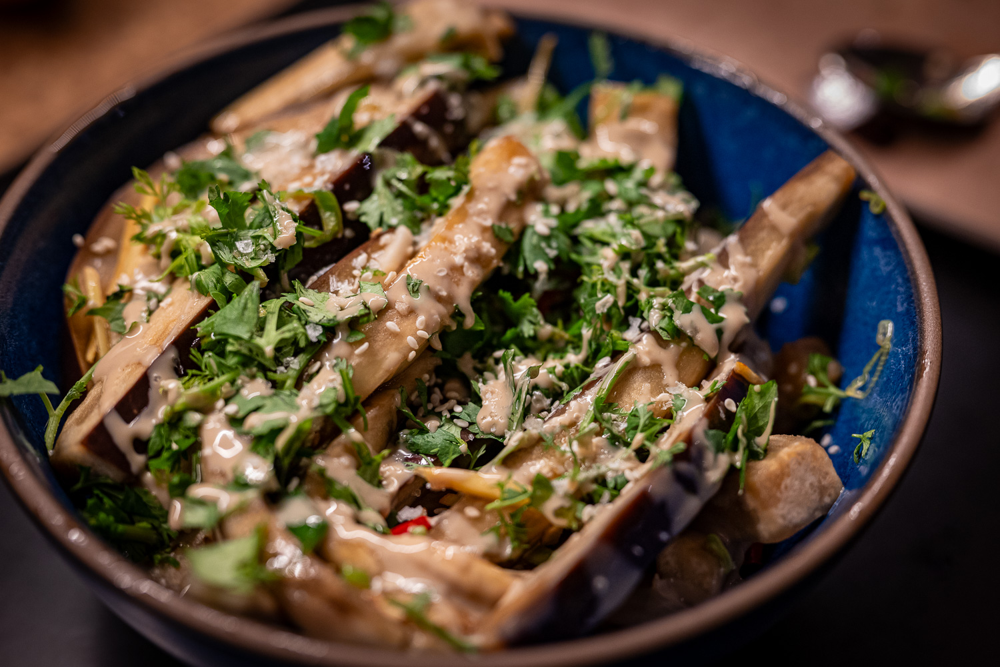
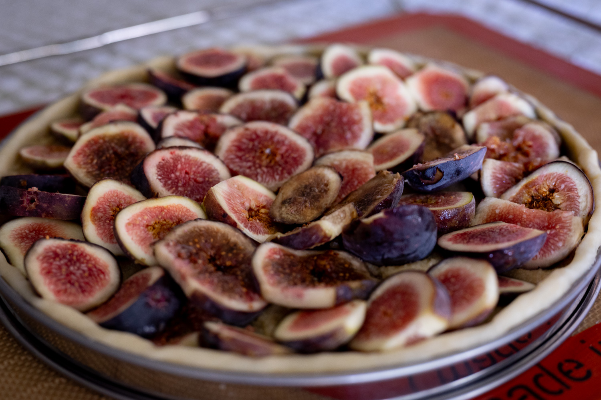
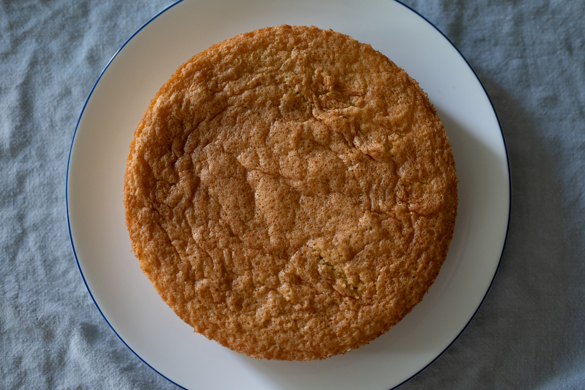

It's been another bit of a busy month, and it hasn't been quite as conducive to my usual note taking as usual.

Searching for some inspiration, I decided to have a run at a steamed eggplant recipe I hadn't tried from my small cookbook library. I'd make it again. The silky smooth texture was great with the piquancy and aromas of the sauce. Though I'd probably peel the eggplant next time. The skin didn't quite break down as much in the steamer as the flesh, and it gave the dish texture in a bad way.

It's continued to be hit and miss with the figs for this year. I had it in my head to do a fig tart, and let a container of not-quite-ripe supermarket figs sit out on the counter for a couple days until I had time to pull everything together. Not paying attention, they tipped over from under-ripe to unsafe with clear mold colonization.

All was not lost, however. One of the markets I visit had good figs. Though they were merely pretty good, not sensational. I can never tell if this is simply because the restaurants get all the really premium produce, or it's the local food culture that doesn't value them enough for people to bring them to market.

A week or two after that I did finally get my act together to do a fig tart. From all my research, frangipane is the go-to for a "traditional" one. I did a very traditional one with almond flour. I'm really tempted to give it another try with hazelnut flour instead after seeing that from a couple of bakeries that I keep my eye on.

I've had more luck with strawberries. The supply has been good this year. And as much as I love a shortcake, I wanted something different to go with the abundant berries. I did an olive oil cake, and, taking some inspiration from other sources, paired the strawberries with sumac.

Out of the house, I made another brief trip to Houston, and had a chance to try one new place and revisit a couple of favorites from last trips. It was a business trip, so I didn't have my good camera with me. Suffice to say I'd still recommend The Blind Goat, and I'd recommendation to Mala Sichuan Bistro after my one visit there. I'm still not totally sure how to distinguish great Chinese food from good Chinese food, but this place was on the level in a more objective sense.

Looking forward, I'm pulling on two big threads. First, I have a big upcoming trip with lots of interesting food potential. Among other things, I'm really hoping this is finally the year that I can snag a reservation at Datil, in Paris. But I don't know I have too much more to say about that right now.

Second, I'm still in the process of dealing with all the paperwork for another fun project that I'm not quite ready to share here just yet either. Suffice to say that it's good excuse to do more baking, despite the final throes of summer weather.

On a more micro scale, I'm still enjoying the summer produce. I've been able to get my hands on some genuinely good green beans, so I'd like to mess around a bit more with dry frying. I don't really understand why this year has been so good for good beans, but I'm not complaining. I'd be even happier if I could find some true just-picked haricots verts. I visit the farmer's market regularly, and am constantly disappointed that it's all candles and jam, rather than never-refrigerated produce with real flavor.

Likewise, it should be a good opportunity to get more great strawberries, blueberries, and figs. I've come to appreciate the strawberries especially preserve nicely. Lacto strawberries over yogurt in the morning has become one of my favorite fall breakfasts.

And then, of course, I need an excuse to do at least one peach tart, in homage to the now legendary side-of-the-road encounter outside Nice.

### What I'm Reading and Watching

* The [crowding out of pizza](https://www.ft.com/content/d10e846e-5615-4cb5-bd4f-b159423d4f75) (and pizza delivery) by other foods thanks to the rise of delivery apps

* Keeping [dining simple](https://www.newyorker.com/culture/the-food-scene/a-greenwich-village-dining-room-that-feels-far-from-the-tiktoking-crowd) at a new opening in New York

_[Subscribe](/subscribe) to get notified every month when new issues go out_