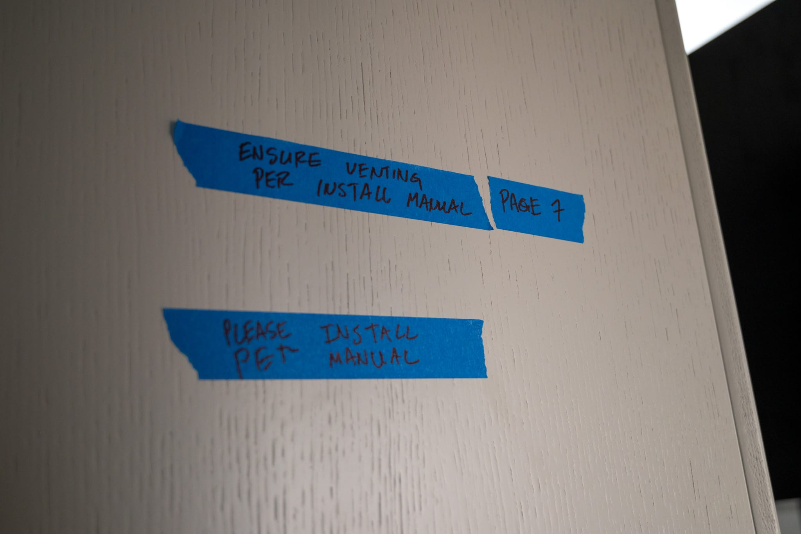
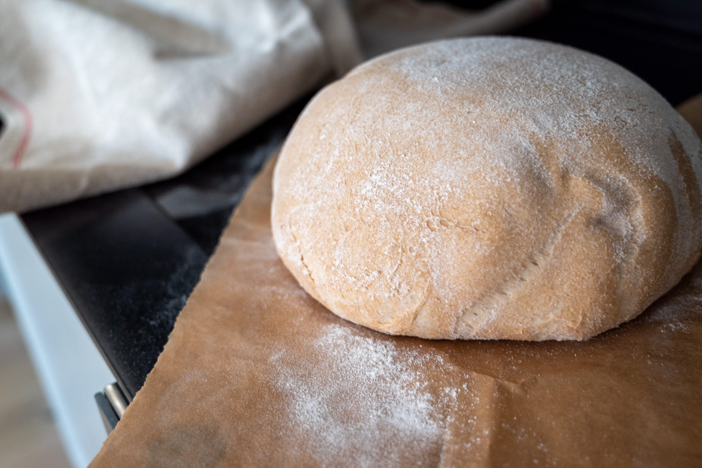

I had really hoped that this time I'd be able to write that my kitchen project had finally wrapped up. Alas, it was not to be. While I can cook again, there are a few troublesome details getting in the way of me completely unpacking and getting back to my usual rhythms.

You can venture over to my [renovation blog](http://jkibe.github.io/kitchen145/) for more details on what is (or isn't) happening with the construction itself. As concerns my ability to fill this monthly update, there are really two main issues.

First and foremost, they still haven't installed my vent hood. While it's not vented to the outside as would be ideal, it does at least have some filters that would make grease and smoke less annoying. It would also protect the upper cabinets. Second, my fancy built-in refrigerator still isn't quite installed correctly. I'm hesitating to fill it back up for fear they'll have to empty it in order to take it out and fix the remaining installation problems.

With my wings slightly clipped, I haven't been quite as adventurous as I would have hoped by this point. There have been a lot of basics and favorites. I've realized I really need to buy a food processor making a [basic ragù](/recipes/ragu) and that pine nuts (that should have adorned a batch of four allium rice) do eventually go bad after being stored in the basement for almost a year.

I tried making madeleines for the first time in almost a year. Despite literal decades of trying, I still can't get them to come out the way I want them. This latest batch was over leavened: they were too light and airy. And I cannot for the life of me get my cakes to acquire the distinctive hump that I see as the hallmark of a madeleine well-made.

More excitingly, I hosted the first group dinner in the new space only a few days ago. I'm not quite ready to go full Ina Garten and introduce readers here to my cast of equally (if differently) impressive friends and family.

It did give me an opportunity to dip my toes back in the world of bread. I tried doing a big, dark sourdough loaf. My sourdough skills are definitely a bit rusty. The loaf was not bad. The crust was very tasty, I got reasonable oven spring, and I got a nice color on the loaf. I need more time and experimentation to get the tang and crumb closer to where I want it. These large loaves present another challenge in the fact that it's a lot to eat even for a bread enthusiast. Perhaps this is a vector to bond with my neighbors.

Getting back into the cooking groove over the last month has been a somewhat surprising experience from a personal finance perspective. While I'm hardly going to starve, there's something really shocking about having to pay almost $10 for a bag of flour. Inflation is real.

It's also very clear that the slow march of efficiency is continuing to erode much of what made Whole Foods a distinctive place to shop. Anecdotally, the people at the fish and butcher counter seem a lot less empowered to accommodate special requests, and more of my favorite (if expensive and exotic) products have disappeared from the shelves. Fortunately they do still have my Isigny-Ste-Mère butter, so they're not completely dead to me yet. Of course, I'm not sure what my alternative would be either.

Looking to the month ahead, there's of course Christmas and New Year coming up. It's my one chance a year to get fresh mochi. The day I don't get a little excited about that, I'd say the spark has gone out in me.

Later in the month, I'm planning to make my first trip abroad since the pandemic cut everything off in 2020. The itinerary isn't quite finalized, so it's hard to predict exactly what I'll learn. I'm really hoping it provides some culinary inspiration. My first-ever trip to Madrid is on the docket for sure. As a magnet for people across Spain for centuries, it should offer a good cross section of the country's food culture.

Winter will truly be with us in January. That screams soups and other food slowly simmered. It could be an opportunity to restock from my friends over at [Rancho Gordo](https://www.ranchogordo.com). Their heirloom midnight black beans make an excellent soup.

Thinking of travel jogged memories of favorite meals on other trips as well. And something in particular made me think of [Breizh Café](https://www.breizhcafe.com/menus) in Paris. Short of actually going to Brittany, they do the best crêpes I've ever eaten. In particular the buckwheat savory crêpes that I associate with _Breizh_. This experiment may turn out like my ill-fated soba noodle experiment: the right flour really does make a difference! Though I think crêpes are a bit more forgiving.

Moving further north in Europe, my 2020 exploration of Danish culture really got me hooked on the many and varied buns that they love to eat in Denmark. I never quite perfected my own version of [_kardemommeboller_](https://madensverden.dk/kardemommeboller-god-opskrift/). Those feel like an appropriate reaction to cold weather, short days, and staying inside to keep warm.
