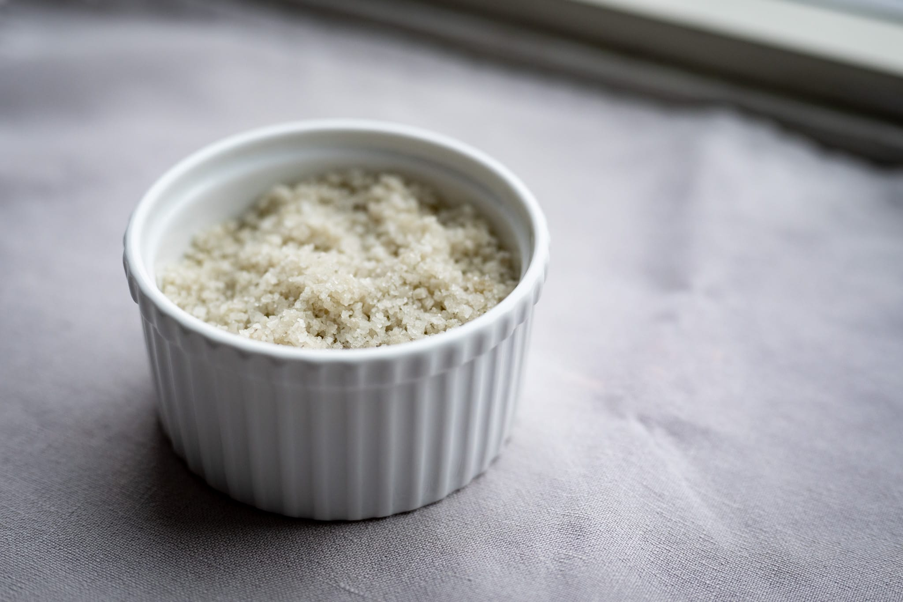

Short days make me want food that's warming, even as we've had unusually warm late November and early December weather.

I love doing a batch of warmly-spiced [red lentils with basmati rice](https://www.youtube.com/watch?v=JuQzdvPjSGg). I've almost always got the ingredients on hand, it doesn't require much effort, and the results are always delicious.

I've continued noodling with the lacto ferments. In particular, I tried making a reduction of the fermentation medium from a batch of blueberries. It had a nice visual effect when I brushed it onto some striped bass. In terms of flavor, though, the authors of the _Noma Guide_ got it right that you need to purée the blueberries themselves to get enough of a hit to taste.

A batch later in the month helped me understand why you might want to build a fermentation chamber and have the process take place closer to 28 °C. Now that the weather has cooled down, my kitchen is definitely cooler indoors, even with the heat on, and the fermentation happens more slowly.

More as an excuse to make some burger buns than anything else, I did a batch of black bean burgers for dinner one night. I tried a new recipe over on Serious Eats that's somewhat more elaborate than my usual. The flavor was good. The texture didn't quite live up to its promise. More than anything, I think it suggests I need to finally buy a food processor. My hand chopping wasn't quite what it needed to be, which created more crunch inside the burgers than I was expecting.

On my latest dive through the excellent Chinese Cooking Demystified, I stumbled on a fun recipe for ["sourdough" bao](https://www.youtube.com/watch?v=hR39C5Gmr1c). They use something a little bit different to a usual sourdough, seeding the starter with fermented rice. This style of bao also borrows from laminated pastry by layering lard through the dough.



This gave me a nudge to make a batch of bao, though I'll admit I couldn't quite muster the energy to do the full-on posubao. But I did do a batch of bao substituting yeast and a relatively fast ferment with the levain I usually use to make bread and a slow, low-temperature ferment in the refrigerator.

I couldn't quite bring myself to make a trip to H Mart only for red bean paste, so I did a swap with some black beans that I washed, passed through a sieve, and cooked out with brown sugar and oil. They weren't quite as sweet, but overall the flavor was pretty decent.

My bigger errors were in the dough hydration and, I think, the fat level. While the dough worked more or less, it was definitely over-hydrated. It wasn't quite as light and fluffy as I'd like, and the pleats lost all definition. When I went shopping they didn't have the cut of pork I wanted, so I bought some fairly bog standard ground beef as a substitute. The insides of the bao were a little dry, unlike what I was expecting from the video.

For years I've been a devout user of Diamond Crystal kosher salt. Along with sharp knives and a digital scale, I'm lost without easy access to coarse salt for seasoning. When I'm in someone else's kitchen and they don't have any --- or it's squirreled away forgotten in a drawer --- it's like having an appendage lopped off. This month, for kicks, I decided to try swapping out the kosher salt for coarse French sea salt. It's about the same price, and I thought it would be interesting to give it a try.

So far, my feelings are mixed. It's got a nice flavor, and I really like the texture. (Though it's not as soft and delicate as Maldon or fleur de sel.) But it's not quite as easy to pinch and scoop as kosher salt, which has a more consistent particle size and packs less snugly in my salt dish. It's also a bit harder to dissolve into something like a pancake batter.

In the pastry department, I did another of the great apple tarts for Thanksgiving dessert. I used the leftover shortcrust pastry (and slightly overextended it) to do an improvised blueberry tart. The pastry layer was definitely too thin.

I stumbled on a tasty looking pistachio-citrus olive oil cake from one of Jamie Oliver's travel programs. I'm trying to convince myself it's a little seasonal with the addition of all the citrus. It was delicious. Olive oil adds a nice vegetal note that I really love, and the citrus adds a nice zing. I especially love the texture of the cake once the syrup has gotten inside.

Looking forward to the month ahead, I'll step back to an extent for various end-of-year gatherings.

Assuming I don't run into more weather-related travel snafus, I will try to do some viennoiserie for Christmas. It's always fun to do croissants and pains au chocolat. I'm also tempted to do more Scandinavian-style cardamom or cinnamon buns.





If you're hunting for ideas, the always excellent Ottolenghi team has [a few Christmas ideas](https://www.theguardian.com/food/2023/dec/02/yotam-ottolenghi-vegetarian-christmas-recipes-rice-pie-sticky-sprouts-and-yoghurty-beans) with the usual Ottolenghi team twist. The green beans in particular remind me a lot of the classic Thanksgiving casserole, but a little lighter, brighter, and less cloying.

I'm a fan of mixing it up for all these year-end gatherings. I might never skip the stuffing or pumpkin desserts at Thanksgiving, but I think there's a strong case to be made for doing something more interesting than turkey as the protein feature.

In that direction, if you can live with subtitles (or speak French), I've really been enjoying what will eventually be a four-part series from Hugo at Whoogy's. The first two have some great ideas, and I'm excited to see the next one that goes meat-free, and the finale, which is a bit shrouded in mystery as I write this.



The team at Ottolenghi are also doing some festive cooking that I've been enjoying. The egg-on-toast combination might be a bit too labor-intensive for Christmas in my world, but I love the idea.



### What I'm Reading and Watching

* Favorite [comfort food](https://www.ft.com/content/32e262f8-2fd5-4d65-b483-dcd7da2cc238) in the FT's HTSI

* A [fantastic episode of _Grands gourmands_](https://www.youtube.com/watch?v=j11C5gsvzLM) with the legendary Paul Bocuse from the wonderful team at INA

* Some [Christmas cookie inspiration](https://www.instagram.com/p/C0uiIP8oxma/) from the wonderful team at Octavia

* An investigation into [our avocado obsession](https://www.nytimes.com/2023/11/28/us/mexico-avocado-deforestation.html) in _The New York Times_

* _The New York Times_ food team has another fun edition of their [Instagram-worthy Christmas cookie recipes](https://www.nytimes.com/2023/12/01/dining/holiday-cookies.html)

* A refreshing [take on _Bake Off_](https://www.theguardian.com/commentisfree/2023/dec/03/great-british-bake-off-triumphs-contestant-michael-chakraverty) from a former contestant

* [An interesting selection](https://www.nytimes.com/2023/12/12/dining/best-restaurant-dishes.html) of restaurant dishes from the team at _The New York Times_

* In [a great article in _New York Magazine_](https://www.thecut.com/article/erewhon-smoothie-boston-los-angeles-history.html) a look behind the history of the moment's buzziest place to buy groceries, at least among the faux wellness set
