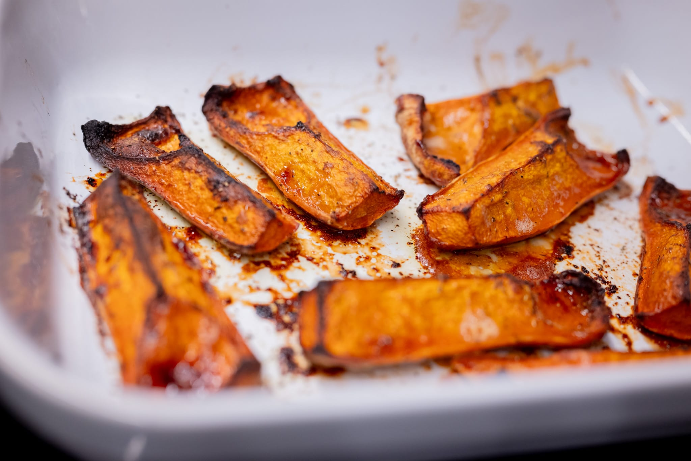

We're nearly at the winter solstice, so there's an end in sight to the short days. I don't mind the cold, but I don't love only getting seven hours of daylight.

The fall weather means squash, and I'm always looking for new ways to prepare it. In my search for Thanksgiving inspiration, I watched a few of Alison Roman's takes, and decided to try her slow-roasted-then-blasted squash from [the 2023 miléssime](https://www.youtube.com/watch?v=sP_9TBAwPRI). (Though not for Thanksgiving.) I wound up trying it with a couple of honeynut squashes. It was pretty tasty. I'd recommend it.

Now that summer has truly given up the ghost for the year, I feel much better about really cranking up my oven.

I took another run at doing pizza _sur levain_ after my rather dismal experiments last month. To start, I once again really upped the amount of the sourdough starter I used. This time, I mirrored my usual bread formula, and did 200 g of the liquid levain. I also gave the dough more time to get going at room temperature before popping it in the fridge for a 48 hour chill, and took the chill off in a 35 °C oven rather than at room temperature.

The results weren't quite there, but I'm definitely making progress. The crust had the same wonderful acidic bite that I had at Oobatz from the sourdough element, and the dough definitely had more oomph when it went in the oven. The pizza was well-risen and not at all under cooked. But I clearly didn't quite get the ratios quite right. The dough was hard to handle and thus wasn't quite as thin as I'd have liked. That also made it hard to get into a nice circular shape.

Flavor-wise, though, it was superb. One more iteration getting the hydration right, and I think I'll be there. I also need to remember to get basil next time for a little more visual zing.

I did a roast chicken for the first time in ages to a few different ends. Most importantly, I needed stock to make the gravy for Thanksgiving. If I were trying to earn a Michelin star I might've bought turkey wings and made stock from those for turkey-wise congruence. This was a lot easier and felt more efficient, too.

There was enough stock to keep a bit aside for future soup, or other dishes like a batch of beans or nice risotto. As much as pre-packaged stocks and bases have improved over the years, they still can't really compete with the real deal. It's one of those little details --- like using tons of butter --- that makes the food at good restaurants so delicious.

My very [overindulgent wine glasses](https://richardbrendon.com/collections/glasses) made it to me from the UK. I feel slightly ridiculous about them. But it's hard to deny their superlative niceness. The glasses do a remarkable job getting all the fun aromas into your olfactory system. It's a noticeable enough difference I think anyone would pick up on it.

For Thanksgiving, my new kitchen was really put to the test. Starting with my freezer. I have a European-size refrigerator, which is more than enough, except when you need to put a turkey in the freezer. Some serious rearranging was required.

I was also bemused once again that it was surprisingly hard to get parsley. Shopping a few days before the big day, I got one of the last bundles at my local store. I suspect this is the one time of year people really try when it comes to cooking, and so is the one time of year more typical shoppers are buying herbs.

For the rest, I like to keep things traditional: Brussels sprouts (roasted), mashed potatoes (ultra smooth and buttery), Parker House rolls (the best), and gravy (essential). Plus the classic apple tart that's become a staple.

The tart was a little bit of a test case. I followed some tips from the team at ChefSteps for making pie, and was able to get the pastry dough much thinner than usual. Which is great. There's something wonderfully luxurious about wafer thin, ultra-flaky pastry on a tart. But it was _so_ thin that, under the weight of the apples, some of the edges didn't hold up after I removed the tart ring.

I wound up with a ton of leftovers, even after imploring people to take as much as they liked. I was proud of my idea to use the leftovers to make a turkey pie. (A pie in the British Shepherd's Pie sense, not the apple pie sense.) It's really perfect: I had leftover celery, tossed in some frozen vegetables and turkey, and bound it together with the leftover gravy, topped with the leftover mashed potatoes.

That said, I definitely need a break from turkey. Next time I'm very tempted to do something less bland, like a ballotine of the leg meat with a chestnut stuffing, as is often done in France for Christmas.

A friend introduced me to the joys of colatura di alici, an Italian cousin to Thai fish sauce, probably with roots in Roman _garum_. It's not something I'd been super familiar with. I'm now a big fan. It's likely to elicit a Marmite-like reaction: you'll either love it or hate it. I don't think you could be indifferent.

Per the person who made the suggestion, I used it really simply with some linguine in olive oil lightly perfumed with garlic, and with a big handful of parsley and a pinch of pepper flakes.

Back on the sweet side, I started doing some post-Thanksgiving Christmas experimentation. I'm a huge fan of ginger, but I wanted something that wasn't a ginger snap. So I tried incorporating a ginger element into a shortbread. It was good, but I think it needs more, perhaps with the addition of raw ginger into the dough or a bit of candied ginger.

I also had some leftover egg whites, so tossed together a meringue for a quick pavlova. While doing the meringue is a little bit technical, I really think it's one of the best quick to assemble desserts.

Looking to the month ahead, it's hard to have anything other than Christmas and New Year on my mind.

I'll be spending some time in Portland, which I continue to think has one of the best food scenes in the world, especially compared to its population and economic output. It's particularly an antidote to the status-obsessed world in so many of the other places I visit, where it's more about being able to boast than it is about the food. It probably doesn't hurt that the local tourism board still hasn't paid for the Michelin people to review the area.

In my never-ending quest for ever more obscure biscuit recipes for Christmas, I've attached myself to the idea of getting some "stamps" to give an interesting bit of texture and visual pop. It's been more difficult than I'd like to find anything interesting, regardless of price. 

I liked this video from the _Cook's Illustrated_ team. It does a great job giving you the "building blocks" for exploring biscuits with a fairly short dough.



On the savory side, I like the idea of doing this panissa that I saw on the Pasta Grannies channel. I love risotto, and this looks like a fun twist on the idea. I love the seeming sacriligious step of adding red wine to an Italian rice dish. I doubt I'll follow this exact procedure. There's a bunch of chicken stock I need to use up.



From the _Comfort_ cookbook I've been trying out for the last few months, Nigella Lawson joins Yotam to cook a very tasty looking roast chicken.



### What I'm Reading and Watching

* [Finding balance](https://www.theguardian.com/society/2024/dec/01/its-about-balancing-out-december-why-nutritionists-overindulge-at-christmas-too) with the rich food we eat around this time of year

* Food writers pass judgement on the [most influential cookbooks](https://www.nytimes.com/2024/11/15/t-magazine/most-influential-cookbooks.html) of the last century

* Big food companies are [fighting back](https://www.nytimes.com/2024/11/19/magazine/ozempic-junk-food.html) as GLP-1 inhibitors quench our collective appetite

* A [fun new book on wine](https://publishing.hardiegrant.com/en-us/books/whos-afraid-of-romanee-conti-by-dan-keeling/9781787139886) with a fun title (_Who's Afraid of Romanée-Conti?_) that I've got on my reading list

* The [dangers of deli meat](https://www.grubstreet.com/article/is-deli-meat-bad-for-you-lunch-meats-boars-head-recalls.html)

* Melissa Clark takes a fresh look at the [Thomas Keller empire](https://www.nytimes.com/2024/11/26/dining/french-laundry-per-se.html)

* The [logistics](https://www.ft.com/content/000b26dd-39f0-4916-9400-9e9402ce9754) of getting food to people in need, even in war zones

* As ever, [Nigella's take on Christmas for the year](https://www.ft.com/content/b10bddc5-4812-4d24-9ee5-c721d8ce4fb0) is worth reading for the writing if not the food

* Tinned fish and balsamic vinegar have [achieved trendy status](https://www.theguardian.com/business/2024/nov/28/olive-oil-balsamic-vinegar-tinned-fish-waitrose-report) according to the culture desk at _The Guardian_

* A really fascinating account of escaping the [clean eating vortex](https://www.theguardian.com/wellness/2024/dec/16/food-nutrition-misinformation-social-media)

_[Subscribe](/subscribe) to get notified every month when new issues go out_
