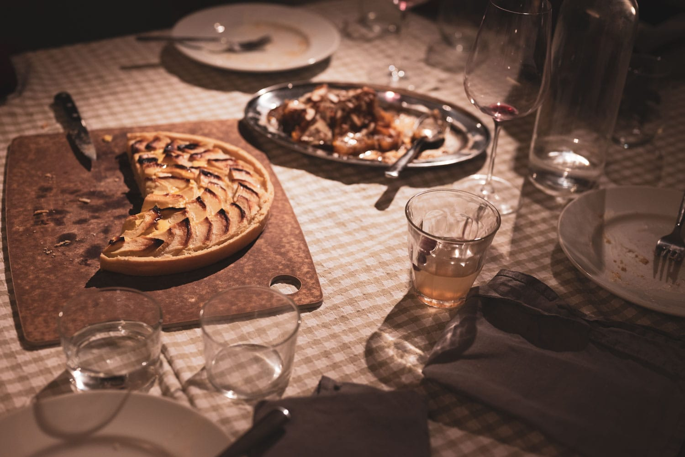
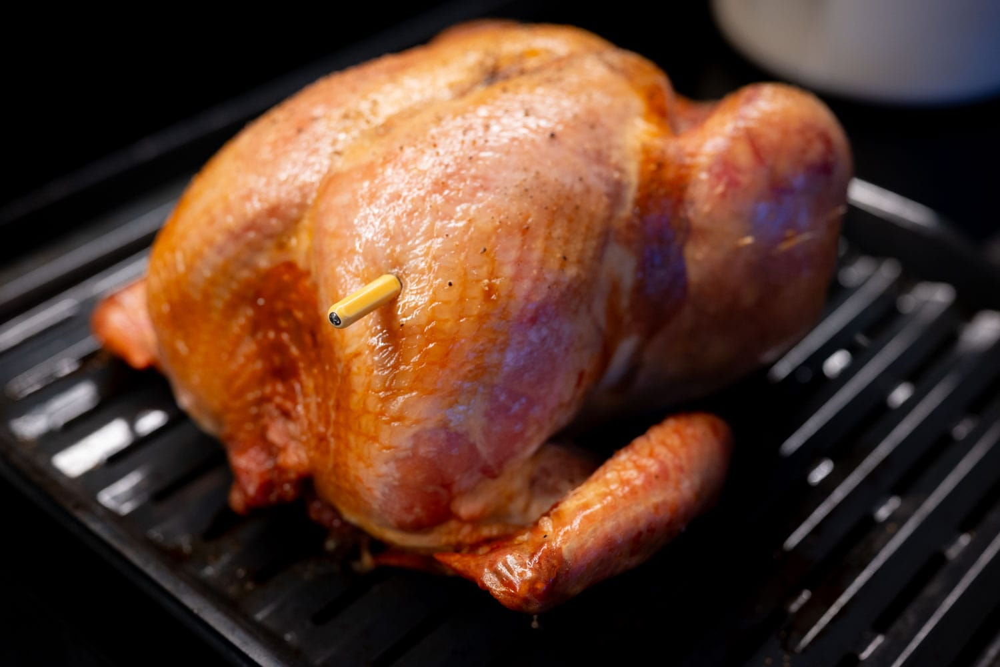
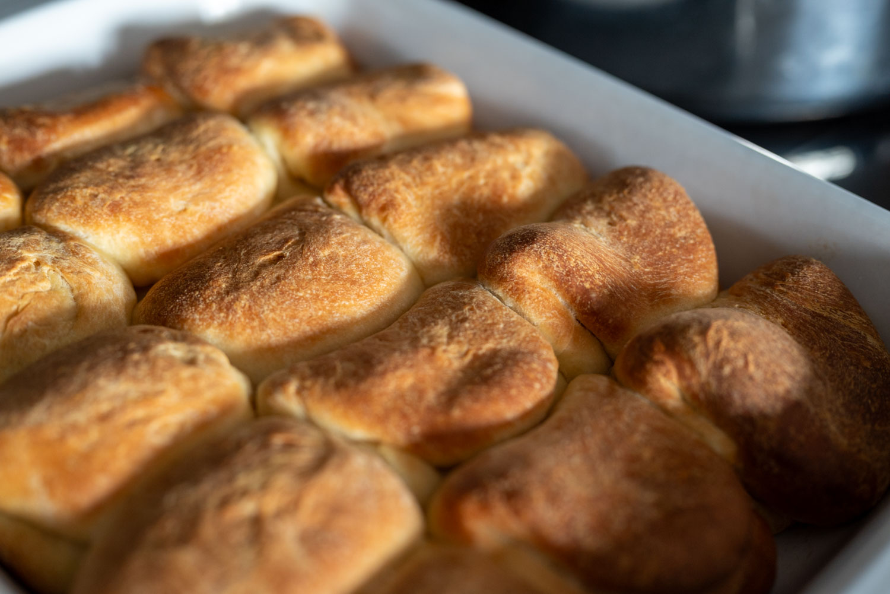
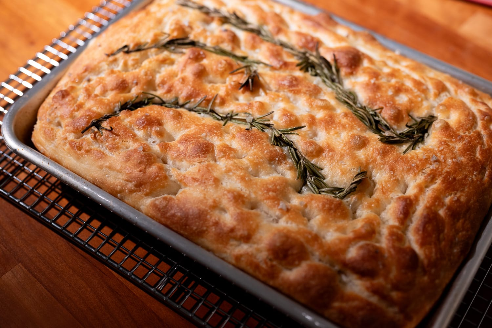
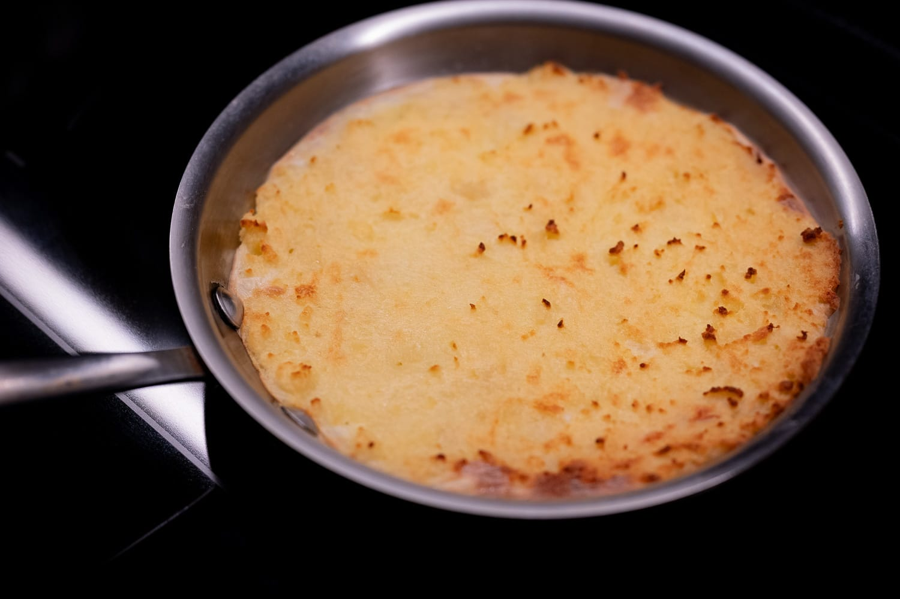
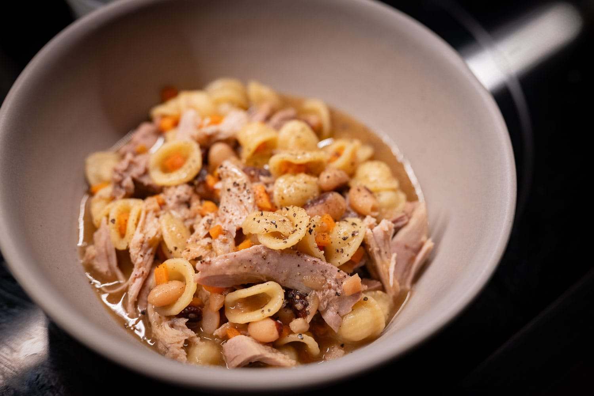
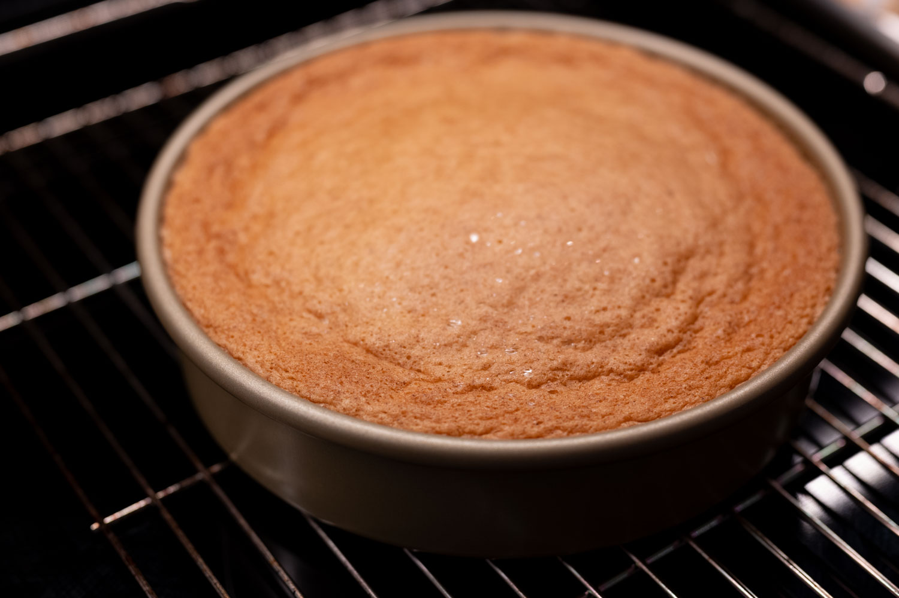
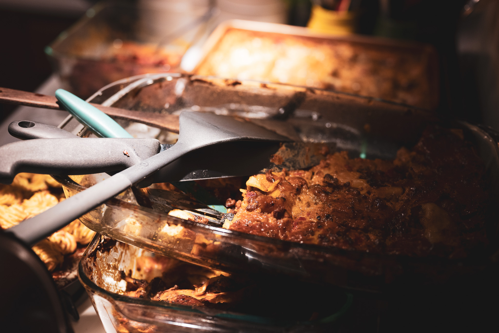
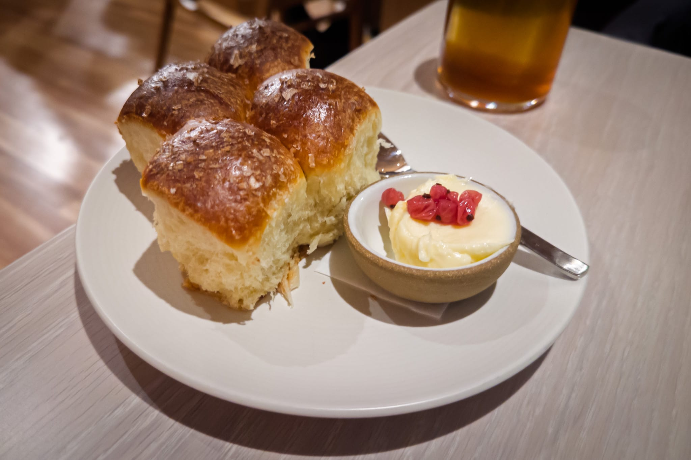
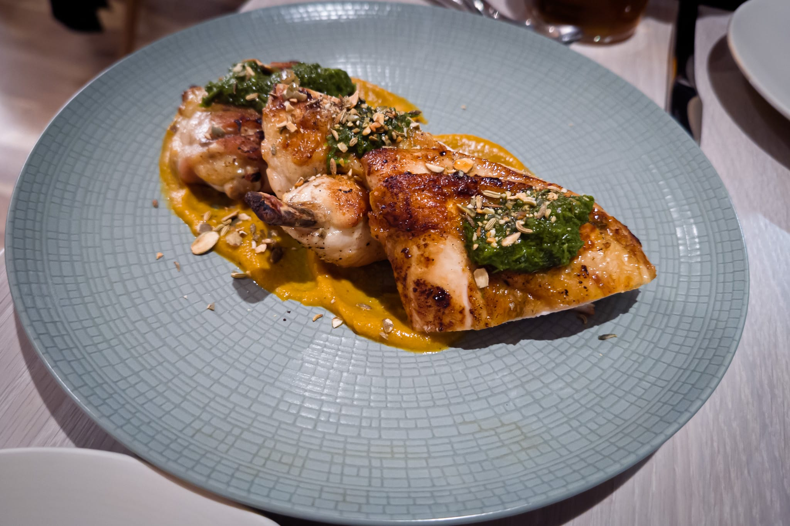

The second half of November arrived with the festive season in all its madness. I really don't mind the cold or the biting wind, but the short days do sometimes get to me. Of course, it also gives me a great excuse to cook for people and eat out.

For Thanksgiving, I had a group big enough that I felt like I needed to make a turkey. Which I think was accurate. A chicken wouldn't have been enough for the group. And yet, I still wound up with a lot of leftovers.

With the turkey, there were the usual Thanksgiving fixings. Parker house rolls, roasted Brussels sprouts, and of course the now indispensable apple tart. Once again, I had a fairly international group, which added a couple of interesting contributions. There was a sort of fregola salad from Italy, and an apparently untranslatable pumpkin-tahini dessert from Turkey.

The leftovers lasted what seemed like forever. Though it was a nice constraint to push me into some more creative directions. I did a turkey-bean soup, which also gave me a good excuse to use up the dregs of a few containers of beans. Inspired by a new sandwich place that opened, I did a sort of Italy-meets-US sandwich with a batch of focaccia.

Doing the focaccia gave me a good excuse to experiment with my Bluetooth food thermometer. I thought it would be fun to pop the probe in the dough for the bulk ferment and see if I could observe the exothermic reaction happening during the fermentation. I didn't have the presence of mind to save the data and get it to my computer to actually compute a numerical derivative and see if it lined up with what you'd expect. But you could see the slope of the line get steeper when I moved the bowl into the oven (where the generated heat energy could accumulate more) from the counter.

The focaccia was also a testing ground for a small olive oil experiment. I'm lucky that inflation hasn't really crimped my style that much. But it's hard to escape quite how expensive olive oil has become. So I did the unthinkable and bought some budget olive oil from my most convenient discount supermarket, Trader Joe's.

It was a good reminder that quality can be worth it. The budget olive oil wasn't very good.

In pastry corner, I did an olive oil cake. Nothing particularly novel or new. But it's always a favorite. And I was able to get my hands on reasonably decent blood oranges, so I was able to take another run at working on how to make a blood orange variant worthy of the name. I still don't think I have the right intensity. Perhaps I need to mess with a post-bake syrup or some kind of flavor concentration technique.

 

Out of the house, I got treated to a holiday-as-birthday party feast. It was one of those reminders that care, attention, and finesse do make a difference. The next time I do lasanga, I'm going to make my own pasta. And, better still, the host finally managed to track down a source for the "good" ladyfingers, which she used to do an excellent tiramisù.

Following my food fermentation obsession, I tried a local restaurant, Fallow Kin, that makes a bit of a todo about its fermentation program to reduce food waste and create interesting flavor. While I'm not sure the fermentation really made its much-vaunted appearance, the food was pretty good. It was disappointing in its way not because it was bad, but because it had signs of greatness, and I have a hunch that they're hold back because people in the US are, on the whole, not very adventurous eaters.

I'm definitely going to be back after they've had a few more months to bed in.

For the month to come, as I've been writing the look back for this month, I've realized how beige my diet has been. Which is not necessarily to say I've been eating nothing but turkey and mashed potatoes. As mentioned last time, there has been a lot of squash.

But I feel like I have to do something green with what's in season, like cavolo nero. I've started following the team at Canteen --- they of my favorite new recipe of the year, the summer pork ragù --- and they were doing a cavolo nero risotto. That may merit some investigation.

More in the beige vein, one of my favorite French food shows did a recent episode on the food of Lake Como in northern Italy. They featured this polenta recipe called ["polenta uncia"](https://www.radiofrance.fr/franceinter/podcasts/le-marche-de-francois-regis-gaudry/le-marche-de-frg-du-dimanche-23-novembre-2025-2607569) that sounds wonderfully warming for a cold winter evening.

Then, of course, there's the dual threat of all the Christmas and New Year festivities. Paradoxically, I don't wind up doing a ton of cooking for the feast days. It's more the days in between that I get called into action, and have to make dinner for a group at the drop of a hat. There's a part of me that enjoys the practice. It can also be a struggle without all my creature comforts of home. You don't appreciate how good your oven is until you have to use someone else's.

Even so, I'm hoping I'll have a few opportunities to try concocting more obscure Italian Christmas cookies and maybe do a batch of PLF for croissants.

### What I'm Reading and Watching

* [Danny Meyer takes a look](https://www.ft.com/content/4930b616-2325-4d10-87e2-3757ee328409) forward and back at Union Square in New York

* Melissa Clark's [Vietnamese coffee brownies](https://www.youtube.com/watch?v=9lqmfluXKGo) were my highlight from this year's NYT Cooking cookie week

* [Festive recipes](https://www.ft.com/content/35eaaae5-e0e3-4a44-ad12-547a9ddeba0c) from some of my favorite voices in food in the FT

* For anyone looking to explore a more vegetable-forward approach in the new year, one of the food writers and educators I follow has [a course on vegan cooking](https://www.christina-soteriou.com/the-big-veg-blueprint-cooking-course) that kicks off in early January

_[Subscribe](/subscribe) to get notified every month when new issues go out_
