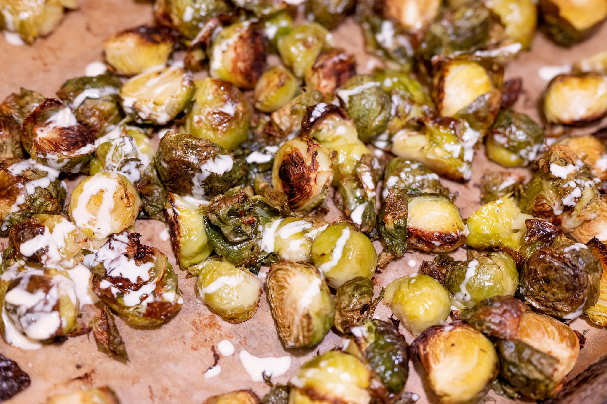

In an exciting twist, I think my [kitchen project](https://jkibe.github.io/kitchen145/) may actually happen soon. My architects, contractor, and I are still working out the final details, but it's looking like we'll get going in March. I'll keep this going as well, though it may be more about my descent into madness eating Sweetgreen for dinner five nights a week.

Other than that, the last month has been relatively uneventful. No travel, not a ton of dining out. I did have a chance to try a place called [Bar Mezzana](https://www.barmezzana.com) for the first time, which I'd recommend. There was an attempt to try a new small plate Thai restaurant, but, despite the pandemic, it was impossible to get a table.

In my kitchen, this has been an even more Ottolenghi-heavy month than usual. For the salmon with greens and tahini sauce, I started my journey to mastering the simple art of making a tahini sauce. However much people may mock the Ottolenghi gang for the amount of tahini they use, it's such a wonderfully simple sauce, it's difficult not to reflexively put it everywhere. Like a beurre blanc, but a lot less complicated.

The salmon with greens and tahini sauce did leave something to be desired. It's very tasty. Visually, I can't quite get behind the look of the greens in sauce on the plate. Maybe I need to slightly thin down my sauce more.

The bean-and-farro fish with chermoula was more unambiguously good. I wound up doing striped bass rather than halibut, which, at about $30 per pound at my friendly neighborhood Whole Foods, was a bit rich for a weeknight. I couldn't get the vivid green broad beans, so I swapped in possibly more delicious (if visually blander) borlotti beans instead. It goes without saying, the real triumph of the dish is the chermoula: anything with preserved lemon is a winner in my book.

As a side, I did roasted Brussels sprouts drizzled with --- what else? --- tahini sauce.

My foray into pizza was a bit less exciting. I keep it simple, and I've more or less gotten the process as good as it can get until I have a super hot pizza oven.

After a month-long hiatus, I did another batch of croissants. This was probably my best batch to date, though there were still issues. For my entire arc of mastery so far, the dominant issue is what I'd describe as "butter bleeding." When the croissants bake, you want the butter to stay in the croissants, so they come out rich and soft. If you don't laminate them very well or let them rise enough, though, butter leaks out, and the baking tray is a slick of fat when the croissants come out of the oven.

Regular readers may recall the 2019 Christmas oven fire, the result of butter leaking from the croissants, dripping off a rimless baking tray, and catching in the flame of a gas oven.

Thus: it was encouraging that this batch had minimal butter escape. I still don't think I let them rise long enough, however. They were too dense and didn't develop enough volume during baking.

Looking forward to the month ahead, I'm struggling to straddle the season. It's still obviously too cold for real warm-weather food. As I write this, it's snowing outside. On the other hand, there are signs of spring: yesterday it was warm enough for me to go for a run in shorts.

There's also the frightening-exciting prospect that this will be the last month before the renovation begins.

One idea has been born more of necessity than anything. I'm in the mood for soup, and I've exhausted my supply of chicken stock. I don't have anything against store-bought chicken broth in a can or a box. I'm not beyond buying it, and I use it all the time. But neither is store-bought chicken broth amazing. When I'm making soup, it makes such a difference to have the good stuff. There's a [roast chicken](https://www.seriouseats.com/easy-roast-chicken-with-asparagus-and-leeks) in my future.

Given the impending need to pack up the contents of my apartment and use up any food, I need something to at least reasonably minimize my stock of [Sporkful cascatelli](https://www.sfoglini.com/products/sporkful). In my frantic past few weeks, I haven't been able to generate any ideas better than the classic ragù. Depending on my desired level of masochism, I may or may not decide to make this into another attempt at a meat-free or at least reduced-meat recipe.

My lack of kitchen will also mean I have to suffer through the lackluster French bread available locally. Not that I struggle to find the time or willpower to make [bread](https://www.youtube.com/watch?v=60K3Fe5j_J8); there will be a certain melancholy.

Speaking of the land of great bread, assuming I can swing it, there may be a trip to the motherland in the cards while my apartment is being torn apart. I'd also like to squeeze in a (first-ever) stop in Denmark, perhaps the real country of my dreams. If it happens, you'll probably hear about it in the April or May edition.

More experimentally, I want to try this week's Ottolenghi recipe for [meatless meatballs](https://www.theguardian.com/food/2022/feb/12/ricotta-squash-pasta-mushroom-meatballs-strawberry-cream-yotam-ottolenghi-valentines-day-recipes-for-two). I feel like pasta is the easy way out, especially as I'm still eating so many solo dinners as the world comes back to life. Even so, the recipe looks very good.

I'd also like to return to some Ottolenghi successes of the past couple of years. More recently, the fantastic tahini-za'atar salmon. From a darker chapter of the pandemic, his kitchen's great [tofu sambal](https://www.theguardian.com/food/2021/may/22/yotam-ottolenghi-tofu-recipes-spicy-sambal-beer-battered-coconut-flan-coffee-caramel).

On the sweet side, I need to get back to the [_pepparkakor_](https://www.thecutlerychronicles.com/pepparkakor-swedish-ginger-thins-html/) I meant to do in the last month. I love ginger, and I need more ways to enjoy it.

Slowly but surely, I'm also getting back into a social groove. With an audience, I have more of an opportunity to make the sort of sweets that I can't slowly chip away at by myself over a week or two. I'm really eager to try experimenting with [madeleines](https://www.youtube.com/watch?v=2IOPlok8SzQ) again. They really have to be eaten within a few minutes of coming out of the oven for maximum effect.
