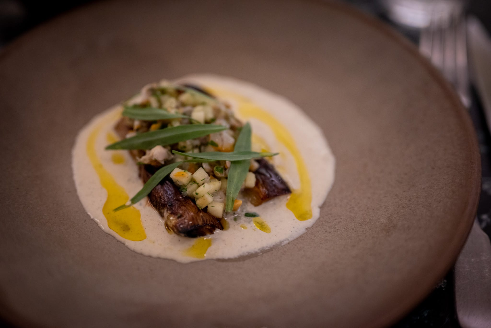

Despite my kitchen still (!) not quite being done, I feel like I'm beginning to get my groove back.

I spent the second half of January meandering around Europe in Spain, the Netherlands, and France, which provided some interesting perspectives that were really inspiring.

The trip marked my first visit to Spain, and I spent that mostly in Madrid with friends there. While I wouldn't say the city is quite as cosmopolitan as Paris or London, it was still interesting to see the mix of food from all over Spain and the world more broadly.

Having _paella_ there was especially interesting. We ordered two varieties, and I was surprised how minimal they were. By way of example, the seafood paella I tried had only a few pieces of fish and shellfish scattered through the rice. It was also very clear they're using a much richer, more flavorful broth to cook the rice than I ever do.

I've written before about what a difference real chicken stock makes versus what comes in a box or a can from the supermarket. It's clear that great paella demands something of that caliber. Especially whenever they finally get around to installing my vent hood, I'm really looking forward to taking another run at paella with this new insight in mind.

Having lunch in Madrid was a constant source of surprises. It's so nice to be in a place where people take the time to have a real meal rather than a bland and hastily consumed sandwich. For the price of an admittedly nice sandwich here in the US, I had several three-course lunches with a starter, main, and small dessert to round things out. It all felt very civilized.

Nor was all the food that I tried in Spain Spanish. I had some excellent yakitori one evening, pretty decent tacos on another, and even did Chinese-style hot pot one evening to celebrate the Lunar New Year. It was really nice to be in a place with such a rich food culture.

The Netherlands is a bit of a different story. I love the country more than I can describe. The way their train system works is something to behold. Their food culture isn't quite as rich as somewhere like Spain, though. That's not to say there isn't good food to be found. More that it's less well-rooted, and tends to borrow more from places that are.

Which is to say, I had some great French food at a bistro-style restaurant in the central canal district of Amsterdam, and a very lush Lebanese dinner at a great restaurant tucked away in The Hague.

Paris has begun to feel like a home away from home. I had a chance to visit a few of my favorite haunts and discovered a few new excellent places along the way.

While it's a guidebook cliché, I'm unapologetic about loving the apple tarts at Poilâne. That was an obligatory stop. I also gave the _chausson aux pommes_ a try at a few other places: Maison Plisson, one of my favorite places for interesting food products; and Boulganerie Utopie, near where I was staying in the Marais. It's hard to go wrong.

I couldn't quite fit in a trip to a favorite like Neige d'été with my other plans, but I definitely loosened the purse strings a bit more in Paris and did an exploration of the neobistrot scene. My first night was probably my favorite at a place in the Marais called Le Saint Sebastien. I had a really nice seafood-leek starter. I love a nice leek. Though I think the star was the cime de rapa that accompanied the fish main. They coated it in a really interesting sauce made from sunflower seed tahini that was delicious.

Riffing on my recent explorations, I started a [new page to compile restaurants](/out-and-about) that I've tried and would recommend. I know I'm missing a ton; I'm not always the best note taker and my memory isn't as perfect as I'd like it to be.

Back at home for the last few weeks has in large part been riffing on the ideas from my trip.

Probably the most fun has been experimenting with the _tourte auvergnate_. It's a rye-dominated bread from the Auvergne region of France. I brought home a loaf from Boulangerie Utopie, and then set about trying to recreate it. I haven't quite gotten it to work. Traditionally, it's made entirely with rye flour, which makes it tricky to get a good crumb since there's virtually no gluten created through the kneading. Most of what I can find online uses a little wheat flour, but I haven't quite gotten the ratio to work at home.

The weather this winter has been unusually warm and dry, so it's difficult to really dig in on the usual comfort food I'd go for at this time of year. Though I did pick up some really great products from the folks at [Sa Majesté la Graine](http://samajestelagraine.com), a small producer in Berry, including some amazing green lentils. As I've probably mentioned before, I love a nice _saumon aux lentilles_.

Something about eating out at a string of nice restaurants revived my enthusiasm for using sieves. I made a velouté of butternut squash and took the time to pass it through a sieve. It's hard to argue with the silkiness of the end product. It also reminds me that I need to buy a Vitamix blender whenever the madness concludes itself.

Looking to the month ahead, I do slightly feel like I'm in limbo.

I really want to try out a few ideas that take advantage of my amazing new cooktop's amazing power. Doing a stir fry, like my favorite [lemongrass chicken](/recipes/lemongrass-chicken), will be so much easier with really high heat. But until my vent hood is installed, I'm reluctant to go too crazy with something that will generate so much smoke and mess. It's never fun to clean up, but at least in a finished kitchen the ventilation reduces the scope of the problem, and you're not worried about damaging your cabinets. Here's hoping we're able to put the screws to the crew and finally wrap everything up before the next edition.

More productively, there are a few threads to pull that don't require hot oil everywhere. I'm keeping King Arthur in business buying rye flour to continue working on the tourte auvergnate. I'm close, but not quite there. And I'm still behind on trying out some of the techniques from Josh Niland's [_Whole Fish Cookbook_](https://www.thecookingworld.com/reviews/the-whole-fish-cookbook-review) that I received as a Christmas gift.

We also have pancake day coming up in a little over a week. Not that I think one really needs an excuse to make pancakes, but, like my annual hot cross bun ritual, it can be fun to have a reason. I do use it as an excuse to make pancakes more like what the rest of the world thinks of: something more like a crêpe than what you'd get at a diner in New York.

If everything goes to plan, there may be more travel as well to report on. But not quite fully-formed enough as an idea to tease more than that.