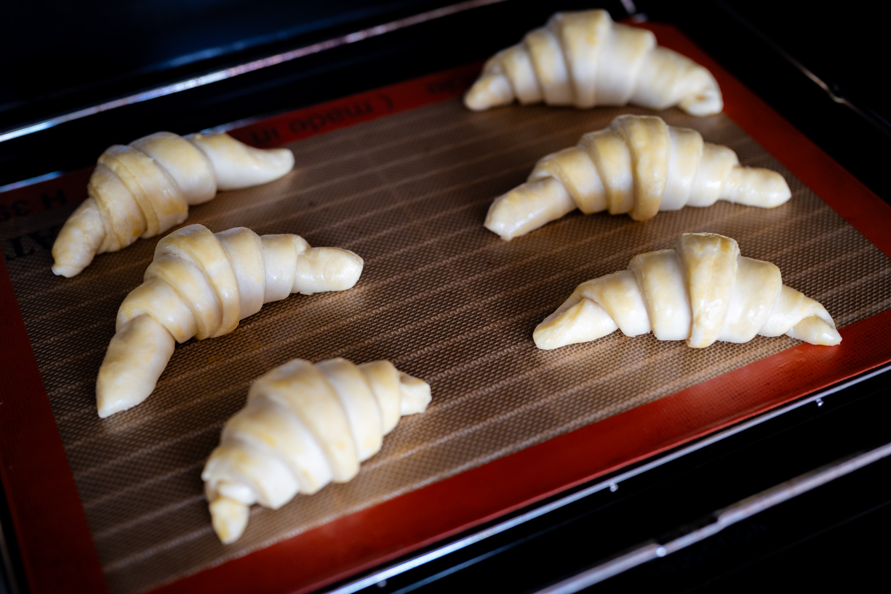
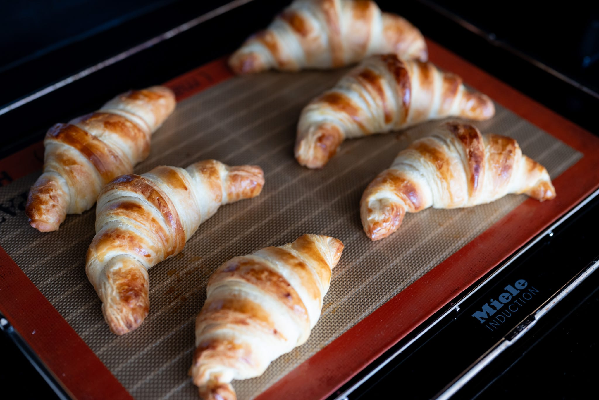
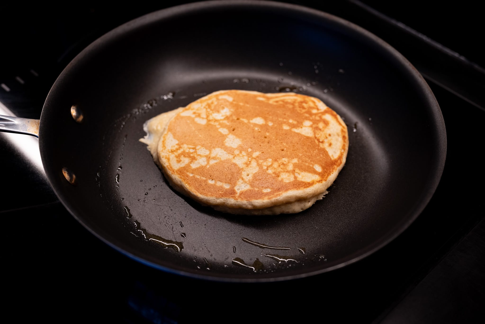
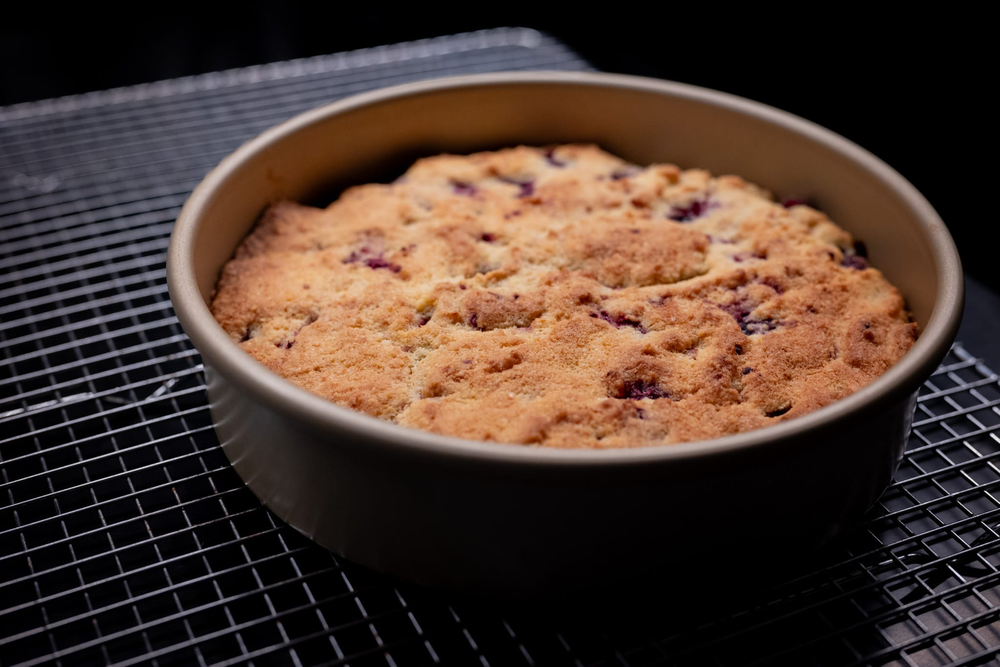

After a bit of a wacky month, I'm trying to get this back on schedule, so this month's notes will be a little sparer than usual. It hasn't been that long!

Outside my kitchen, I had some fun celebrating Lunar New Year at a friend's gathering. The food was great, and I can't take credit for any of it.

My small contribution was a fun bottle of _brut nature_ bubbles --- my obsession for the last decade --- from my favorite wine shop. These sparkling wines put a bit of a twist on the usual method by harvesting extra-ripe grapes, so there's no need to add sugar for the yeast to make the bubbles. The result is a bone-dry effervescent wine.

It's hard to recommend weird wines because they're so inconsistently stocked. If you can find it, the Nomi _brut nature_ from i Clivi was great. Louis Roederer does a (much more expensive) _brut nature_ champagne that's also really nice and somewhat easier to find. I've found bottles of Triple Zéro from the Domaine de la Taille aux Loups at wine shops on both the East and West Coast in the US.

As mentioned last month, I got a big shipment of product from Rancho Gordo. Ridiculous as it may sound, they really do produce and source exceptionally good beans. I did a batch of black bean soup with some of their Ayocote Negro black beans, which was quite nice. The beans are a little bigger, a little more toothsome, and much tastier than your bog standard grocery store dried black bean.

For no particular reason, I had a yen to make some pizza at home. I don't know there's too much to report. I keep it simple and I've more or less gotten as good as I can the limitations of my home oven. Sometimes I think about getting something like the [Breville Pizzaiolo](https://www.breville.com/us/en/products/pizzaovens/bpz820.html?sku=BPZ820BSS1BUC1). Then I remind myself I'd have to store it somewhere and, for the purchase price, I could get a lot of professionally-prepared pizza at my favorite places.

For anyone who thinks I'm immune to mistakes, I botched the transfer from peel to oven on one pizza. It was pretty grim. My oven was covered in a tangle of uncooked dough, cheese, and tomato sauce. I would've shared a photo, but, in my panic, I was more concerned about making sure hot cheese didn't get all over the floor or permanently adhere to the oven.

On the sweet side, I worked up the energy to make croissants. I can tell I'm getting better at doing laminated dough. These were easily the best croissants I've done at home. And more generally, it's hard to mess them up to the point they're not delicious at all. At the same time, they still weren't quite there. They were a little too dense and scrawny after baking. The surface dried out too much, so I didn't get the desirable light crispness on the outermost layers. I didn't get the egg wash applied right, so there also wasn't quite enough browning. Even so, I was encouraged. I'll return to this in another few weeks and see if I can get closer to what I want.

While I'm not at all religious, I enjoy using certain religious holidays as a good excuse to make certain food. This month, that excuse was pancake day. I didn't do anything special, just my usual formula.

I got my hands on a bag of heirloom polenta recently, so I did one of my favorite desserts, a raspberry polenta cake. I'd usually dose it with lemon, but I finally managed to track down good blood oranges this season, so I used those instead. (I've become a very big fan of the blood orange in the last few years.) Given the season, I used frozen raspberries, but it was still a welcome hint of summer in the sunny but chilly February weather.

Looking ahead, I've been roped into some dumpling making to continue with the Lunar New Year theme. I'm brushing up on the pleating technique.



With March and spring approaching, my annual hunt for asparagus that's not from Peru begins. From experience, I may have to wait for something more like April, but it's never too early to begin hoping. As I've probably written before multiple times, I love really fresh asparagus with a poached egg and hollandaise.

In the legume department, I have to keep using my immense stock of beans. If you get good ones, it's often enough to serve them with a drizzle of really good olive oil and some herbs. I may venture slightly deeper and do a more refined, Italian-style beans on toast. Think crusty sourdough bread drizzled with olive oil, rubbed with garlic, and some beans tossed with herbs.

In my continued Ottolenghi obsession, I've been completely seduced by the idea of this tahini-sesame chicken schnitzel. I'm going to have to give it a try soon.



I've made a lot of French-style crusty bread over the last couple of months, which is obviously fantastic. All the same, in a funny sort of way I've gotten tired of the constant battle I wage against the crumbs that go everywhere when you slice it. There's a part of me that really wants to return to some delicious but less aggressively crumb-producing.

### What I'm Reading and Watching

* Coffee expert James Hoffman did [a ridiculous dissection](https://www.youtube.com/watch?v=C1jADbqJjFo) of tiramisu over on his YouTube channel

* [Lessons from the Aeropress](https://www.ft.com/content/734e4a05-db37-4af9-9a8d-72c4b613c5c6) in the FT

* Over on my favorite baking YouTube channel, [a good tutorial](https://youtu.be/G5ScLaxpjII) on doing crosisants at home

* A [funny (if tragically accurate) take](https://www.theguardian.com/commentisfree/2024/feb/12/food-should-be-tasty-and-it-doesnt-have-to-come-in-a-bowl-could-someone-tell-my-lovely-american-hosts) on the strange prevalence of bowl food

* A great [primer on cookies](https://jepensedoncjecuis.com/2024/02/la-meilleure-recette-de-cookies-la-votre.html) from one of my favorite food blogs

_[Subscribe](https://landing.mailerlite.com/webforms/landing/k5w5z0) to get notified every month when new issues go out_
