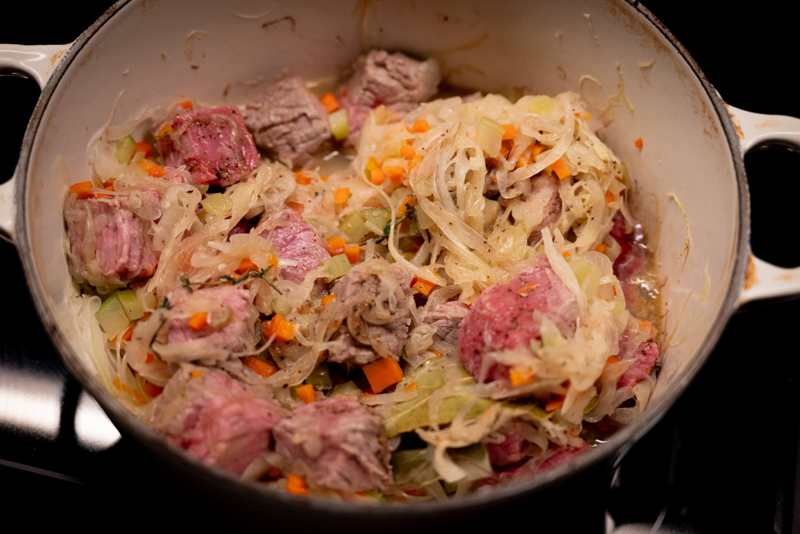
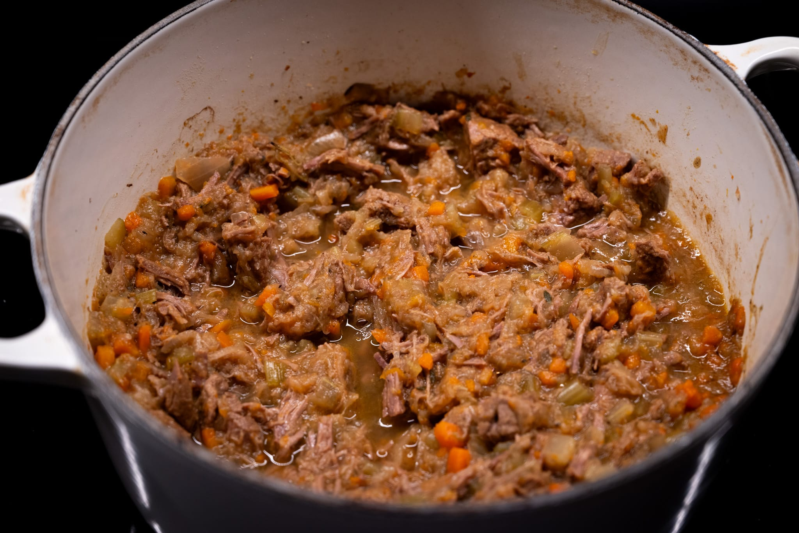
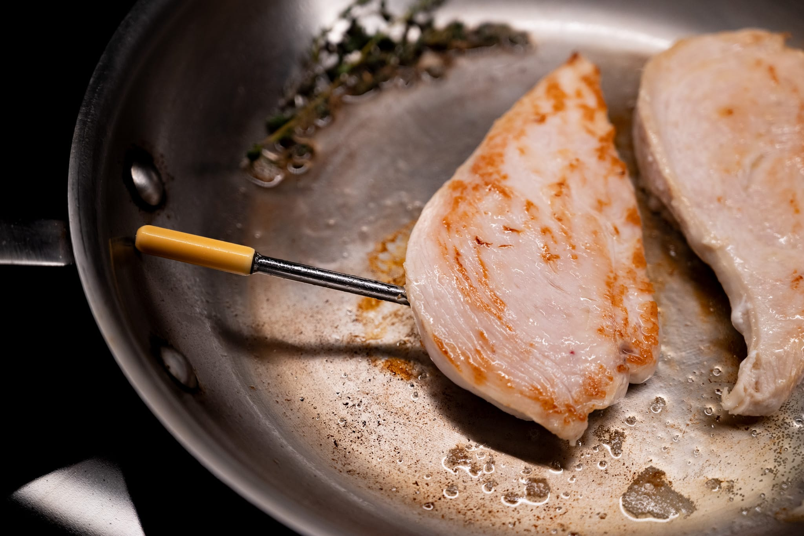
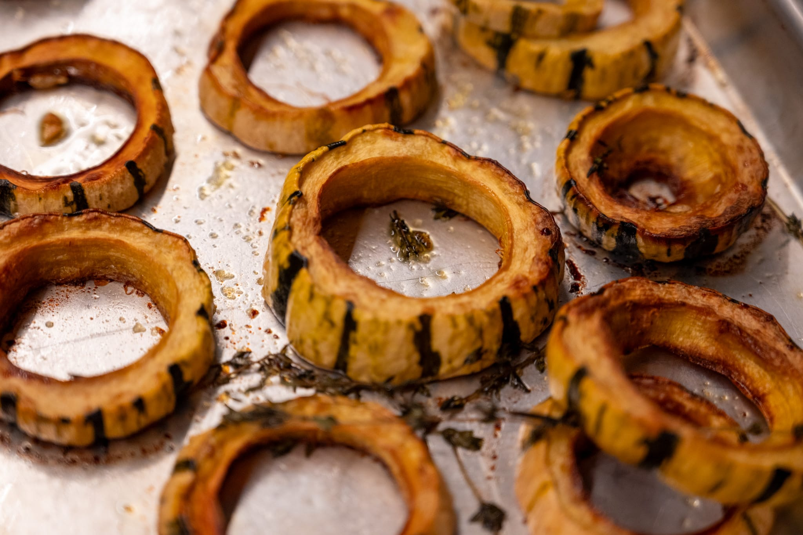
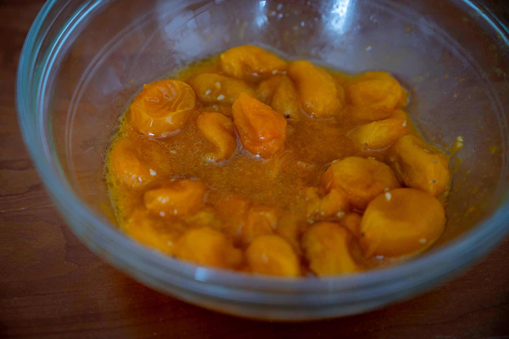
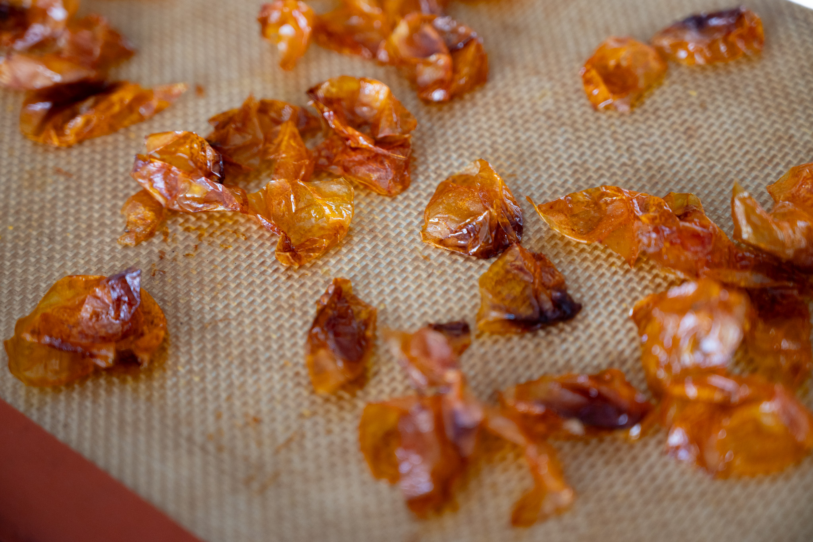

Even as daylight slowly makes its return, it's been cold. Very cold.

On the savory side, I felt like I had to try [a recipe for a _ragù Genovese_](https://www.ft.com/content/571a229e-d883-4308-9533-77e6aa725531) that I found in the FT. It pitched the recipe with this line:

> As the onions cook down, the liquid they release creates the sauce that the meat cooks in, and the pot slowly transforms from looking highly unappetising to absolutely delicious. It's a magic process to watch.

The butcher counter staff were surprisingly helpful in figuring out what to substitute for the cut of beef --- top round, for anyone else reading this in the US --- and I really did have to buy a lot of onions.

It was a winner with me. Though I think it needs a little bit of a tweak. The onions give the ragù a great texture and incredible sweetness. Too sweet, almost. I'm not totally sure what to add to cut the sweetness. I fear that cutting back on onions will take away something essential. That will have to be an exercise for a future iteration.

The delayed-by-manufacturing issues Christmas gift [Combustion Inc thermometer](https://combustion.inc) did make its way to me in the end. I tried it out on one of my less adventurous weeknight meals, a chicken _escalope_ cooked in a bit of butter with a quick pan sauce. The thermometer was a little awkward in that application.

Unfortunately, I wasn't able to really use it in a more well-suited application: cooking steak _sous vide_. According to a post I found from the company, they need to issue a software update because the probe currently gets confused between being sealed in a bag for _sous vide_ and being in its charging cradle. (In both cases, the contact on the top of the probe is covered.)

Eventually I'll try it with something that takes more advantage. From what I've seen so far, it's a solid product. I haven't had any major connectivity issues, and the software, if not completely without its rough edges, is fairly polished. I'd welcome a sharper tip and more svelte probe.



On the plus side, the steak was tasty, and it gave me an opportunity to try out another recipe for the steak sauce from cult restaurant L'Entrecôte. While I wouldn't make a trip to France only to eat there, it's worth trying at least once, and their steak sauce is very tasty.

The ChefSteps formula for the sauce was good. It needs a few tweaks for my money.

Faced with many a chilly evening, I returned to my Oobatz-inspired pizza experimentation. I think I've more or less figured it out. First, the levain really needs to be in tip top shape. For yet-to-be-determined reasons, pizza dough is less forgiving than bread-bread. Second, it needs a substantial amount of time to rise and get going before it goes into the refrigerator to develop flavor.

This built on my last attempt, which was good, but not perfect. Realizing I needed to use more than a token amount of the levain last time, I did actual math and got the hydration right. For something in a home oven, it was pretty good.

I was similarly impressed with a few more dishes that I tried from the latest Ottolenghi team cookbook, _Comfort_. The first time I try something, I make an effort to follow the recipe as closely as possible. In this case, that included peeling a few dozen roasted cherry tomatoes and then drying the skins out in the oven. To be fair, everyone who tried them agreed they added a certain something to the final dish.

This also provided an opportunity to use some celeriac for the first time in ages. It's a really underrated root vegetable, and worked well in the mushroom ragù that used it to add bulk and another flavor profile.

On the pastry side, as planned, I did my first-ever run at a _brioche des rois_, a sort of toroid-shaped extra-rich brioche meant to evoke a crown. It's usually made for much earlier in January for Epiphany. Between being sick and other obligations, I didn't quite get there for the big day.

Slightly frustratingly, none of my more immediate places to buy supplies had the orange flower water that most recipes called for. I knew that if I needed to find the time and energy to drag myself out to my favorite Middle Eastern food shop, I was never going to make the brioche.

So I swapped out the orange flower water for water-water, and gave it a run. Everything about it worked, except the shape. I seriously underestimated how much it would rise in the oven, and wound up with more of a loaf than a crown.

Beyond that, it's been a light month in the pastry department for better or worse.

The first half of March should mean the weather begins to turn, and I can cast my eyes to more spring-like produce. Though if past years are any guide, it will be another month or two until the good asparagus makes its appearance.

While I wait for that, I'm planning to continue embracing winter for what it is.

I have my eye on a chocolate-chestnut cake that I saw from François-Régis Gaudry.



Every time I visit France, I bring back at least one can of chestnut cream. It's one of my favorite flavors, and I don't understand how it's not more popular in the rest of the world. While I'm in chocolate cake season, this concept feels like it's worth a try.

It's peak blood orange season. They've really become one of my favorite things, in all forms. And they're one of the few products that's in-season at this otherwise somewhat barren time of year. In addition to eating them straight, I like the idea of trying blood orange as a flavor in a savory sauce, and as something to add some zing to a dessert. 

### What I'm Reading and Watching

* The lonely life of [residents-only restaurants](https://www.nytimes.com/2025/01/22/nyregion/condo-tower-restaurants.html) in the world's luxury condo buildings

* [A basket](https://www.theguardian.com/food/2025/jan/26/ultimate-custard-perfectly-timed-pasta-espresso-fuelled-stews-37-brilliant-recipe-hacks) of cooking tips

* Reflecting on the nature of [working as a private chef](https://www.ft.com/content/b076b820-9201-428d-a2fc-2c641876d57d)

* The _Ask Well_ column [explores the eternal question](https://www.nytimes.com/2025/01/28/well/eat/hot-lemon-water-health-benefits.html): does the preferred drink of Chinese grandmothers actually have health benefits?

* [A new take](https://www.theguardian.com/science/2025/feb/06/scientists-crack-what-they-say-is-the-perfect-way-to-boil-an-egg) on the eternal question of how to boil an egg

* [Pass notes](https://www.theguardian.com/food/2025/feb/12/young-people-no-longer-peel-much-whats-behind-the-french-frozen-chip-boom) on the apparent trend for frozen French fries in France

_[Subscribe](/subscribe) to get notified every month when new issues go out_
