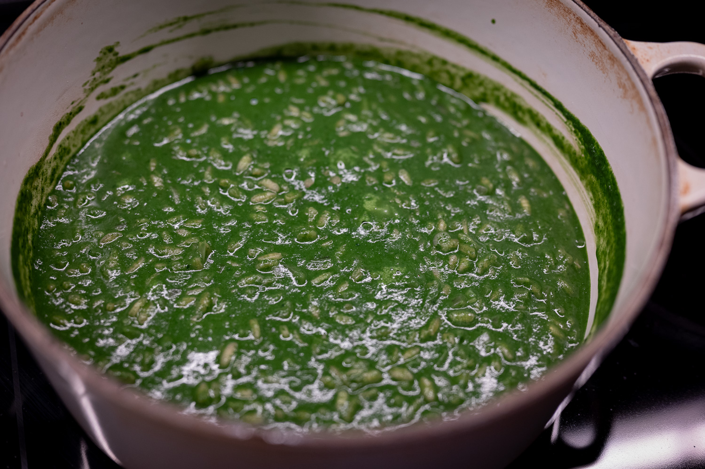
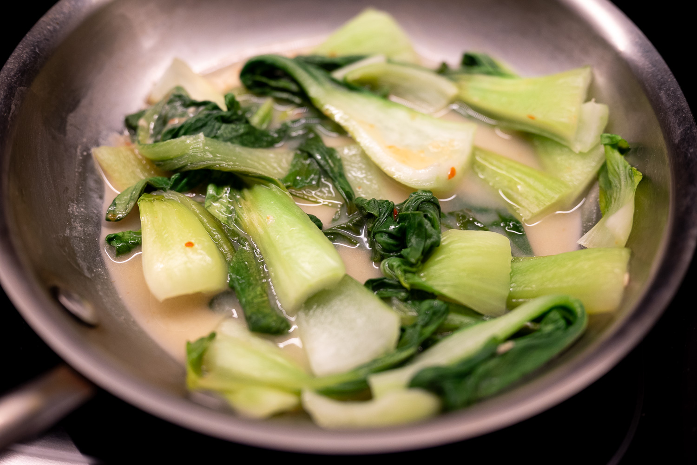
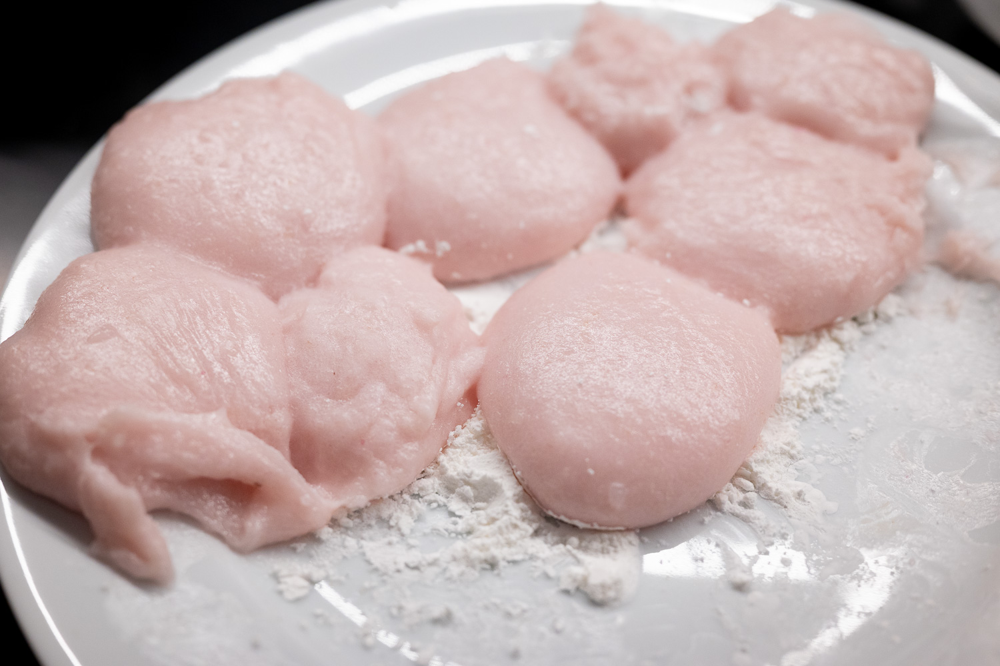
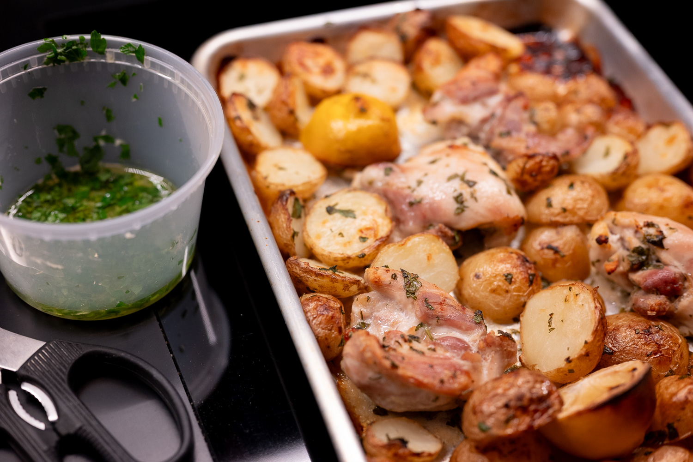
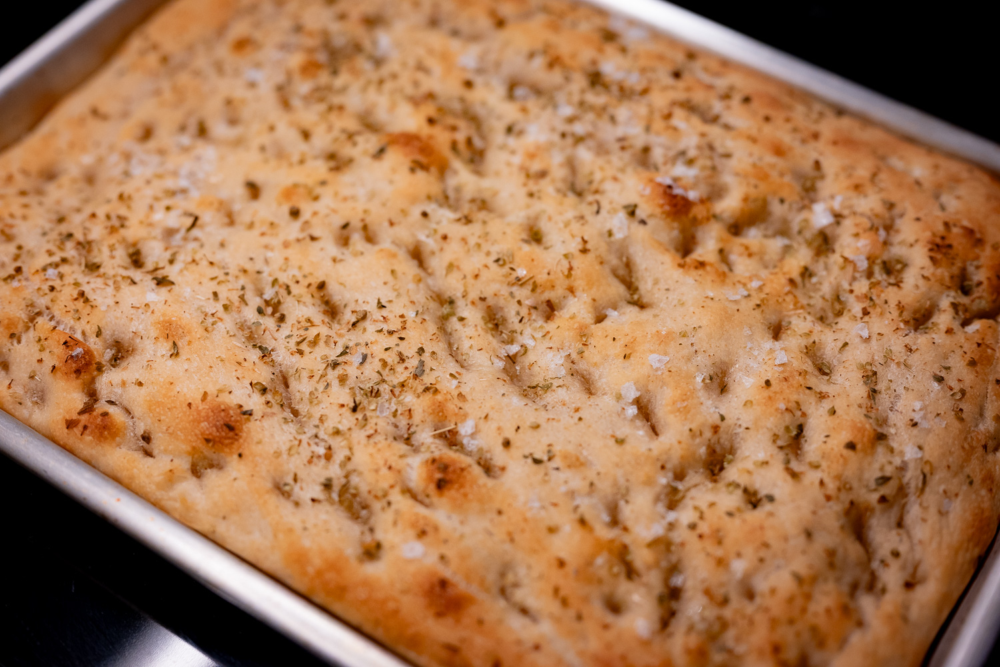
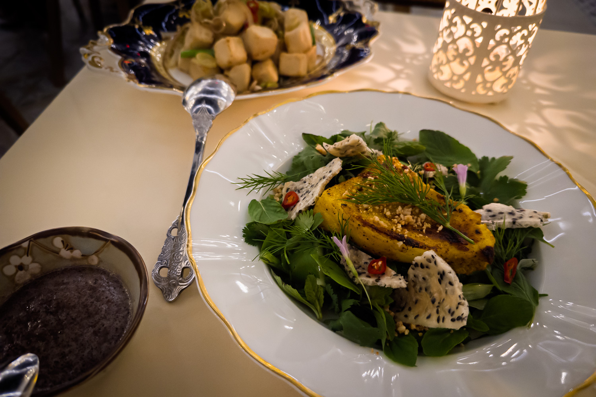

Winter began gently enough, and then got very serious a week or two into January.

With the weather so chilly, I thought it was a good opportunity to draw down from my store of chicken stock from the big batch I made for Thanksgiving. As I've probably written here a million times, using real stocks and broths instead of the pre-packaged stuff makes such a tremendous difference. I don't know that it was anything revolutionary, but then I'm now really coming around to the fact doing the basics right can be more of a challenge than one would think.

Reflecting on the beige-ness of the last few months, I made the time to try a recipe for a risotto with cavolo nero. It's in season yet gives the rice a great green punch. I'm not sure you can really cut down on the amount of butter and cheese you need to add, but the kale definitely adds something beyond just the color.

For a group dinner, I thought it would be fun to go Vietnamese, especially after the one spectacularly disappointing (notionally) Vietnamese meal last month.

It was a good excuse to dive back in and cook a few more dishes from The Slanted Door cookbook that I hadn't tried before. I was pleasantly surprised that everyone enjoyed the bok choy with a fermented tofu sauce. The fermented tofu is pretty funky, and it can be divisive.

In the same experimental context, after many years of thinking about it, I bought a mochi machine. I'm not usually one to buy such single-use kitchen tools, but in this one specific case, I felt like it made sense.

The machine I got definitely isn't as powerful as the one I'm most familiar with, something that one of my aunts bought in the 1990s.

The first batch I did was pretty disappointing. Even after pounding the rice for over 20 minutes, there were individual grains of rice visible. The mochi lacked the nice smoothness I'm used to. By contrast, the circa 1995 machine cranks out excellent mochi in about seven minutes. The superiority of that model is reinforced by the fact even used ones are selling for over $1,000 on places like eBay.

My second batch was a lot better. It still took about 15 minutes to get a good result and I added a bit too much water, so the mochi was a bit too soft. But it was enough of an improvement that I'm not going to return the machine.

Less experimentally, there are times where you need something easy, and I returned to a quick formula for doing a roast chicken and potato tray bake.

On the baking side, it took some time into the month to revivify my levain. But once I got it back in form, I did a deliciously successful focaccia au levain. It might have been a shade too acidic and over-fermented, but I really liked the extra character that the sourdough starter added to the bread.

Out of the house, I made a flying visit to Houston, Texas, the restaurant reservation gods were not necessarily on my side. On the unintentional Southeast Asian thread this month, I did snag a table at a well-reviewed Vietnamese restaurant. It was pretty tasty. I'm not sure it was quite good enough for me to recommend, so shall remain nameless. The food, décor, and service all felt a bit form over function.

For the month to come, I'm going to continue tinkering with the mochi machine. I'm very close to nailing the formula, but it's a bit tricky to do experimentation because even the smallest batch is still pretty big. I can only eat so much of it, and, unlike bread, it's not something that stores especially well. It can be reheated, of course, but it's really best straight out of the machine.

I'm looking forward to peak citrus season. I've really come to love blood oranges over the last few years, and the last I've picked up are getting better. (They're usually available year round, but that doesn't mean they're good, as with so much else.) This will also set me up for my annual batch (or two) of hot cross buns as spring arrives and we approach Good Friday.

Now over a month late, I also really need to get around to doing a _galette des rois_, and trying out at least something from the Nicola Lamb book that I got at Christmas.

More on the savory side, the mochi machine has nudged me into exploring Japanese food at home a bit more. There are a few Japanese items that are a part of my standard repertoire --- I grill a lot of fish with Japanese sauces --- but I feel like I could still expand my horizons a bit. The mochi machine I bought includes a blade for making miso, which could be interesting.

### What I'm Reading and Watching

* In the fairly small intersection of food and drink with television, I'm watching the new season of [_Drops of God_](https://www.justwatch.com/us/tv-show/drops-of-god) on Apple TV

* [A look at the financial side](https://www.ft.com/content/8145e128-8035-4cf1-ae7e-7804f57e4471) of the world's largest chocolate producer, Barry Callebaut

* Restaurants are tinkering with [more flexible all-day concepts](https://www.nytimes.com/2026/02/02/dining/rise-of-the-all-day-cafe.html) as they continue finding their way in a post-pandemic world

* [The decline](https://www.ft.com/content/e108f198-9d4f-48aa-8369-e52cbf6a50f2) of the popup concept

* At the Winter Olympics in Milan, athletes are enjoying the [pasta-rich food culture](https://www.nytimes.com/2026/02/09/world/olympics/olympic-games-pasta-italy-athletes.html) of Italy

* Fast food businesses are [struggling](https://www.ft.com/content/9643e9b8-a4d8-49e2-8c16-20c1a1c5ca4b) as tastes change and inflation squeezes people's finances

_[Subscribe](/subscribe) to get notified every month when new issues go out_
