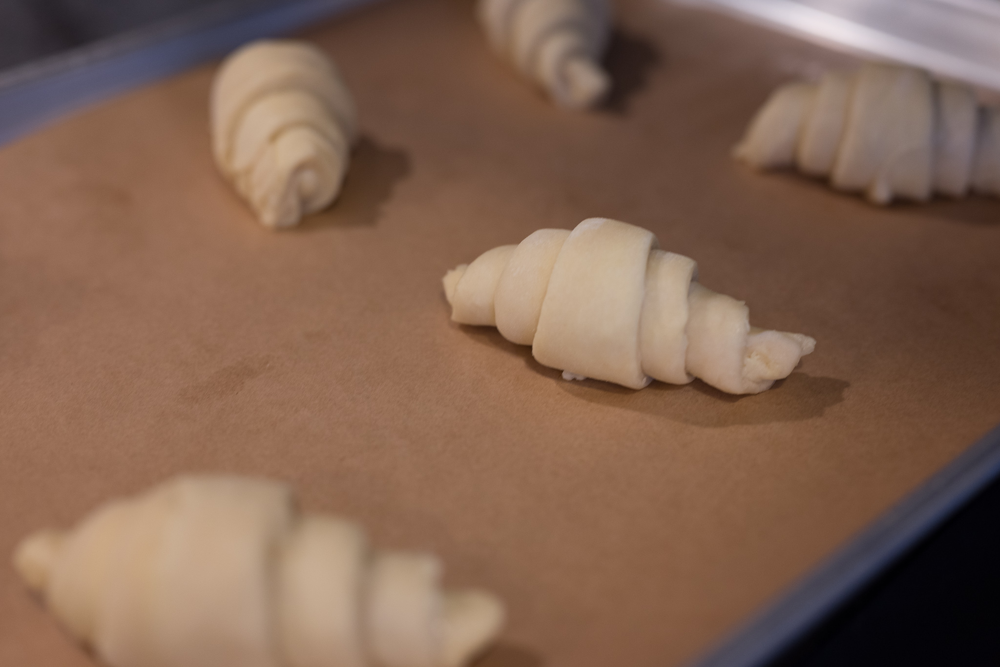
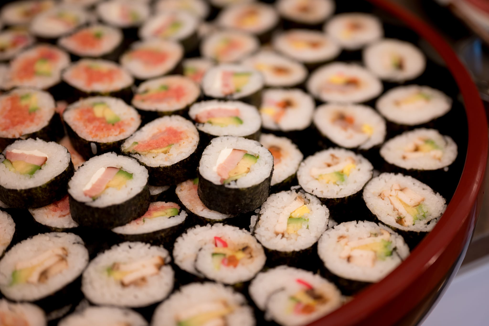
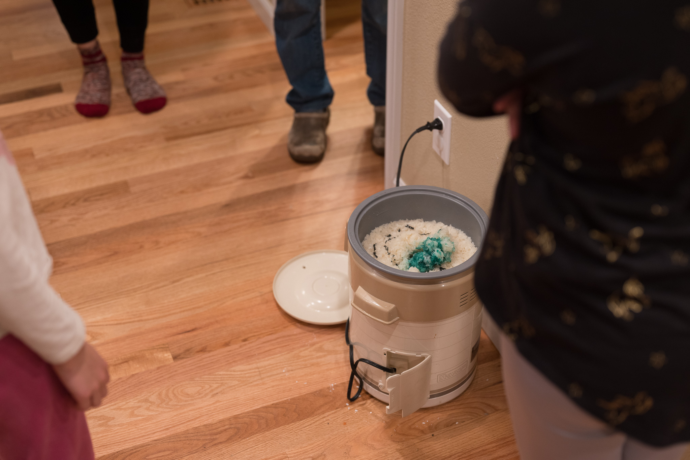
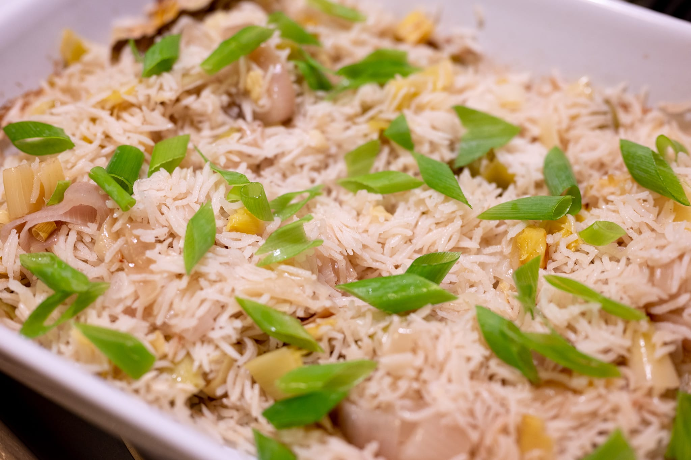

The latest virus variant has pushed me a lot closer to where this whole project began in March or April of 2020. We're back at the point that, despite being vaccinated and boosted, I'm not in love with the idea of doing any indoor dining.

The last few weeks have been interesting food-wise, however, and at least approached normality during the festive period. In that respect, we're a lot better off than the end of 2020 when moving through the airport felt very dangerous indeed. As I write this, it's also incredibly cold: with wind chill, it's down to 0 °F, or about -18 °C. Great weather for staying in, at home and, say, baking bread.

Looking back over the last month, on the more prosaic side, I did a nice apple and raspberry crumble for myself before Christmas. From what I could tell, these were the last of the seasonal apples for the year.

At Christmas, for one of the less high-stakes dinners between the big days, I tried out a pair of recipes from the always reliable Ottolenghi team: four-allium baked rice and poached cod in a tomato sauce. The fish was not bad, though not revelatory. The rice was a surprise, though. The technique is incredibly simple, and the alliums give what could be very ordinary rice a nice twist.

For Christmas, I had fairly minimal involvement. I did a classic River Cafe lemon polenta cake with my own raspberry twist. The raspberries add complexity, and they pair extremely well with citrus. More critically, I achieved redemption with a relatively successful batch of croissants. They were not my best effort. The lamination wasn't fantastic, and I suspect I didn't let them rise enough. While in many ways my parents' kitchen is better equipped than my current one, it's hard not to suffer a bit in a less familiar environment.

At New Year, the food situation was closer to normal. The start of the new year is a big deal in Japanese culture, so on the Japanese side of my family we do a lot of Japanese food on the 1st. From my perspective, it was a lot closer to "normal" than 2020 when I had to eat mochi outdoors in the rain. From the perspective of taking photos, there wasn't quite as much as in a pre-pandemic year, and we (by which I mean the people other than me who did all the cooking) didn't spend as much time arranging it photogenically.

Since getting back to Boston, I've done a bit of experimentation, too.

Mostly due to environmental guilt, I'm trying to eat less meat and other animal products. If I take a relativist position, I eat far, far less meat and animal products than the average person in a developed country. I doubt I've had red meat more than a dozen times in the last 12 months. On the other hand, compared to the truly virtuous people who go full-on vegan, it's rare that I go even a day without at least using a few drops of milk in my morning cup of tea. Oat milk isn't bad, but neither is it quite the same as real dairy.

With this in mind, I've spent the last year or two trying (and failing) to produce a ragù alla bolognese with a smaller resource footprint that still tastes great.

For my latest attempt, I tried splitting the difference. Rather than try to do it completely meat-free, I figured it couldn't possibly be an issue to cut the mix of ground beef and pork with some finely chopped mushrooms. This turned out to be a very bad idea. Yet again, my sauce was very bland and watery.

At that point, I had a realization, confirmed with research. It struck me that maybe my meat-free or reduced-meat attempts tasted watery because my meat substitutes literally contained more water than meat. A cursory bit of research confirmed my hunch: by mass, beef (as one point of reference) made of about a third less water than a mushroom, something like 60% versus 95%.

What I'll do with this insight I'm still not sure. The biggest hurdle is food waste. If I do another bad batch, there's only so much mediocre pasta I can eat. I feel bad foisting bad food on friends. And there's no way I'll toss the food unless it's genuinely inedible or dangerous.

Moving into the month ahead, my kitchen renovation remains in limbo. By which I mean I still don't have a contractor booked, and there's still no start date. I really hope it happens this year, it goes without saying. On the plus side, my takeout journey has yet to begin.

I'm trying to push myself out of my end-of-year where-did-the-daylight-go funk now we're the other side of the solstice by trying more new recipes.

It's a bit cliché at this point, but I can't help wanting to try recent [Ottolenghi recipes](https://www.theguardian.com/food/2022/jan/08/yotam-ottolenghi-five-ingredient-recipes-charred-prawns-charred-cabbage-onion-orechiette) for charred prawns and hazelnut pasta. I'm also giving the recipe for [za'atar salmon](https://www.youtube.com/watch?v=shbiih6Q-Ww), from the test kitchen's latest book, _Shelf Love_, a try. His cooking has had quite an effect: tahini has joined the likes of crème fraîche and fish sauce as the more unusual ingredients that are always in my refrigerator.

White bean soup is a personal favorite. I'm going to try mixing up my usual procedure inspired by [this Melissa Clark preparation](https://cooking.nytimes.com/recipes/1021776-lemony-white-bean-soup-with-turkey-and-greens). Adding turkey is a bridge too far for me; I do like the idea of giving it a bit of zing through the addition of citrus, ginger, and lots of fresh herbs.

Not so much new as I haven't done it in ages, I may play with a more classical fish preparation with a nice [beurre blanc](https://cooking.nytimes.com/recipes/2020-beurre-blanc-classic-french-butter-sauce) sauce. Though as I roll the recipe around it my head, it does feel like an isomorphism of a tahini sauce. Butter instead of tahini. White wine vinegar instead of lemon juice. Shallots (also an allium) instead of garlic.

On a sweet note, I have it in my head to mess around with ginger biscuits. I do the American classic (and excellent) [ginger-molasses cookies](https://fivesilverspoons.com/flour-bakerys-ginger-molasses-cookies/) all the time. I'm thinking something more like a Swedish [_pepparkakor_](https://www.thecutlerychronicles.com/pepparkakor-swedish-ginger-thins-html/): thin and crisp. It may also be an opportunity to try my hand at making my own [crystallized ginger](https://www.theguardian.com/lifeandstyle/2013/apr/20/dan-lepard-crystallised-ginger-recipe). It's surprisingly expensive to buy pre-made considering it's nothing but ginger, sugar, and water plus heat, none especially pricey ingredients.

Here in the depths of winter, I'm also not completely shying away from a few tried and true favorites. With it so cold outside, it's a great time of year to try doing something like a [baguette](https://www.youtube.com/watch?v=60K3Fe5j_J8) or a nice [sourdough](https://www.youtube.com/watch?v=uokpgOFVGiI). If the mood strikes, this might also be a nice opportunity to do another batch of croissants.

While the lightness of pizza feels more appropriate for the summer months (Naples is in a warm climate), I often feel a certain amount of guilt cranking up my oven and presumably working the air conditioning more. As ever, I use the dough recipe from the excellent [Ken's Artisan Pizza](https://kensartisan.com/pizza) in Portland.