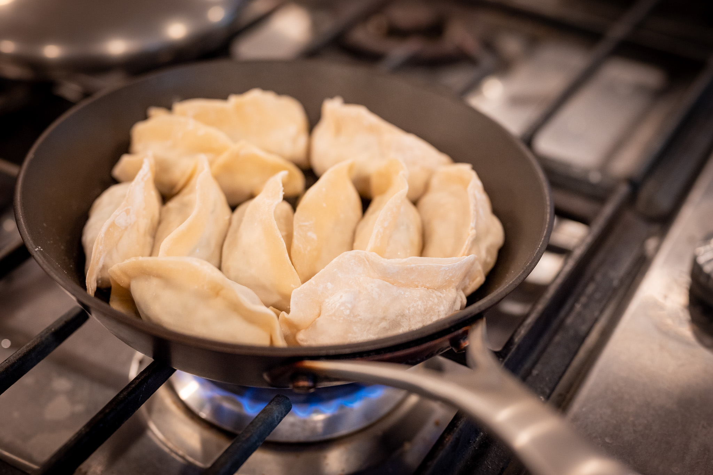
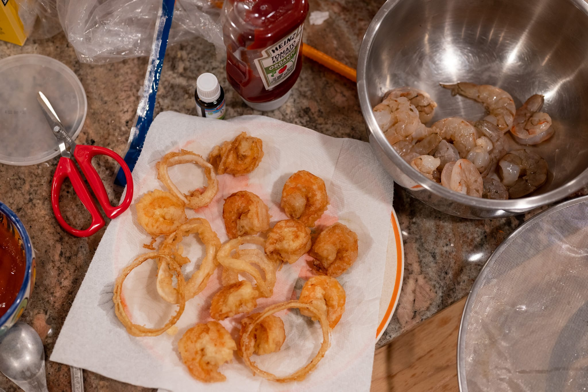
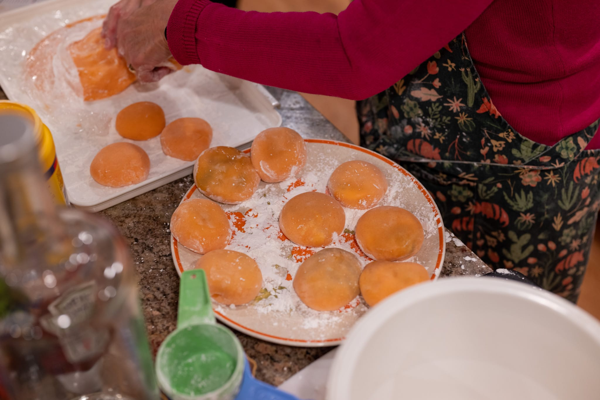
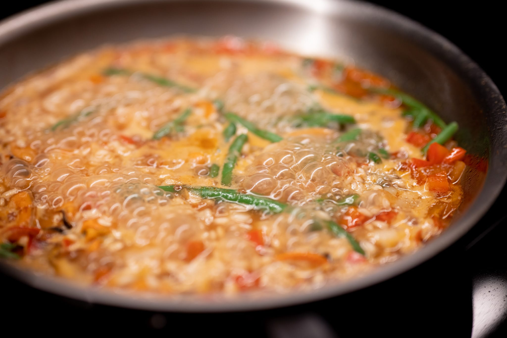
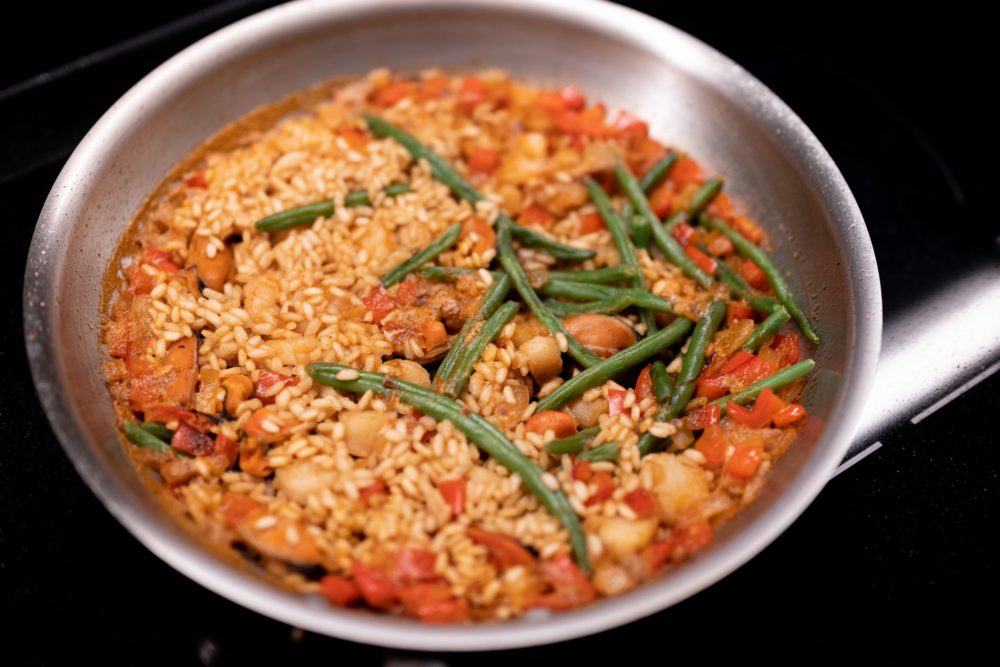

I'm attempting to reset the monthly updates to the usual mid-month release cycle. The jucier content from my jaunt abroad will have to wait for the next installment.

Though amazingly [my kitchen](http://jkibe.github.io/kitchen145/) still isn't done. It's still very close. I still don't have a working vent hood or handles on any of my cabinet doors.

In the meantime, I made my now habitual trip west for Christmas and the New Year. My dreams of making croissants for Christmas were curtailed by the terrible winter weather, which messed up my travel and didn't quite give me enough time to do a laminated dough.

Travel snafus and circulating illnesses also reduced the number of test subjects for my cooking. I did get an interesting cookbook as a gift, [_The Whole Fish Cookbook_](https://cookbookreview.blog/2020/01/02/the-whole-fish-cookbook-by-josh-niland/) by Sydney-based Josh Niland. It inspired me to do a bit of fish cookery for some weeknight dinners. Working with what I had, I did an oven-steamed black cod with a sort of cheat's salsa verde one night that I thought was reasonably successful.

It's going to take some serious ingredient sourcing and effort to give the actual recipes from the book a try, but I think that could be a fun project.

Working in other people's kitchens is never quite as nice as working in your own. Their equipment is always a bit different and you don't have that reflexive sense of where everything is. Despite my renovation woes, this year I felt the "kitchen homesickness" a bit more keenly. Not having my knives, my amazing new oven, and my prep tools felt strange. Which is not to say I was really suffering. More that it validated the blood, sweat, tears, treasure, and strained relationships that have gone into realizing my renovation. At least I've gotten something that agrees with me.

For the New Year, I didn't do much, but was the eager beneficiary of other people's work.

Back home, I made pancakes for the first time in probably a year. Suffice to say I'm still figuring out my new kitchen. Some weren't quite browned and cooked through, and then I overcompensated on the next batch.

I also had a strange yen for paella, and did a decent attempt at reviving that skill. It really showed off the power and precision of my new cooktop. For the first time at home, I haven't been annoyed that the pan wasn't heating unevenly.

Looking to the month ahead, I'm certainly most excited about the prospect of getting some culinary inspiration from a trip to Spain and a few other places.

Now that my renovation is done enough, I'm finally buying a few pieces of gear that I've been meaning to get for years. I had held back assuming (wrongly) the project was just around the corner, and they'd add to the ballast of items I needed to pack and store.

I'm finally going to get some _bannetons_ for proofing big loaves of bread. Using a large colander isn't exactly the end of the world, but it's not quite the same either. After last month's first attempt in at least a year, I want to get my big loaves of bread _à l'ancienne_ back to a more respectable level.
