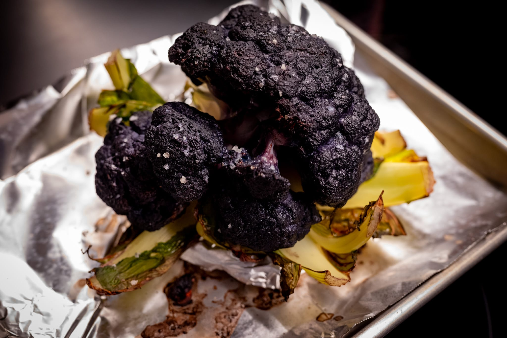

The last month has been dominated by the usual festive madness with all its ups and downs. And some other developments got in the way of getting this issue out at the usual cadence.

I wound up being in charge of most of the meal at Christmas Eve, and got to put a little bit of my stamp on what my extended family enjoyed. I did roast carrots and potatoes, but with a twist. For the carrots, a yogurt-tahini sauce and a drizzle of chili crisp to add some pockets of spice. For the potatoes, a dose of curry powder to give them a bit of interest.

When I'm drafted into the kitchen at this time of year, it's always an interesting exercise. Like writing a sonnet rather than free verse. There are more preferences and requirements to take into account. I don't have my pantry with all its quirks. And I have to work with what someone else has already shopped for.

By way of example, I wouldn't normally reach for a pork tenderloin or feel compelled to whip up gougères to use up a ridiculous quantity of cheese, but that's what I did.

I was once again reminded that home really is now in New England. It took a few tries to adjust to an oven other than the one in my new kitchen, or to not having all my kitchen gear easily to hand. It's pretty clear that the convection fan in my new oven is a lot more powerful and consistent than what you get in a more typical US kitchen.

Out of the house, and despite a mild mystery upper respiratory infection --- not Covid, thankfully --- I was able to give a few places a try. I went back to ¿Por Que No? for the first time in ages. It can be frustratingly difficult to find good tacos on the East Coast.

On an extended family outing, I had a chance to try some very Portland (and tasty) Korean fried chicken. I was perhaps even more tickled and impressed that they were thoughtful enough to include a pair of gloves with my order. It made everything that bit easier, even if it felt a little too on the nose for a $20 bobo food cart meal.

To celebrate the new year, my extended family observed its usual Japanese-inflected food traditions. Mostly with minimal involvement from me. Others handle essentials like the sushi, mochi, and ozoni. But I did make a small contribution this year with some Japanese-adjacent steamed bao with an improvised chicken thigh and scallion filling that seemed to go over well.

Someone had the inspired idea to do yellow mochi this year in one batch, which I thought worked really well visually. (I didn't grab a good photo that won't compromise my OpSec, unfortunately. You'll have to take my word for it.)

Back at home more recently, I've been experimenting more on my own terms

At Christmas, I was lucky enough to get a couple of interesting additions to my growing cookbook library. Nik Sharma's _Veg-Table_ had been on my radar already through the usual sources. Gregory Gourdet's _Everyone's Table_ was a bit of a wildcard, but nevertheless a welcome addition as well.

The Gourdet book is interesting in being very true to its goal of presenting interesting food that avoids certain types of ingredients, like gluten and soy. While I'm skeptical about the general health claims, it's nice to have more free-from options in my quiver for people who have serious food intolerances I really do need to accommodate. Not to mention, what I've made from the book so far is great, and there's still more I'd like to try.

The available scallops didn't look especially great, so I decided to try one recipe with fish instead, and was pretty pleased. It's clearly a restaurant dish, but making the squash purée and chili-hazelnut crunch wasn't really that bad. With hindsight, I don't think I toasted the raw hazelnuts I bought quite as much as they needed. I rebelled by using cream instead of coconut milk for the purée, and ate everything with gluten-rich sourdough bread. Overall, though, a good dish that's reasonably weeknight-friendly, if you don't mind washing quite a few pieces of cookware.

Sadly, I didn't have a chance to eat at Gourdet's very hot-ticket new restaurant, Kann, while I was in Portland.

The Nik Sharma book is very much my tempo. An initial favorite --- that used some excellent beans I also got --- was a broth-y bean and mushroom concoction. As the recipe suggests, it's great with a bit of sourdough bread as well.

When I went to buy cauliflower one afternoon, they were out of the "normal" white variety. I had some fun cooking a purple one. Though I'm not sure I'd buy it again. Because it's already so dark to begin with, it was very difficult to gauge the level of browning. I could have left it in the oven longer, but I also didn't want to burn it.

For pastry, I've resigned myself to the reality that this is not the season to get amazing strawberries, so I might as well lean in and use a lot of chocolate, nuts, and sweeteners.

I did a batch of chocolate chip cookies that were fine, though didn't quite have the verve I was seeking. It's been a long time since I've done a chocolate chip cookie, and I'm still feeling my way back in. It's hard to really mess them up, even if I know I could've done better.

More successfully, I did a big batch of _punitions_ (of Poilâne) for a group gathering and to stash away in my freezer for dessert emergencies. Sometimes you're in the mood for a biscuit, and it's nice to have a good one at the ready.

Looking to the month ahead, I'm very much embracing winter.

I had a large quantity of Rancho Gordo beans appear in my mailbox, so there's a lot of bean cookery in my future. I'm never entirely sure what to do with some of the more exotic varieties, other than cook them and dress them with a drizzle of olive oil and dusting of herbs. I do have it in mind to toss together a black bean soup.

This is also the season of food that I put in the "brown but delicious" category. Many have tried, but I'm not convinced that you can successfully braise beef short ribs in red wine and make it photogenic. That isn't going to stop me from making some. They're delicious.

My middling attempt at croissants during my Christmas break has inspired me to get back to doing PLF and croissants more regularly. I'm getting better, but I'm still not at the level I want to be.

I'm also continuing my bread experiments. Suffice to say I haven't made any substantial progress on the loaves I'm trying to master.

### What I'm Reading and Watching

* A great [story on the act of preserving food traditions and pathways](https://www.ft.com/content/cbdf2ed8-ebd4-49c0-b1b6-52c924b96ec9) in the FT

* The excellent [Ledbury in London](https://www.theguardian.com/food/2024/feb/05/sublime-flavours-at-ledbury-in-west-london-win-it-three-michelin-stars) achieves a third Michelin star --- it's gratifying that I discovered it when they had but one

* In The New York Times, [an examination](https://www.nytimes.com/2024/01/29/insider/menus-project.html) of how we present food
