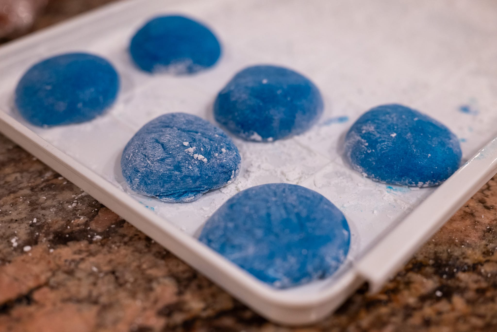

It's been a month of two halves in more ways than one.

The second half of December began with a little more pre-Christmas experimentation.

I'm a big fan of ginger, and stumbled on a recipe for ginger-inflected cantuccini from a fun French-Italian bakery in Lyon. If I'm being honest, they were good, but lacked the gingery punch that I was hoping for. I'd like to try another batch with whole chunks of ginger, or --- at the risk of it being too sweet --- crystallized ginger.

With all the social events in the lead up to the last couple weeks of 2024, I didn't have all that many opportunities to cook at home.

Among some of the places I dined out was a new place from the team at a couple of other Boston favorites, Zurito. The food was good. It was also entertaining. Someone at the restaurant recognized me and showered me and a friend with lots of freebies. I'm worried it colored my experience too much in the positive direction.

On the other side of the country, there were a few interesting food outings on my visit to Portland for Christmas and New Year.

I went to Han Oak, a sort of experimental Korean restaurant with aspirations to fine dining. It was tasty. For my visit the theme was hot pot, and it was definitely the most deluxe, artful hotpot that I've ever had. They took a very simple concept and elevated it with better ingredients and more attention to detail. Though it must be said that, in the chilly Portland rain, my inner _petit bourgeois_ wished they weren't operating out of a building improvised out of zip-tied sheets of plexiglass.

My family and I made an attempt at trying a popular Vietnamese soup place, Hà VL. By the time we got there, they had sold out of soup for the day and wouldn't let us in. With these kinds of places, I always wonder how deliberately they reject modern business practices. I can see how some people would find their imperfect Instagram account or daily soup production charming. On the other hand, it's a bit annoying when you get there and they don't have any food, or you have to rely on imperfect reports on Yelp to understand what's on the menu. And you have to think they'd be making more money --- surely one of the chief goals of a business --- if they had even a slightly more sophisticated demand prediction model.

I was also reminded that Portland sets a really high standard for food. It's something that doesn't really make any sense, and I'd like to understand better. Which is to say, I made a stop at a more or less randomly selected café-bakery one afternoon, and it was better than most places you'd find in Boston or New York.

Other people took care of the heavy lifting for the big festive gatherings.

It was interesting reading my late grandmother's notes in her recipe for making New Year's Eve tempura. Even as a home cook, she was very aware that the batter should be minimally mixed and made in small batches. As she correctly noted, this makes sure the batter is thin and crisp, and not thick and stodgy.

But I did get drafted into making a dessert at one stage. However much people may think I like to experiment, I find myself making three or four River Cafe desserts all the time. In this case, the always wonderful chocolate-hazelnut cake. It lacked a certain amount of visual impact because there wasn't a really large diameter cake tin to hand when I was putting the cake together.

By contrast, the first half of January --- at least after the first few days --- were colored by recovery. First from all my travel, and then from a mystery upper respiratory bug.

That really cramped my style, food-wise, save for a couple of (with hindsight) ill-advised restaurant outings. Though there was something very comforting about making (and eating) lots of soup. It was a great opportunity to use and enjoy the last of the chicken stock that I had made in the lead up to Thanksgiving and my seemingly endless stock of good beans.

When I was more on the mend, I hosted a few friends for brunch and followed through on my plan to try doing _panissa_ from my new favorite YouTube channel, Pasta Grannies. It certainly wasn't bad, but neither was it revelatory. Perhaps that's the nature of cooking from granny recipes. Their charm is in not being Alain Ducasse.

In the pastry department, I also made a run at doing the River Cafe "oblivion" cake --- chocolate, eggs, sugar, cream, and nothing else --- for the first time. It wasn't super successful, and I'm not entirely sure why. I suspect I did something wrong. Otherwise, I'd say I've had better flourless chocolate cakes.

The arrival of true winter has also meant I can finally get good blood oranges again. They've really become one of my absolute favorite things, and, when they're in season and I can get good ones, I buy them with abandon. As has also become tradition, I try to grab the peel from them so I'm well-stocked for hot cross buns come Easter.

For the month to come, February is still going to be a story of cold and dark, and I plan to cook accordingly.

The panissa stuck me with an awful lot of (very good) Arborio rice. So there is probably some risotto or paella in my immediate future. The risotto is very much of the season --- perhaps paired with some winter squash. The paella is a go-to for injecting a bit of summer . As a weeknight option, it's still delicious with frozen haricots verts instead of fresh runner beans.

Keeping on the "borrowing dishes from places with warm climates to stave of winter chills" theme, I saw this really intriguing recipe for chorizo verde on Rick Bayless's channel. I'm really tempted to make it, even though I'll finally have to cave and buy a food processor to do it. I've become really enamored of making my own tortillas and doing tacos at home. 



More on the seasonally-appropriate side of things, I'm tempted to go back to tugging on the celeriac thread. I find many winter vegetables uninspiring. I'll never understand the appeal of cabbage, aside from the nice crunch that --- applied sparingly --- adds textural interest. Flipping through a copy of Josh McFadden's _Six Seasons_, my celeriac interest was piqued. Doing it like really decadent mashed potatoes sounds delicious.

As a Christmas gift, someone got me a Combustion smart thermometer. Due to manufacturing issues, I don't have it yet. But I'm very curious to try it out. Being wireless, it will make temperature monitoring for cooking _sous vide_ a lot easier.

In the baking department, I'm determined to do a belated brioche version of a _galette des rois_ for Epiphany. As with the Easter hot cross buns, I'm not religious, and I probably wouldn't choose to be Catholic if I were going to align myself with one of the Christian denominations. But I love the ceremony and tradition in the same way I love getting the (at least for me) slightly more culturally relevant mochi on the 1st of January.





### What I'm Reading and Watching

* Eating a batch of mince pies [really extremely slowly](https://www.theguardian.com/lifeandstyle/2024/dec/20/experience-ive-been-eating-the-same-batch-of-mince-pies-for-20-years)

* Apparently it's the ["golden age of bakeries"](https://www.nytimes.com/2024/12/24/dining/american-bakeries-golden-age.html) according to the team at _The New York Times_

* Contemplating the [dangers of the American diet](https://www.newyorker.com/magazine/2024/01/13/why-is-the-american-diet-so-deadly) in the _New Yorker_

* [A selection](https://www.ft.com/content/de311665-7b28-4e37-b2be-28ec9b91e9f1) of great food halls around the world in the _FT_ 

* Fuchsia Dunlop takes on the [curious genre of Western food](https://www.ft.com/content/20abc36a-9904-4605-83d7-bc2ea87e1433) through the lens of Shanghai

* In their attempt to re-capture the cozy, friendly spirit of a neighborhood coffee shop, [Starbucks is cracking down](https://www.nytimes.com/2025/01/14/business/starbucks-bathroom-purchase-policy.html)

_[Subscribe](/subscribe) to get notified every month when new issues go out_
