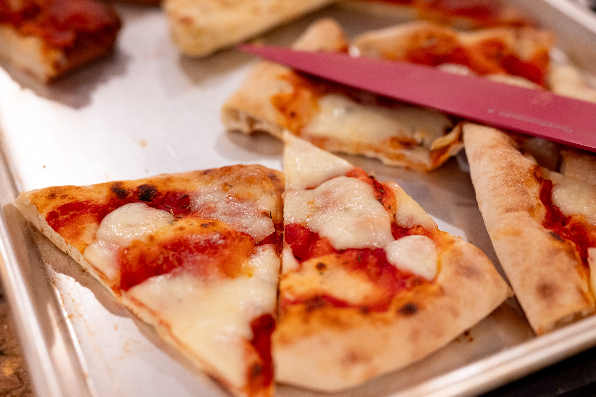
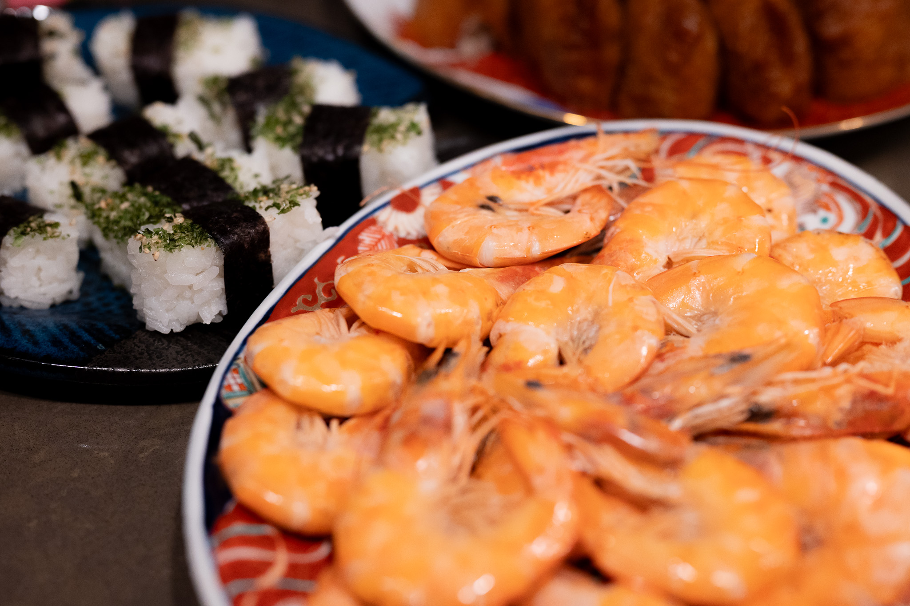
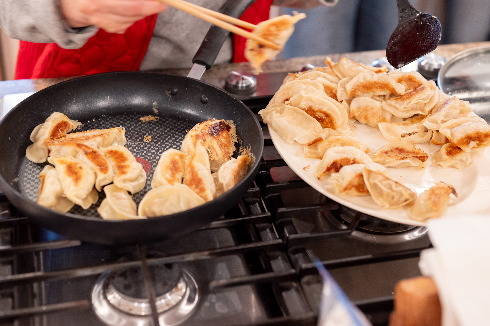
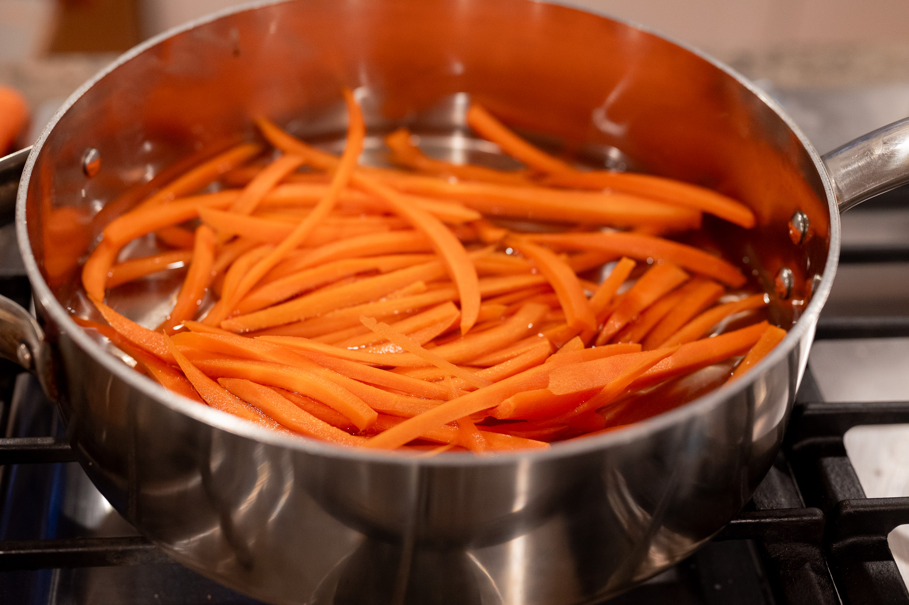
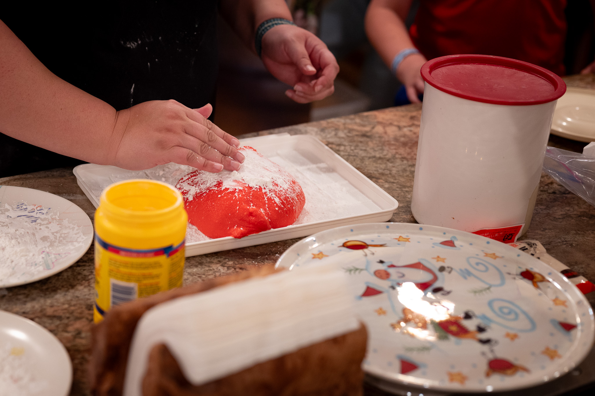
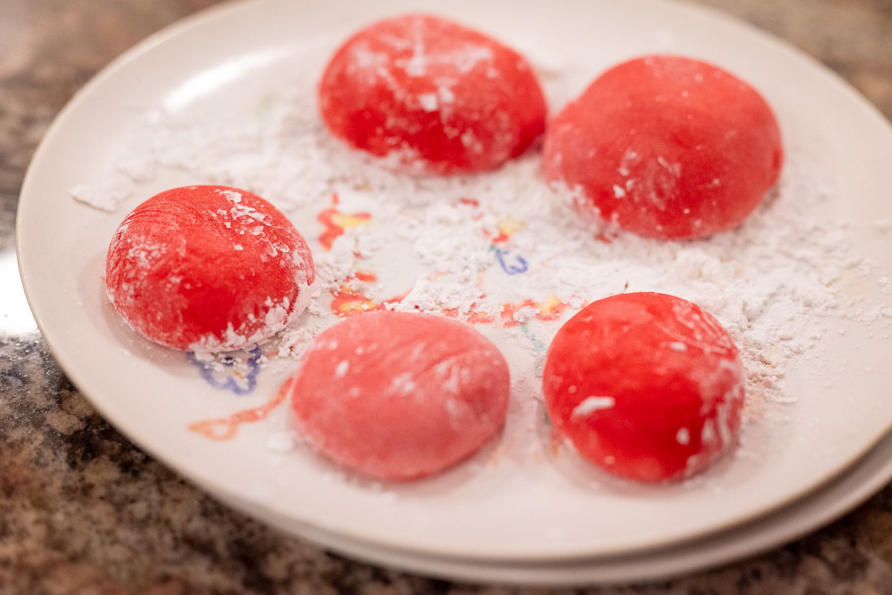
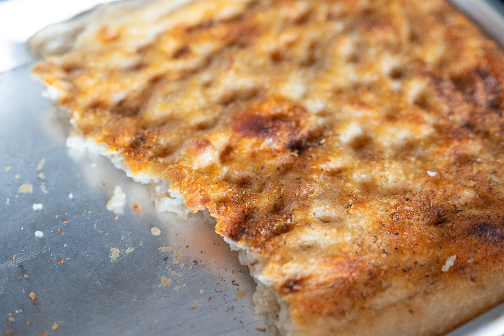

The last month has been busy, with a lot of cooking, and a lot of people cooking for me.

There were of course all the festive fixtures. For Christmas, my only small contribution was doing a few side dishes to go along with the bigger meals. It's all very traditional and there are some less adventurous eaters in the mix, so it's hard for me to do anything that experimental or color outside the lines.

I did get roped into attempting pizza without all my usual equipment. While it wasn't bad, the difference between a more traditional pizza stone in the kitchen I was using 

There was also the usual Japanese food to celebrate the new year. This too is fairly rooted in tradition and routine, in a good way. There was all the usual: lots of sushi, lots of seafood, and lots of dumplings.

Of course, we made mochi, my highlight. With all my cousin's children, we were reaching the point that even several batches weren't enough to feed everyone. This prompted me to do some research on mochi machines. More on that later.

In between the group dinners and when we didn't go out to eat, I didn't take great notes or really any photos of what I was making. Though I did make quite a bit of focaccia.

Back at home after the Christmas and New Year madness, I was very much in the mood for simple, basic food. There was a lot of rice and lentils. I also did a batch of a more traditional Bologna-style ragù. It's hard to go wrong.

The first batch of bread for 2026 was a good illustration that my levain hadn't been tended to for a couple of weeks. I'm so used to having a healthy one that I don't really do any complicated checks to see if the starter is in good shape. When you do that with an exhausted levain, you get fairly disappointing bread.

The focaccia that I did while visiting my family also inspired me to try doing a batch _au levain_. The flavor was excellent. My levain, when I did the focaccia, still quite wasn't in good shape. The texture was too dense, and not that light, airy texture that I'm usually able to get consistently with my batches using commercial yeast.

Out of the house, there were some interesting discoveries and one real disappointment.

My parents suggested a place in Portland called Dolly Olive, which I'd recommend. The gnocchi made with squash either in lieu of or addition to the more traditional potato was really interesting. I'm hoping that's a straightforward enough swap that it's something I can try at home.

The disappointment shall remain unnamed. It was disappointing enough I bothered to set up a Yelp account and leave them a review. It was a very buzzy restaurant, and for $250 per person, it was nowhere near the mark in terms of the food or especially the service.

For the month to come, there are a few interesting things on the docket.

By chance, someone gave me a package of Himalayan pink sea salt. A friend and I have been meaning to try that out as a reagent in a lacto ferment after reading about it in a research paper. A couple years ago, I would've been deeply skeptical that swapping in a different salt would make a difference. After my experimentation, though, I think it might change the ferment.

I got a copy of Nicola Lamb's latest cookbook, which should be fun to work out of. Outside the fairly basic recipes, the more ambitious ideas are in a nice sweet spot. More complicated and interesting than your copy of _Joy of Cooking_. Still below the madness of a multi-day bake with exotic ingredients and laborious processes in something like the French Laundry cookbook.

What I plan to do, I'm not quite sure.

I've also got some puff pastry in the freezer for a belated _galette des rois_ when I get a chance.

On the mochi front, I decided to take the leap and buy a mochi machine. It was going to happen eventually. Shopping for it was interesting. The circa 1995 model that my aunt bought and that we still use is now very coveted. I saw several selling for over $1,000 on second hand equipment sites. I wasn't interested in buying a step down converter to use a made-for-Japan model. So I went for a reasonably well-reviewed model from Tiger. I'm not totally sure it will be here in time for the next issue. Or where I'm going to get the special rice to use it.

I also have a tiny bit of travel coming up, and should have a chance to try at least one interesting place to eat.

### What I'm Reading and Watching

* Contemplating [the inevitable closure](https://www.nytimes.com/2026/01/13/dining/favorite-restaurants-closing-visits.html) of your favorite restaurants

* A really interesting [dive into low- and no-alcohol drinks](https://www.radiofrance.fr/franceinter/podcasts/on-va-deguster/on-va-deguster-du-dimanche-11-janvier-2026-1851423) from François-Régis Gaurdy and team

* The [tension between regulation and experimentation](https://www.theguardian.com/food/2026/jan/16/two-stars-from-michelin-one-for-hygiene-star-chefs-poor-score-ignites-uk-dining-debate) bubbled to the surface in a debate between a Michelin-starred establishment and the local government that did not think highly of their hygiene practices

_[Subscribe](/subscribe) to get notified every month when new issues go out_

