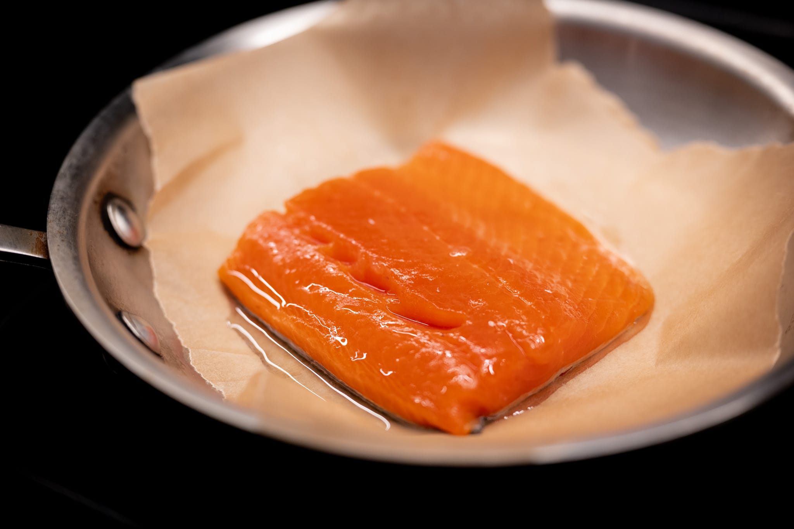

Between travel and a more general desire to get out of the house, I found a few outlets for my food obsession outside the worlds of restaurants and my kitchen.

A local [baking supplies shop](https://www.elmendorfbaking.com) decided to hold a nominally bread-focused event a few weeks ago. I felt like I wouldn't be true to my love of French bread if I didn't pop over to see what was going on.

It was really encouraging to see how busy the event was. I have renewed hope there is a market for great bread here. On the other hand, the organizers clearly weren't prepared for the turnout. The queues for Liège waffles and crêpes were very, very long, and --- more importantly --- the people selling bread were out by the time I got there.

On the same theme, a new bakery called [Michette](https://www.instagram.com/michettebakery/) that I've been eyeing opened recently. When I made my first visit, they didn't have any bread on offer. According to the shop assistant, they were still recipe testing. They were also sold out of plain croissants --- my benchmark for viennoiserie. The small sample of what I did buy was extremely promising.

Even in bigger cities like New York or London, I'm always surprised how hard it is to find _good_ French bread and viennoiserie. From a bakery perspective, I got very lucky growing up where I did.

I also dived back into my food history research hobby. It's quite handy to live 20 minutes from the Schlesinger Library at the Radcliffe Institute, which houses one of the world's best collections of material related to food and cooking.

In conjunction with my ongoing practical exploration of the madeleine, I've been trying to research their history. It was especially interesting to see several madeleine recipes in a handwritten notebook, filled between 1899 and 1902, in the Schlesinger collection. By that point the recipe's contents look more or less like what we have today. In one recipe, the author uses whipped egg whites --- common before baking powder was widely available --- and in another he specifies "1/2 de carbonate," which I take to be baking soda (sodium bicarbonate). Curiously, though, he doesn't say anything about using a shell-shaped mold. It's not clear if that's because it was common knowledge what they should be baked in, or if using a shell-shape mold is really part of a 20th century codification like so many other canonicalized "traditional" recipes.

I'll share more eventually in my notes on the madeleine once I have a recipe I like.

Back at my table, I'm continuing to explore the contours of what's possible with my new appliances.

I love the [minimal roast cauliflower technique](https://lefooding.com/en/recipes/toquera-295-an-affair-with-un-chou-fleur-miznon) I learned from the team at Café Miznon. But it has to be said, it's a bit of a pain to execute. Dragging out a huge stockpot and boiling an enormous quantity of water to par cook a single head of cauliflower is a resource-intensive step.

I thought it might be interesting to see if I could do it in one step with my oven's steam system. Like a loaf of bread, filling the oven with steam at the start of cooking --- which would hopefully imitate the blanching, as steam is a far better conductor than air, like the boiling water --- and then getting the roast-i-ness once the water has been driven off.

It worked pretty well, though needs a few tweaks. The cauliflower was reasonably soft and had the wonderful browning that I usually get. It wasn't quite the same melt-in-your-mouth soft that I get by blanching first.

I've kept tinkering with a couple classics --- pizza and paella --- and feel increasingly comfortable with the new kitchen.

True to form, I splurged on some in-season salmon. It's worth the price.

In the drinks department, after seeing the _Schorle_ featured on _Karambolage_, I've had a yen to try that out.



I'm pretty ambivalent. There's definitely something nice about a weaker drink that (at least anecdotally) feels more hydrating than a glass of wine. On the other hand, it's hard not to think a glass of champagne would be nicer.

Switching to pastry, I tried doing an ["aquafaba" meringue](/recipes/aquafaba-meringue) for the first time. That is, a meringue made with the residual cooking liquid from chickpeas, rather than egg whites. I sometimes need to accommodate a dietary preference --- someone who's vegan or can't eat eggs for some reason --- and I always feel better making one dessert everyone can eat. It's more convivial and a lot easier to execute. (See also the famous [chocolate cake](/nigella-chocolate-cake).)

I was pleasantly surprised with the result. If I hadn't known how it was made, I never would've known I hadn't used egg whites. Maybe that betrays the limits of my deductive powers.

Many of the recipes I looked at suggested the addition of a booster to help keep the foam stable. I had cream of tartar on hand, so wound up using that. It added a very slight acidic tang, which I'm not sure I love. I may try a different additive the next time I do this.

I was in the mood for a pavlova --- a great vehicle for summer fruit --- so I took the meringue base in that direction. I didn't get it quite right, to be honest. I should have piled the meringue a bit higher, and so got thin, uniformly crisp pavlova bases, not the crisp exterior and chewy interior I wanted. I made up for it by stacking two at a time. With some macerated raspberries and whipped cream, it wasn't bad.

More exciting, I had another run at the elusive peach tart, and I think this is the closest I've gotten to recreating its inspiration.

I adapted the technique I wrote about last month, using an unsweetened shortcrust pastry (_pâte brisée_), a glaze on the fruit, and a custard-like filling. It was very good. The peaches had the melt-in-your-mouth quality I wanted. The glaze gave the peaches that bit of extra caramelization at the edges.

Though it still needs a bit of work. The pastry had a bit of a soggy bottom problem. While I won't pretend I completely understand the soft matter physics of fruit, experience suggests the apples either do a better job retaining water or letting it evaporate during the bake. With the peaches, the pastry either needs to be blind baked, or I need to add something (e.g., cornflour) to absorb the liquid.

Even so, I was very happy with the results. I'm getting closer.

Another chance recipe encounter looking for something else led me to experiment with what I'm going to call "rough PLF." I was looking for something else, and came across a "rough puff" recipe to make millefeuille. It struck me that it might be fun to see what would happen if you used a similar technique for a croissant-style PLF dough.

I wound up using my "usual" [PLF proportions](/recipes/plf), but cut the butter into the dry ingredients and then added the wet ingredients. It was, sadly, not a success. The croissants looked a bit like croissants on the outside. On the inside, I had more or less made brioche.

It was a big enough failure I'm not leaping to make another attempt. Turns out, if you want to make a yeasted laminated dough, there aren't really any shortcuts.

Last but not least, the in-season local strawberries made their usual appearance. I really struggle to understand why people buy the year-round strawberries from California --- engineered to withstand shipping not to taste great --- the rest of the year. There's really no comparison.

Looking forward to the month ahead, there are a few pieces in flux. You'll have to wait for next month to find out what may (or may not) happen.

With a bit more certainty and less mystery, I've been wanting to make [_dakos_](https://ottolenghi.co.uk/recipes/dakos-reveg0010013) for ages. They're a local dish from Greece, or really Crete. I've had two main barriers up to now. First: great tomatoes. Though that's more a question of timing. In peak season, I can usually get my hands on good ones. Second: the bread that forms the base. That has always been a bit harder to figure out. There's (of course) a part of me that wanted to figure out how to make the bread component myself. In the end, I couldn't summon the energy.

Then, on a chance stop for lunch while I was running an errand, I spotted them in a small specialty food section of a local fast casual Greek restaurant. I was pleasantly surprised.



The weather makes me want merguez sausages. I'm not usually one for sausage as a rule. There's something about merguez that's really evocative of summers in France, and I'm tempted to see if I can't hunt them down, maybe if I can find a North African market.

In the pastry department, after seeing a photo somewhere, I really want to make this [baked chocolate ganache with olive oil](https://www.eater.com/2016/2/13/10985198/yotam-ottolenghi-chocolate-ganache-recipe). It feels a bit heavy for something in the summer, but that may not stop me.

### Experimental: What I'm Reading and Watching

* [Rewilding](https://lifeandthyme.com/food/beyond-regeneration-the-fight-to-rewild-the-american-northeast/) on this side of the Atlantic

* A great story about the [Chinese bafflement](https://www.theguardian.com/food/2023/jun/15/lunch-of-suffering-plain-white-people-food-goes-viral-in-china) at our food here in the West

* Another story about our collective [aversion to chewing](https://www.theatlantic.com/science/archive/2023/07/american-gummy-candy-chewy-food-texture-preferences/674635/) in _The Atlantic_

_[Subscribe](https://landing.mailerlite.com/webforms/landing/k5w5z0) to get notified every month when new issues go out_
