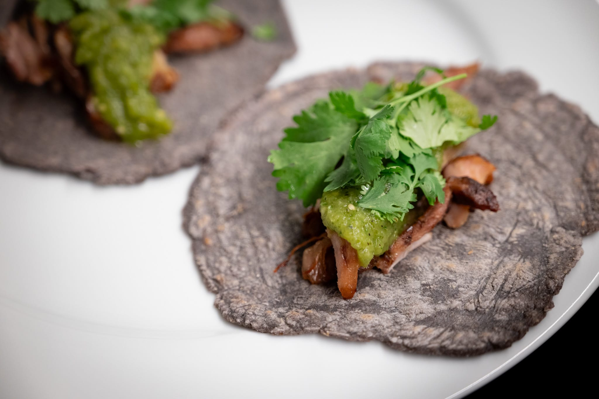
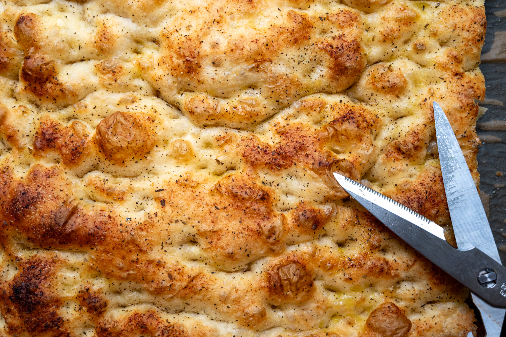
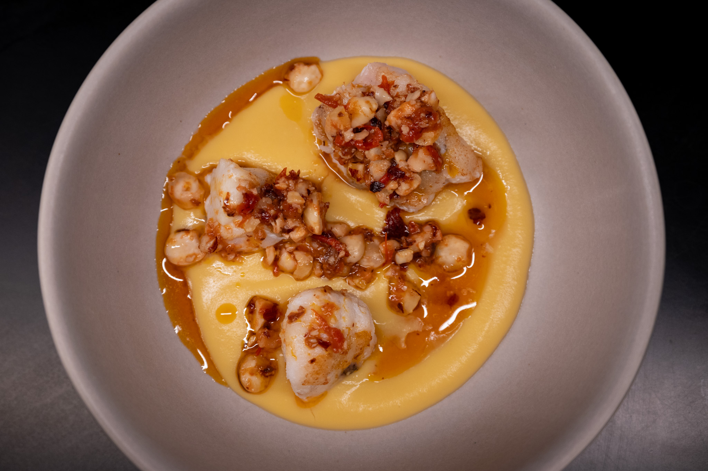
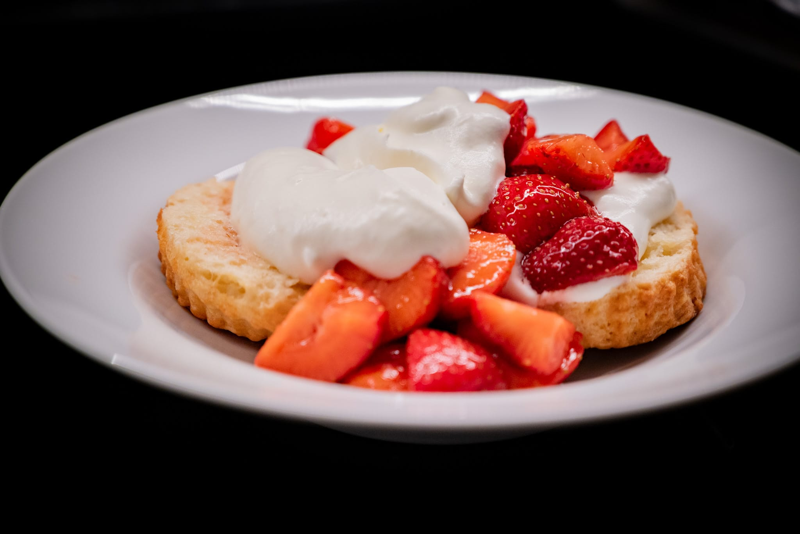
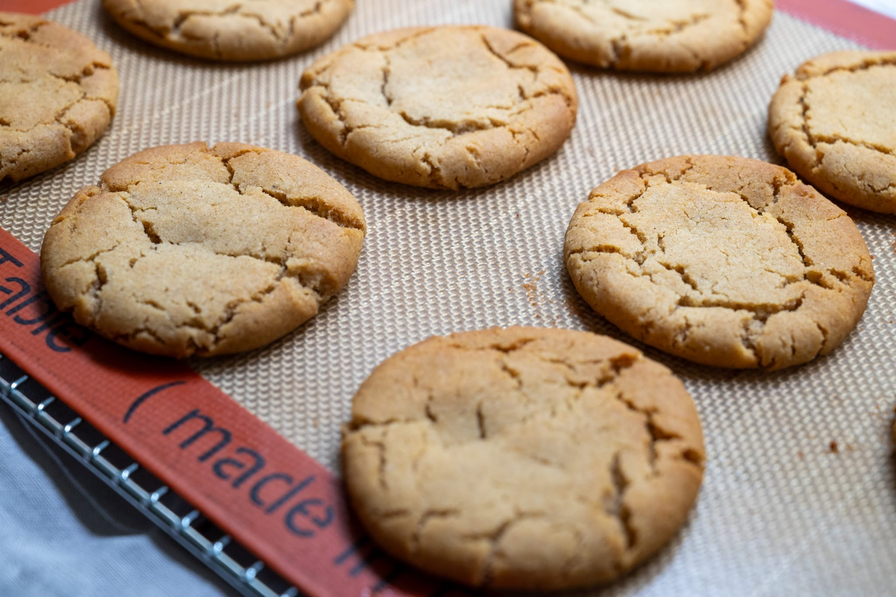

Summer has begun to really assert itself, and so my food-related projects shift with it.

Warm weather always makes me want tacos, which feel slightly weird to make when it's freezing outside.

I took this as a chance to try a couple of new concepts. First, I did a batch of carnitas _sous vide_. It's one of those fun recipes where you need to cook the food for what seems like an inordinate amount of time. In this case, the recipe I was using suggested at least 12 hours of cooking.

Second, I went to the trouble of getting some fun blue corn flour from the fine people at Masienda. While it's a bit of a pain, fresh corn tortillas are so, so much better than pre-made tortillas. I'm less sure that blue corn makes any difference to the flavor. At the point it's fun and didn't cost any more than the more usual colors, I didn't think twice.

It was a bit of effort, but very much worth it. What turned out to be 24-hour carnitas were great. (This was a good nudge for me to finally buy a proper vacuum packer, too.) It was a very slow braise at 74 °C. My tortilla skills could use a bit of a refresh, however. They were a little lumpier than I'd have liked. Aside from that and not remembering to pick up radishes as a garnish, I was pretty happy with the results.

Continuing on the never-ending pizza theme, I tried riffing on the pizza that's captured the attention of _le tout Paris_ made with a dough using a levain instead of baker's yeast. The flavor was spot-on. The texture needs some work. Likely in part because I feed my levain with less-refined "white whole wheat" flour, which doesn't form or contribute to as nice a gluten matrix. The natural yeasts in the levain also aren't quite as punchy as a normal baker's yeast. It needed a lot more time to rise, and even then I don't think I gave it quite enough time.

On a similar note, I've taken what I've learned from the pizza experimentation to improve my focaccia as well. And like the pizza, it's an easier bread to do same-day when I'm in the mood for bread, where I don't feel like it makes quite as much of a flavor difference as it does when I'm doing something based on, say, a pain courant.

My encounters with the world of fine dining always make me think I should put the work in and do more of that style of cooking. I had a similar feeling after watching the latest season of _The Bear_. Reality tends to make that more of a stretch than it seems in concept.

Either way, I returned to a really lovely formula from the Gregory Gourdet book that I got at Christmas. I wasn't very impressed with the scallops I could buy, so did the dish with monkfish instead. It's still a few components, but none of them are especially tricky. My styling could perhaps use more finesse.

Over in the pastry world, the great strawberries have made an appearance, and I've taken full advantage. It's always very tempting to eat them as a quick dessert with nothing more than a mound of whipped cream. I also did multiple batches of shortcake, and took this as an opportunity to tinker a bit.

I had the idea to spike the shortcakes themselves with a bit of yogurt rather than cream, for the tang more than any putative health benefits. I'm not sure the substitution worked the way I hoped. The cakes had a great bit of acid, but were also a little dense and rubbery. Next time, I need to try a more liquid "normal" yogurt than the Greek-style yogurt I tend to keep on hand.

I'll confess, faced with the actual choice, I didn't wind up making Rice Krispie treats, however fancy or otherwise. I told myself that I also needed to make my own less-processed marshmallow, and that was a process bridge I was uninterested in crossing.

Whereas, I'm always after new ginger-tinged desserts, and gave a try to something I'd never heard of, the Cornish fairing biscuit. The concept is great. Both my execution and the recipe I started with need a bit of work. While I have no true reference to compare with, I'm fairly sure I made my fairings too big and didn't bake them enough.

From a recipe perspective, I've found others that play up the spiced notes and add some citrus for a bit more interest. It seems like a thread worth continuing to pull.

Looking forward to the month to come, I'm confronting the frightening reality that the summer has reached its apogee and is nearing its end. So I'm hoping to continue taking advantage of what's available during this time of the year.

I've been seeing a lot of fun minimalist fruit tarts lately, which have appeal mostly in that they're even easier to make than a "real" one that requires me to get out a tart ring and all the pageantry.



I have the idea of doing something with the ginger-y, citrus-y fairing biscuit as a base and some stone fruit on top, as in the apricot tart from FRG.

From what I've seen at my usual sources the last few days, I'm afraid that the peak of good local strawberry season has ended, and I'll need to give up on getting any more of them. But that's good motivation for getting back to the peach tart project, even if I've yet to find a good source (that will sell to me in small quantities in any case) for really great in-season peaches.

Likewise, I didn't get around to doing pan bagnat, and I think it deserves an outing while it feels in season.

On the savory side, I've yet to find inspiring tomatoes in my usual places this summer. For all my pizza experiments over the last few weeks, I've continued using (high-quality) tinned tomatoes. But they are a real treat when you can get them. I have my eyes throwing together this [warm tomato salad](https://www.theguardian.com/food/article/2024/jul/11/warm-tomato-salad-recipe-crab-on-toast-yotam-ottolenghi-summer-recipes) from the Ottolenghi team. There's something to be said for food served between the temperatures of freezing cold and piping hot.

### What I'm Reading and Watching

* [An investigation](https://www.bbc.co.uk/sounds/play/m001xzrx) of our current obsession with protein in our diets on Radio 4

* Naturally, the latest season of [_The Bear_](https://www.themoviedb.org/tv/136315-the-bear), which, I'd agree is beautiful but not always filling --- the series is at its best when we see its characters grow

* An almost philosophy of teaching take on [the way to write recipes](https://www.youtube.com/watch?v=BR1VRJDu-gc) and cook from the wonderful people at Chinese Cooking Demystified

* On _Food Checking_, [a dive into mochi](https://www.youtube.com/watch?v=vrjoYZJvX9U) with a French lens

* On _Eater_ a more [work culture take](https://www.eater.com/2024/7/2/24190121/the-bear-season-3-hulu-toxic-restaurant-culture-labor) on that new season of _The Bear_

* In the _FT_ [an investigation](https://www.ft.com/content/e2c7bfe0-23fa-406a-aa73-b651856a33c6) of the weird world of supplying top restaurants with the best ingredients

* An exploration of [the cafés of Vienna](https://www.ft.com/content/215528c2-1b34-4ce0-81fe-24a3dcc7b4dc) in the _FT_

* A look at the [science and history](https://www.youtube.com/watch?v=8BzNFAlEsD4) of one of my favorite summer drinks, pastis

_[Subscribe](/subscribe) to get notified every month when new issues go out_
