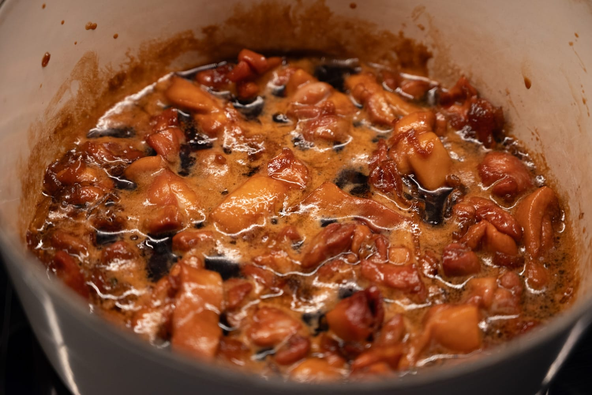
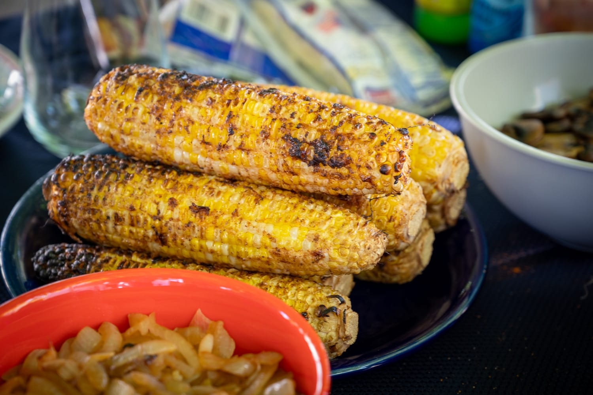
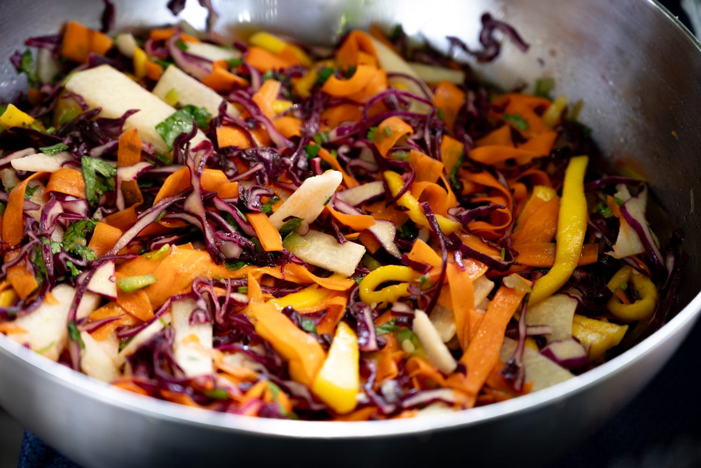
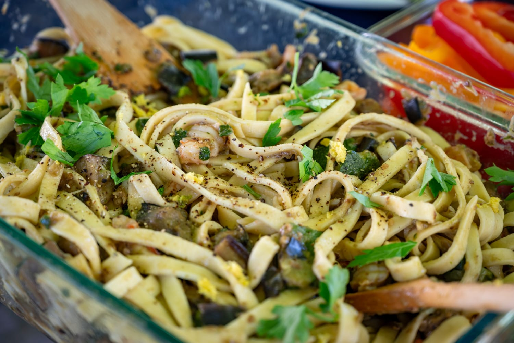
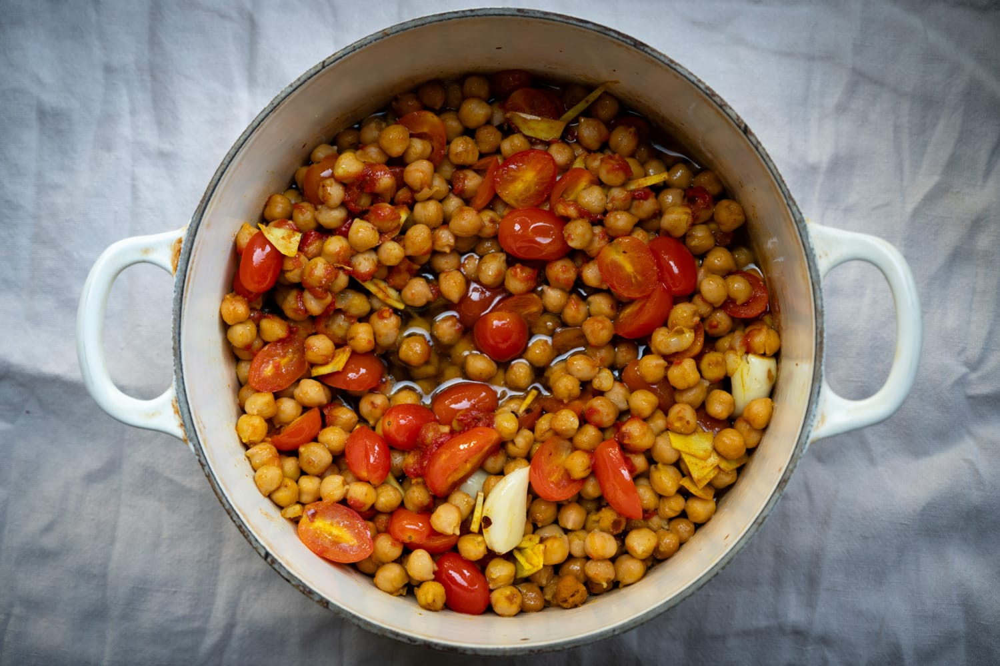
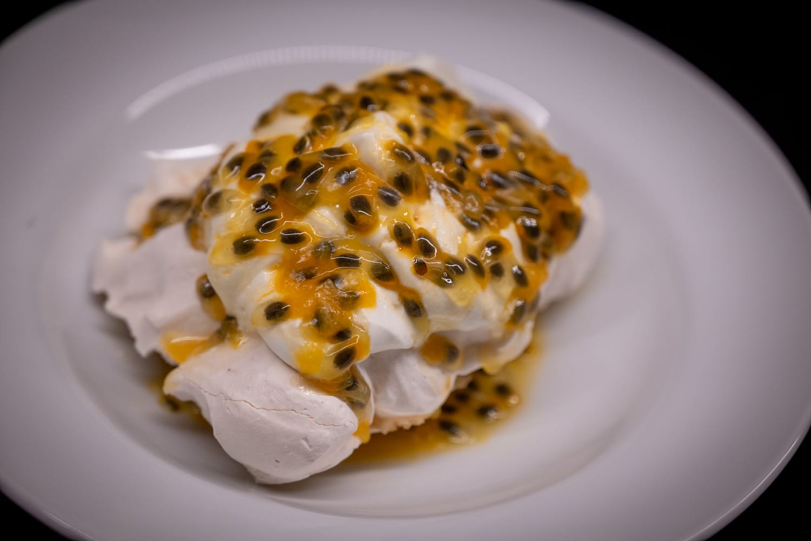
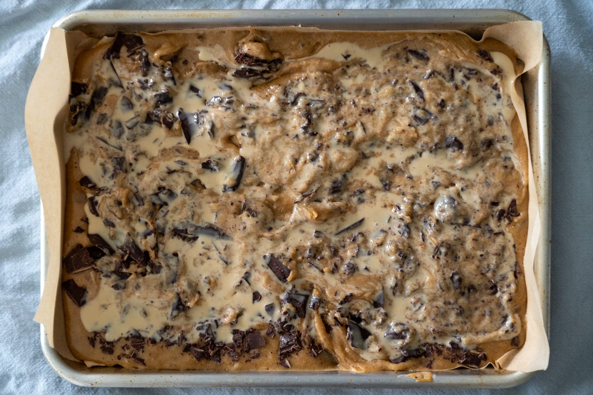
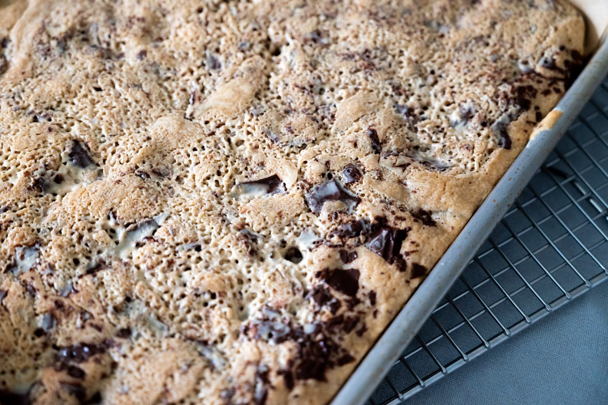
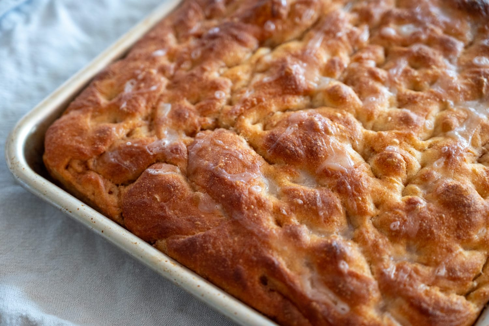

The past month has been a bit of a blur, with less time than I'd have liked to quietly noodle with food in the kitchen. In some cases in good ways, and in others less so.

I did have the coincidence of time and energy to do the Vietnamese-style caramel sauce that I'd planned to try out. The recipe from The Slanted Door was pretty simple to follow, and the sauce was great in a variety of applications over the following week or two.

Among them, an incredibly quick and very weeknight-friendly poached chicken dish with added aromatics and garlic. If you've planned ahead and have the sauce ready, the limiting factor in throwing dinner together is the time needed to steam a pot of rice. I made it in a European-style cast iron cocotte. It was very tempting to use this as an excuse to go buy an actual clay pot.

For the 4th of July, I wound up more as a diner than cook. My first attempt at true pizza in a wood-fired oven will have to wait for another time. But the group did put together a nice spread. Some highlights for me: a vibrant and zingy slaw-style salad, grilled corn, and summery shrimp-vegetable tagliatelle.

As June wound down, so did asparagus season here in the Northeast. I got my fill, and my local markets have returned to selling bland asparagus imported from Peru.

On warmer summer days, I feel guilty cranking up the oven. A batch of confit chickpeas slowly bubbles away in a low oven, and has a summery lightness that I appreciate at this time of year.

On the sweet side, I used up some frozen meringue to do an improvised pavlova with passion fruit, as in the original version of that dessert. If I'd had a passion fruit pavlova before, it's been a long time. After this attempt, I'm on the fence. The seeds add a different kind of crunch that I'm not sure I like. But if you were to remove the seeds with a sieve, I feel like the pavlova would lack a certain visual punch.

Maybe the lesson here is that I should stick to other summer fruits like strawberries.

For whatever reason, the whim struck and I did a batch of tahini blondies. There are moments you need a sweet treat, and it worked with the ingredients I had on hand.

Slightly more experimentally, I finally got around to trying a recipe I saw a few months ago from Benjamina Ebuehi for cinnamon focaccia. While it's a pretty sacrilegious concept, I thought it might also be great.

I messed up one small detail, and mixed the cinnamon sugar into the melted butter, kneading it into the dough. I doubt whether it affected the flavor. If anything, it may have improved it because the spices bloomed slightly in the butter. But it did mean that visually the focaccia lacked a certain something. It was more of a flat uniform brown than "cinnamon swirl."

That said, my hunch was right: it's delicious as a dessert. The grassy notes from the olive oil don't dominate, and, while the crumb isn't as delicate as a brioche-style cinnamon bun or babka, it also keeps everything moist.

Outside the house, I made a quick trip down to New York for a weekend. I didn't have a ton of time to go food shopping, but I did have a chance to try a few new restaurants and one or two old favorites. A friend took me to Olle, a Korean restaurant in Midtown. On what was the hottest day of the year so far, their cold noodles were really wonderful. A quick return trip to perennial favorite Balthazar was also nice.

Looking to the month ahead, I'm keeping my eyes peeled for more summer fruit.

I'd love some nice strawberries or stone fruit, so I can both eat them as-is, but also do some using the lacto fermentation technique that I've become such a big fan of. I'm trying to talk myself into buying a chamber vacuum packer to make this process easier.

In the last year or so, I've become a big fan of Pasta Grannies on YouTube. This recipe for broad beans and greens with a small bite-size ear-shaped pasta. I don't think I have the patience to make _strascinati_ from scratch. The odds of me finding cicoria rossa or fresh fava beans are also low. But I think I can get reasonable substitutes. And I really like the idea of seeing what happens if you pour ripping hot oil over a pan of pasta.



One of my regular lunch spots introduced me to peanut soup, and there was [a recipe for West African peanut butter-marinated chicken](https://www.ft.com/content/eb3604a6-969a-441c-b8b5-023fedefb726) in the _FT_ that feels like it might capture some of that magic. I'm hoping I can give it a try in the next month.

### What I'm Reading and Watching

* Not sure I agree, but [a take worth considering](https://www.thetimes.com/travel/inspiration/comment-inspiration/this-pervasive-dining-trend-is-set-to-wreck-my-summer-holiday-fqn26qq86) on sharing at restaurants, especially on vacation

* [Flamingos are causing problems](https://www.theguardian.com/environment/2025/jul/12/risotto-rice-paddies-flamingoes-ferrara-italy) in Italy's rice fields

* [A good take](https://harvardpublichealth.org/policy-practice/is-alcohol-bad-for-you-or-is-alcohol-good-for-you-yes/) on the raging debate over the role of alcohol in your diet

* Faced with higher prices and (maybe) the effects of GLP-1 drugs, people in the US are [buying less "snack food"](https://www.ft.com/content/d44f369c-204e-4267-a940-ea53b8b45ef4)

_[Subscribe](/subscribe) to get notified every month when new issues go out_
