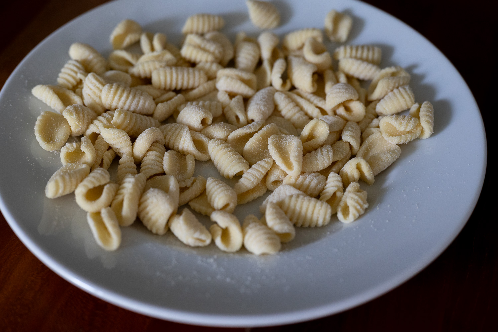
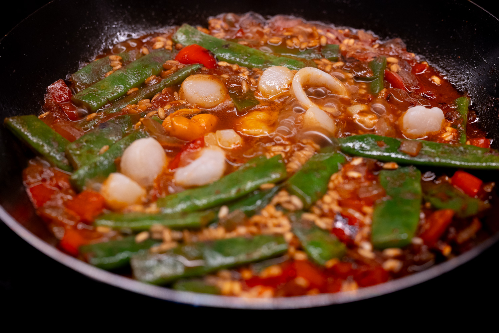
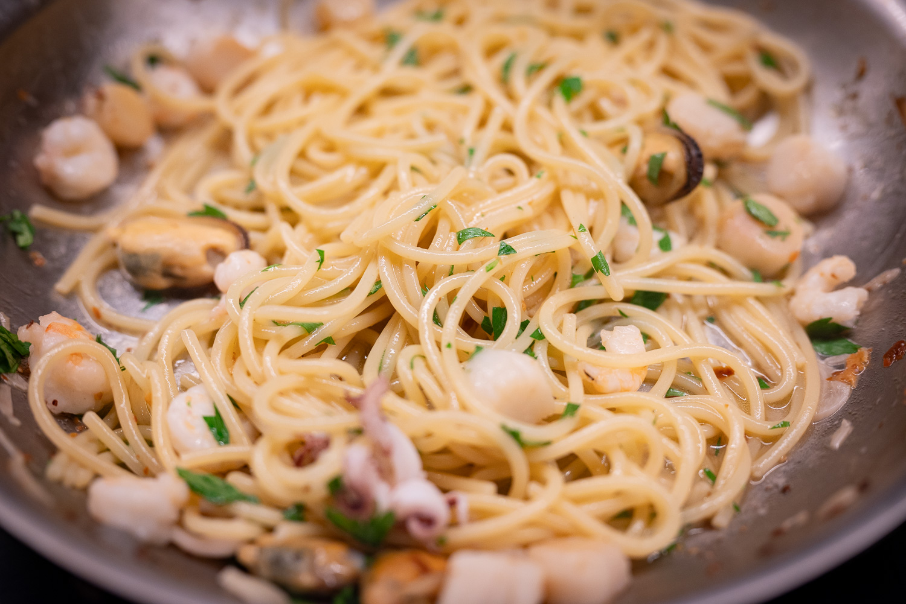
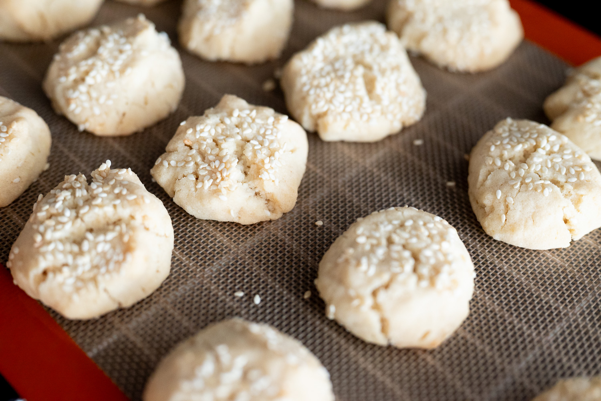

It's been a light month not so much for cooking, but for anything that felt noteworthy enough to document it and take notes. The weather has been extremely hot, which makes me feel guilty and a bit ridiculous firing up the oven, and it's been a hit-and-miss July for some of my favorite produce.

Which is not to say that there's been nothing.

After my relative success a month or two ago, I managed to get my hands on more _semola rimacinata_ --- even the Italian specialty stores don't always have it --- to do more cavatelli. While I still haven't come anywhere close to mastering it, I can see myself getting better. It's becoming a favorite.

In a pleasant surprise, I was finally able to find some runner beans this summer for paella. Not that I'm that much of a purist, but having had paella in Spain, I do think runner beans work better than the more standard green beans that are easier to find.

That said, I do really like green beans, _haricots verts_ especially, and I was a bit annoyed that the season for the good ones was apparently so short this year. I've had the same experience with figs.

There's been a fair bit of pasta, and I remembered to get a snap of one batch of spaghetti with shellfish that I did. It's not helping control my astronomical olive oil budget, but it's a winning combination.

On the sweet side, I followed through on my plan to do _drömmar_ (Swedish for "dreams"), inspired and informed by Cecila Tolone's YouTube channel, which I stumbled across last month.

For once, getting a somewhat exotic ingredient for those wasn't too difficult. For true drömmar, you need to use ammonium bicarbonate, as contrasted with sodium bicarbonate or baking soda. While I haven't had a chance to do a true side-by-side comparison, both attempts did work really well, and I'm persuaded that the different leavening agent does produce a lighter, crisper biscuit.

After two iterations, though, I haven't quite got where I want to be.

I've been trying to recreate drömmar since I had a sesame version from a bakery in Stockholm, Lillebrors. I have the texture right. But the Lillebrors version had a nutty, toasted character that I can't quite figure out to get right. My next batch may involve a batch of beurre noisette.

For the month to come, I'm going to keep going with the Swedish biscuits. Lillebrors is one of my favorite bakeries in the world, and their sesame drömmar were so good. It's now been about three years, and I'm so close I can both metaphorically and literally taste the finish line in being able to make them myself.

On the Scandinavian theme, a Swedish sweet shop is apparently going to open in my neighborhood. I'm hoping they'll have some serious salted licorice. After discovering that in Denmark, I've been hooked. It's not exactly easy to find in the US. Which doesn't really surprise me: it's an acquired taste.

I'm also holding out that some of my favorite produce makes its appearance. I haven't found peaches good enough to justify doing a big tart. And, aside from a brief one or two week window, there are no good figs to be found at my regular places.

### What I'm Reading and Watching

* A look at the [razor thin profit margins](https://www.theguardian.com/food/2026/jun/26/how-much-the-hidden-costs-of-restaurant-dishes) at restaurants

* Getting fiber is apparently becoming the [next great food fad](https://www.newyorker.com/magazine/2026/07/06/the-fibre-fad-keeps-on-moving)

* [_The Bear_](https://www.imdb.com/title/tt14452776) gets a nice code in its final season; season two still feels like the peak to me

_[Subscribe](/subscribe) to get notified every month when new issues go out_