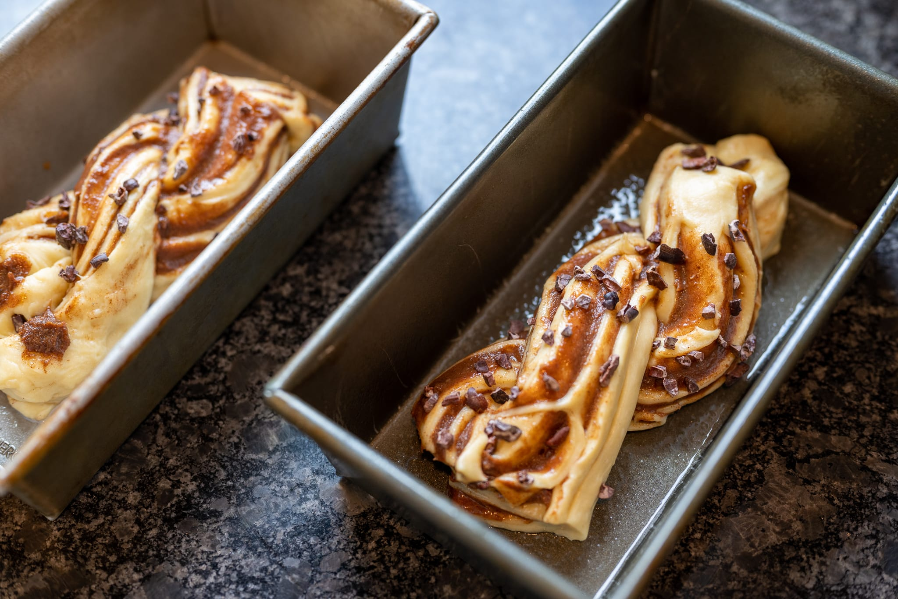

The [kitchen project](https://jkibe.github.io/kitchen145/) is behind schedule. For perhaps understandable reasons: they found asbestos that had to be removed, and the electrical work to bring everything up to code has been difficult. As of writing, I believe the first fix plumbing is now done, but the electric isn't. That's next, and after that they can close the walls and start installing the millwork.

Because they were working on the power and water in my apartment, though, I had to relocate for a couple of weeks, which gave me a chance to do a bit of cooking for a change.

I tried making a [babka](https://www.youtube.com/watch?v=Gc61v-1oyUg) for the first time, taking a cue from my favorite YouTube baking channel. It came out pretty nicely. My only real issue was a mismatch between the loaf size and the size of the loaf pan. The loaves were delicious, but looked a little spare in pans that were too big.

One of my locations gave me the chance to do a [grilled pizza](https://www.youtube.com/watch?v=GkDYsQkXbxw) for the first time in ages. It was pretty clear that I'm out of practice, though by the last pizza I had gotten closer to mastery. More than anything, I felt the lack of counter space most limiting. You need a fair bit of space to assemble because you add the toppings on the grill itself.

I didn't have a chance to go anywhere too exotic to eat. Fate stole a chance for me to have breakfast at [Tartine](https://tartinebakery.com/san-francisco/manufactory), though I did (by accident) try a gruyère-pepper scone. It was better than I would've expected, but a bit too salty for my taste. I tried to make a trip to The Slanted Door, which still hasn't reopened, and Hog Island (a short stroll away in the ferry terminal building) had a line that was a bit too long for my patience.

Looking forward, I'm hoping that the kitchen will be more or less complete sometime in July. Though even best-case, my [fancy German oven](https://www.mieleusa.com/e/24-oven-h-7660-bp-am-graphite-grey-11804840-p) won't get here until mid-August, so no baking until then at the earliest.
