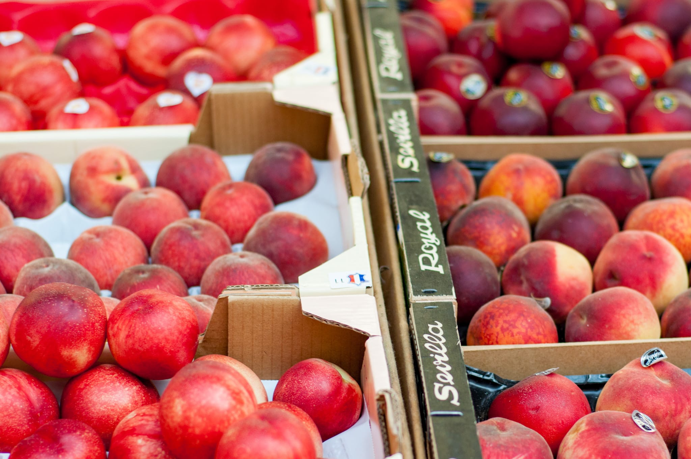
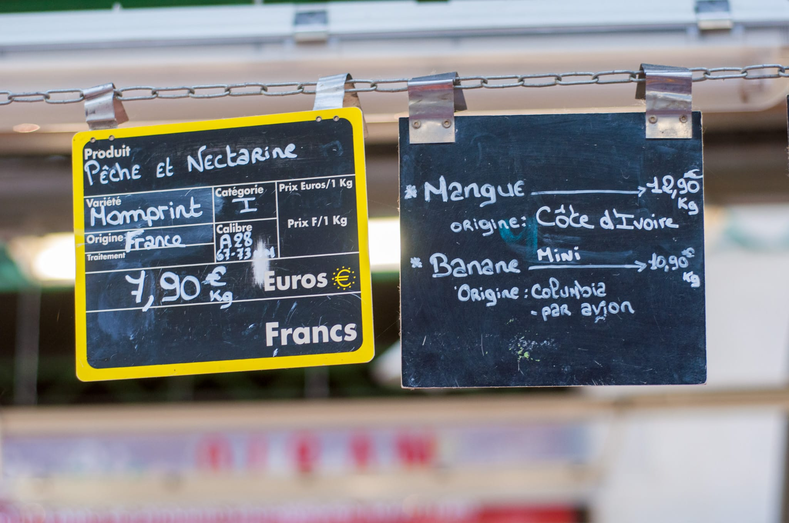

The weather here in New England has been a bit indecisive over the last month. Some days have been decidedly in the summer column. Others make me hesitate to pack away the coats and sweaters even though we're now halfway through June.

A very summery week at the end of May put me in the mood for something served very cold. I really love doing a [super-simple Sichuan-style smashed cucumber salad](https://www.seriouseats.com/sichuan-style-smashed-cucumber-salad-recipe). It only requires a handful of store cupboard ingredients, and they transform the cucumbers into something very tasty.

On the pizza front, I'm still trying to figure out how to use my new oven.

I know I'm never going to get true Neapolitan-style pizza at home. At least until that home has an oven that can get up to 500 °C. But I was able to get pretty good results in my old circa 1980 oven, especially after getting myself a [Baking Steel](http://bakingsteel.com). In the new one, my first batch was a bit limp and lacked spring.

After a few tries, I got it working by giving my new oven a lot longer to preheat than my old one. I can't quite pin down why this made such a difference. I'm guessing it has something to do with my new oven's smaller size --- it's a European-style 60 cm oven rather than the more typical 30" --- and more sophisticated preheating system. Unlike my old oven, the new one uses everything it has (top, bottom, and fan elements) to get up to temperature as quickly as possible.

Though I still have some work to do. By the time the crust was where I wanted it, the cheese was a bit overcooked for my liking. I may need to leave it off initially and add the cheese mid-bake. It may finally be time to buy a pizza peel, so I can more easily pop the pizza out, put the cheese on, and pop it back in.

My experimentation with soba noodle salad continued. I like it on its own merits. As summer approaches, the fact it's nice served cold or at room temperature is a bonus.

I've gotten something good and very close to what I want. The buckwheat is earthy, the cucumbers give it crispness, and there's the right amount of lip-puckering acid and sweetness to cut through from the dressing. The cilantro adds a nice extra bit of freshness. Finding a recipe written by the people who came up with the version I like helped. I was surprised how many ingredients were in the dressing.

It's also one of the places I want to keep tweaking. Even over the course of an hour or two at dinner, the dressing isn't a stable emulsion. I don't want to add a "traditional" ingredient like mustard or egg yolk to introduce proper surfactants. That would mask or change the flavor too much. I may see if something like xanthan gum does the trick.

Similarly, I made the mistake in my most recent batch of using the tofu I had rather than the tofu I wanted. Extra-firm is too firm for this salad.

After watching [_Drops of God_](https://www.imdb.com/title/tt15282746/), I felt like I needed to explore the space of wines. I stopped by one of my favorite wine shops, [Brix](https://www.brixwineshop.com), and wound up getting a bottle of _frappato_ from the team at [Planeta](https://planeta.it/en/wine/frappato-en/).

I was a little less adventurous with the muscadet I bought to cook and go with some mussels. Always an excellent choice with shellfish.

I've also been playing with the dry cure technique [Kenji López-Alt wrote about](https://cooking.nytimes.com/recipes/1024187-dry-brined-salmon) in his _Times_ column recently. He used it on salmon. I've been trying it out on other fish like cod and hake, sometimes with additions like a bit of lemon zest for extra kick. I'm also curious what would happen if I used some _gros sel_ like sel de Guérande instead. Either way, I'm a fan of the technique.

Last but not least, and mostly so I could try making a meringue without egg whites (more on that next month), I did a batch of confit chickpeas. This was a pandemic discovery, and is a favorite. It takes time, but is otherwise a cheat's dream: all the prepared ingredients get dumped into a cocotte, and that's about it other than the yogurt sauce.

Moving into the realm of pastry, however much I was in the mood when the temperatures were very summery a couple weeks ago, I held back on doing something like an [Eton mess](https://www.theguardian.com/lifeandstyle/2018/aug/15/how-to-make-eton-mess-recipe-masterclass). The great strawberries have yet to make an appearance. I'm holding out. I'm sure my patience is rewarded later in the summer.

I indulged my sweet tooth with an experiment to see if I can get closer to the mythical by-the-side-of-the-highway peach tart I had one summer in Nice. By pure chance, I stumbled on an old episode of [_Kitchen Secrets_](https://www.bbc.co.uk/food/programmes/b00yk23k/episodes) with the French-British chef Raymond Blanc. Something about the apple tart he made looked good, so I tried it out. It was excellent. I can't wait to try this on some white peaches when good ones make an appearance in the high summer.

In the meantime, I need to remind myself how to make shortcrust pastry. It's hard to see in the photo. Believe me when I say it was a disaster putting that tart shell together. At least it didn't leak.

Also in the pastry department, I decided to make a giant batch of shortbread biscuits after the famous _punitions_. In the same way some people like having a pint of ice cream in their freezer, I like to have something crisp and buttery when the mood strikes.

Looking to the month ahead, I have a bit of travel planned, and may add a bit more if the stars align.

Otherwise, I'm looking forward to the usual summer fare.

There is of course my annual attempt at recreating the mythical peach tart, as mentioned earlier. Much will depend on how good the peaches are in the month to come. I may need to wait for August. As much as the technique matters --- evidenced by the fact that almost a decade on I still haven't cracked it --- I suspect I got lucky that the restaurant happened to have some really good white peaches that day.

We'll also overlap the 4th of July holiday here in the US. I'm not entirely sure what I'll be doing yet. A friend of mine likes making [strawberry shortcake](https://www.theguardian.com/food/2019/jul/31/how-to-make-strawberry-shortcakes-recipe), and I like that tradition.

If you're looking for something to go with and you've never explored the [summer cup](https://www.theguardian.com/lifeandstyle/2015/jul/01/how-to-make-perfect-summer-cup-pimms), it's a favorite. Yes, it comes from the same universe as people reminiscing about punting down the Cam or who can boast memberships to the All England Club. Don't let that put you off. It's a great drink.

Summer also means good salmon is in season. As I've written before, I'm not a huge fan of the farmed salmon that's available year round. It's definitely more forgiving to cook and has a milder flavor that may find a bigger audience. It's also much less interesting. While the prices are a little steep, it's worth springing for some good Coho or King salmon once or twice during the summer.



Almost irrespective of the season, I'm trying to find an excuse to make this incredible looking lemon and labneh cake from Varena Lochmuller and the Ottolenghi team. I can't possibly make it for myself to have on a weeknight. I've been tempted to scale it down and do a less over-the-top cupcake version. I feel like that throws away some of the magic.

I should probably overcome my self-consciousness and bring one as a huge surprise to the next dinner I'm invited to. 

Also without any real connection to the season, I was taken by this recipe for chicken cordon bleu from François-Régis Gaudry of _On va déguster_ on France Inter's YouTube channel.


  
Much as I love French food, it's not something I'd usually go for. It reminds me of an off day in my college's otherwise pretty good dining commons. And yet, seeing the cheese ooze like that, it's hard not to want some.

### Experimental: What I'm Reading and Watching

* Ligaya Mishan considers the limits of Americans' appetite for texture in food in [a great piece in the New York _Times_](https://www.nytimes.com/2023/05/08/t-magazine/food-texture-eating.html)

* The _Observer_ writer Tony Naylor contemplates [the disappearance of the dessert](https://www.theguardian.com/food/2023/may/21/save-our-pudding-why-restaurant-desserts-are-disappearing) from restaurant menus

* In the _FT_ economist Daron Agemoglu takes the ["Lunch with" column](https://www.ft.com/content/67e49261-d046-424e-adf7-7cef5cb00292) to local favorite Sumiao

* For any francophones, François-Régis Gaudry dives into Paris and its role in the creation of food culture in his new series [_Paris Ripaille_](https://www.radiofrance.fr/franceinter/podcasts/serie-paris-ripaille)

* On Apple TV+, I'm watching [_Drops of God_](https://www.imdb.com/title/tt15282746/), a loose adaptation of a Japanese manga series about two wine experts going toe to toe

* Tim Hayward takes on the [recent resurgence in picnicking](https://www.ft.com/content/e78572e7-0848-4444-be66-b04b21a33b77)

_[Subscribe](/subscribe) to get notified every month when new issues go out_
