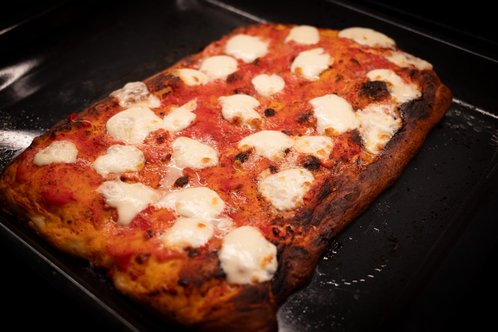
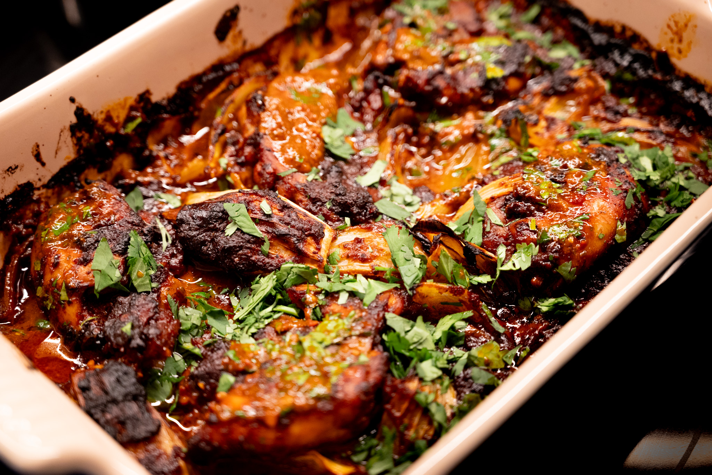
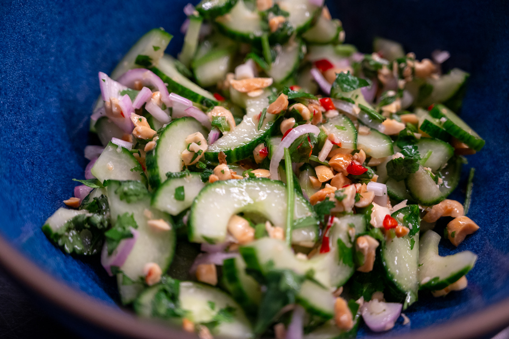
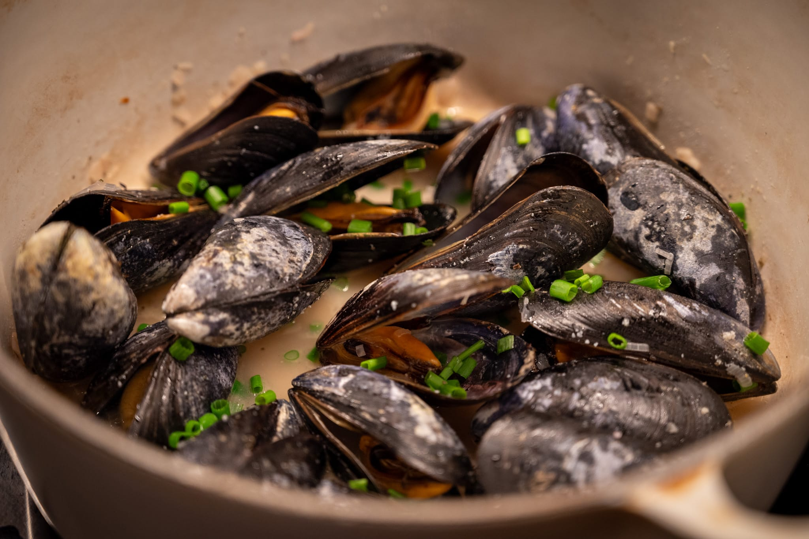
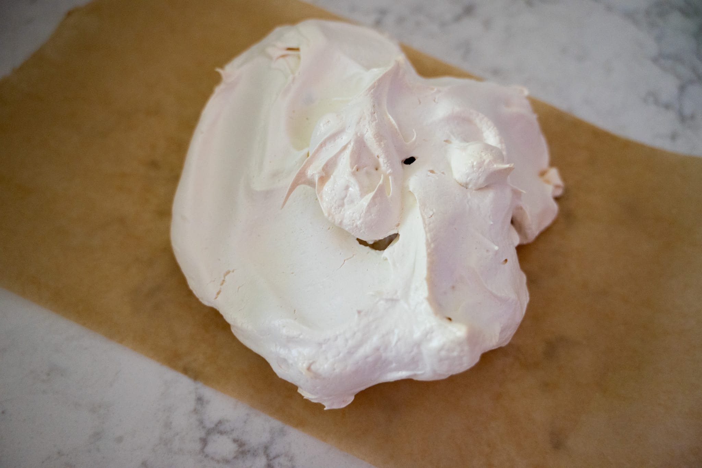
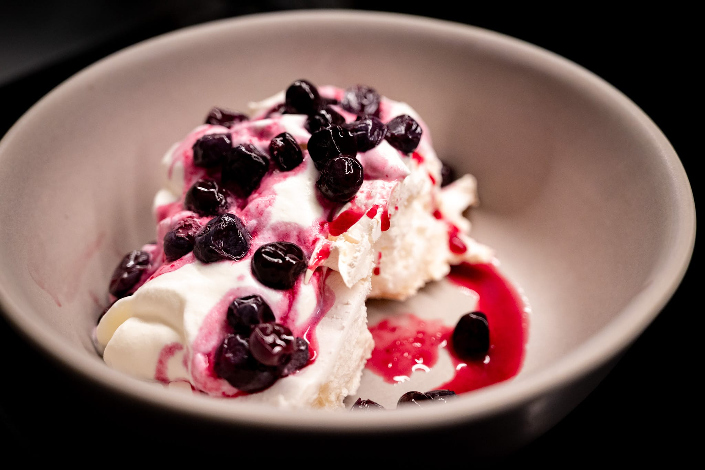

Every year I feel like I should keep a log of the average daily temperature. As soon as I blink, the weather goes from so cold I'd freeze without wearing a coat to so warm I have to turn on the air conditioning.

For better or worse, I didn't have a ton of time to explore the local food scene in Florida. I also have a suspicion that the more interesting food scene lies outside the area that I was visiting. A further exploration will have to wait for another time.

Back at home, regular readers may recall that I've been trying to unpick pizza _in teglia_ for a few months as a more straightforward, low-maintenance at home pizza. But I've really struggled to get the bottom of the crust to achieve the crispness that I expect from a Roman-style pizza. 

On my last attempt, I hypothesized that the problem was the baking tray rather than the temperature of the oven or the dough. This based on a slight improvement by transferring the pizza to my baking steel for a few minutes, and watching some videos from Italian pizza experts doing _in teglia_ with their special trays. (Recall that _in teglia_ literally means "in a mold" in Italian.)

Then I realized that my weird (for the US) European-style oven came with a dark gray baking tray not unlike the _teglie_ typically used to make this style of pizza in Rome.

So I gave that a try on a recent batch. As it turns out, the baking tray was indeed the problem. Switching to a dark-colored steel tray from a more typical US-style light-colored aluminum sheet pan worked so well that for the first time I had sticking because I didn't use enough olive oil. It wasn't the most photogenic --- I didn't really need an entire half sheet of pizza and the cheese didn't quite do what I hoped --- but it was very tasty, light, and crispy on the bottom.

Equally successfully, I tried out an excellent Mexican-inspired chicken recipe from the Ottolenghi team. Their recipes are usually pretty good, but this one really resonated with me. I forgot to remove the seeds from the chipotles after I soaked them, so everything had a bit more of a kick than I was expecting. But it was fine. And the peppers added a really tasty floral perfume to the sauce. The little bit of chocolate recalls a mole, though this is definitely not even a cheat's mole. It's its own thing: Mexican-inspired rather than Mexican. And very good.

The leftovers were an excellent excuse to make tortillas and do some improvised tacos as well.

I'm continuing to work my way through Nik Sharma's _Veg-Table_, and did a slight variation on his peanut cucumber salad recipe. I took the liberty of salting the cucumbers before putting them in the salad. This helps firm them up a bit and concentrates the flavor --- as well as seasoning --- which makes them a little nicer. I needed something to go with a batch of lemongrass chicken that I was in the mood for.

I was pretty pleased with the salad, especially with the dash of red chili for color contrast. I'll be coming back to it.

With the weather feeling more summery, I was in the mood for mussels. I'll confess, I didn't do anything especially creative. I used up the dregs of a bottle of white wine with a shallot, some herbs, and a sprinkle of chives. With some nice bread, it was a nice midweek meal.

In the pastry world, I used some egg whites leftover from a batch of sauce hollandaise to do a somewhat experimental pavlova. The meringue was pretty standard. But rather than using regular fruit, I tried sweetening a batch of lacto blueberries and doing a "fermented" pavlova. It wasn't bad, though neither was it amazing. More iteration is required.

Moving into ideas for late June and July, with the weather really getting summery here, I'm back in the mood to experiment with the pan bagnat. I'm sure I've written about it before here. It's a great sandwich concept from the area around Nice, France. Especially for muggy New England summer days when you don't want to heat up the house with full-on cooking, it's really nice when the most you have to do is make a hard-cooked egg or two.



The excellent Constance Dovergne has [a quick interview](https://carteblanche.substack.com/p/a-quoi-seriez-vous-prete-pour-cette) with the baker behind the pizza of the moment in Paris. Apparently, it's all down to making the dough with a levain. I've tried it once and more or less failed. Perhaps it's time to make another run at that, perhaps combined with my continued noodling on the pizza _in teglia_.

Writing this, I've also realized it's nearly the 4th of July. Perhaps another excuse to refine the mythical peach tart, assuming I can find good peaches.

For reasons I genuinely don't understand, I have a yen to make Rice Krispie Treats. (Yes, I had to look up that spelling.) It's never been something I've loved, and yet. We'll see if I actually follow through on this one. Either way it's sent me down the rabbit hole of interesting variations on the classic, such as this one from the King Arthur Flour people. I like the idea of spiking them with some really high-quality dark chocolate.



### What I'm Reading and Watching

* A very [over-the-top seafood tower](https://www.youtube.com/watch?v=PfDovHJ2zPM) from the team at ChefSteps

* [Low- or no-alcohol](https://www.theguardian.com/food/article/2024/may/22/the-experts-bartenders-on-how-to-turn-16-classic-cocktails-into-mocktails-from-a-negroni-to-a-mojito) remixes of classica cocktails in _The Guardian_

* People finally waking up to the [mediocrity of Instagram cookware](https://www.nytimes.com/2024/05/24/dining/instagram-cookware.html)

* The FT had [a great series](https://www.ft.com/content/166e71f5-6057-452f-8367-c47adb4e298c) featuring extra writing on food and drink topics at the end of May. I especially appreciated Nicola Lamb's [piece on cake](https://www.ft.com/content/f008f880-3d22-4bb3-861f-dae53dbf825d) that went a bit deeper than the usual

* [Maillard backlash](https://www.newyorker.com/culture/kitchen-notes/the-maillard-over-reaction) in _The New Yorker_

* How French haute cuisine has [taken the New York culinary scene](https://www.ft.com/content/d7b53d48-57b6-44fc-8c59-d44828f3c19a) by storm in the _FT_

_[Subscribe](/subscribe) to get notified every month when new issues go out_

