It's been another month of ebbs and flows. I had a bit of a chance to relax, and I also had quite a bit going on.

On the calmer side, I had time one evening to try another recipe from the Ottolgenhi team's _Comfort_ book. This time, an herb-y smoked salmon and potato bake, inspired by a Swedish lax pudding.

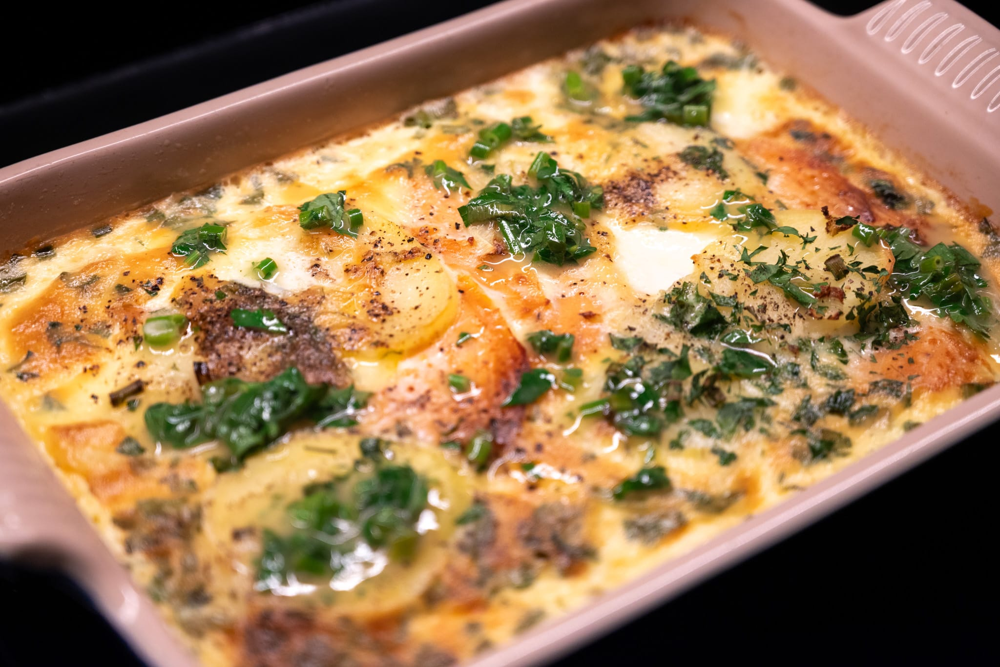

This wasn't as life-changing as other products of the Ottolenghi kitchens. But it was still a nice twist on a fish pie. Now that I understand how it snaps together, I think it could be a nice easy weeknight option.

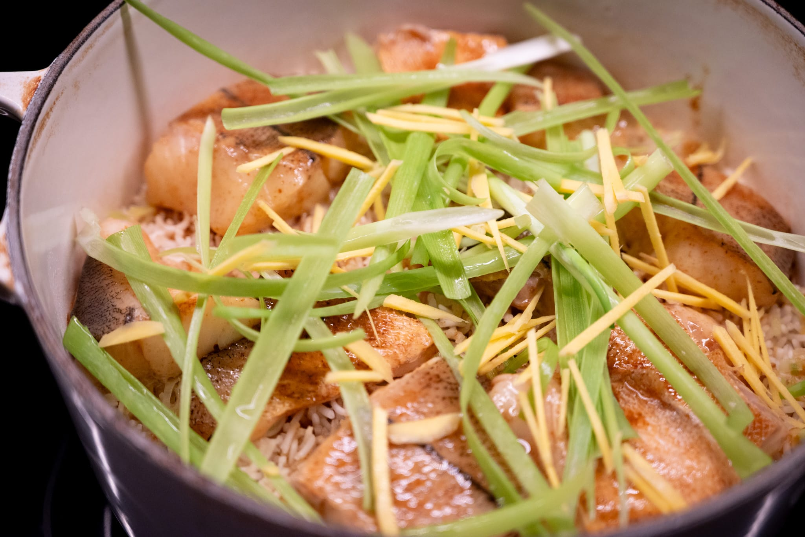

I was more impressed with a different recipe for gingery fish over rice. With the benefit of hindsight, I should've made the scallion garnish more bite-size. I always love an excuse to pour a bunch of hot oil over fish and aromatics as a final flourish.

From my pad Thai experiment last month, I had a ton of leftover tamarind paste. I thought that might be interesting to turn into a sauce to go with some fish. After trying a couple of recipes, I'm not sure I've found the formula yet. I can see how it might work, but it's still too weak even with a very delicate white fish.

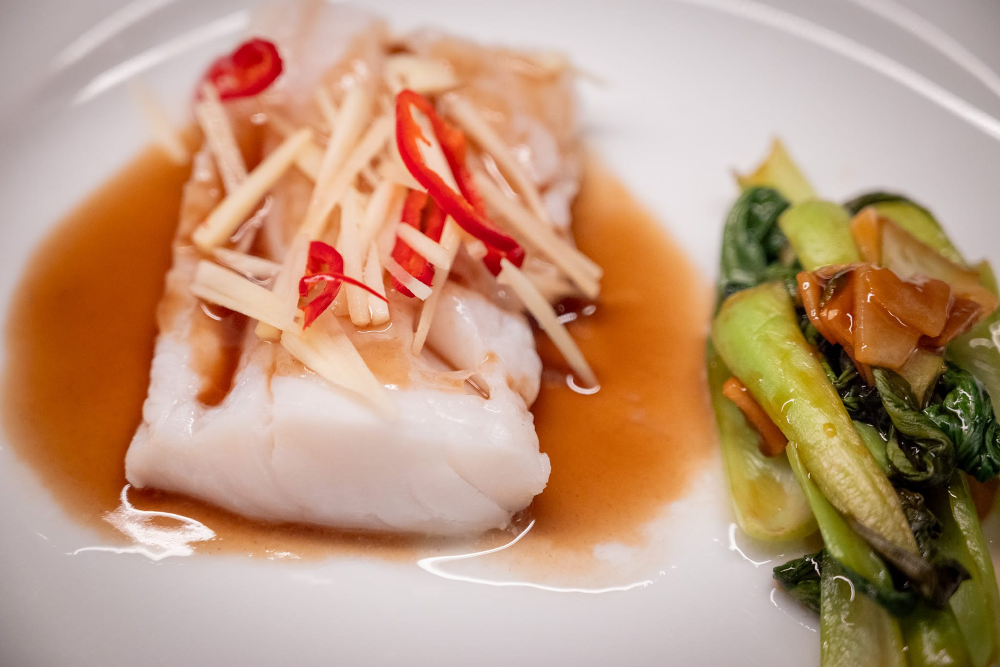

As planned, I did the James Hoffmann tiramisu for a friendly competition. I learned a lot. Not least that the ingredients to make a tiramisu are surprisingly expensive. Between a huge number of egg yolks, 14 shots of espresso, and quite a bit of mascarpone, the ingredients ran over $50.

Though I do think part of that was a difference between the ladyfingers used to develop the recipe and the ones I used. The ones available at my friendly neighborhood Whole Foods (imported from France) I suspect were smaller than the ones the James Hoffmann team used to develop their recipe. (An Italian friend who also participated had a similar issue.)

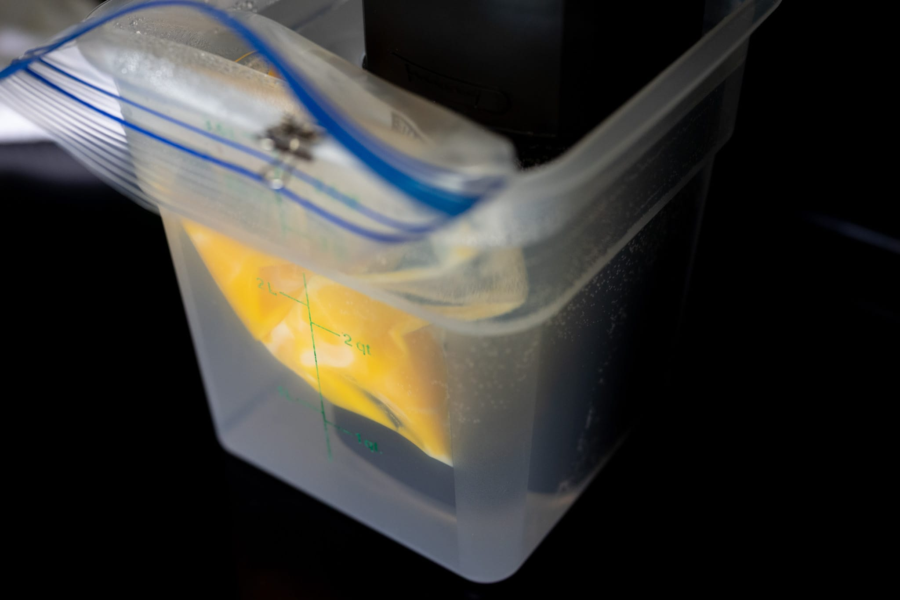

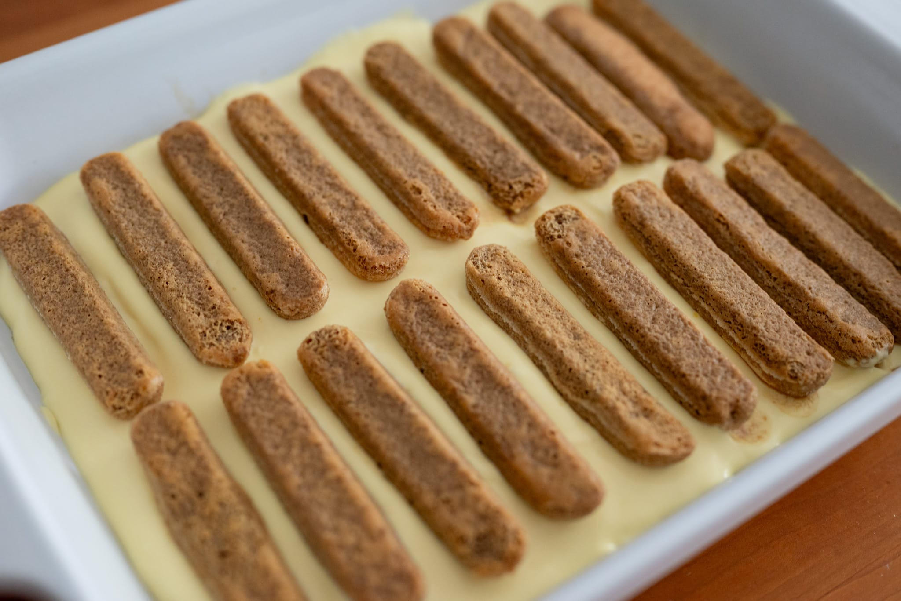

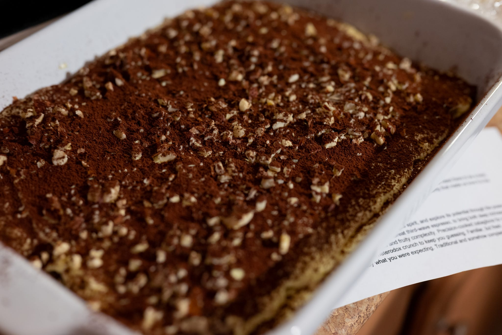

I had a lot of leftover espresso syrup, despite using more biscuits than the recipe recommended, and I had to fill a lot of the leftover volume with the mascarpone-egg yolk-sugar mixture.

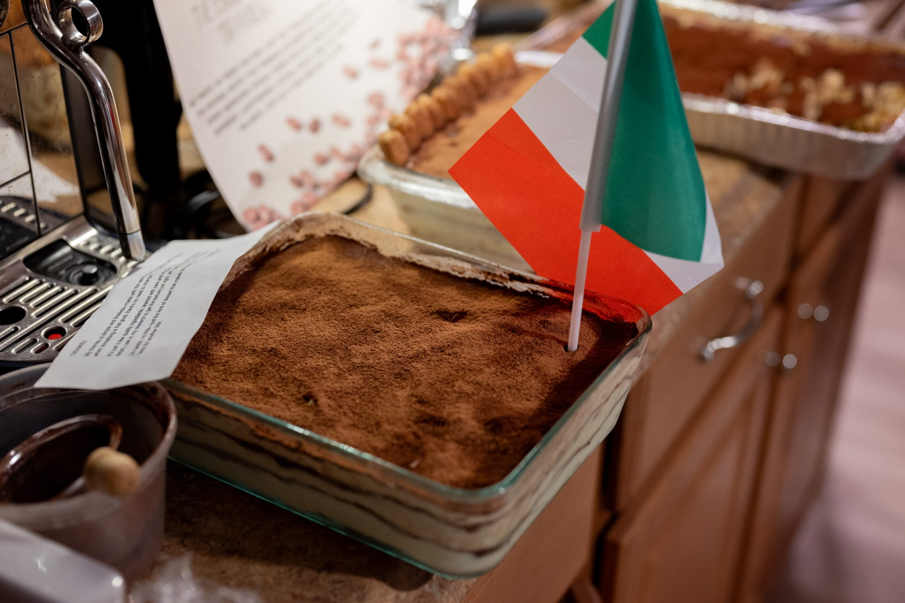

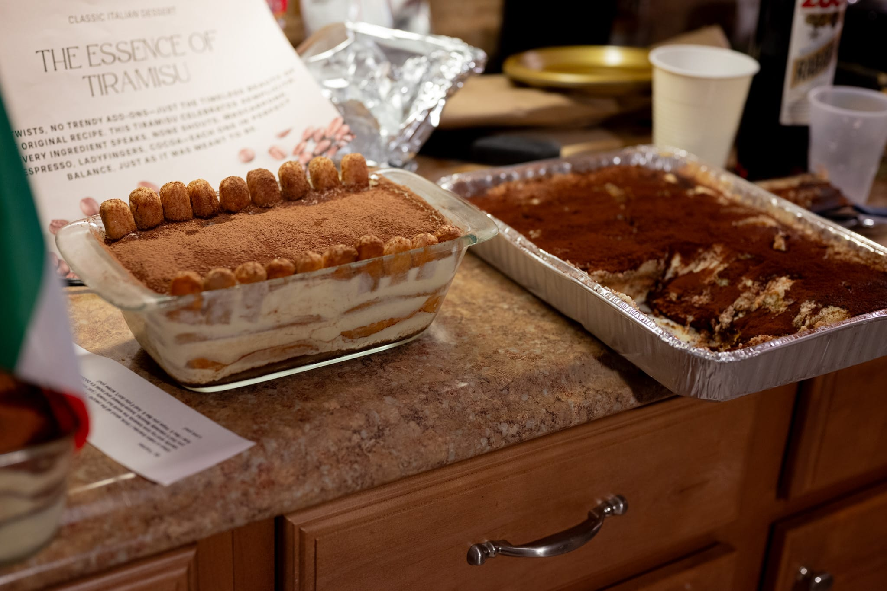

My effort placed a respectable third out of six entries. In the top half, at least. It was surprisingly interesting to taste the other efforts. It's so much easier to compare when you can so easily hop between the different options. Mine had a nice coffee oomph. Especially compared to a more traditional entry from a friend who also made her version, you could really tell that mine was too wet.

Making the tiramisu (or at least the James Hoffmann version) meant that I had a lot of leftover egg whites. I'm not sure what you do with that other than making a meringue.

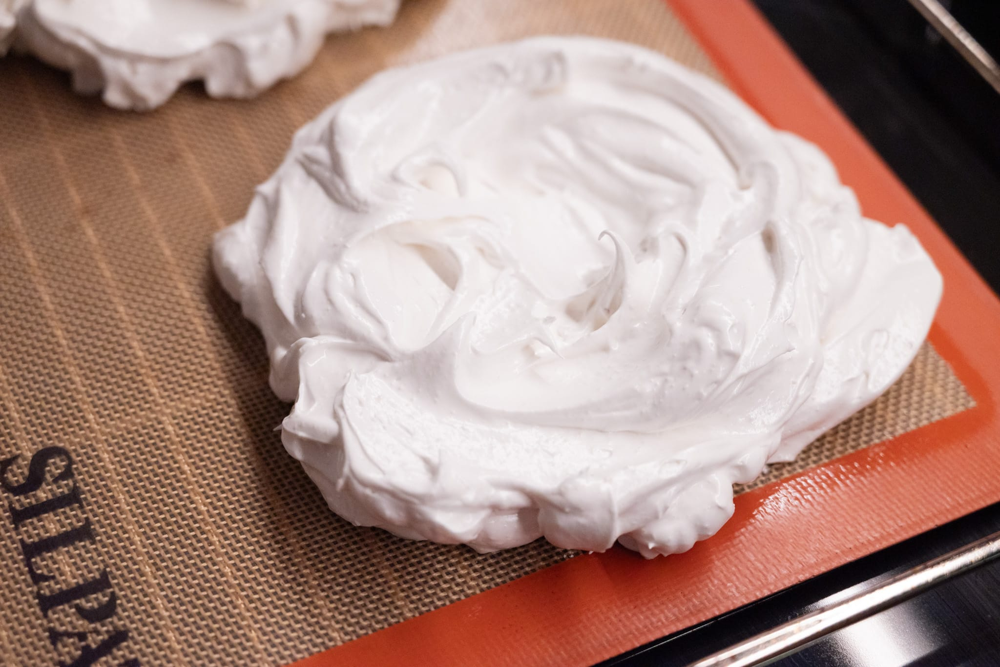

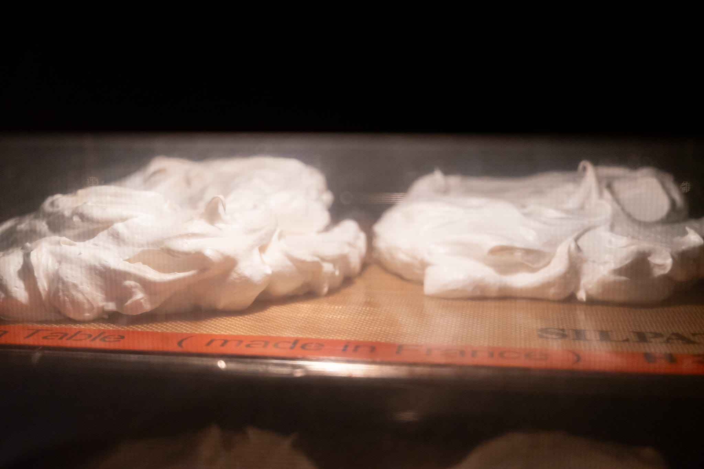

After finding serviceable white peaches, a peach pavlova felt like an interesting idea. It's hard to really make a bad pavlova. But I'm going to confess I was a little disappointed. The peaches weren't at that magic point in the year where they're sublime.

Outside the house, I managed to make a quick trip down to Duxbury, MA, home of Island Creek Oysters and (as of a few years ago) their raw bar aimed at the general public. If you like seafood and especially oysters, it's great. You really can't get any fresher.

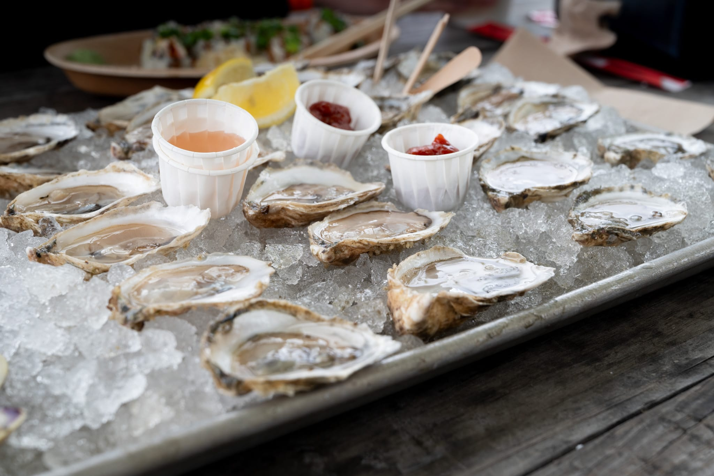

I also made a flying visit to Houston, which was a lot more interesting than Dallas from a food perspective. On a recommendation, I tried a great Vietnamese restaurant called The Blind Duck.

For the month to come, I'm very tempted to make another run at tiramisu. Not least I found [a recipe from the SPQR team](https://www.lacucinaitaliana.com/trends/restaurants-and-chefs/tiramisu-recipe-by-michelin-star-chef-accarrino-from-san-francisco?refresh_ce=) that optimizes for a different definition of great.

Sticking with the Italian theme, the FT ran an appealing feature on pasta, including yet another [twist-on-a-classic ragù recipe](https://www.ft.com/content/cf962461-9f06-484a-9e77-eb0b1dcf7171). I really enjoyed the slightly bonkers ragù recipe that used a kilo of onions, published earlier in the year, even if it was a bit too sweet with all those onions. (Next winter will offer a chance to tinker further there.) I like the idea of welcoming summer with an herb-y ragù.

Likewise inspired by a restaurant visit, I've resolved to finally try doing a Vietnamese caramel sauce. Basically caramelized palm sugar and fish sauce. The apotheosis of bitter-sweet-savory, at least in theory. I've got a good recipe for caramel claypot chicken in _The Slanted Door_ cookbook.

There is a tentative possibility that I'll have access to a wood-burning oven for the 4th of July. If that's the case, I'm really eager to try my hand at doing pizza in a wood burning oven for the first time.

### What I'm Reading and Watching

* Apparently it's [screen time, not health concerns](https://www.ft.com/content/a0fcf6b7-13f5-4c7c-81e9-6692f14ac942), driving people to consume less alcohol

* Investigating [the latest innovation in butter replacements](https://www.youtube.com/watch?v=FNCepnw64dY) in Paris

* Exploring the [evaporation of alcohol](https://www.youtube.com/watch?v=eOlc9GXRmy0) in cooking

* [A strange meal](https://www.sfchronicle.com/food/restaurants/article/thomas-keller-french-laundry-20290670.php) at The French Laundry from the SF Chronicle's restaurant critic

* Helen Rosner's [take on the ice cream sundae](https://www.newyorker.com/culture/the-food-scene/three-ice-cream-sundaes-for-the-start-of-summer) for the summer season

* Livia De Giovanni of the Pasta Grannies team tackles [pasta heterodoxy](https://www.ft.com/content/0d45d6f3-f929-4513-a52d-af3ba4387fbf)

* The French being French at a [cocktail bar in Paris](https://punchdrink.com/articles/de-vie-paris-new-cocktail-bar-ice/) that uses no ice

* Honey and Co published their [universal cake recipe](https://www.ft.com/content/952023f6-a662-429a-87a9-966569c4576a)

_[Subscribe](/subscribe) to get notified every month when new issues go out_