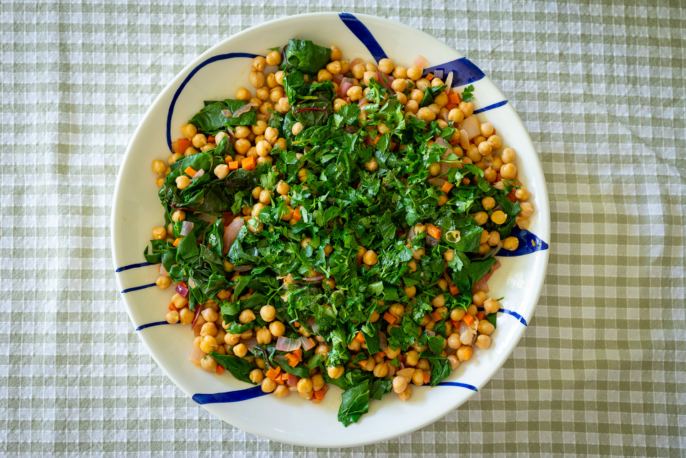
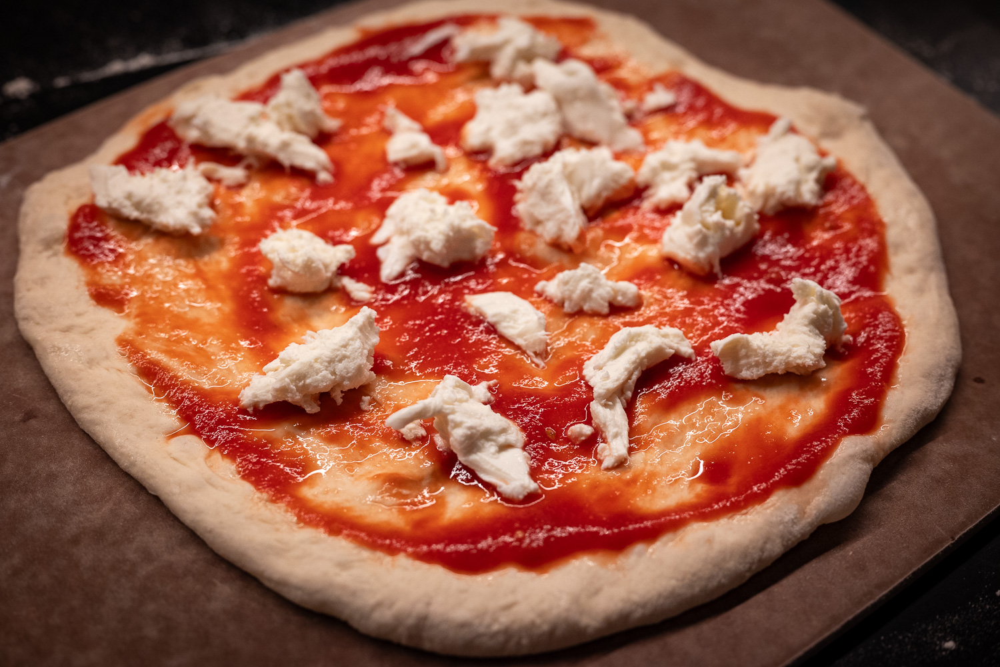
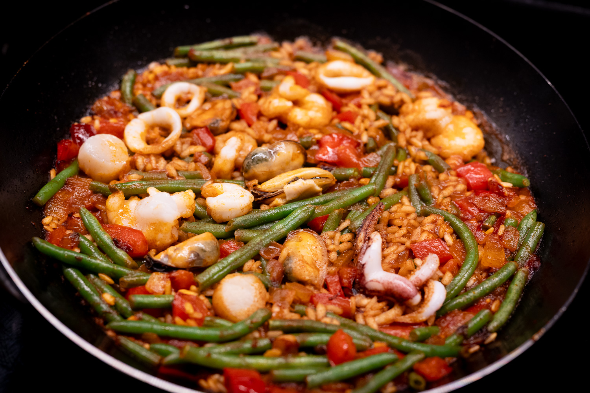
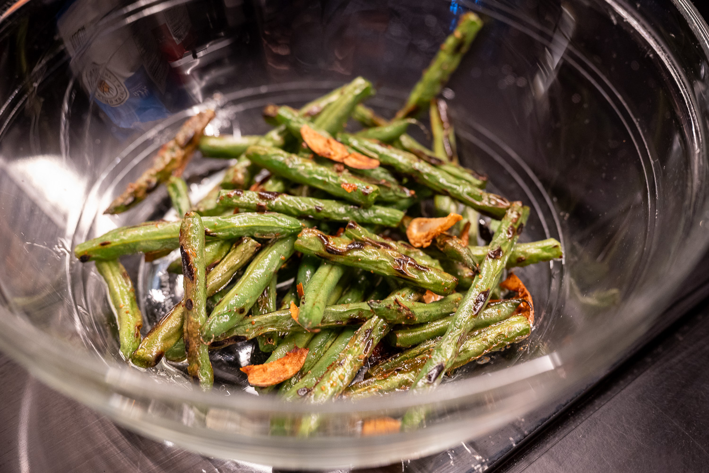
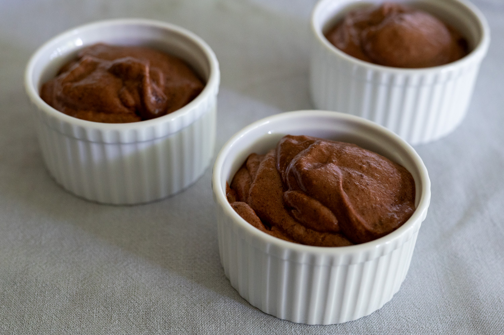

The last month has continued to be a bit liminal. The weather can't quite make up its mind, and the produce has been a similar story.

I willed warmer weather into being with at least one dinner I hosted. I repeated the cavatelli from last month, which had an interesting and unexpected twist. I've become a real convert to the idea of doing as much as possible ahead of time when I host, and in that vein I prepared and shaped all the pasta the night before. Everything I read suggested you could leave it out at room temperature, which was nice given how (relatively) small my refrigerator is.

The conditions were just right in my kitchen, apparently, and the pasta began to ferment, as if I'd added yeast. So I inadvertently made sourdough pasta, which was pretty nice. I'll have to see if I can do this with any repeatability.

That took me down an Italian path, so I also had a chance to do my evolution of a chickpea salad recipe that I first took from the ever-excellent River Cafe.

On one of the cooler evenings earlier in the month, I took the opportunity to do more pizza experimentation. However many years later, I still haven't quite cracked pizza in my new oven. Last time I tried this, several totally fell apart when I was putting them in to bake, and they both didn't have the rise I wanted and weren't elastic enough to get to my desired thinness, so were too cake-y in the center.

Typically, I use an Italian-style 00 (double zero) flour. It's very finely milled and very refined, but has a relatively low protein content, closer to a US all-purpose flour. I wondered what would happen if I tried a stronger bread flour. I'm still not sure I've figured it out, but at least none of the pizza fell apart.

Tinkering continued with my evolving relationship with carbon steel. I still haven't been able to get a good _socarrat_. It remains unclear to me whether this is my technique or the fact my pan still isn't very well-seasoned. It's also occurred to me that I might want to get a true _paella_. Even if I'm only cooking for myself, I think I may be overfilling the pan.

I tried doing an _ochazuke_ (rice with tea) for the first time as another potential quick weeknight option. The first attempt left a lot to be desired. It was unbearably bland. Somehow even flatter than a bowl of rice on its own. Pretty quickly I realized that I needed to cut the fish into thinner pieces, use tea made with completely boiling water, and the fish needed a ton of seasoning.

More successful was a riff on a Chinese green bean dish. I love Sichuan-style green beans. You dry fry them and then stir fry them, so they're wonderfully tender crisp. At home, though, it's such a faff to do any kind of deep frying. Inspired by another technique, I realized you can truly dry fry. As in, put the beans in a completely dry pan with nothing in them, and give them their first cook that way. It worked a treat. Though for the second cook in oil, it still made more of a mess than I'd like. In purely gustatory terms, it was a success. In practical terms, the concept needs refinement.

Somewhere in between the success of the green beans and the abject failure of my _ochazuke_ was an attempt at a vegan chocolate mousse. Mostly because I ate a ton of chickpeas, which meant I had a lot of opportunities to harvest "aquafaba." I also like the practicality of doing vegan meringues or other egg white desserts. It's so rare that I simultaneously need a ton of egg yolks to make a custard and egg whites to do a meringue, so I inevitably wind up with a lot of waste products. Whereas you can always eat some chickpeas.

In most ways, the incidentally vegan chocolate mousse was great. Texturally, you'd be hard pressed to distinguish between an egg white chocolate mousse and one made with aquafaba. But the flavor needed work. Partly that was my fault for trusting the recipe I tried a bit too closely. It suggested that if you had "good" chocolate, you should cut down on the sugar. That turned out to be a mistake. After a couple of bites, I wound up having to pour some honey on top to get the texture and flavor to work at all.

For July, I'm hoping the good summer produce finally begins to make an appearance. In particular, I'm eager for great strawberries, peaches, and figs, especially since I've truly accepted that blood orange season is behind us. I've seen figs and seen some peaches. They didn't bowl me over.

The chef Manon Fleury has become a frequent guest on _On va déguster_. Her restaurant in Paris, Datil, is the place I'd most like to try when I'm back there next. It has a huge focus on getting away from very heavy traditional French food, but without going so far as to ban any ingredients completely. She had a few fun ideas that I'm now very curious to try at home, like substituting sunflower butter for actual butter.

I've also recently discovered this fun YouTube channel from a baker who runs a business out of her Stockholm apartment. Her videos are fun, and she has some good tips for making some Swedish baked goods I'm a big fan of.



Most critically, she has a recipe for the fantastic sesame _drömmar_ (dream) biscuits that I discovered at my favorite bakery in Stockholm. I've been trying to reverse engineer them for years, not having had the presence of mind to write down what they were called when I bought several bags. Now that I have a clearer starting point, I need to get my hands on ammonium carbonate and give them a try.

### What I'm Reading and Watching

* What [baguettes can tell us](https://youtu.be/pmGgcYCkW7I?si=d6P0lZciuKRl4IVo) about modern France from _Les Echos_

* In Sweden, a star of the culinary world now aims to run a merely ["perfectly ordinary" restaurant](https://www.ft.com/content/c8edf296-9a60-4d35-b9a0-1250f8e5522b)

* New clues on the [origins of viticulture](https://www.theguardian.com/world/2026/jun/14/dna-from-2000-year-old-grape-seeds-points-to-origins-of-modern-winemaking)

* The [squeeze comes](https://www.theguardian.com/food/2026/jun/09/booming-british-food-scene-has-suddenly-gone-bust) to the UK's hospitality industry in _The Guardian_

* One of my favorite lunch spots shut its doors, only to [do an about face](https://www.bostonglobe.com/2026/06/03/business/clover-restaurants-reopen/?p1=BGSearch_Overlay_Results) within the space of a week

* Searching for [dinner at under $50 per person](https://www.nytimes.com/2026/05/28/dining/the-dream-of-a-50-dinner-is-still-alive-at-these-restaurants.html) in New York

* This FT columnist shares my growing insistence that all restaurants, no matter the cost or niceness, should [offer free water](https://www.ft.com/content/8ac95015-39b6-4318-ac62-922736f0dd28?syn-25a6b1a6=1) of some kind

_[Subscribe](/subscribe) to get notified every month when new issues go out_
