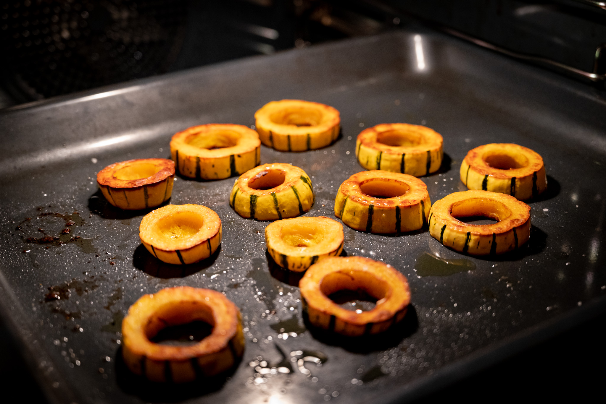
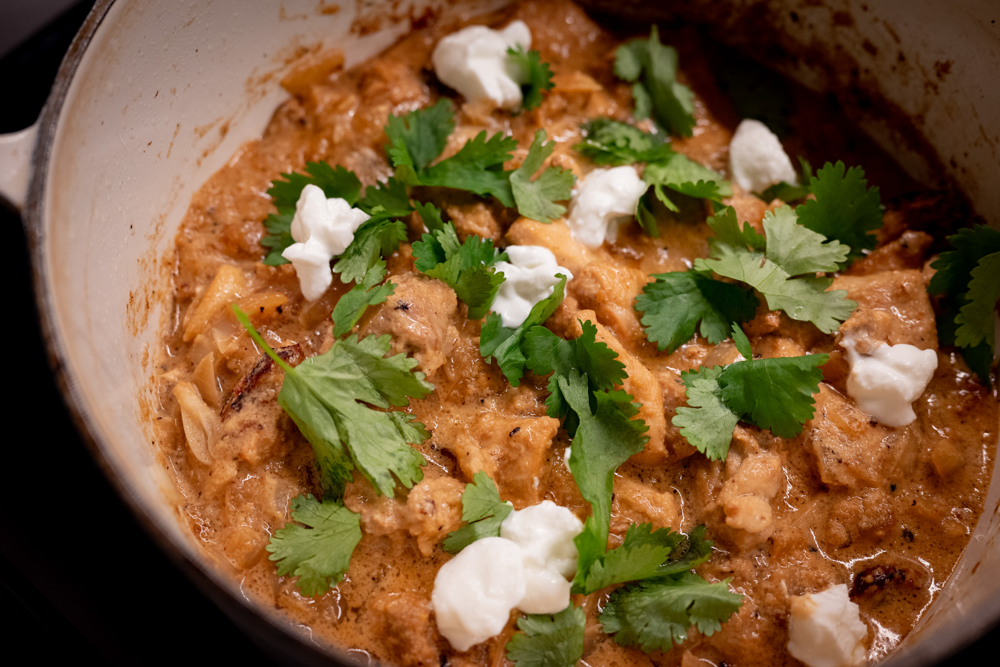
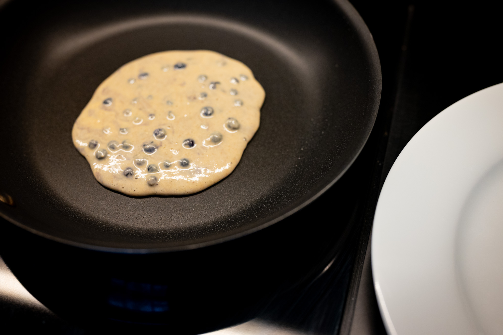
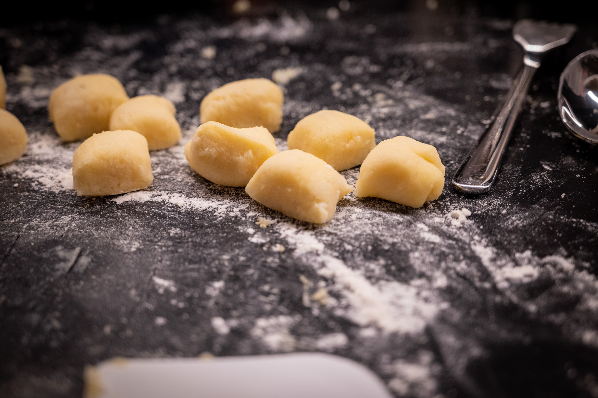
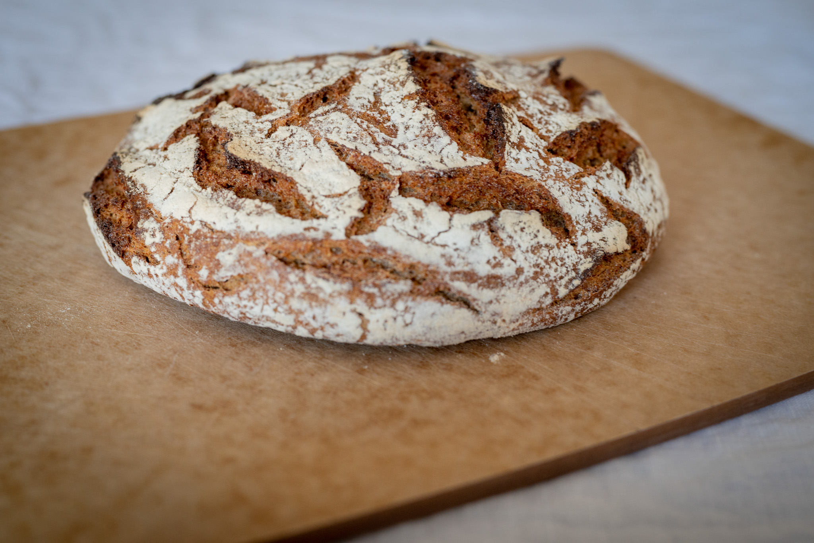

With painful slowness, my kitchen is coming together at last. My architects and I brought in a new crew to deal with the points of finesse the previous contractor couldn't quite get right. My dishwasher finally stays open without holding the door with my foot, and my vent hood is in.

It's still not quite done. There are a few details like the more substantial handles for my refrigerator and freezer that needed to be selected, ordered, and shipped before they can be installed.

In the meantime, I've been continuing to tinker to the extent possible.

Once the vent hood went in, I took the opportunity to [stir fry](/recipes/lemongrass-chicken) for the first time in almost a year. Here again I'm still getting used to my new kitchen. The power of my new cooktop is really something else. To the extent that even when doing a stir fry, I couldn't use the highest power level without risking burning the food. Perhaps next month when I've got a better handle on it, I'll post some photos. Scrambling around so much trying to figure out my new environment, I didn't have the presence of mind to get out my camera.

I got somewhat frustrated struggling with the tourte auvergnate. It's a very finicky loaf of bread with so little gluten to support itself. I need to find a new source for rye flour as well. For my usual occasional needs, I haven't minded paying the absurd price my local Whole Foods exacts for a dinky one-pound bag. When you need most of the $5 bag for one loaf of bread that probably won't quite work, it feels wrong.

Faced with that, I started exploring the world of more traditional sourdough breads. Nothing was photogenic enough to share, though I got the flavor right on my first try. I suspect I need to actually buy a set of proving baskets and perhaps be a little more patient.

I was in the mood for a chicken korma a few weeks ago, and so set about making that for the first time. I had never given the dish much thought. The process of making a sort of cashew milk to thicken and give body to the sauce was interesting, and not something I'd ever tried or done before.

When push came to shove on Pancake Day, I was in the mood for my go-to blueberry and tahini pancakes. When you're hungry first thing in the morning, it's not the time to do a bunch of research for the best way to make a crêpe batter. The American-style batter is almost reflexive to put together at this point. It's almost a subconscious act.

Last but not least of interest, I had some fun meditatively rolling, cutting, and shaping gnocchi. That was more pure execution than discovery. Since getting the [Serious Eats primer](https://www.seriouseats.com/light-tender-potato-gnocchi-recipe) on gnocchi that had the insight to bake the potatoes --- driving out more moisture --- I've never had any issues with the dumplings disintegrating during cooking. I did try doing a baked version with a tomato sauce and cheese, which was nice in a comfort food sort of way.

Looking to the month ahead, I'm hoping for calmness. It should be possible to finally wrap up my apparently never-ending renovation, letting me finally clean everything up and finalize the organization scheme in my new space. The one-year anniversary of the project starting is only a few weeks away.

My travel plans for March didn't quite work out with my schedule the way I had hoped. Stay tuned. I'd like to fit a bit of an adventure in for the spring assuming I can make the details work.

In the kitchen, I want to keep pushing on my [tourte auvergnate](https://www.youtube.com/watch?v=1fHzga2ZL9o) project. It's such a nice loaf of bread done well, and it's something I truly cannot find here.

*A professionally-made tourte auvergnate from a favorite bakery in Paris*

With Easter approaching, I have to do my annual [hot cross bun](https://www.theguardian.com/lifeandstyle/wordofmouth/2011/apr/21/cook-perfect-hot-cross-buns) bake. Making those for Good Friday has become a fun tradition. I love the burst of citrus and sweetness of dried fruit. And this also feels like a good opportunity to revisit the similar [cardamom bun concept](https://www.theguardian.com/food/2022/apr/13/how-to-make-the-perfect-cardamom-buns-recipe-felicity-cloake) that has its origins in Sweden.

I'm hoping that I can find good asparagus again this year. It's so much better when it's in-season than the thin, bland product you get imported from South America most of the year. There are so many nice ways to do that. I love an [anchovy dressing](https://www.americastestkitchen.com/cooksillustrated/recipes/869-asparagus-and-country-bread-with-anchovy-dressing) or serving them with a nice [poached egg and sauce](https://www.marieclaire.fr/cuisine/mouillettes-d-asperges-vertes-sauce-hollandaise,1194415.asp). 

This also makes me think of [poached eggs meurette](https://philippe-etchebest.com/les-oeufs-poches-meurette/), which makes a nice veggie lunch or dinner.

There's probably scope to keep mastering my new kitchen appliances. As anyone who's been reading this for the last few years knows, I did an exploration of [fried rice](https://www.youtube.com/watch?v=owUiKyx4chI) during the 2020 and 2021 lockdowns. I feel like this could be a fun way to explore the power of my new cooktop.
