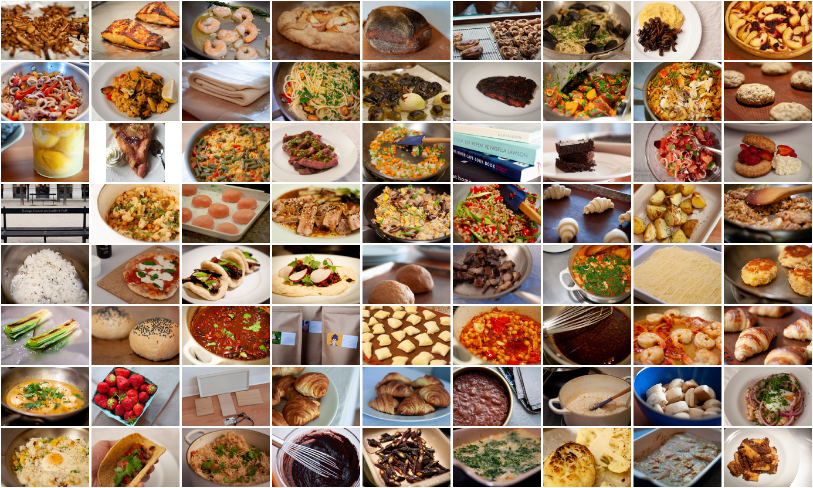
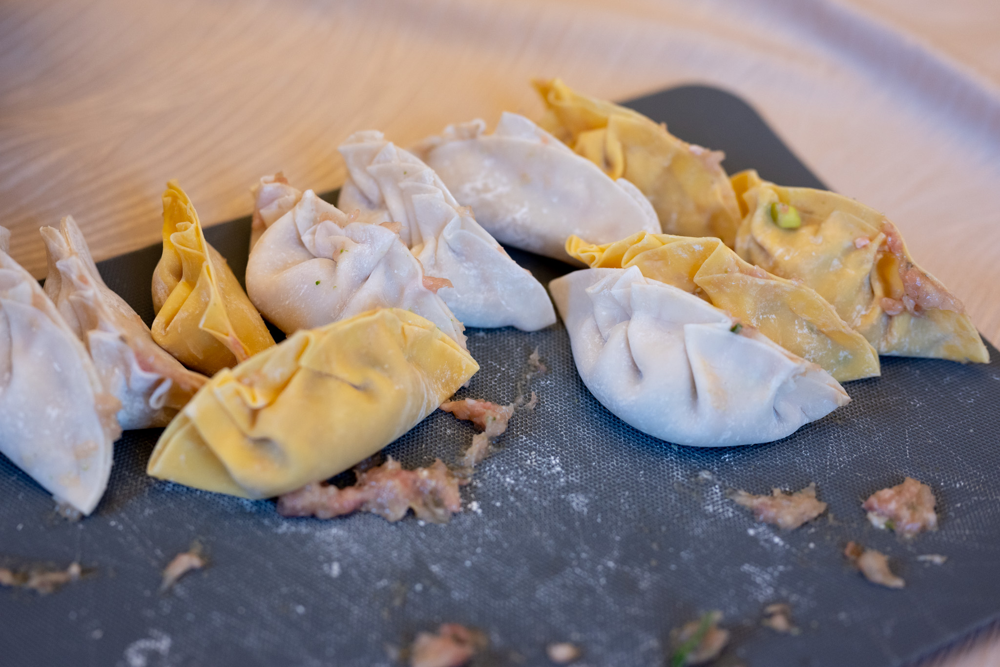
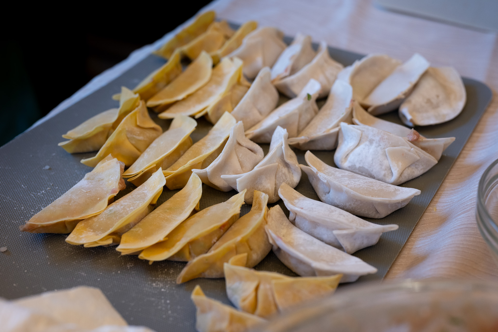
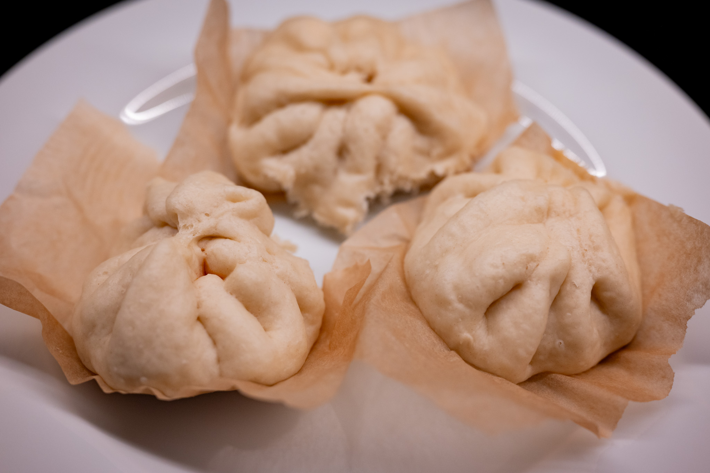
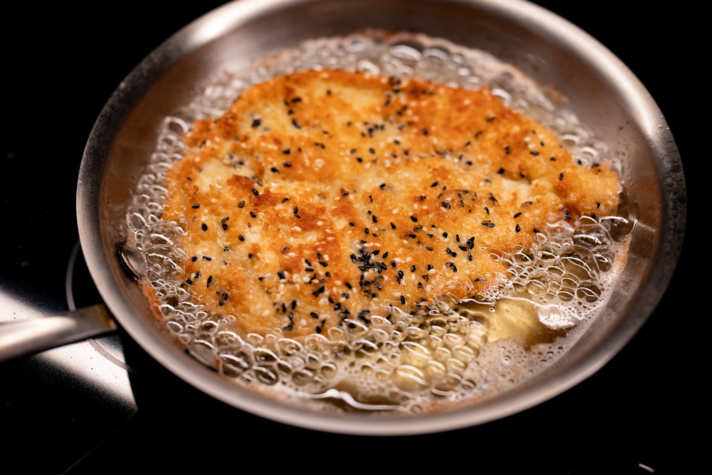
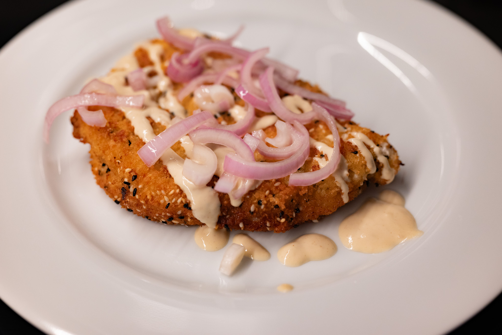
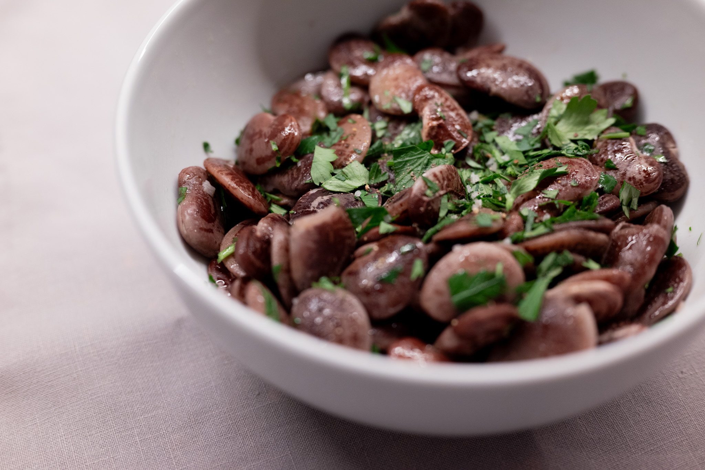
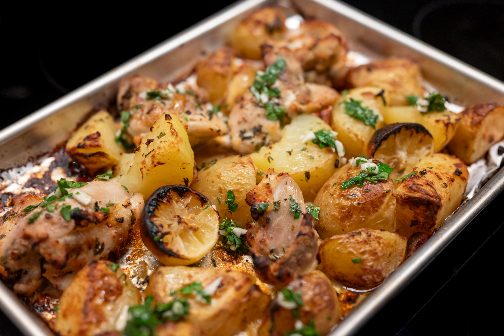
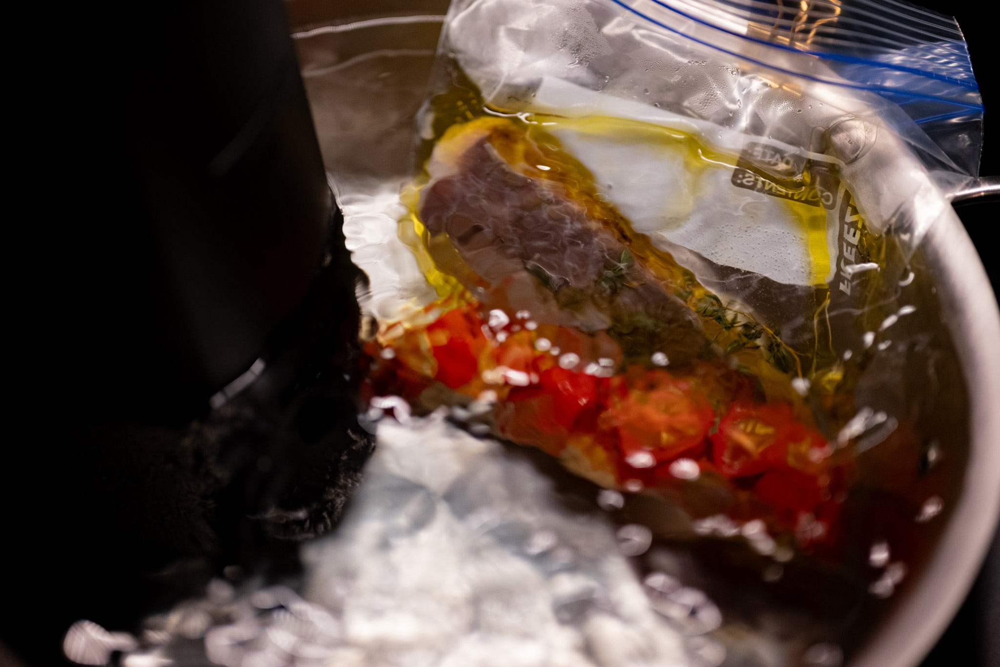
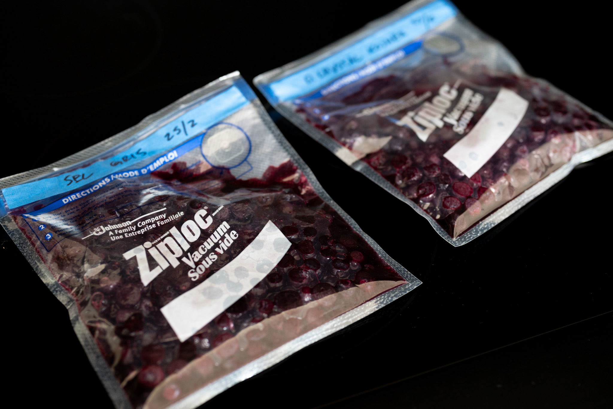

Longtime readers may recall that the genesis for this whole project was the weekly newsletter that I started in early 2020 at the height of the COVID-19 confinements. I used a service called TinyLetter to write and mail that out, and, much to my chagrin, they've decided to shut TinyLetter down.

With that in mind, I took steps to get all my data out. It would be a shame to lose that pandemic time capsule. One day I'd like to spend the time laboriously converting the export to something this system supports, so it's easy to go back and explore that. In the meantime, for the more technically savvy among you, I've dropped the [archive in the GitHub project](https://github.com/jkibe/recipes/tree/main/archive) that hosts all this, if you're feeling nostalgic.

In related news, I finally got the shelving for the upper cabinets in my new kitchen. I'm still figuring out how to organize everything. Perhaps more on that later.

Moving back matters alimentary, a few issues ago, I embarked on a bit of an experiment with my go-to salt for day-to-day use. I thought it might be fun to try substituting coarse sea salt with my usual Diamond Crystal kosher salt.

While I'm a big fan of coarse sea salt --- I've been using _sel gris de Gurérande_ --- it really isn't as good for everyday seasoning. It clumps, which makes it hard to dose out with your fingers. Because of the high variation in particle size, it doesn't completely dissolve if you put it in something like a cake batter either. It's nice to have on hand, but my salt dish is now filled with Diamond Crystal again.

The Lunar New Year celebration continued with a dumpling making gathering another friend hosted. From the cooking perspective, it was a humbling experience for me. Not that I was expecting to waltz in and pleat my dumplings perfectly, but I was surprised at the difficulty in neatly pleating the dumplings and not having the filling get squished out.

Others were a bit more practiced, and, unsurprisingly, did a better job.

Either way, they were pretty tasty.

I tried to redeem myself at home by doing a batch of bao. I had some leftover chorizo, and so wound up using that to make the filling rather than something more traditional. I doped that with some scallions to keep it on-theme. I'd definitely recommend it. While my bao pleating probably still isn't good enough to get me a job in a fine dining kitchen, I'm definitely further along the learning curve.

As planned, I gave the Ottolenghi tahini chicken schnitzel a try. It took a couple tries before I felt good tossing it together, to make sure I was putting the right pieces in the right places for the coating. I don't know it was the kind of life-changing experience I was hoping. It's a good schnitzel with a nice twist through the tahini and sesame seeds. Next time, I'm probably going to omit or adjust the amount mustard in the dressing. For my money, it overpowers other components. I wanted a more tahini-forward sauce.

I hadn't realized I was almost out of white sesame seeds, so I made up the difference with my store of black sesame seeds, which gave it an interesting visual twist. Purely from a visual perspective, I should have sliced the shallots into continuous rounds, rather than halving each one first. Such is my reflex, it happened unthinkingly. Not that it impacts the flavor much.

Likewise, I continued chipping away at my huge stash of beans. I can't say enough good things about keeping it simple: I did one batch with nothing more than excellent olive oil, sea salt, and some herbs.

I gave a [Kenji Lopez-Alt video-recipe](https://www.youtube.com/watch?v=3b4cyBEvUPE) for a simple chicken and roast potato tray bake a try. It worked really well. I don't know there's anything revolutionary in it, but that doesn't take away from a good concept. I'd agree with his assessment the recipe has great bang for your buck. The sauce-marinade gives everything a nice citrus kick, and everything crisps up really nicely.

I also did some experimentation with oil poaching fish _sous vide_. Poaching fish in oil is great for flavor, but always feels incredibly wasteful. Doing it the traditional way in a pan requires a lot of oil that can't really be reused. Doing it _sous vide_ means you need a fraction of the oil.

It was reasonably successful. I think it still needs some work. Fish is tricky because, unlike, say, beef, it's cooked at a temperature higher than the target. More finesse is required and you can't cook that long. So the tomatoes I tried to confit at the same time as a garnish didn't cook quite enough. They weren't in the bath long enough.

In chemistry corner, I've started a fun project to further explore lacto ferments.

Someone sent me some interesting research about the impact of different salts on the fermentation. Because there's concern around our sodium intake, people have been investigating what happens if you use other salts to ferment food. For instance replacing some of the NaCl (sodium chloride, or common table salt) with KCl (potassium chloride).

When you're doing a lacto ferment, a certain amount of salt is necessary to inhibit the growth of undesirable bacteria. But salts also inhibit the bacteria we do want and that makes the fermentation possible. The 2% NaCl I've been using is well-validated by researchers in terms of striking the balance between keeping your food safe while not slowing down the desired fermentation too much.

There's some evidence that these other salts, such as KCl, interact more favorably with the bacteria we want in a lacto ferment. That is, bad bacteria are still kept at safe levels, but there's less interference with the good bacteria, accelerating the fermentation.

So I set up a test with Diamond Crystal salt --- to a first approximation, pure NaCl --- against my huge stash of _sel gris_, which has much higher (though still fairly trace) quantities of other salts in a batch of blueberries.

I think I'd need to run the experiment a few more times with better measurements to feel confident about drawing conclusions. This initial test at least suggests the sea salt produces a more complex, nuanced product.

I'd also like to repeat this with different salts that may make the effects more pronounced. The paper that set off this thought used [a Finnish product called Pansuola](https://suomikauppa.fi/en/products/pan-suola-jodipitoinen-mineraalisuola-450g) that's closer to 30% KCl versus NaCl. If the original research is right, this should have a more pronounced effect on the fermentation dynamics, but may also impact flavor more. From what I've read KCl can taste off compared to the NaCl we're used to eating. It might also be a useful control against something like the _sel gris_ in that it's industrially produced, and thus won't have the variety of other trace minerals that may be contributing to a more nuanced, complex flavor.

Over in the pastry department, it's been a month of learning.

First, I had a bit of a failed experiment with an olive oil cake.

A few months ago, after years of skepticism, I finally tried making pancakes with a lumpy mix and was surprised that leaving the batter scruffy really does produce lighter, fluffier pancakes. The lumps all work themselves out when the pancakes cook, and the pockets of flour really do help give the pancakes lift. Given the similarities in the batter to my usual olive oil cake, I thought doing the same there might be a good idea.

In fact, it was a very bad idea. The surface of the cake developed strange spotting --- I'm guessing because the batter wasn't homogeneous, so the drier parts browned faster --- and it was noticeably less spongy than usual, in a bad way.

Fortunately it wasn't such a failure that I couldn't eat the cake. But the lesson seems clear: for an olive oil cake, lumps are bad. I'm not sure I understand why convective and radiant heat (versus the conductive heat in a frying pan on the cooktop) makes such a big difference. But then I'm not a mechanical engineer.

Riffing on the sesame theme, I tried doing a recipe I found for a black sesame and lemon cake. The batter was clearly a bit too thick, which didn't really impact the texture of the crumb, but did give it a slightly misshapen appearance on the outside. I suspect I should have either upped the amount of milk I used, or should have used a regular rather than thick Greek yogurt.

Looking forward to March-April, I'm very excited to have an excuse to make my annual batch of hot cross buns for Good Friday. I've been stashing away the zest of every lemon, lime, and orange for the last few weeks so I have enough to make at least a couple batches. I don't know what it is about the HXB that so seduces me, but they're really one of my favorite things.



I've also been seduced by the idea of, as the British would call it, a hedgehog slice.



Though it has to be said, I find myself straying away from really heavy desserts. I'm trying to find a way to do it without making something that looks so cloying.

On the more savory side, one of the YouTube channels I sometimes watched has started a new series about Roman-style pizza, which I've been experimenting with as well.



This has inspired me to get back into figuring out how I can make it successfully at home as well. Ideally, I'd find a way to jet off to Rome for a couple of weeks and try a dozen different places to really get a handle on what I'm trying to achieve. Alas, that wasn't possible, but I do have some experience with the genre.

Exploring recipes from people in Italy has given me some new clues as to what I might have been doing wrong. For starters, it seems clear that something got lost in translation. In Italian writing, people tend to call it pizza _in teglia_ ("pizza in a baking tray") rather than _al taglio_ ("pizza to size").



I'm hoping a few more attempts with this additional research will get me closer to what I'm hoping to achieve.

### What I'm Reading and Watching

* [A meditation](https://www.ft.com/content/83755db1-ef83-493b-9101-664510a8fea0) on the perfect soundtrack to your meal in the FT's _HTSI_

* [Entertaining the Danish way](https://www.nytimes.com/2024/02/15/t-magazine/malene-malling-copenhagen-dinner-party.html) in the _NYT Style Magazine_

* A fun take on the ascendancy of [Lotus biscuits](https://www.ft.com/content/b863779f-1afc-453e-946e-805d6cb2063c) in the _FT_

* My favorite restaurant and hotel guide, Le Fooding --- sadly only in France and Belgium --- has launched its new [kid-friendly reviews](https://lefooding.com/kids) page

* [Reflections](https://www.nytimes.com/2024/02/27/dining/chefs-state-of-the-restaurant-industry.html) on the restaurant industry in _The New York Times_

* [Evidence](https://www.nytimes.com/2024/03/05/dining/restaurant-minimum-wage-tipped-workers-dc.html) from a change in tipped worker rules in Washington and its impact

* In _The Guardian_, the [limitless possibilities](https://www.theguardian.com/lifeandstyle/2024/mar/08/tap-water-is-boring-so-they-invent-new-products-how-did-humble-h2o-become-such-big-business) of applying marketing to water

_[Subscribe](/subscribe) to get notified every month when new issues go out_
