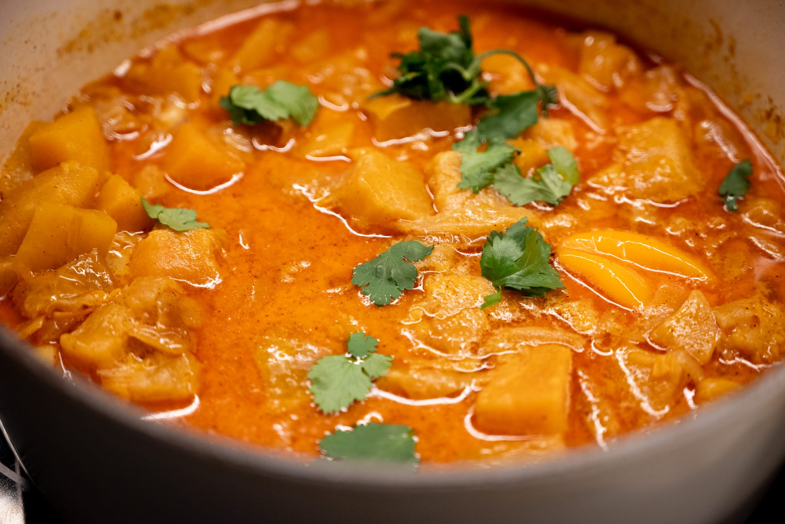
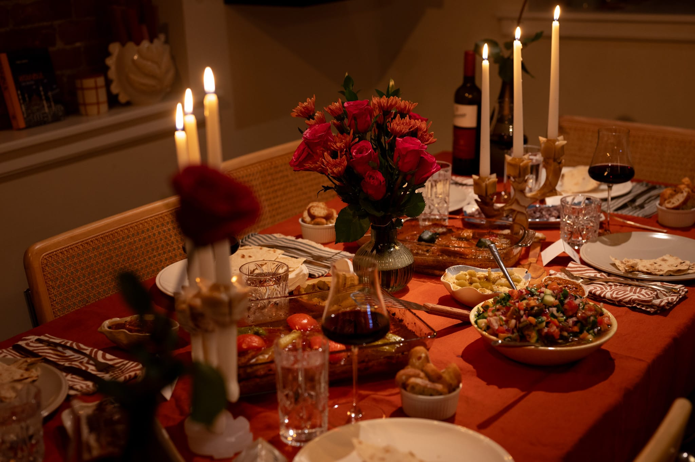

The weather is finally beginning to turn, though that's yet to reflect itself in the produce I can get my hands on in a meaningful way.

There has also been much discussion of food prices, as we continue to fight with inflation above the levels we've gotten used to in the last couple of decades.

As I wrote back then, it was a really interesting experience not really buying groceries for most of 2022 during my kitchen renovation. When the project finally (painfully) got far enough along that I could cook again, I was pretty shocked at how much more expensive it was to do my weekly shop.

During our recent and ongoing egg panic, I thought it was weird that I didn't really notice a dramatic increase in egg prices. I've definitely done a double-take now that the butter I buy costs almost $10 a pound, and have taken note that my preferred flour is much more expensive than it used to be.

Then I did a little research, and was shocked to learn that the typical person in the US eats over 280 eggs per year. Which seems like a lot to me.

Back off my political soapbox, in the basics corner, I spent a bit more time noodling with doing paella. What I make is always edible; I think I may need to finally spring for a true Spanish-style _paella_ or at least get a more conventional carbon steel pan. Using my trusty stainless frying pans, you're trapped in the bind that really crisping up the bottom doesn't produce a crispy bottom so much as more or less fusing a quarter of the rice to the pan.

More experimentally, I tried another recipe from _Comfort_. The butternut squash stew was good. I'm not sure it was substantial enough to be a serious main course. Though I cut more corners than I had intended to. The cilantro I'd bought for something else a few days earlier went off way too quickly, and I was only able to salvage a tiny bit for this stew. It turns out I didn't have any mustard seeds. And tamarind paste isn't as resistant to spoiling as I thought. As a side or even something with another bold veggie dish, I think it would work better.

I've kept trying to find applications for my wireless thermometer. Surprisingly, it's been most useful for cases where I'm not cooking so aggressively. It's been really handy while I'm warming up ingredients for baking, be that a batch of bread I'm warming up after proving in the refrigerator overnight, or getting the temperature of the butter "just right" after I take that out of the refrigerator for a batch of cookies. Having the wireless logging go directly to my iPad and smartphone --- rather than needing to run a fussy cable or remember to check the display of one of my thermometers --- makes it a lot easier.

Over in the pastry corner, I did a bit of interesting experimentation, though the first two lacked the visual pizzazz to grab a photo.

As mentioned last month, I wanted to find new ways to enjoy blood oranges while they're in season. I tried doing a Victoria sponge with blood oranges rather than orange-oranges. While it was hardly a failure, I wasn't bowled over either. The other ingredients in the cake overpower the blood orange-ness of the blood orange. It was too subtle.

Desperate for a sweet treat, I tried doing a batch of chocolate chunk shortbread with a weird mix of sugar: about a third standard sugar, and two thirds demerara sugar. Somehow I managed to run out of eggs, brown sugar, and plain sugar at the same time. So it was shortbread (no eggs required), and I had to use the sugar I had on hand.

It worked pretty well. Since I didn't have any eggs, I couldn't give them an egg wash and coat the outside, or give the tops a nice sheen.

More successfully, I did a batch of brioche to have something sweet around the house. It wasn't that remarkable, but it's hard to be disappointed with a well-made brioche. I did happen upon some sparkling sugar in a cabinet while I was clearing things out. It added a nice crunch and a little bit of visual pizzazz.

And I did put my blood orange obsession to good use with an olive oil cake. I used a ton of blood orange zest and the juice of an entire blood orange. That still wasn't quite blood orange-y enough for me, but it wasn't far off. It may even merit a recipe addendum.

Out of the house, I tried a new (to me) French-Vietnamese bakery. The black sesame croissant was a highlight. I don't know who would ever complain about Basque cheesecake either. It isn't quite up to the superlative standard of my favorite (more or less local) place, Michette or other top-tier places like Boulangerie Aristide, which I discovered in Annecy last year. But I'd give it a recommendation.

A friend invited me for dinner, and I managed to remember my serious camera. So I grabbed a few photos of the spread they put together. It was a sort of Ramadan-inspired dinner, and everything was very tasty. Everything was a fun variation on something I'd had before. That fun mix of familiar and new. The host made a family recipe for kebabs, with a couple of sauces, including a family hummus recipe.

For the month to come, I'm looking forward to at least a little more fresh, spring-season produce. It really seems like there should be more green in the photos for the last month, and it's decidedly beige. Or perhaps I don't think there's much point in taking photos when I make brussels sprouts.

As usual, I'll begin keeping my eyes peeled for local in-season asparagus. It's one of those things like strawberries that are so, so much better when you can get it in-season.

Past evidence suggests that this is wishful thinking, and (at least here in the Northeastern US) that's more likely to happen for the April-May issue. But I don't totally understand how the asparagus season in New Jersey works, so I try to work opportunistically in my annual asparagus hunt.

Easter falls late in April this year, so there are still a few more weeks before it's time to make hot cross buns for Good Friday. But I always love a baked good, and I saw a recipe in [one of my usual places](https://www.theguardian.com/food/2025/jan/31/scandinavian-cardamom-buns-recipe-richard-hart) for cardamom buns --- a favorite flavor.

I also need to follow through and actually do the chocolate chestnut cake from FRG that I mentioned in the last issue.

Unrelated to any seasonality, Felicity Cloake did a recipe for her "How to Make the Perfect…" series on scallion pancakes. I don't know that I'll necessarily use her recipe, but it was another bit of inspiration to get that on one of my menus for the next month.

Speaking of Felicity Cloake, she also introduced me to Scribehound, where she's part of the team writing for their food section. It's a paid service, so it will have to justify itself to me. But it seemed worth spending £1 for a trial subscription. There are a bunch of other people I think do good food writing, including Noor Murad (formerly of the Ottolenghi team), Bee Wilson (of many excellent books such as _Consider the Fork_), and Itamar Srulovich (of Honey and Co). We'll see what happens once the service officially launches on the 1st of April.

Last but not least, I'll likely be spending some time in one of the great food cities in the US. I don't know how much latitude I'll have to try something new or return to an old favorite, but it should offer at least a little scope to try interesting food.

### What I'm Reading and Watching

* Alphaville digs deeper on the UK government's [wine cellar](https://www.ft.com/content/23f15437-8bb4-47dd-a042-f847b2c73e1b)

* More on [the dark side](https://www.theguardian.com/food/2025/feb/27/restaurant-culture) of high-end restaurant kitchens

* The [social dynamics](https://www.nytimes.com/2025/03/08/nyregion/harlem-dinner-parties-nyc-chefs-alexander-smalls.html) of the dinner party

* Food critic Jay Rayner has taken over at the FT as its [new food critic](https://www.ft.com/content/e184e9a4-d653-41ff-9fd5-c9ddc0064e00)

* The team behind _No Such Thing as a Fish_ have a new podcast in the family on food, [_Lunchbox Envy_](https://www.qi.com/lunchbox)
