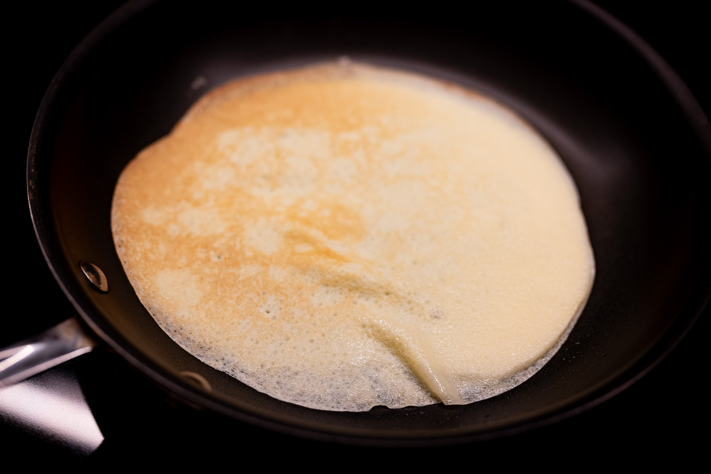
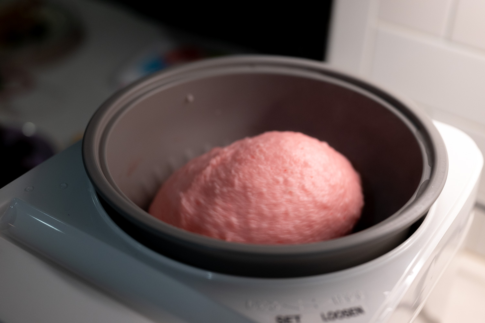
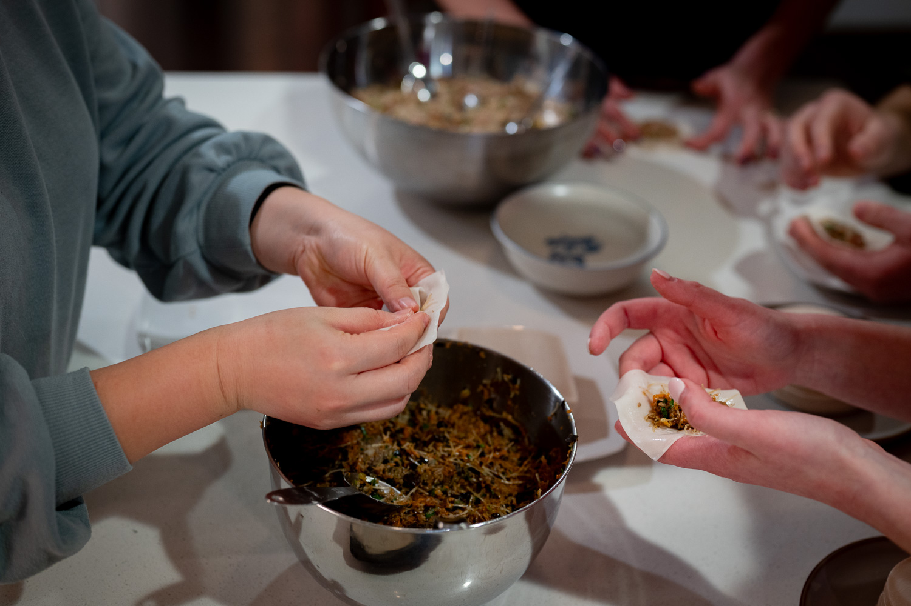
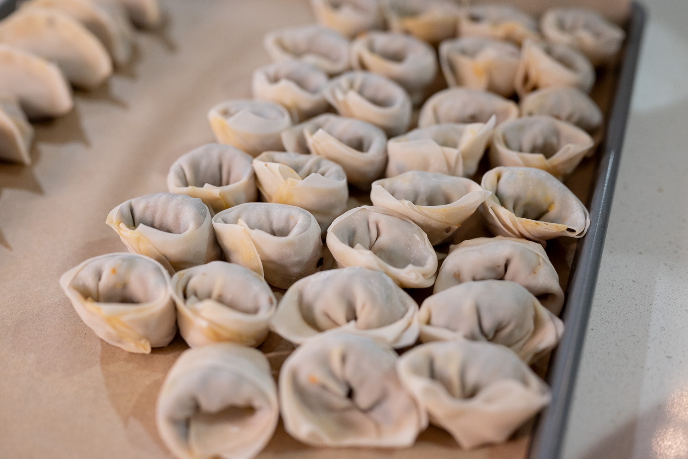
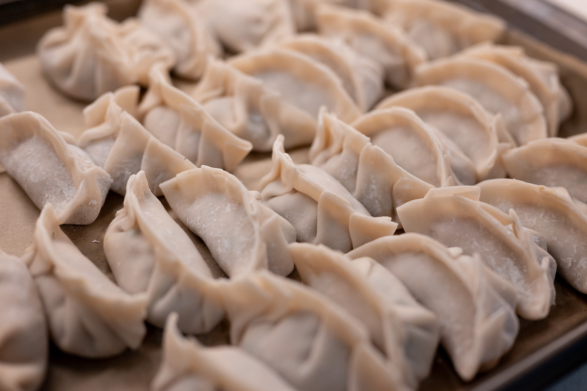
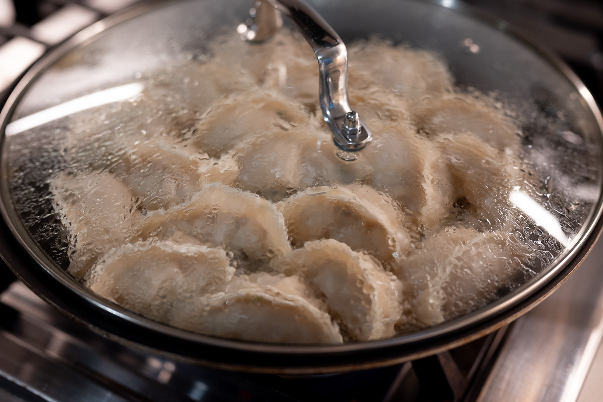
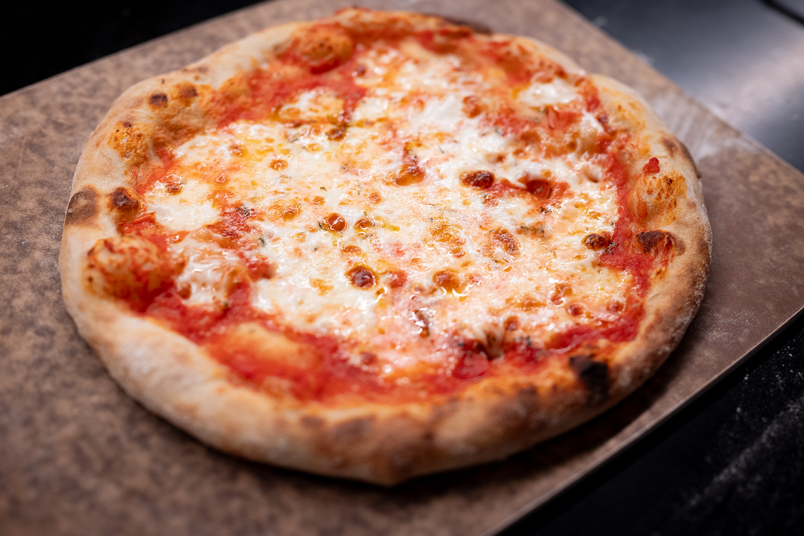
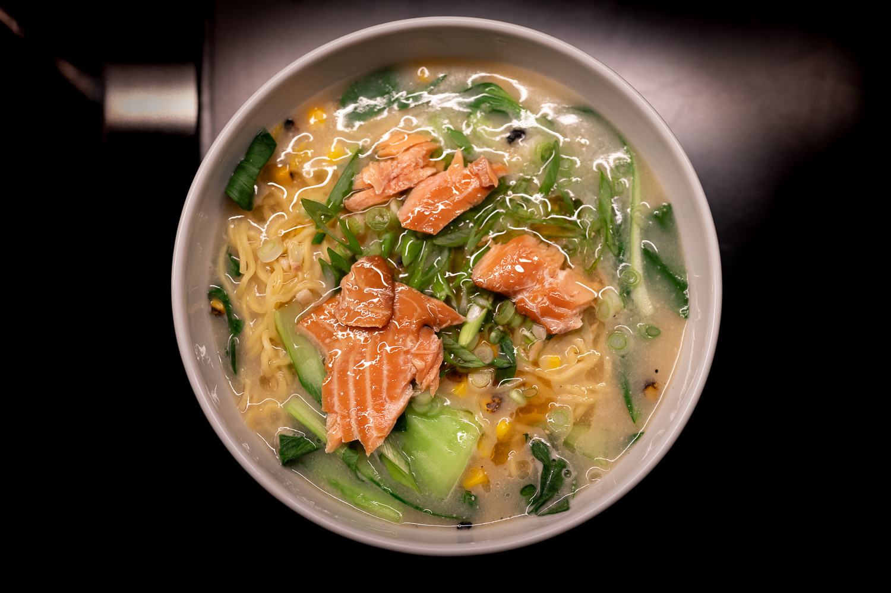
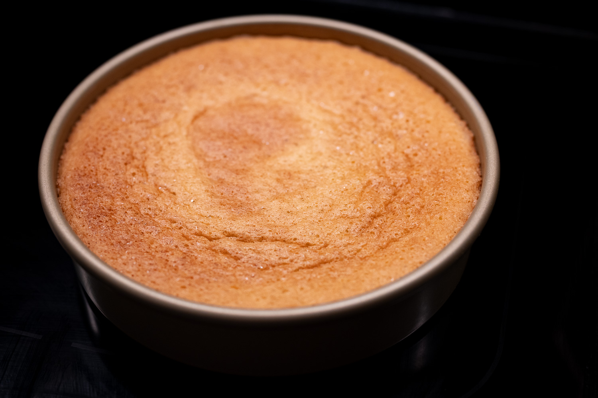

While I'm not especially religious, I find the period of Lent does provide a certain rhythm to the winter-spring seasonal transition. In many traditions, the day before Ash Wednesday is a feast day. People in the US probably know "mardi gras" from the French-Catholic culture of New Orleans and Louisiana. I tend to think of it more as Shrove Tuesday, Pancake Day, or Le Chandeleur.

Which is to say: I had a good excuse to make some crêpes.

Despite making more US-style pancakes many weekends, I had never made crêpes at home before.

I leaned on a formula from one of my favorite blogs, _Je Pense Donc Je Cuis_. Flavor-wise, my last-minute decision (and a very stubborn container of vanilla extract) meant that I had neither fruit liqueur nor vanilla extract on hand to give the batter a boost. My judgement in terms of batter per pancake and when to flip need work, as does my flipping technique.

Trying to do them in a frying pan made me appreciate why crêpe restaurants use a pan or griddle with no sides. It would've been a lot easier to manipulate the crêpes without having to navigate a spatula around the walls of the pan.

Even so, it's hard to really go wrong with a crêpe. They weren't bad.

Drawing on a different set of traditions, I had an opportunity to continue iterating on my mochi skills at a Lunar New Year event. I'm getting the hang of it. The batch I did for the group was still a bit too wet for my liking. I've concluded that the extra dash of water maybe isn't doing as much as I think, and the real trick is getting aggressive with helping the machine to get all the rice to amalgamate.

For this batch, I got my hands on some gel-based food coloring. The dosage still wasn't quite right --- we were aiming more for red than pink --- but much better than the last batch.

I got another tutorial helping the group make what must have been at least 100 dumplings. I'm a long way from mastery, but I feel like at least one of the techniques has helped me get a bit more grounding.

Trying to take advantage of the ongoing winter weather, I revived my experimentation with pizza dough _au levain_. I'm not quite at the point of going through the financial and maintenance headache of getting a digital pH meter and logging everything, but it really is very temperamental in a way that making loaves of bread with a sourdough starter is not.

One of the batches, though, I was pretty pleased with, at least dough-wise. For uninteresting reasons, I couldn't get my hands on anything better than grocery store part-skim mozzarella, which gave the pizza the look that reminds me of that "second meal" they serve on long flights.

Something possessed me to do ramen at home as well. I'm not quite at the point of making my own noodles: I picked up some pre-made noodles at H Mart. I did, however, make my own dashi to do miso ramen, and it was a great excuse to use up various bits and bobs from a bit of leftover baby bok choy to some tinned fish I needed an application for.

In the pastry department, I felt like a break from buttery desserts, and did another olive oil cake. This time I had more foresight, and trekked out to replenish my supply of orange blossom water. Hence: orange blossom water olive oil cake.

I still haven't quite nailed the bake time and temperature. I really love the ooey-gooey texture from slightly under-baking. This one was a shade too under in the center and still way too over (a recurring problem) along the edges. This may be an impossible circle to square without getting ridiculous. I'll keep tinkering.

At another point, I was in the mood for something chocolate-y, but then realized I didn't have any chocolate, and couldn't quite bring myself to leave the house to restock. After a deep browse of the cookbook shelf, I rediscovered a great recipe I haven't made in years for a chocolate rye cake, which helpfully only uses cocoa powder and other ingredients I had on hand.

It's a great little cake, and incidentally gluten-free. 

The month presented a few unexpected opportunities more to try and taste than necessarily to cook. A friend brought me a bar of Duabi chocolate from Dubai. I'd never had it before, and it tickled me that I was having the real deal. It's an interesting flavor profile. But I couldn't help thinking of Claire Saffitz's videos where she re-creates famous foods. The Duabi chocolate would've been better with a more intense pistachio cream and a better-tempered chocolate shell.

Doing some grocery shopping, I accidentally bought a $40 bottle of wine. Apparently I misread the label, and when the person checking me out scanned it, I didn't want to lose face or hold up the (very long) line over $20 more than I was planning to spend. Obviously this wasn't a scientific test, but I thought it was noticeably nicer.

For the month to come, the most obvious item on the list is a batch of hot cross buns for Good Friday. Like my dose of mochi for New Year, hot cross buns have become one of my alimentary rituals for the arrival of spring.

Chris Young, of my over-engineered wireless probe thermometer, had a fun video exploring the application of emulsifiers to foam stability. While his main motivating case was the chocolate (or really any) soufflé, I was most intrigued by the chocolate Chantilly he did in the last part of the video.



Chatting pasta with someone, I was reminded that I need to try recreating the squash gnocchi from a restaurant that I tried in Portland at Christmas.

### What I'm Reading and Watching

* As if the tension between diners and hospitality staff couldn't get any worse, it's now easier than ever to [subtly record what's happening](https://www.nytimes.com/2026/02/16/dining/meta-ray-ban-glasses-restaurants.html) with the cameras available in many sets of high-tech glasses

* Contemplating [the value](https://www.nytimes.com/2026/02/16/t-magazine/chicken-rising-prices-restaurants.html) of a well-prepared chicken dish

* The hunt for [dark breakfast](https://moultano.wordpress.com/2026/02/22/the-hunt-for-dark-breakfast/)

* Matt Parker contemplates the [bold claims made](https://www.youtube.com/watch?v=CYjD9cpxT18) by a breakfast cereal that the sphere is the optimal shape for sugar delivery

* Behind the high-minded food, less pleasant [behind the scenes at Noma](https://www.nytimes.com/2026/03/07/dining/rene-redzepi-noma-abuse-allegations.html)

_[Subscribe](/subscribe) to get notified every month when new issues go out_

