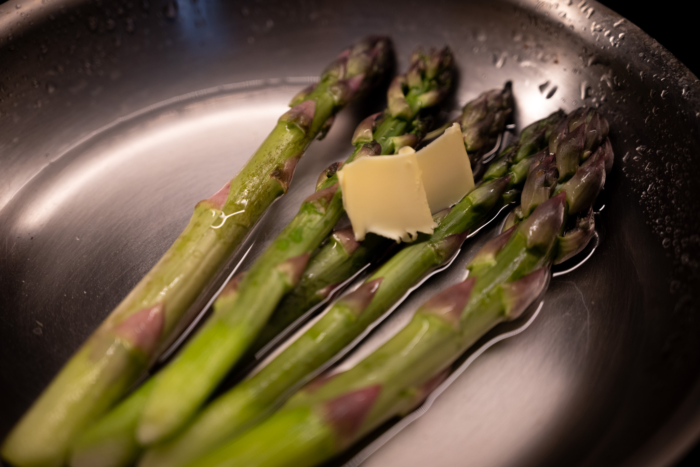
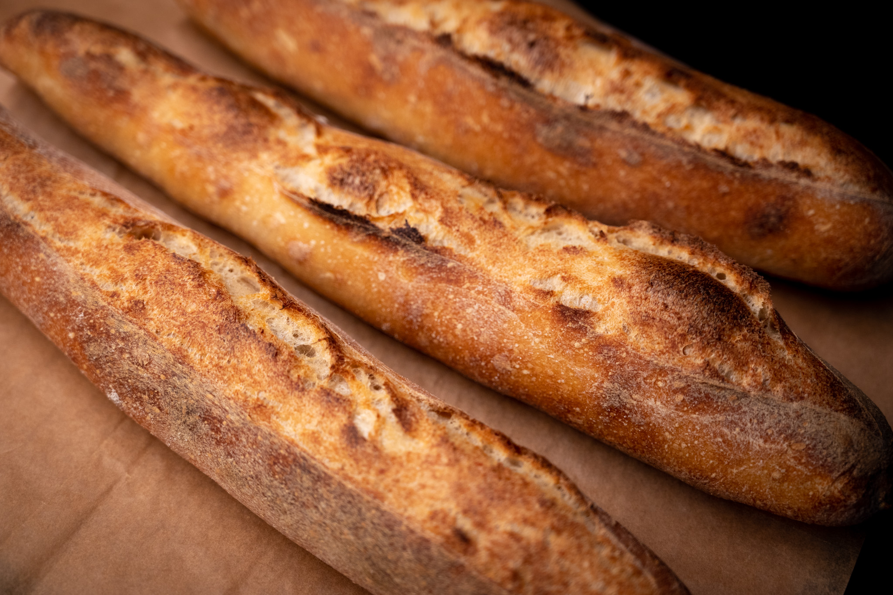
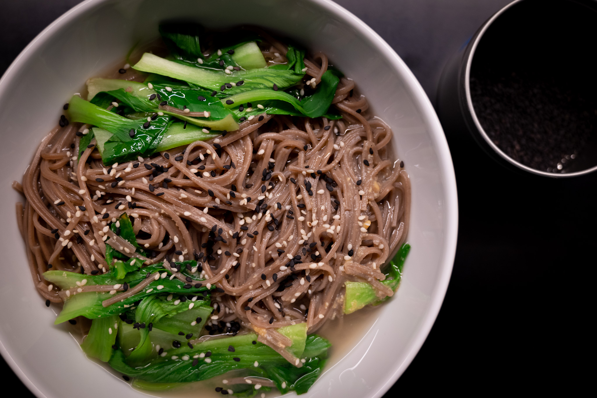
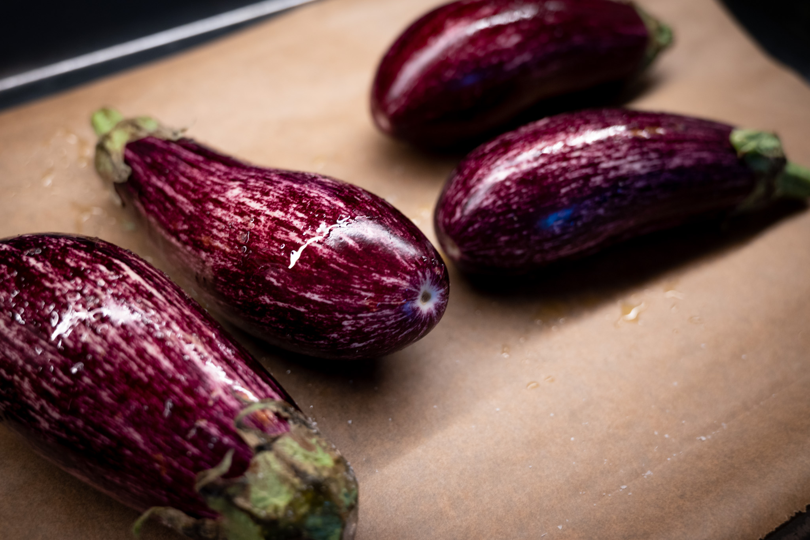
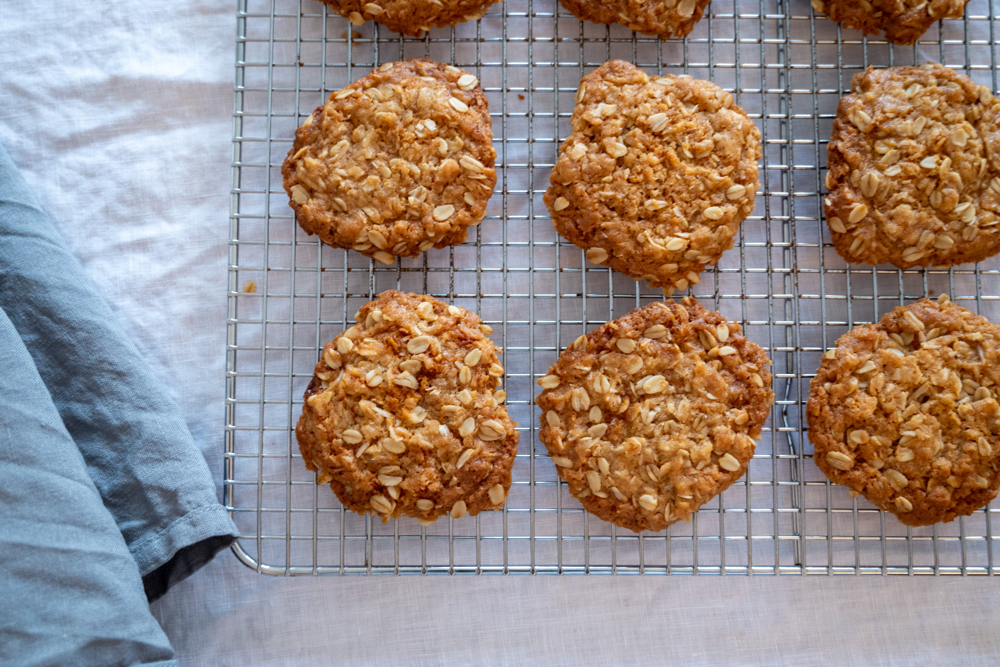
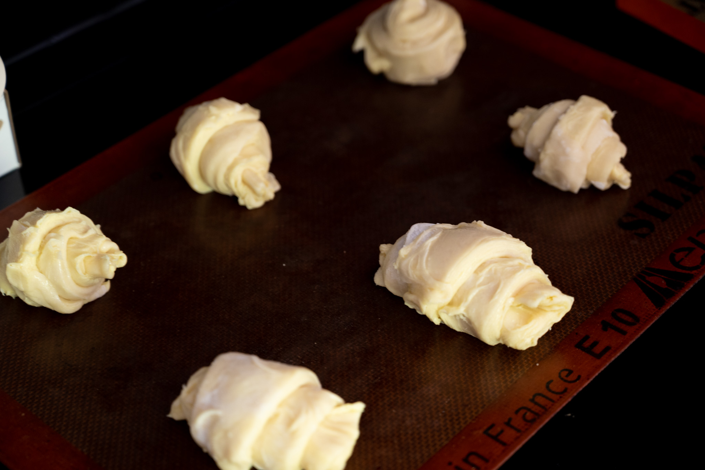
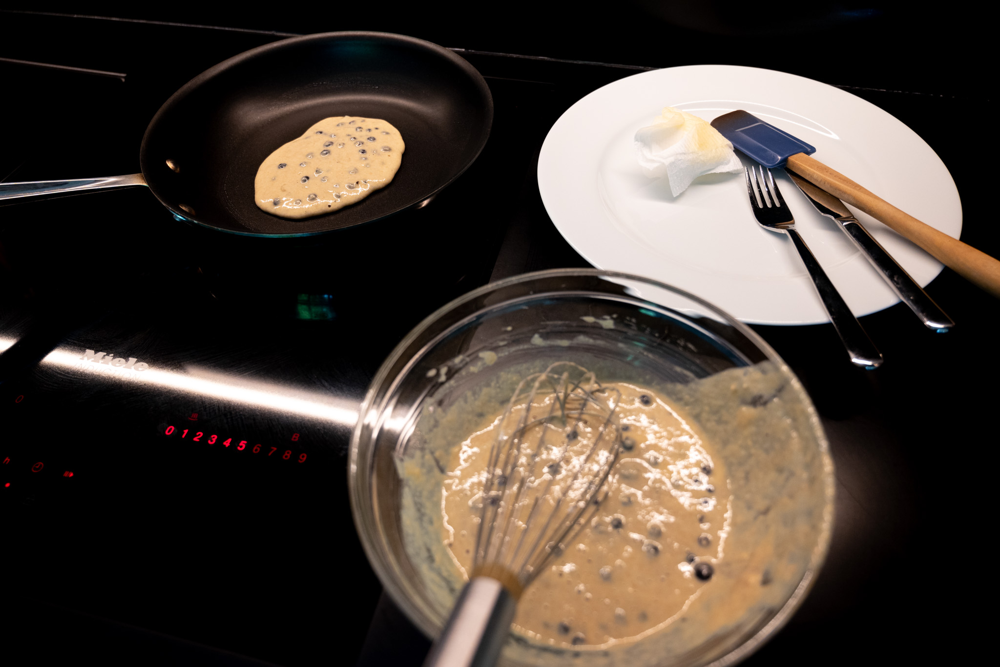
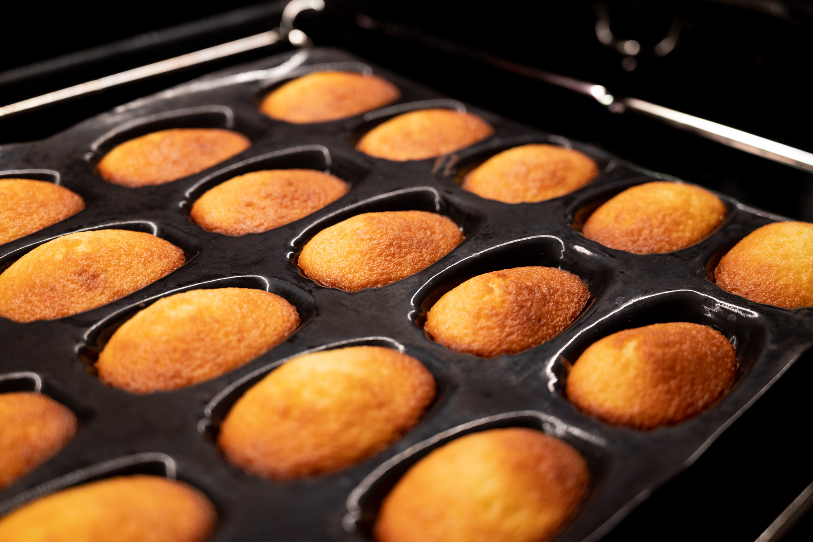

At last, I feel like I've really settled back into a groove in the kitchen.

My patience was rewarded, at least with respect to asparagus. I usually think of it as an early-spring vegetable. It was frustrating and disappointing to see the imports from [Peru](https://apps.fas.usda.gov/newgainapi/api/Report/DownloadReportByFileName?fileName=Peru’s+Asparagus+Production+Remains+Strong_Lima_Peru_7-21-2017.pdf) week after week. And then, with no fanfare or promotion on the part of my regular sources, they had the New Jersey asparagus, which I greedily bought.

I did most of it relatively simply. Following [Alain Passard's weekly videos in _Le Point_](https://www.lepoint.fr/invites-du-point/alain-passard/) when he was doing that a few years ago imprinted one of his techniques in my head. It's something between blanching, braising, and steaming that's hard to describe. You put the vegetables in a shallow pan with a little bit of water and a small hunk of great salted butter. (Isigny Ste Mere butter is relatively easy to find in the US, and it's worth every penny.) Then as the water evaporates away, you've cooked the vegetables just enough they're soft and vibrant, but still have some bite. And you're left with a sort of buttery, vegetal glaze-reduction that acts as a sauce.

I've been trying to recreate a cold soba noodle salad from a favorite Asian fusion restaurant. Perhaps subconsciously trying to prepare for the summer heat. I don't know that I've gotten that salad quite right. But I did buy a lot of soba noodes, and had some fun playing with those in soups and with different Japanese sauces. After my paella experience earlier in the year I've been returning to making _dashi_ (and other flavorful broths and stocks), which makes a great foundation for a soba noodle soup.

In my ongoing Ottolenghi obsession, I tried doing an [aubergine recipe](https://www.youtube.com/watch?v=0ADn1W7XKd4) the test kitchen team shared recently. I couldn't find baby eggplant, so had to do a bit of adjusting. It was very good: incredibly rich, and the yogurt really cut through that richness. I'll confess, I didn't think the anchovies in the yogurt came together. I plan to dial them back a bit the next time I try this.

The yen for enchiladas struck a couple weeks ago, which gave me a chance to experiment there. With something like an enchilada where the protein is covered in sauce and cheese and fillings, I always feel like it's silly to use meat or poultry, with all the environmental impacts. This time, I did a mix of black beans, poblano peppers, onions, and cheese. It was pretty good. Not quite ready to commit to my GitHub collection, but I wasn't unhappy.

It's been a good month for baking.

In the same way I love Good Friday as an excuse to make [hot cross buns](/recipes/hot-cross-buns), I enjoy creating a feeling of solidarity with the people of Australia and New Zealand by making anzac biscuits around Anzac Day in late April. I didn't get the date particularly right this year, but I got it done. They're wonderfully easy to make and a nice treat.

On the croissant front, I really went all-in. I hosted a small workshop to show friends how to do PLF. This was the first time I'd done a laminated dough since my kitchen renovation, so I was a bit rusty. I think I gave my pupils a reasonable foundation. I wouldn't say we did the best job --- my fault as much as anyone's --- but the results were delicious.

I had some leftover proseco from that gathering, too, and did some pancakes with it the next morning. Using a bit of bubbly in place of about 20% of the milk adds a nice tang. It's an opportunity I always take when I can. There's no way I'd open a bottle solely for making more interesting pancakes.

As I may have mentioned in a previous post, I've been trying to make great madeleines now for at least a couple of decades. (Yes, _decades_.) I have a distinct memory trying a French-language recipe for the first time as a teenager before I really spoke French well, and doing a batch with yeast instead of baking powder. They were surprisingly not that bad.

In the past, mine have been either too dense or too light, and they never have the characteristic hump that I associate with a madeleine well-executed.

But as with so many other kitchen questions, the people of the Internet do not share my level of obsession. And so when you do a Google search for recipes, you get the usual suspects like The New York _Times_ and food bloggers who care more about style than substance.

Then a minor miracle happened. I found an amazing blog called [_Je pense donc je cuis_](https://jepensedoncjecuis.com). It has [a post](https://jepensedoncjecuis.com/2022/09/reussissez-des-madeleines-moelleuses-et-bossues-a-tous-les-coups.html) on my elusive shell-shaped cakes that attacks the question with a level of rigor I can only dream of. So iconic is the madeleine that some graduate students wrote a paper about the formation of the hump.

After a few attempts, there are green shoots. I'm getting one or two really great-looking cakes per batch. But there's some tinkering needed. Somewhere at the nexus of the oven temperature, the capacity of my mold, and the strength of US versus French baking powder. I'm still not getting the little peak I want on the back of each cake.

My madeleine quest took me off the path toward tourte auvergnate enlightenment. I really will come back to that in the month ahead! Doing croissants for the first time in ages also made me want to get back in that groove. If nothing else, I'd really like to grab some photos of the different steps to help illustrate my notes better for others.

Moving into June and the summer, I think of strawberries and peaches. Strawberries on something like a shortcake with softly whipped cream, or in an Eton mess with crumbled meringue. Peaches, of course, make me think of the mythical peach tart I had at an unassuming roadside restaurant outside Nice. Not that I've made that much progress of the nearly 10 years since I had that tart, but it was disappointing not to have my kitchen to give that a try again last summer.

As with the asparagus, much will depend on the produce I can get my hands on. There's the glorious clutch of weeks in the summer when I can consistently get locally grown strawberries that are consistently great. I'll admit I'm too lazy to figure out how to predict this. My vague memory tells me I probably have to wait for July or August.

In a distant future where I have a second home somewhere out in the middle of nowhere, I love the idea of having a fashionable outdoor pizza oven. Alas, I may have to content myself with something indoors or suburban. In either case, summer (or at least warm weather) says pizza to me.

_[Subscribe](/subscribe) to get notified every month when new issues go out_
