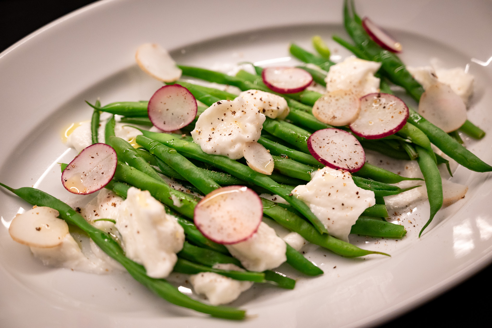
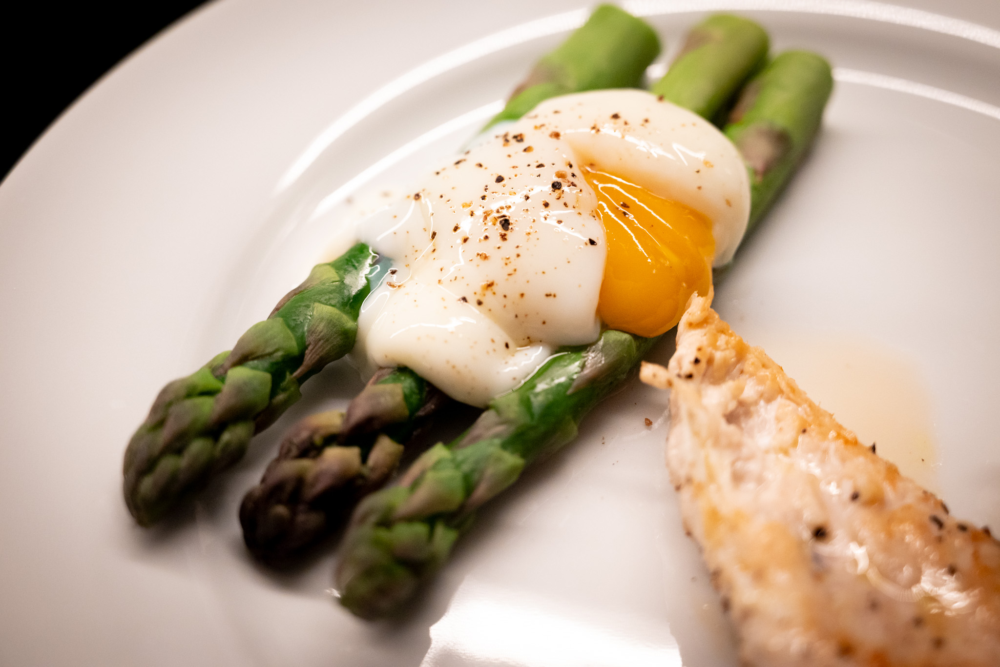
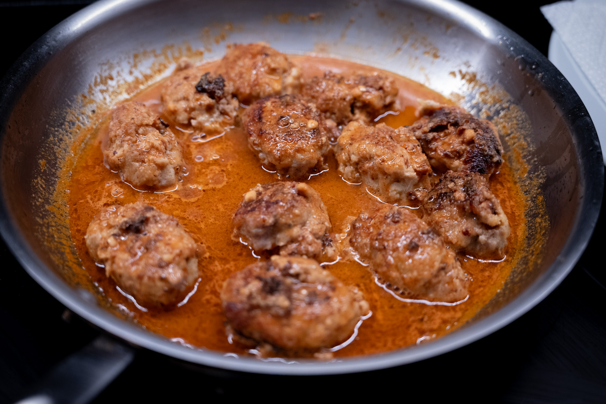
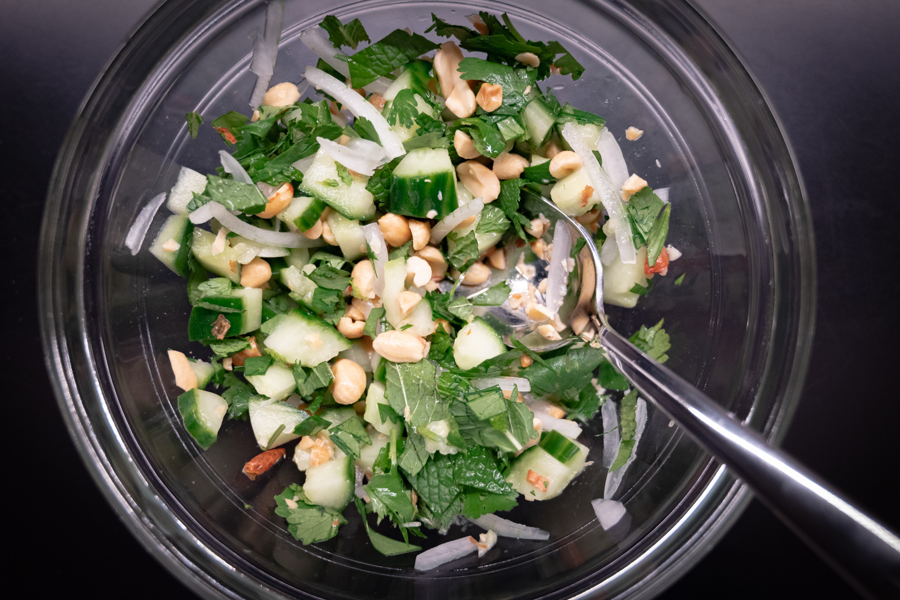
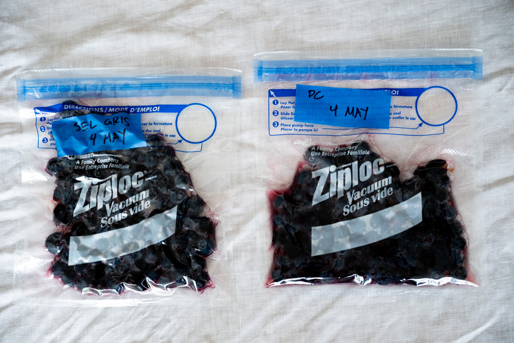
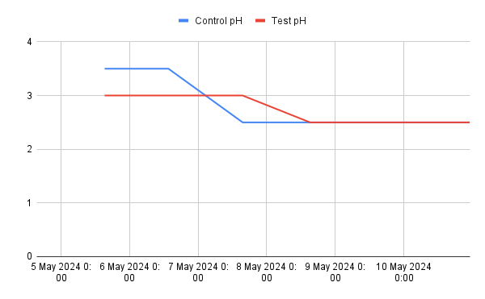
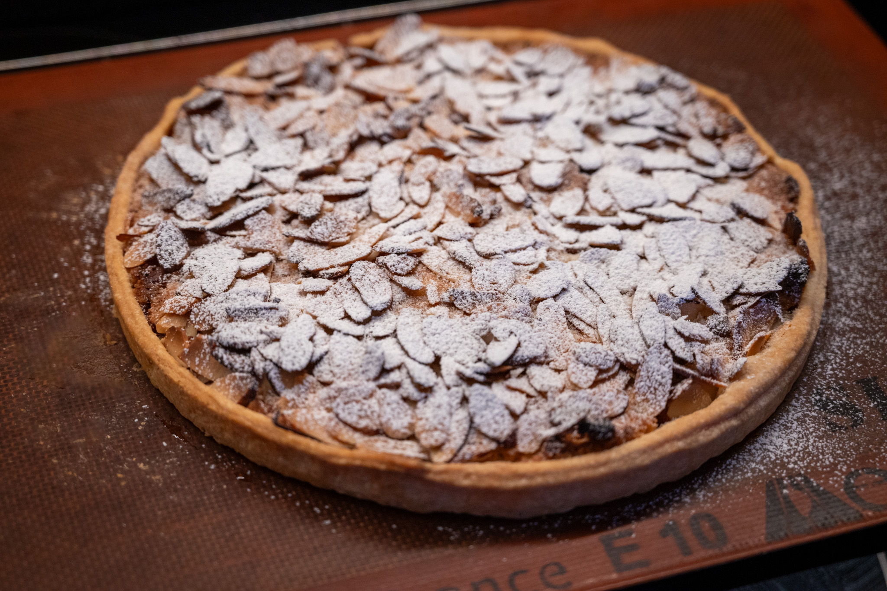
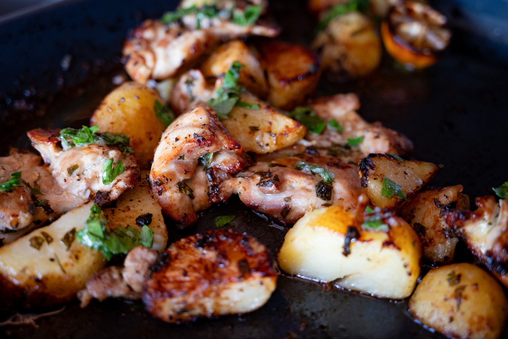
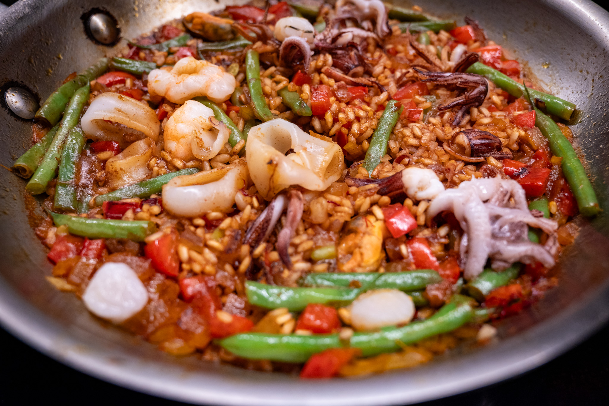

The weather finally decided to change into something truly springlike in the middle of April.

While they weren't exactly in season, I had a real hankering for haricots verts. It was a great opportunity to make a batch of garlic-forward toum.

In season, I finally found some of the good New Jersey asparagus. As I feel like I write every year, it's great, and I don't really have much more to say. I did nothing more than quickly blanch it, and served it with some 63 °C poached eggs.

Staying savory, I found the time to try out the promising recipe for Swedish-style meatballs with a peanut gravy from the Ottolenghi team. They were good, but I think I made some mistakes and the recipe needs some finesse. I followed the recipe to the letter, which left me with meatballs that --- with the benefit of hindsight --- were a little too wet, and thus didn't hold their shape. They were a bit rough around the edges visually. Similarly, I didn't think the gravy was peanut-forward enough.

Overall, though, there's promise. I'm going to have to try this again. It has all the elements of a classic Swedish meatballs with a twist. I especially liked the crunch of peanuts as a different kind of texture against the cucumber. There's also a part of me that wants to find a similar sort of North African take on the lingonberry garnish that's always served with meatballs in Sweden.

Speaking of funky fruit, I made another run at the lacto fermented blueberries as planned.

Last time there was pretty strong consensus one type of salt produced a nicer flavor than the other. I wanted to both see if I could reproduce this, but also get better measurement to see if I could get some insight into why there's a difference.

So I got a box of pH test strips. In my chemist friends' opinion, the increased precision I could get from a digital pH meter wasn't really worth the trouble. By tracking the acidity of the ferment over time, I thought I'd be able to get a better handle on what's going on.

This turned out to be a bit of a disaster.

Most notably, I generated [some discussion](https://chemistry.stackexchange.com/questions/182192/can-i-use-ph-test-papers-with-a-dye-rich-solution) and thinking when I realized that the dyes being extracted from the blueberries might be ruining the data from the pH test strips because they tint the test media. With the input from some chemist friends, I eventually got a protocol working.

Then for other reasons I don't totally understand, the ferment didn't really take. Two weeks in, the blueberries still didn't have the funk I was hoping for. A few days later, they started developing a problematic-looking white fuzz that made me toss the batch.

Another batch followed, and was more successful from a "did I produce something edible?" perspective. It was a little difficult to pin down what was going on because, despite developing a better protocol, the basic paper pH test strips that I bought weren't high enough resolution to really see what was going on. The mixture is relatively acidic to start (ca. pH 3), and the acidity plateaus only modestly lower (ca. pH 2.5) when the desired fermentation is very active and successful. With pH readings of only ±0.5, that makes it difficult to start to understand what's happening.

I'm now trying to decide if it's worth the hassle of getting a digital pH meter. As with so much else, the real cost is in the maintenance. A good instrument is only about $50. But the calibration buffers can cost just as much, and need to be regularly replenished for best results.

In the drinks department, I took a chance on a weird South African wine made from the cinsault grape. It's a very light, almost purple, red wine. It reminds me of a beaujolais, though this was (fortunately) a bit more grown up and sophisticated than the cheap and cheerful beaujolais nouveau that introduced me to that appellation however many years ago.

On a whim, I had another run at doing croissants. My consistency still needs some work. My pastry still can't quite rival the best bakeries I've tried. The results weren't bad, though. These were easily the best croissants I've made at home.

My hunch is that I've been way under-proving the croissants before they go into the oven, rather than there being a major issue with my lamination. (Though I think my laminating could definitely still be better.) For this batch, I put them into my oven (with the heating off) along with a big pan of boiling water to generate humidity and heat. They rose far more than I've ever seen, and, I think for the first time ever, my croissants had hints of the lightness and crispness that I've been missing.

I really need an expert to show me the rope at some point. Perhaps more on that later.

Continuing to explore the Via Carota cookbook, I had a run at adapting their recipe for an almond tart. It was a nice dessert when I was at the restaurant, though I gave it a bit of my own twist. First, rather than use a sweetened pastry shell, I used an unsweetened shortcrust pastry. The almond filling is pretty sweet and the more basic shortcrust pastry is also easier to work with. Second, I added a little interest using up some leftover raspberry jam as a filling. It was basically a _pasta frolla_, but I like to tell myself it's really a product of my creativity.

It was pretty successful. By the time the pastry shell was fully-baked, I was afraid the sliced almonds on top were a little too toasted. But in fact, they were perfectly fine. About the only changed I'd make next time would be to let the almond filling soften a bit more before adding it to the tart to make it easier to spread.

Less experimentally, I've fully taken the great chicken-potato-vinaigrette recipe from a Kenji video into my standard repertoire of midweek meals. I didn't really have the energy to come up with something interesting, so I did that for dinner one evening.

I did a cheap and cheerful at-home paella in the same vein to use up some of the green beans I bought when I had that craving. I've concluded I have to invest in a carbon steel pan at some point. I can't get the crispy bottom layer on the paella in my stainless steel cookware. Or at least not in a way where I can get it off the bottom of the pan. Using my nonstick pan is a nonstarter given the heat you need to cook the vegetables.

Looking to the month ahead, I may need to visit Miami for something unrelated to food, though I'll certainly try to squeeze in an interesting tangent or two as the other events allow.

At home, I enjoyed this little video from Karambolage, a series that explores cultural differences between France and Germany. (It airs on a channel called Arte that's a joint French-German project.) It made me want to make a highly-efficient German-style cake.



In food-adjacent territory, I've begun talking myself into a set of [wine glasses from Richard Brendon](https://food52.com/shop/products/6456-the-perfect-wine-glass-set-of-2). Do I need them? No. But I've somehow managed to destroy all my stemware (save my champagne flutes) in the last few years, and I enjoy a finely-crafted object.

Keeping with the arrival of spring, if I could find some wild garlic, I love the idea of doing some quenelles à la lyonnaise. I've had them in Lyon --- complete with the vibrant green sauce --- and they're pretty tasty.



Completely unrelated to any kind of seasonal cooking --- and for reasons I don't really understand --- I have this strange desire to try making some breakfast sandwiches. I don't think I have any desire to make my own sausage mix, but I'm kind of intrigued about the idea of making my own English muffins.



That said, I feel like to some degree I need to be true to myself, and I can't really imagine having a breakfast sandwich as breakfast-breakfast. It could be a good brunch option for a Sunday afternoon.

### What I'm Reading and Watching

* Something amused me about [this review in _The Guardian_](https://www.theguardian.com/tv-and-radio/2024/apr/15/jamies-air-fryer-meals-review-the-din-of-barrel-scraping-is-deafening) of Jamie Oliver's new series, _Jamie's Air Fryer Meals_

* A [fun new technique](https://www.unsw.edu.au/newsroom/news/2024/05/Ultrasonic_cold_brew_coffee_ready_under_three_minutes) from a group of Australian researchers for speeding up the production of cold brew

* Fun fusion cooking from China via Chinese Cooking Demystified in the form of [Chinese bagels](https://www.youtube.com/watch?v=gNeGHhU6UaI)

* A friend recently turned me on to a Netflix series [_Drink Masters_](https://www.imdb.com/title/tt21840870/)

* Fights over late-night [ice cream in Milan](https://www.theguardian.com/world/2024/apr/21/do-they-realise-what-theyre-doing-milan-takes-on-ice-cream-sellers-in-war-on-wild-nightlife)

* An object lesson that supposed moral high grounds need not generalize, in [the case of a famous vegan restauranteur](https://www.nytimes.com/2024/04/22/dining/vegan-chef-matthew-kenney.html)

* [A meditation](https://www.ft.com/content/19a6216a-670a-4090-8136-534e4c9de0d5) on unlimited dining options in _The FT_

_[Subscribe](/subscribe) to get notified every month when new issues go out_

