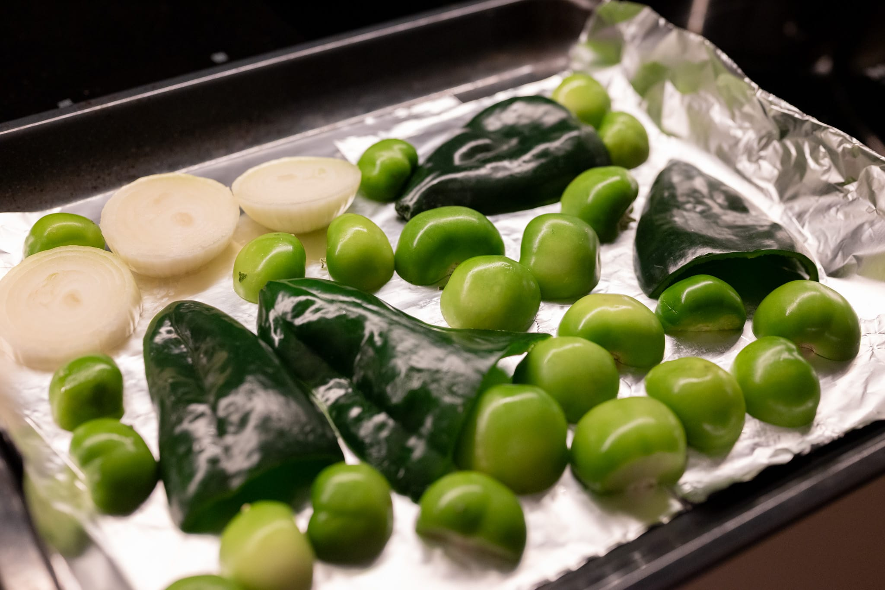
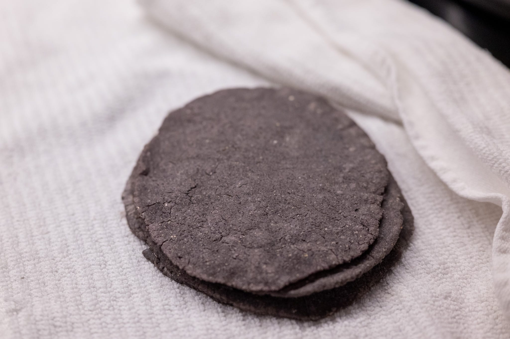
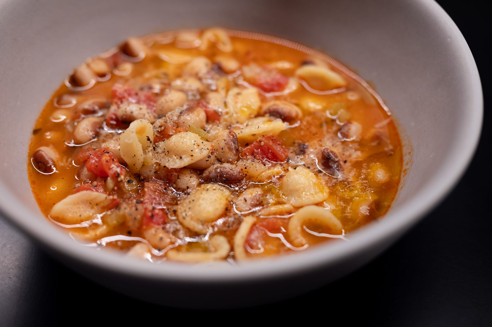
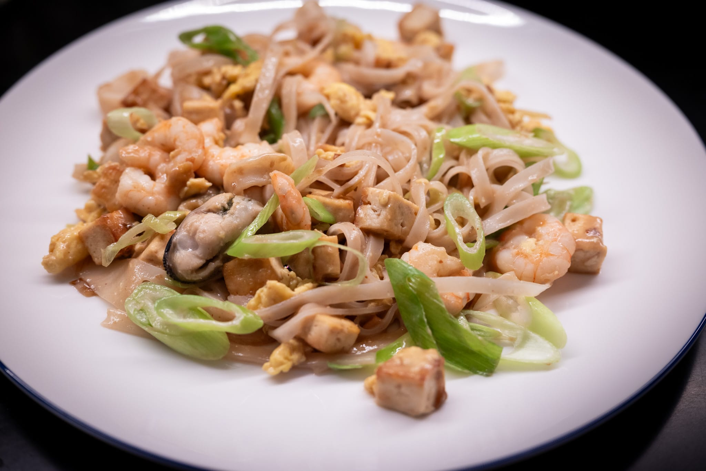
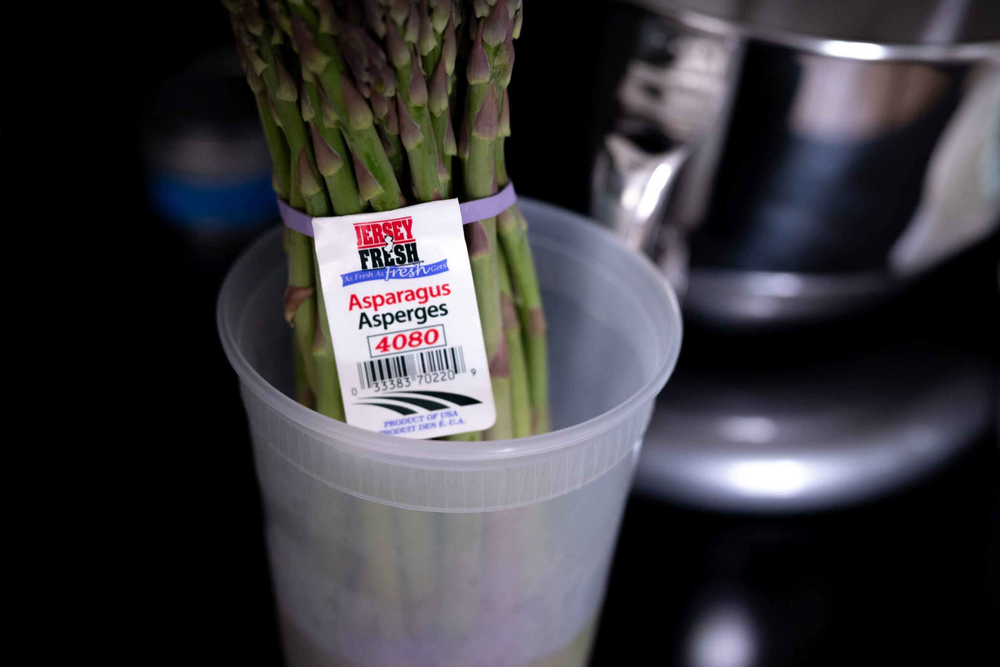
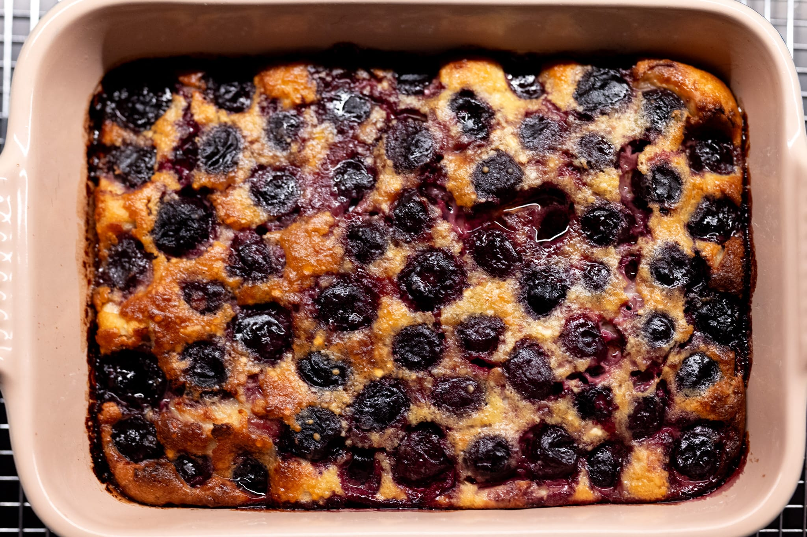

It's been another whirlwind month with less time cooking than usual. On the plus side, the weather finally began its turn to spring, which has been nice.

Though this has meant an end to citrus season, and with it the end of the good blood oranges. The last few I bought were really only useful to juice for cocktails, sadly. Though that is a great way to use them.

My annual batch of hot cross buns for Good Friday was a bit of a mixed bag. They hit all the right notes --- as the usually do --- in terms of flavor. But in my rush to get them done for Good Friday, I botched the crosses. Maybe I'm editing my life too much by not sharing photos. Suffice to say they looked a little rough.

I had a better time getting back into the groove with tacos. Or really the art of tortilla making. My technique has progressed to the point that everything works, but I'm still a long way from mastery. I think I need to finally get a carbon steel pan --- or something else that lets me get the tortillas cooked hotter. While my tortillas are good, and certainly miles better than store-bought, they don't get that puff that's the hallmark of a great tortilla.

Between celebratory dinners, invitations from friends, and a whole bunch of other activity, I had a real yen for something simple. It wasn't especially seasonal, but I wound up doing a batch of _pasta e fagioli_.

A few months ago, the cheap and cheerful Thai place down the street closed after the owner died and the heirs weren't interested in keeping it going. Which has really deprived me of cheap and cheerful Thai food. So I returned to the art of making my own pad Thai.

I wasn't able to find the dried radish that apparently give it a really authentic flavor at H Mart, and I couldn't be bothered to buy a giant package of bean sprouts to make a couple portions of noodles. It was still pretty good. I still miss the cheap and cheerful Thai spot down the street.

On a food run, I spotted the good asparagus. Which was a real treat. I bought a ton and did everything from steaming to roasting, with and without various sauces. If you only ever eat the generic asparagus from Peru, there's such a huge difference in flavor with the local stuff.

In pastry corner, I thought it would be fun to try doing a clafoutis after having one for the first time in ages last month in San Francisco. It was pretty clear I was out of practice. The clafoutis looked good, but in the eating it was pretty disappointing.

With my mediocre blood oranges, though, I did another blood orange olive oil cake. That, unlike the clafoutis, was excellent. I messed around a bit with the egg-to-flour ratio and bake time, and got something with a really great texture gradient through each slice.

Outside the house, I had a chance to very briefly explore the Texas food scene on a flying visit to Dallas for professional reasons.

If I'm being honest, I wasn't bowled over. From what I experienced, it's a good case study in having your city rated by the Michelin people or a given restaurant having a coveted star not necessarily being a guarantee of quality.

When I visit California and get tacos, it's clear you're getting something great, and certainly better than what you can find where I live here in New England. None of the Tex-Mex food that I tried in Dallas was appreciably better than what you can find in Boston. (Which, much as I love where I live, is a very low bar.)

Possibly the floor is higher. The more or less randomly chosen Tex-Mex places I went in Dallas were pretty good. But nothing gave me that frisson of joy that you get in (say) a good Los Angeles taco place.

My friend who hosts a monthly supper club once again pulled out all the stops. I got too wrapped up in everything to grab any photos. The lobster ravioli were a highlight.

For the month ahead, I'm crossing my fingers that there are at least another couple weeks of good asparagus. I still haven't worked up the energy to do it with poached eggs and hollandaise sauce.

A few friends have organized a tiramisu competition, so I'll be giving the James Hoffman super-optimized recipe a try. I'm also really tempted to mess with perfection and add some chopped roasted hazelnuts for extra texture.



### What I'm Reading and Watching

* The [rise of orthorexia](https://www.theguardian.com/global/2025/may/02/orthorexia-eating-disorders-rfk-jr) in our age of information overload and weak trust

* [Another entry](https://www.theguardian.com/food/2025/apr/21/are-michelin-stars-a-blessing-or-a-curse-restaurants) in the ongoing debate over the Michelin guide

* Mulling [the future of beer](https://www.ft.com/content/42a9869f-7e65-4f73-9e3e-7f3375005a71) at the Heineken Experience in Amsterdam

* [Recycling oyster shells](https://www.nytimes.com/2025/04/21/climate/shell-recycling-connecticut-oysters.html) off Long Island Sound in Connecticut

* The Honey and Co team [takes on the scone](https://www.ft.com/content/6b79c6ce-1d16-41b8-9878-5773b28708b9) in their "building blocks" series

* Research on the [phase behavior of cacio e peppe sauce](https://pubs.aip.org/aip/pof/article/37/4/044122/3345324)

_[Subscribe](/subscribe) to get notified every month when new issues go out_
