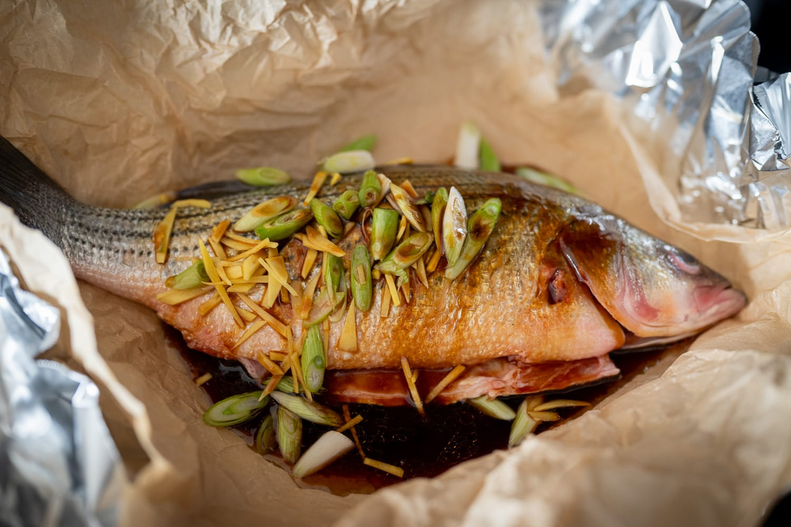
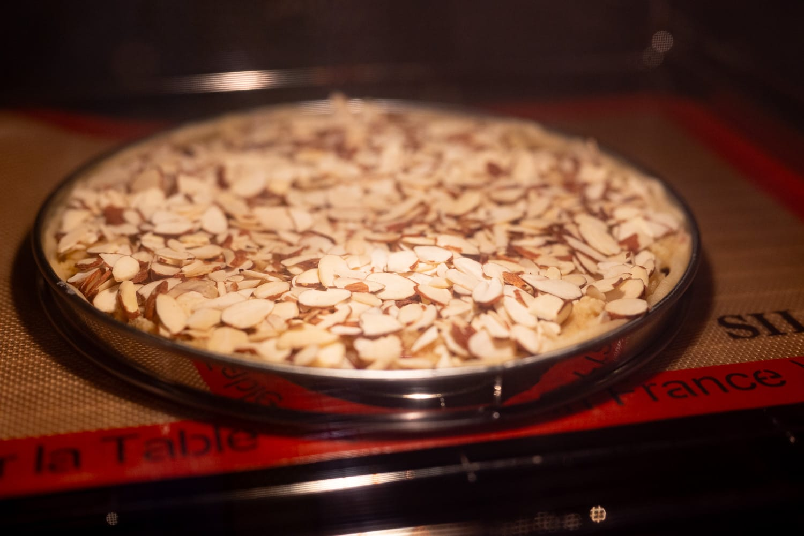
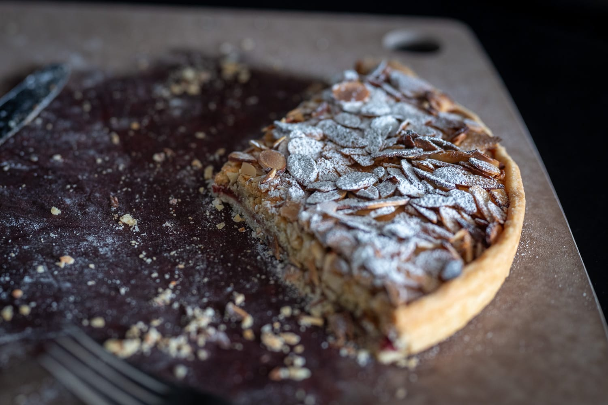
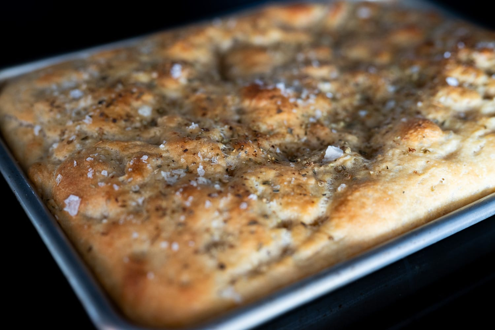
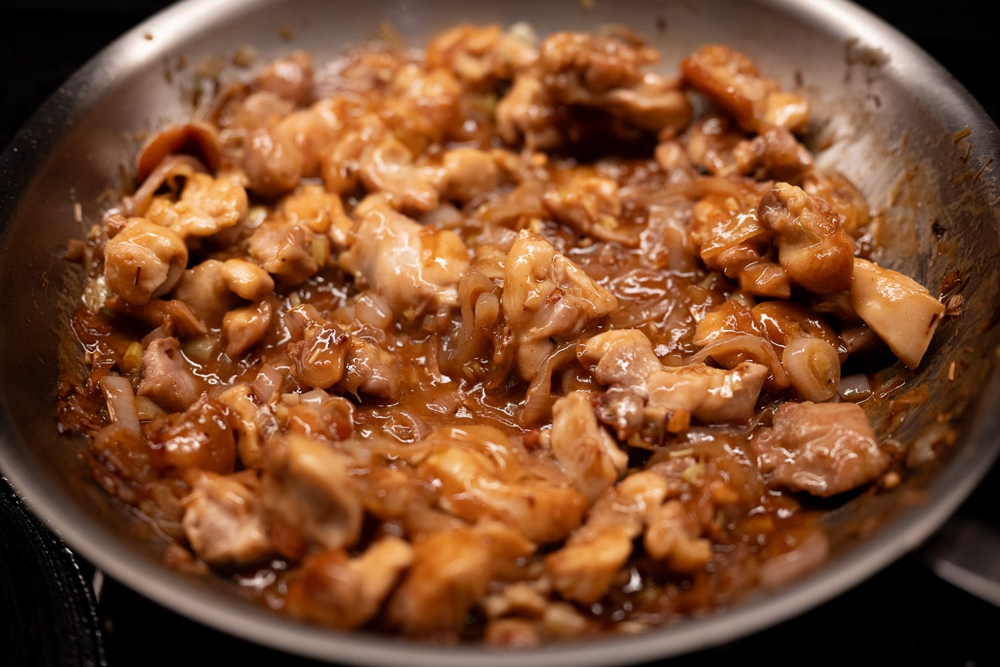
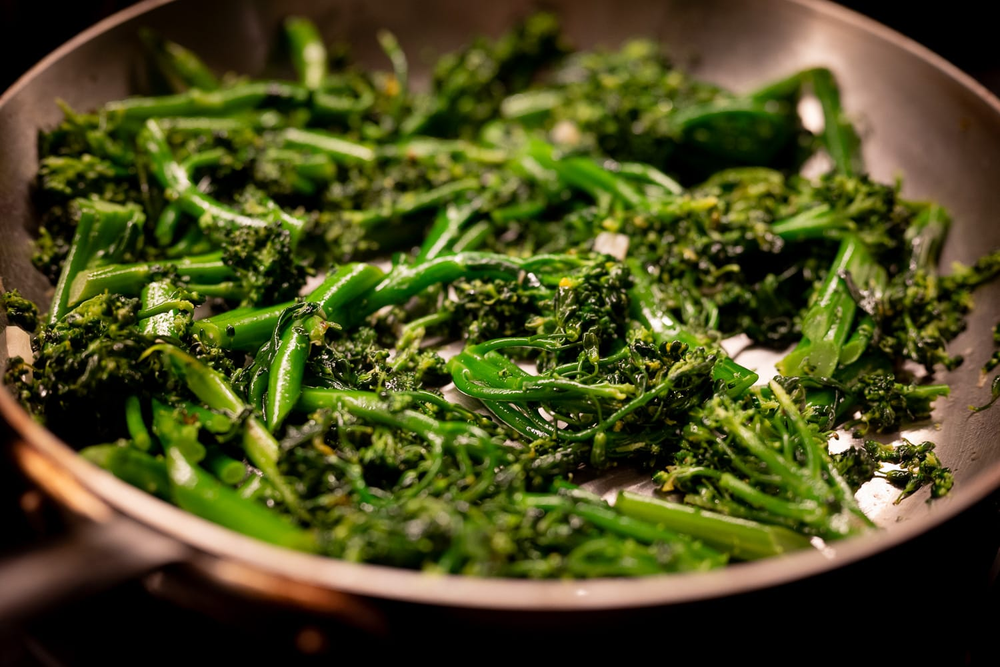
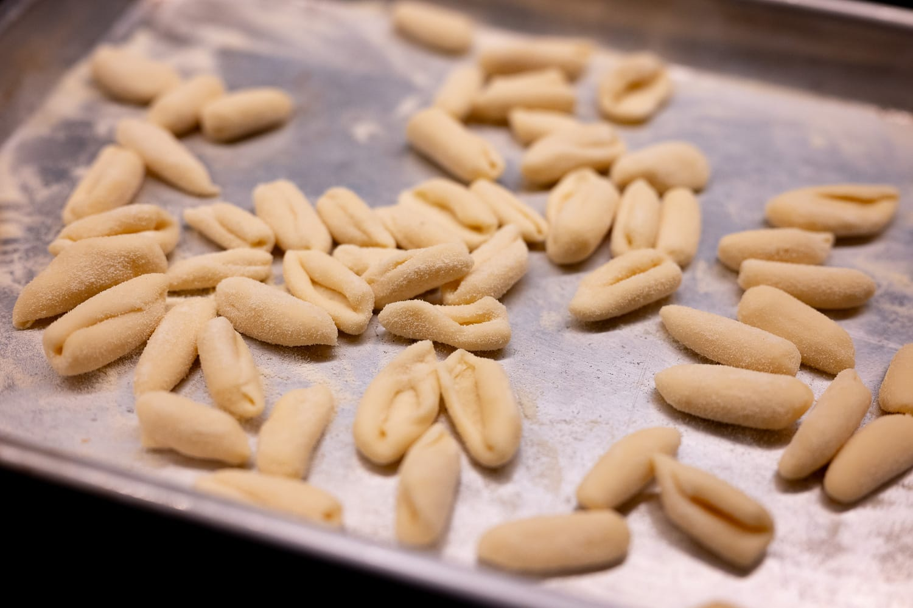
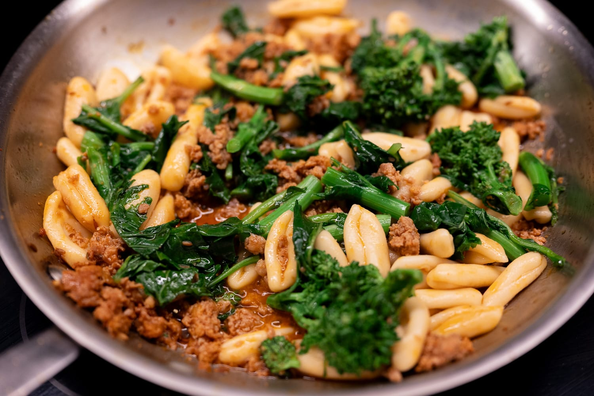

This has been a bit of a light month for cooking. I've been busier than usual, and haven't had as many opportunities to cook, or the time to cook when I wasn't eating out.

I hosted a dinner, which did provide one opportunity to have some fun in the kitchen. I took it as an opportunity to cook out of _Viet Kieu_ as I'd planned, and did a bit of a Vietnamese feast. I had to cut some corners. Despite visiting a few different places, I couldn't find any galangal. With hindsight it was less surprising, if still a bit frustrating, that I couldn't find any desert limes, a decidedly Australian ingredient.

One of the Vietnamese supermarkets I tried did, however, have an exceptional fish counter. I did a recipe out of the book with some really fresh fish that was a big hit.

For a sweet course, I couldn't quite swing doing a dessert from the cookbook. I did find pandan leaves (for the recipe I thought looked the most compelling). Running around as I've been doing this month, putting together a complicated chiffon cake with unfamiliar ingredients didn't feel like a great idea. Instead, I did my [Via Carota-inspired frangipane tart](/recipes/almond-tart/) with raspberry jam from last summer.

On a quieter evening, I did some braised chicken, and had another run at doing focaccia _au levain_ to go with it.

That was an especially good batch. I gave it a very long first rise, and it was wonderfully light and airy. It was a good reminder that even when the starter is in very good shape, it's not as punchy and active as commercial yeast.

At the Vietnamese grocery, I had to buy pre-bundled lemongrass, and wound up with far more than I needed for the fish. That seemed like as good an excuse as anything to return to the lemongrass chicken recipe inspired by The Slanted Door's version, but that I've now definitely cooked and tinkered with enough to call my own.

It was also an instructive exercise in the value of good ingredients. I ran out of mirin, and the only true mirin (made only with rice, water, and a culture) was something like $15 for a small bottle when I went shopping. That seemed a bit ridiculous, so I bought the $5 bottle of more basic mirin. It wasn't bad, but I regret the choice. You can really taste the added sugar, and there was definitely something missing from the final dish.

In seasonal produce corner, I've had to accept that blood orange season has ended. They're still available, but either mealy and fibrous, or nearly completely devoid of flavor. I have enough zest stored in the freezer for maybe one more batch of hot cross buns.

I was pleasantly surprised to find the good (more or less) local asparagus from New Jersey on a shopping trip, however.

The whim struck to try making [cavatelli](/recipes/cavatelli) for the first time, so I did. It's easier than I expected, though I also suspect my technique could use a lot of improvement. I had some sausage to use up, so did a quick sauce with that and some cima di rape, always a winning combination.

Less successfully, I needed a quick dessert and had meant to make an olive oil cake. Of course, I forgot to add the olive oil. Fortunately, the no-olive oil olive cake was not terrible and very edible. But it's a lesson that no matter how many times you've made something or how much confidence you have, it's a good idea to look back at your notes.

Looking ahead to the rest of the month and the beginnings of June, I'm hoping that the asparagus season lasts a bit longer. It's one of those ingredients like strawberries that's completely forgettable to the point of seeming pointless unless it's great and in season.



I'm also debating whether it's warm enough to haul out the amazing [summer ragù recipe]() that I was completely seduced by last summer. That could also be a good opportunity to 

I've become a real convert to fruit-based desserts, but in the winter I usually have to give that up. There's no point in making a strawberry tart with mediocre strawberries, so you might as well do something that leans into going the other direction with, as I did a month or two ago, [a chocolate cake](/recipes/nigella-chocolate-cake/).

In this liminal period, though, that feels too heavy. At least where I live, the great warmer weather fruit is a long way from coming to market. So it feels like a good time to have another run at a [_flan pâtissier_](https://jepensedoncjecuis.com/2026/03/mes-conseils-pour-reussir-un-flan-patissier-onctueux-et-croustillant.html).

In the more experimental realm, I got my hands on a copy of the new _Noma Guide to Creating Flavor_. (I have mixed feelings about this given how problematic some of Noma's practices are or were. Suffice to say I minimized the amount of money that went to the Noma operation.)

It's one of those cookbooks that's the food equivalent of something like Thomas Piketty's _Capital in the 21st Century_. Most people will buy it for the prestige value and never use it. It's still going to be highly influential and is really useful for serious professionals.

Much of the book is highly impractical or completely impractical. I especially loved the recipe for ant salt, which is exactly what its name suggests: salt cut with ants, as in the insects. I've had the tasty Noma ants before (at a different restaurant), and they're not bad, but neither did I find them revelatory. More importantly, even if you wanted to make ant salt, it's not exactly easy to find the special pleasantly acidic ants that the recipe requires.

Light mockery aside, there are some genuinely interesting and pretty doable ideas in the book that I'm hoping to try out.

### What I'm Reading and Watching

* Despite its flashy overtones, I think champagne (and other similar-style sparkling wines) can be super interesting, and are one of my favorite kinds of wine. Apparently [the soon-to-be-released 2018 vintages](https://www.ft.com/content/60e4a9b6-1330-45df-8496-9c75ab0478f6) are really good

* [An interesting article](https://www.nytimes.com/2026/05/04/dining/food-pleasure-mindful-eating.html) on mindful eating in the _Times_

* TéléCrayon had an excellent episode on the [geography of fish production](https://youtu.be/-Yj-IYlqZak?si=O5VvKzAu1AEZl4ZF) that really made me want to find some Peruvian anchovies

* I was once again reminded of this [fantastic review of The French Laundry](https://www.thebolditalic.com/a-four-year-old-reviews-the-french-laundry-the-bold-italic-san-francisco/) in _The Bold Italic_

* Jamie's Italian [reopens in London](https://www.theguardian.com/food/2026/may/03/jamies-italian-reopens-jamie-oliver-london), trying to avoid the mistakes of the first go around

_[Subscribe](/subscribe) to get notified every month when new issues go out_