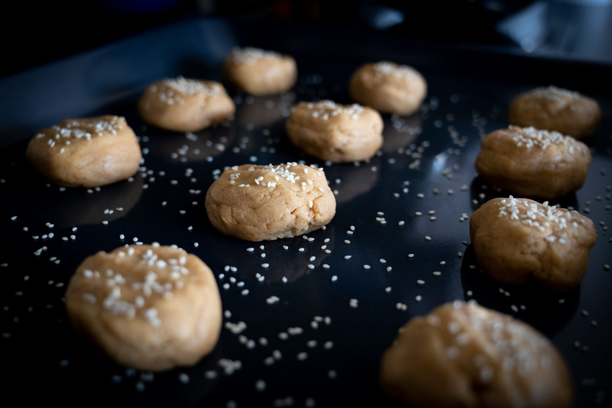
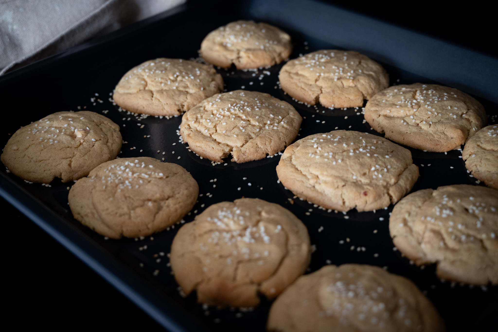
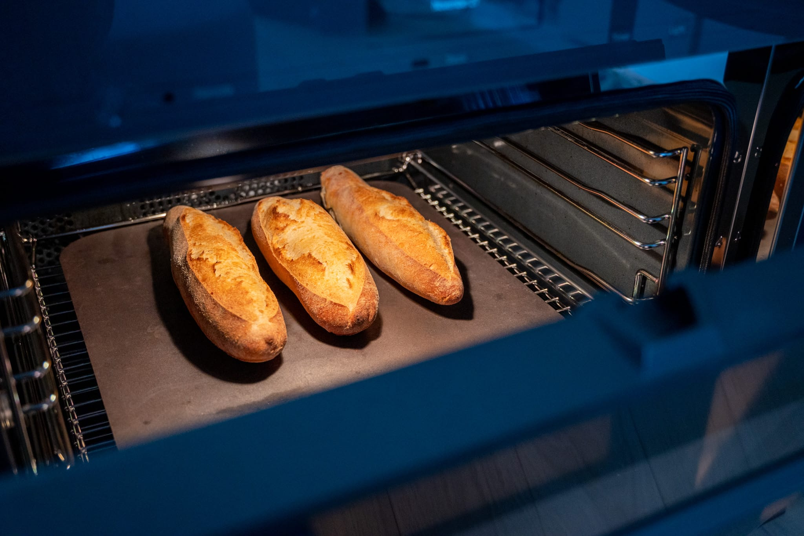

My kitchen is still not quite done. I think there's at least another week of work for the crew to do, optimistically.

But we have achieved an important milestone: [I can cook again](https://jkibe.github.io/kitchen145/functional). It's a huge relief as well as a bit frustrating. A relief for obvious reasons. I no longer have to rely exclusively on the monotony of takeout. A frustration because until the project is done-done, my house doesn't really feel like a home. Being so close to being done without actually being done is maddening. I want my sofa back.

Progress is progress, of course. I'm taking my victories where I can. I was able to make a halfway decent Thanksgiving dinner.

While I haven't completely lost my touch, I'm a little rusty. The new kitchen will also take some getting used to. I can't quite figure out where everything goes yet, because the kitchen isn't completely done. Getting appliances that aren't 40 years old has also thrown me for a loop. My new oven is the first one I've ever used where the difference between fan and unassisted baking is so clear.

I made some of my favorite miso peanut butter cookies, and I was very impressed and almost surprised by the speed and evenness. Whether this is because I have an oven that isn't 40 years old, or I twisted myself into a pretzel to get a true European-style 60 cm oven, I can't say. But it's definitely better than any other convection oven I've ever used.

Likewise, I was really impressed with my first attempt at making bread in the new oven. I don't think I've ever gotten such good oven spring in my old oven.

For my mini-Thanksgiving, I kept it simple. With my partially-completed renovation, I didn't have a big group (me plus my girlfriend), so I did a roast chicken --- a turkey felt excessive --- plus mashed potatoes, green beans, and gravy.

While the project has been going on, I've dipped my toes a little bit more into the world of coffee. At home, when I need an afternoon pick me up, it's easy enough to make myself a cup of tea. In the office I've been using, it's not always that easy to get a great cup of tea.

Going to a café, I feel a lot more ridiculous paying $5 for a tea than I do a coffee. Making great tea basically comes down to whether you have great tea leaves and a timer. Making great coffee is a highly variable process that actually demands expertise. In other words, I really don't feel bad paying $5 for a well-made coffee. Usually a flat white.

There's always a part of me that wants to take it into my own hands, which has been an interesting rabbit hole to start down. It's really convinced me that the $5 for a good coffee shop espresso is a bargain.

Even if I had an espresso every day, it would take over two years to recoup the cost of good equipment alone. There's more basic (and thus cheaper) equipment available, but from what I've come to understand, it won't equal what they're using at a great coffee shop. That's ignoring the coffee itself --- the good stuff is not exactly cheap --- and other consumables. 

For now, I'm going to resist my worst impulses and skip the [Decent](http://decentespresso.com).

Looking to the month ahead, I have a few interesting threads to pull.

I'll be in New Orleans for a wedding, which should be an interesting food experience. I've never been, and, as someone put it to me once, Cajun food is really one of the few truly distinct cuisines of the United States. One of the people getting married has Indian heritage, so I'm hoping that also means good Indian food at the reception.

Then there's the obvious task of reacquainting myself with the practice of cooking. I couldn't possibly be more excited about that. My [new oven](https://www.mieleusa.com/e/24-oven-h-7660-bp-am-graphite-grey-11804840-p) has a steam injection system. I'm really excited to try baking bread without having to pour hot water onto a tray. My new cooktop can drive an absurd amount of power into a single pan. I'm very eager to see what kind of stir fry I can achieve with that at my disposal.

Then there's the simple pleasure of trying out all the ideas I've had accumulating since April. I can't wait to try something like this recipe for [coconut rice with peanut crunch](https://www.youtube.com/watch?v=hMRzBomsc_g). The Ottolenghi team is consistently great.

Last but not least, it's Christmas and New Year food.

I'll probably have another run at making croissants at Christmas. I may need some practice before attempting it for a larger group after so many months without a kitchen. Laminated dough is temperamental at the best of times.

I'm also eager to continue my exploration of Italian biscuits. In my ongoing quest for novelty, I've found that the endless universe of Italian sweets is a great way to explore. I've done _torcetti_ in the past. I'd love to try something like [_baci di dama_](https://www.tavolartegusto.it/ricetta/baci-di-dama-la-ricetta-originale/) (literally "lady's kisses") or doing my own [amaretti](https://ricette.giallozafferano.it/Amaretti.html).

Long ago, back when I had a working kitchen, I had dreams of exploring gingery sweets a bit more. This all feels more ambitious than anything I can actually do, but I like exploring the ideas.

Much of the cooking in my extended family falls to others, and so I'm along for the ride more than anything. Having fresh mochi is always a treat.
