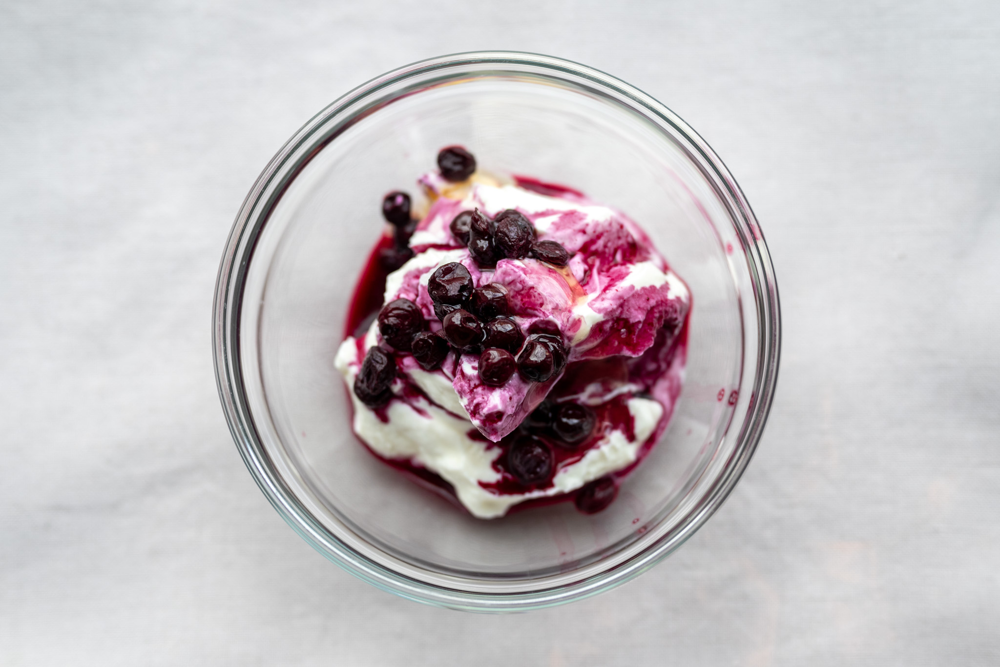
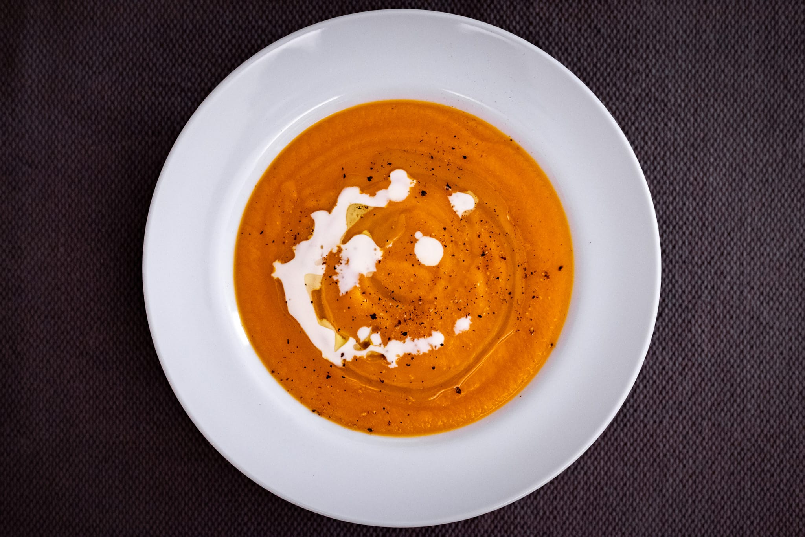
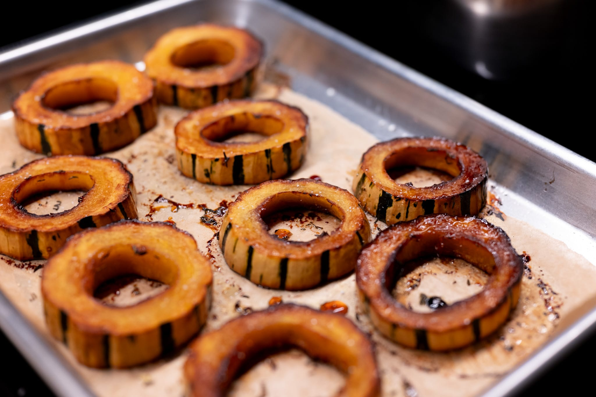
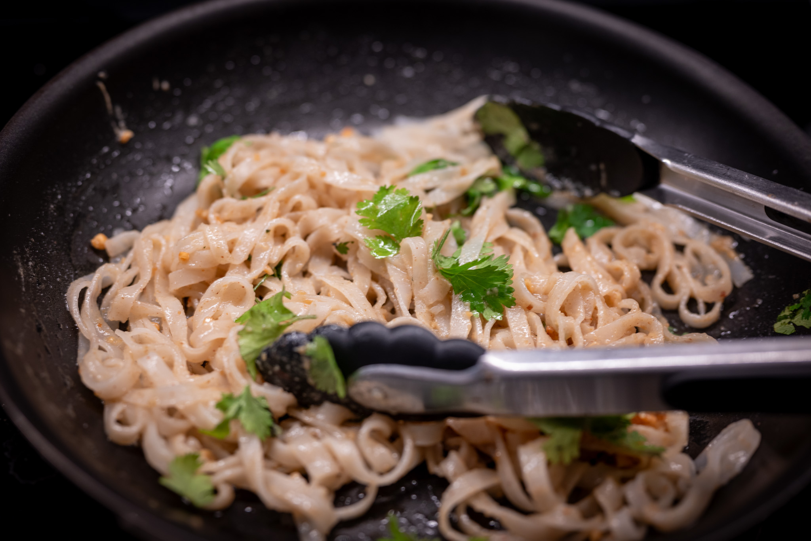
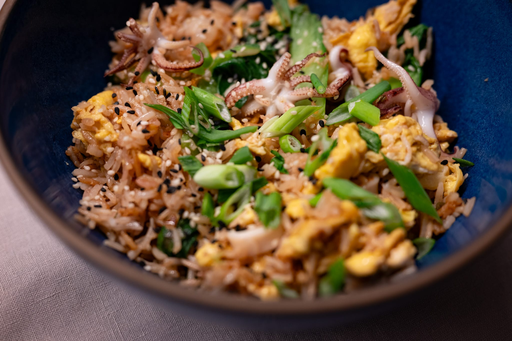
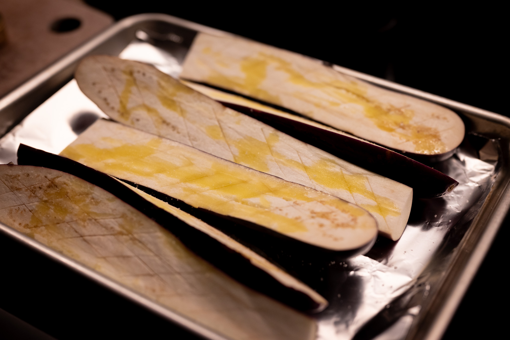
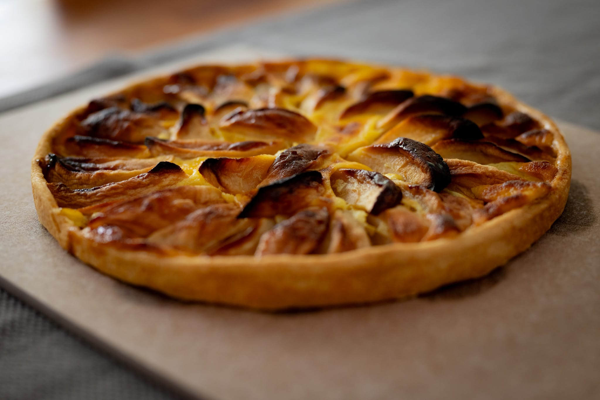
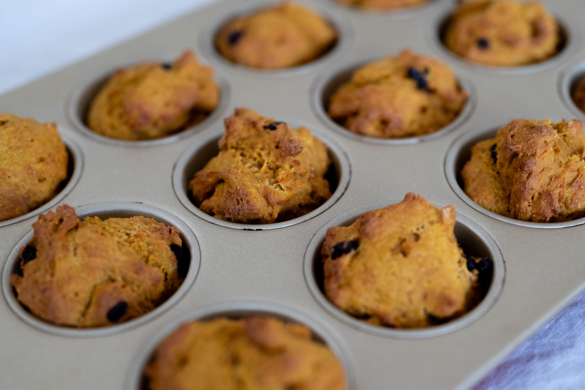
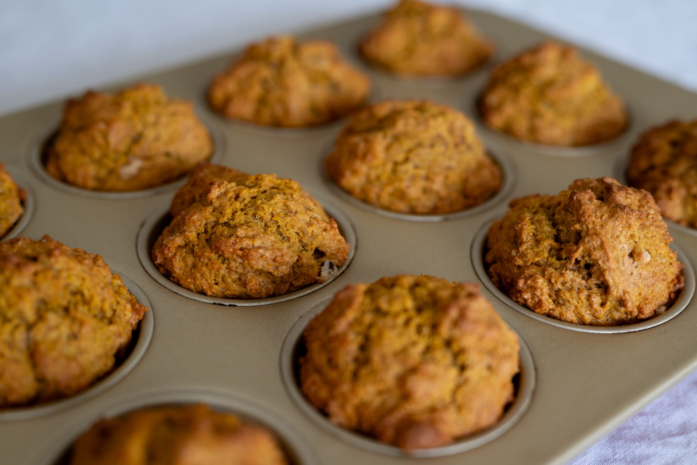
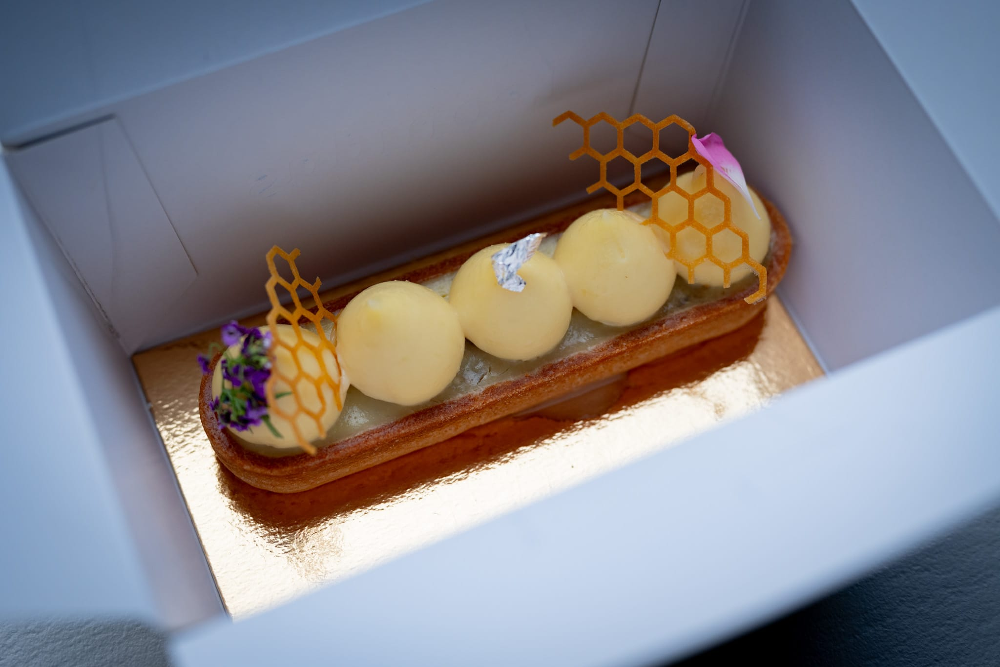

Moving into the deep fall and closer to winter, I find myself both celebrating the excuse to switch up my menus even as I miss summer produce. Looking only at the photos, everything is much more beige and monochrome than it has been.

Getting deeper into my experiments with fermentation, the pain is all the more acute. My tiny stash of lacto-fermented strawberries are the last I'll have until next June or July.

Not to be completely deterred, I did try a batch of lacto-fermented blueberries using fruit from the freezer aisle. Frozen berries usually have better flavor than the bred-for-transport berries you get most of the year, since I can no longer get good fresh blueberries. It worked reasonably well, though of course I have no reference point for doing it from fresh. I continue to be a big fan of this flavor of fermentation. As in the _Noma Guide_, the blueberries are great in as simple an application as adorning some Greek yogurt with honey.

In terms of what I can get, the change of season means there's a lot of locally-sourced squashes to hand. As planned, I did a nice pumpkin velouté. I didn't have the presence of mind to record what kind of squash I used, but I got the flavor right. Despite using my finest mesh strainer, though, it's still not quite the ultra-smooth consistency I was aiming for. One day, I'll get myself a superfine strainer or a Vita-Mix blender.

On most days, I go out and pick something up for lunch. When you work from home, I feel like it's a good idea to have an excuse to get out of the house. But sometimes it can be fun to make something, too, especially when the weather isn't the best. I started noodling with shakshuka. I'm reasonably happy with where I landed. Getting the eggs just-set rather than too runny or overcooked was a little trickier than I thought it would be.

I had an Apollo 13-style successful failure with one batch of bread. At this point, I go in autopilot mode when I'm doing basic bread dough. A mistake, it turns out. Because I managed to forget the salt. It's amazing what a difference that makes. The bread is so bland without it. It's encouraging to me that it was still just about edible, thanks mostly to the hint of acid from the levain that I use as a base. Also encouraging that my intuition is good. There was something wrong with the dough that I couldn't place as I was forming the loaves. Not that I could've done anything at that point to save it.

I also managed to misremember how much flour I had left at another point, and found myself unable to make bread. I'm not sure it made for the most coherent meal, but I cobbled together some fun spicy peanut noodles as a substitute. I surprised myself with the improvised dish, though next time they need a hit of something sweet to round everything out.

As much as I like trying the new and being creative, it's not always possible to muster the energy to do that with everything else swirling around in my life. With that in mind, I did some more basic dishes as well.

A quick store-cupboard fried rice is always great. I usually have scallions and eggs in my refrigerator, and I had a bit of shellfish to use up.

Similarly, I love doing tahini-crusted eggplant, riffing on something from the team at Honey and Co in London. It's so easy and the tahini crust really lifts the eggplant. I gave my latest run a bit of a twist using Chinese eggplant I picked up on a trip to the Asian market with some Chinese five spice in the crust.

In the sweet column, I felt like I had to make something with apples, so went back to the Raymond Blanc recipe that I took inspiration from for the peach tart over the summer. At first, I thought the apples were a little too browned, but in fact it was just right. This is my favorite way to do an apple tart now without question.

Staying on-theme, I was in the mood for pumpkin muffins. Finding a starting point was a bit of a struggle as usual. I've lost patience for anything in the pastry department that doesn't use gram measurements. I tried out [a recipe from the excellent Stella Parks](https://www.seriouseats.com/pumpkin-spice-streusel-muffins-recipe) on Serious Eats, and [one that piqued my interest](https://www.melskitchencafe.com/sourdough-pumpkin-muffins/) because it incorporates a sourdough element.

The exercise was a good lesson in home economics. The sourdough-spiked muffins weren't bad, but neither were they amazing. They felt a bit flat --- you could taste the spices and the pumpkin, but everything was muted --- and were a little too small in the muffin tin, in terms of the visual.

The Stella Parks recipe, by contrast, was outstanding. But it really was clear why: more good ingredients go in, so you get a better result. There's more fat, more spices, and thus more flavor. Which, it has to be said, definitely increases the cost. I buy very high-quality (read: expensive) vanilla extract, and, while it's not something I usually worry over, when you're pouring quite so much of the bottle into the mixing bowl, it's hard not to think about the cost. Certainly I can't imagine it's even remotely as expensive as buying a single $6 muffin at the fashionable bakeries I frequent, but it's worth contemplating nonetheless.

I skipped the streusel for this batch. I wanted to have a fairer comparison, given the other recipe didn't do anything (other than suggest the optional addition of chocolate chips).

Outside the kitchen, I gave a try to a new (to me) local pâtisserie with some promise. I was reasonably impressed. By the time I was there late on a Saturday afternoon, they had sold out of nearly everything. I'm going to have to go back earlier in the day (or during the week) to get a better sample of what they sell.

For the rest of the month and into December, we're creeping into the season of gatherings, with its ups and downs.

My Thanksgiving plans have been disrupted by a poorly-timed jury summons that would make any travel very tricky. I'm hoping I can make the best of an annoying situation. It's a funny anniversary of a few more personal things, but also of having a (barely) working kitchen again for the first time last year as part of my big renovation. Fortunately, it's now been completely done for months. If I'd been able to plan better, it would have been nice to inaugurate it with a slightly more thoughtfully-planned Thanksgiving gathering. Perhaps next year.

Without the guilt of needing to run the air conditioning when I crank up the oven, I'm hoping to do a bit more bread-wise experimentation. There are the excellent rolls I'm still trying to recreate from one of my favorite places in Copenhagen, and I want to get back into trying to pull of a _tourte auvergnate_ at home. That's one loaf I really can't get at all in Boston, let alone a great one. I also have it in my head to make a big batch of croissants so I can have some ready-to-go in the freezer.

In more of a holiday direction, I have it in my head to do some practice runs on some of my favorite biscuits. Especially after meandering around Scandinavia in September, that's got to be pebernødder (a real favorite) and a run or two at cardamom buns.



Something about the time of year also puts me in the mood for [salmon with lentils](https://www.marieclaire.fr/cuisine/dos-de-saumon-aux-lentilles,1198419.asp). It's simple and warming, and gives me great memories of escaping slightly dreary winter afternoons meandering around Paris in the winter.

### Experimental: What I'm Reading and Watching

* A [thoughtful summary](https://www.youtube.com/watch?v=5QOTBreQaIk) of current research in nutrition with Chris Van Tulleken at the RI

* Also with him, a great series airing on Radio 4 and BBC Sounds, [_Fed: Planet Chicken_](https://www.bbc.co.uk/sounds/brand/m001ry9t), on the planet's favorite source of animal protein

* I've recently discovered the _Table Manners_ podcast, and of course I have to recommend the [episode they did](https://overcast.fm/+K0mUpSC6s) with the inimitable Nigella Lawson

* I realize it's in French and I know I've already recommended this newsletter, but the [most recent issue](https://carteblanche.substack.com/p/quest-ce-quon-a-fait-au-bourdieu) was incredibly entertaining, so here I am recommending it again

* Eric Ripert of Le Bernadin has a great new cookbook out, [_Seafood Simple_](https://www.penguinrandomhouse.com/books/703357/seafood-simple-a-cookbook-by-eric-ripert/)

_[Subscribe](https://landing.mailerlite.com/webforms/landing/k5w5z0) to get notified every month when new issues go out_

