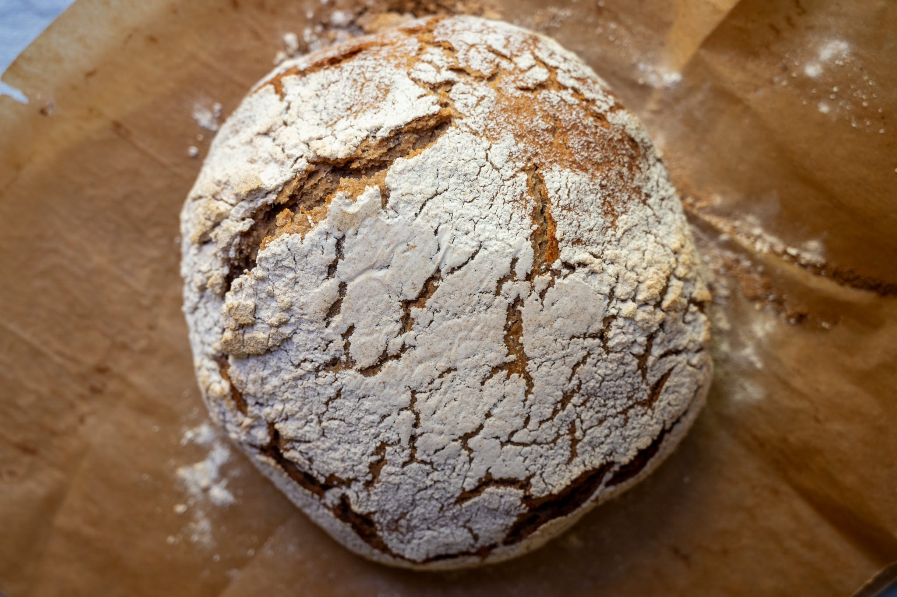
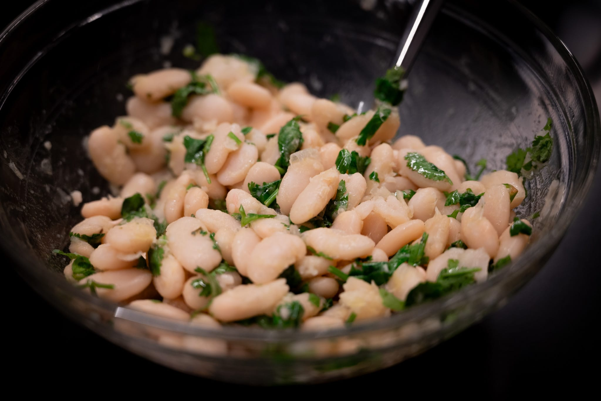
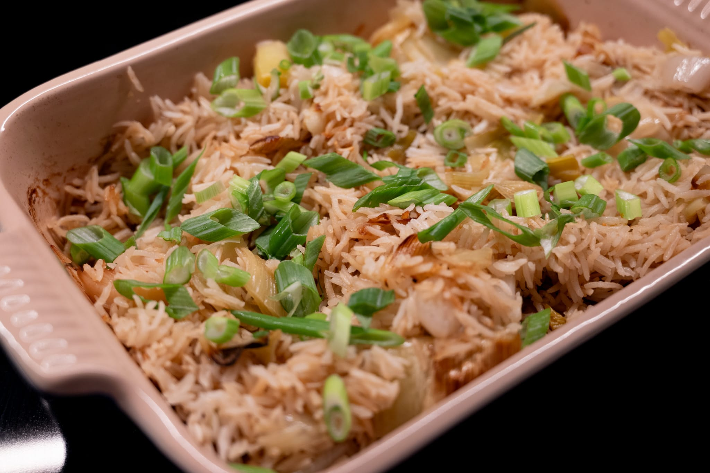
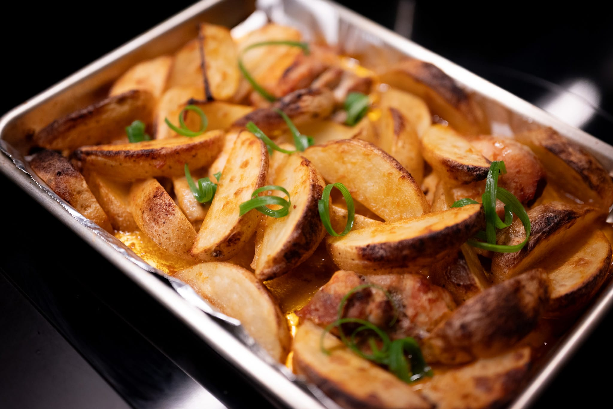
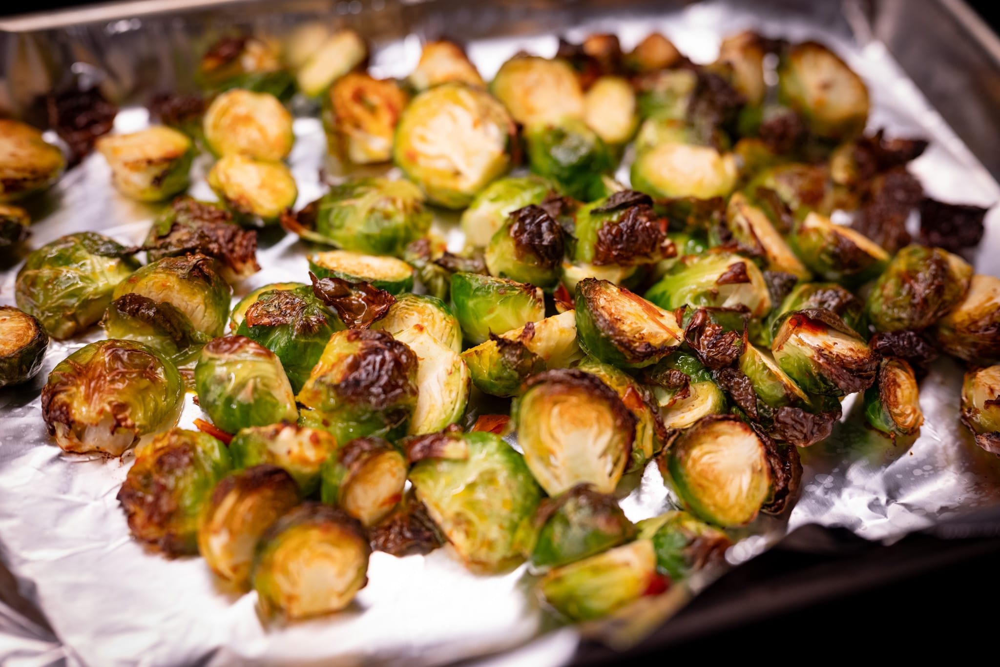

The election has cast a certain pall over the last month. Apparently, this is who we are. I felt like I needed to mention this because, compared to the very scary four years to come, it feels very decadent for me to be worrying about pizza dough. At the same time, doing what's normal is probably healthier than wallowing endlessly.

On that cheery note, inspired by Oobatz (and because I was in the mood for pizza) I decided to try making pizza dough with my levain rather than normal baker's yeast. It definitely gave me more appreciation for the team at Paris's hottest pizza eatery.

In the past when I've tried to do pizza this way it's failed because the dough is too weak and underdeveloped. So in the oven, the weak pizza dough doesn't get that final rise, and so I've wound up with pizza that's dense, flat, and slightly under-baked because I don't want the toppings burned to a crisp.

I assumed this was because I hadn't used enough sourdough culture. In Neapolitan-style pizza dough, you use a truly minuscule amount of commercial yeast. The usual recipe I use has about 0.1% yeast for the amount of flour, which works out to not even a gram in most cases. In past attempts doing this _sur levain_ I've tried using around 10 grams of the levain, thinking you really didn't need much yeast at all, and 10 g for 500 g of flour isn't much. Since that was clearly too little, however, I thought I'd see what would happen if I were to up it to 50 g this time.

Even though I have a very healthy levain, it still wasn't enough. Or I didn't let the yeast develop enough in the dough. Over three pizzas made on different days though a week, none of the pizzas really worked. The last one --- which had been fermenting in the refrigerator for almost a week by the time I used it --- was definitely the best. But it still wasn't even close to good.

More experimentation is required.

Keeping on the baking theme, I did indeed get back in the proverbial saddle on the _tourte auvergnate_. And, to my great pleasure, I definitely made progress. It was still a little too dense and a bit too wet. I'm not totally sure how to fix the texture. Possibly I under-proved the bread. Fortunately the residual water issue is easy to fix. Every recipe I looked at suggested you need to leave the bread in the oven at a lower temperature for 20 or 30 minutes after baking, to dry it out. I was impatient and only gave it about 15 after turning the oven off. It wasn't enough.

More successful was a blackberry and apple crumble cake, another great idea from the latest Ottolenghi cookbook that I've been working through.

In a necessity-is-the-mother-of-invention moment, I wound up doing a variation of olive oil cake with a few twists. I bought too many blackberries for the other cake, so tossed those in. Then, after preparing all the ingredients --- and very much in the mood for something sweet --- I realized I was out of normal sugar. So I swapped in brown sugar.

The result was good, if a little strange. For understandable reasons, it browned a lot more than my usual version using standard sugar. If I ever toss in blackberries again, they need to get folded into the batter. They looked off, halfway in and halfway out of the cake.

Back on the savory side, I went back to a few old favorites. The weather (mostly) being very fall-like, the great four-allium rice felt very appropriate. Likewise, a batch of beans felt very seasonal. And it was a great excuse to use up some cilantro that was about to become unusable.

I took a run at another chicken tray bake idea from the Ottolenghi team. It works in concept. I think it could use some finesse. Mostly, I thought it would've been nudged in a slightly better direction with more than a few dollops of the sauce after roasting and par-cooking the potatoes to give them a little more crispness.

In preparation for Thanksgiving later in the month, I decided to do a bit of a Brussels sprouts experiment. While I really don't mind spending money on good produce, I've been a little annoyed at how much my local supermarkets charge for sprouts. It's one thing to pay $40 for a really amazing olive oil. I don't think my local Whole Foods has such special Brussels sprouts.

So I decided to see what would happen with frozen Brussels sprouts as a comparison. At least where I shop, they're almost four times cheaper frozen versus fresh. I have no snobbery about frozen food. It's often a lot better than fresh. Nothing can beat a really amazing local strawberry in the peak of summer. In the dead of winter, a frozen strawberry will almost certainly be better than the cardboard-like stuff shipped from California.

The fresh Brussels sprouts were great as usual. The frozen ones weren't bad either. It's a lot easier for sure. You don't have to worry about the vegetables going off since they're frozen, and they can go directly from freezer to oven. It's also really nice that when you're tossing the sprouts with seasoning they stay intact, since they're frozen together. The only real downsides are the cooking time (slower), and the fact that, as they're frozen, you can't really halve them before cooking, which I like to do.

I'll probably get fresh sprouts for the big day. In terms of pure quality, they were better. For normal weeknight cooking, this may be a useful discovery, especially in a pinch.

In a similar vein, I took the Thanksgiving-is-coming moment as an opportunity to act on one lesson I learned on my trip last month. I needed better wine glasses.

So I splurged a bit and got a set of the [precision wine glasses](https://richardbrendon.com/products/the-precision-wine-glass) from Richard Brendon. They're a little bit cheaper than the hand-blown original model, which helped me justify it to myself.

Looking to the month ahead, there's the as-alluded-to Thanksgiving question.

I've once again volunteered to host, so have already started thinking about the menu. This year's group is big enough I may do a turkey. Or at the very least perhaps a turkey breast. A single chicken would not be enough to feed the group.

At the risk of being a cliché, I'm very tempted to try out this from-frozen technique from Chris Young.



(I've never been able to bring myself to get a set of the _Modernist Cuisine_ books because one of the co-authors --- not Young --- is a very obnoxious patent troll.)

I really like to keep Thanksgiving traditional, at least in the broad strokes. That means Parker House rolls, mashed potatoes, brussels sprouts, and cranberry sauce. Though I do like to give things a bit of a twist to keep things interesting. I have it in my head to try doing a scratch cranberry sauce and spike it with gentle heat and something floral. Blood orange zest. Maybe some ginger.

And of course, I have to do an apple tart of some description. It's become part of my mythology.

Beyond that, as the weather gets colder, I want to make things warming and comforting. No doubt that will include no small amount of soup, and gives me a chance (and a medium) to do more bread. In particular, I really want to return to one of the breads that I had at one of the fantastic restaurants I went to in Copenhagen last year.

With the benefit of hindsight, I should have done more experimentation right after that trip. Because the memories are starting to fade. All I really have to work against at this point is a sightly blurry photo I took with my smartphone and the notes from my first couple of attempts last fall.

After Thanksgiving, I feel like it's acceptable to start getting ready for Christmas. I really like trying weird and esoteric biscuits from around the world. For the last few years I've been exploring Italian biscuits, such as the _torcetti_ I did a few years ago. I still haven't quite decided what's on the docket. Finding esoteric biscuit recipes is a challenge in and of itself.

### What I'm Reading and Watching

* More on the [ascent of Gail's](https://www.ft.com/content/8a68a240-a6bc-4370-8773-dea2063b4e69)

* As a distraction on election night, I started watching the latest series of MasterChef: The Professionals (UK), the obviously best version of that format

* A [fine dining chef samples](https://www.youtube.com/watch?v=D5Jz1lhnjDM) the fare eaten by participants in the Vendée Globe

* Watching a video about London in the Second World War, I discovered the existence of _Something New in Sandwiches_, a cookbook about sandwiches from the late 1920s. The title amused me, and the level of practicality is very endearing.

* A [tour of Carbone](https://www.nytimes.com/2024/10/15/dining/carbone-las-vegas-new-york-miami-dallas.html) locations across the US

* [Din Tai Fung](https://www.nytimes.com/2024/11/05/dining/din-tai-fung-nyc-restaurant-review.html) finally comes to the East Coast, and does not impress Melissa Clark

* [A tour](https://www.ft.com/content/ced1a4a2-edda-44ef-aa45-e7e863ba5d8b) of almost-perfect bars in Manhattan

* The [surprising (to me) reason](http://bostonglobe.com/2024/05/23/business/high-and-dry-boston-restaurants-liquor-license-suburbs/) that Boston proper has a dearth of creative restaurants

* Michel Roux Jr on [shutting down Le Gavroche](https://www.youtube.com/watch?v=FUi9oXIxk3I) and other projects

* The Surgeon General and José Andrés launch a new campaign to [encourage people to gather](https://www.nytimes.com/2024/11/12/dining/project-gather-loneliness-surgeon-general.html)

* A pizza place in Germany was selling [illegal drugs on the side](https://www.theguardian.com/world/2024/oct/22/side-of-cocaine-with-that-german-police-raid-pizzeria-after-finding-secret-ingredient)

_[Subscribe](/subscribe) to get notified every month when new issues go out_
