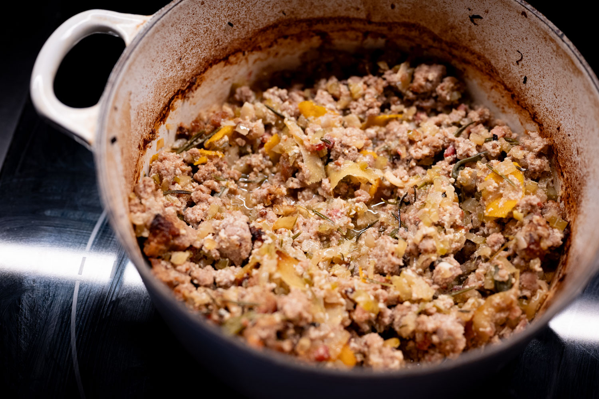
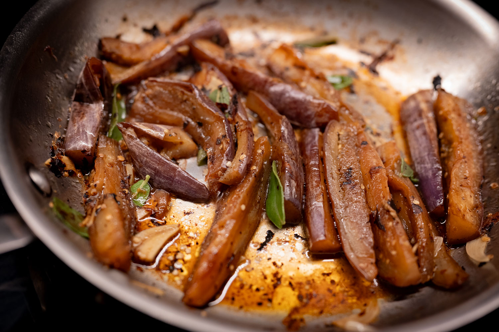
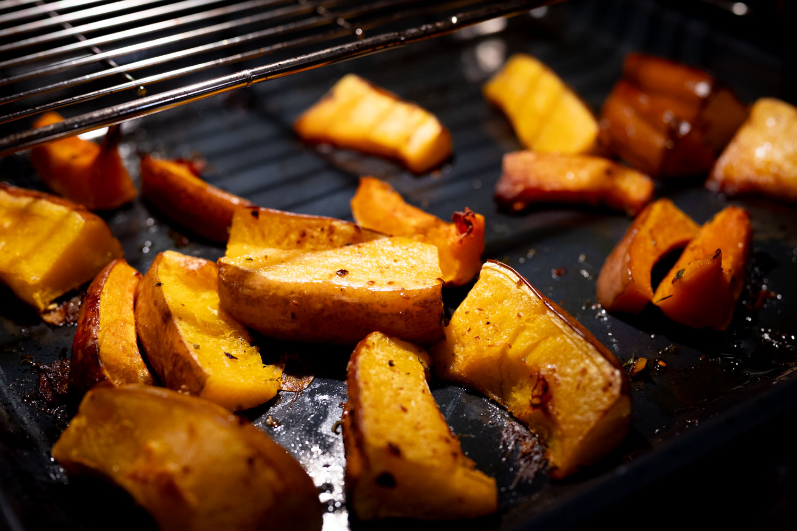
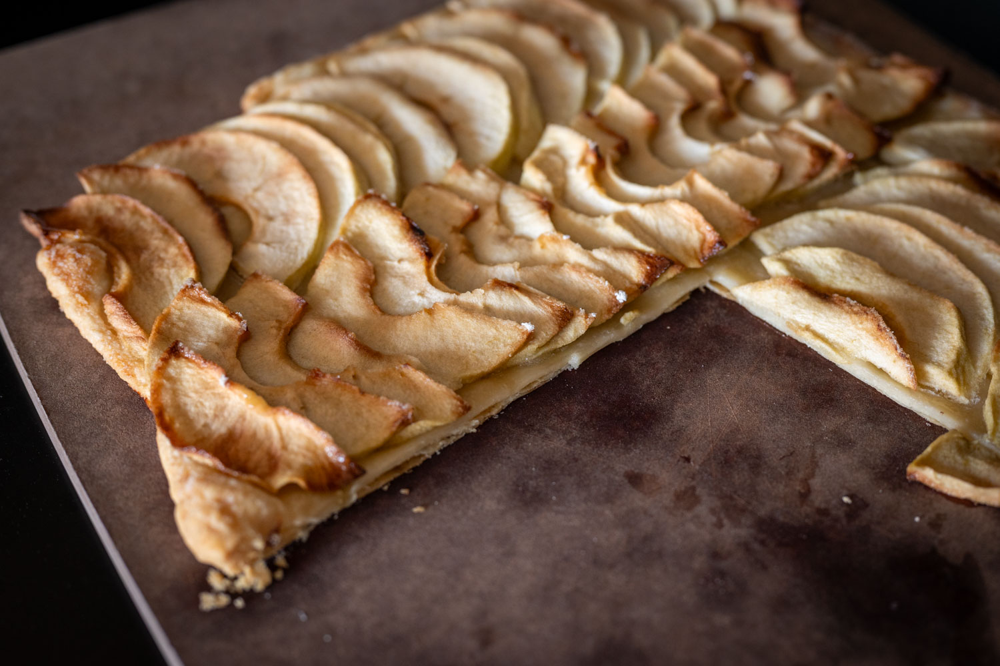

Fall has definitively arrived, which presents some interesting contradictions. The leaves have come off the trees and the sun is lower in the sky, which really bathes my apartment in light. At the same time, the shorter days are not my favorite. Especially after the clocks go back and the sun sets so early in the evening.

I couldn't help myself and did a last batch of the fantastic summer ragù. It's great, though it's definitely too light as the season changes. I'll miss it until next spring.

On a recent episode of _Lunchbox Envy_, they discussed mushrooms, and explained that it can make sense to dry fry them before searing them with oil. This collapses all the air pockets, which means that they fry when you add oil, rather than soak it all up and get gross and greasy.

I thought the same might work with eggplant, and might resolve one of my main frustrations doing eggplant on the stove. While I don't know that the protocol I tried out --- dry fry until the eggplant collapsed, then added oil, crushed garlic, and some leftover sage --- was a total success, I think I'm on the right track to something interesting.

In the last year or two my local Whole Foods has stocked Row 7 produce, operated by a consortium of people including Dan Barber. They make a big deal about it having more flavor and everything else, and I thought I'd do an informal taste test. While the price difference is hardly enormous, it's enough that I was curious.

In my incredibly unscientific testing, I thought the Row 7 squash was a bit better.

In the pastry kitchen, there was a good article on my favorite food blog about a _tarte fine aux pommes_, a sort of hybrid-cheat between the elegance of an apple tart and the rough-and-ready crumble. My assembly needs some finesse. I've had this (or, more relevant here, seen this) in many a French bakery or pastry shop, and my attempt wasn't quite up to that standard. I'll have to take another run at this.

The change in available produce also pushes me to the realm of non-fruit-based desserts. So: a batch of miso peanut butter cookies.

Less successfully, I was in the mood for babka. For our purposes here, let's say I didn't quite get the amount of dough to size of loaf pan ratio quite right. The photos didn't quite make the cut.

Out of the house, I spent some time in New York earlier in November. More than anything, I was struck by how incredibly difficult it was to get reservations at some of my favorite places. But that prompted some exploration of a few new places, a couple of which I'd recommend. Cochava is the sort of neighborhood Mexican restaurant that every neighborhood should have. And I got a kick out of a hole-in-the-wall French bistro in the West Village called Le Baratin. The food was good and it has great atmosphere.

Looking forward to next month, I've turned my focus to hosting a small Thanksgiving gathering. Unlike last year, I don't know that there's anything as experimental I want to try this year. I'm likely going to repeat the Chris Young day-of thaw technique --- it was a hit and so much less work --- and do all the standard issue dishes like mashed potatoes and cranberry sauce.



I was very tempted to break one of my own traditions and do this tarte tatin technique from the ChefSteps channel. But I feel like I have to do the usual apple tart.

Beyond that, I've been a little starved of inspiration and imagination this month. I need a few more ways to do winter vegetables. There may be some space for pre-Christmas cookie experimentation. I keep meaning to pick up a cookie mold to do something interesting in that direction.

### What I'm Reading and Watching

* For the next generation, apparently [early dinner is cool again](https://www.theguardian.com/lifeandstyle/2025/sep/19/gen-z-early-dinner)

* Large food companies are [starting to reformulate their products and change their strategy](https://www.ft.com/content/20b3acf2-0783-469a-9a76-54e8711953bb) as GLP-1 drugs begin to really affect public health and consumer choices

* Notes on [lab-grown chocolate](https://www.theguardian.com/wellness/2025/oct/31/lab-grown-chocolate-halloween)

* From Jancis Robinson, [deconstructing the dynamics](https://www.ft.com/content/877e6505-4395-44a2-9f17-9f889dd55e7e) behind emerging wine regions

* A great piece in _The New Yorker_ covers the [culture of Costco](https://www.newyorker.com/magazine/2025/10/27/can-the-golden-age-of-costco-last), and contemplates whether it can outlast the founding team

* According to new research, [aggressively yelling at gulls to stop them taking your food](https://www.bbc.com/news/articles/czjp8kz1x8yo) is one of the few places where that technique is helpful rather than destructive

_[Subscribe](/subscribe) to get notified every month when new issues go out_

