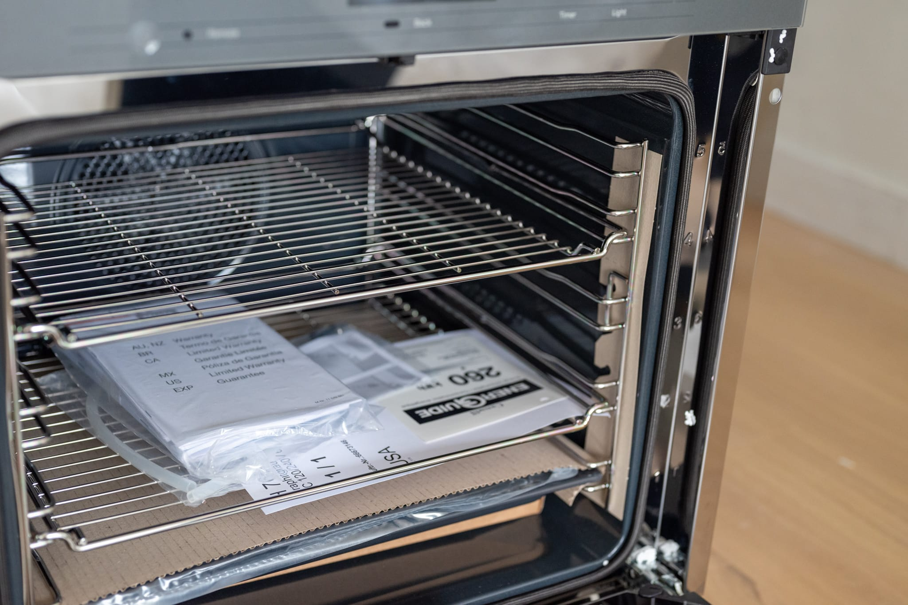

For a variety of reasons, this is late by a couple of weeks.

Unfortunately this was not because my new kitchen was so close to completion, waiting another week would make the difference. Though there's been at least some progress since last month. The fire protection contractor came along to take care of moving a sprinkler since I'm moving my cooktop, which removed a project impediment that was my (rather than the general contractor's) responsibility.

In the meantime, it's been something of a quiet few weeks food-wise as I've bided my time on the project. I'm still stuck in the takeout grind, and there's not much to say about that.

Anticipating the eventual completion of the new kitchen, however, I've restarted my levain. Last weekend, I also borrowed a kitchen to try it out.

The first attempt left something to be desired. I also didn't have the presence of mind to remember my camera and take a photo. You're not missing much.

Looking to the month ahead, I have some hope that I'll have a functional kitchen again for the next edition. The team running my project threw down the 12th of November as the new substantial completion deadline. Given what's left to do, there's enough buffer there I'm cautiously optimistic.

Part of me is looking forward to simple luxuries. Not having to wash dishes in the bathroom sink. Eating off real plates. Or even having all my furniture back so I don't have to eat dinner on the floor or on my bed.

My more superficial side is looking forward to trying out my two project splurges. The Miele induction cooktop I specified is incredibly powerful. It should make some nice stir fries, and it's a huge upgrade from the 1980s resistant cooktop that came with my apartment. The oven I specified has a steam injection system, which should make my bread baking a lot more convenient.

In my corner of the world, it's very much apple season. While I try not to get my hopes up, I'd love to bake something like an [apple fondant](https://food52.com/recipes/14571-torta-di-mele). It's one of those desserts that's unbelievably easy to make, but that really impresses people.

Assuming the contractor hits the deadline, I may be in the throes of effectively moving back into my own home the next time this is supposed to go out. Which is to say, probably not in a position to spend oodles of time baking desserts. For those of you reading this without those requirements and looking for something a bit more ambitious to throw together, I'd love to try out this [pastis gascon](https://www.youtube.com/watch?v=8VXeLJy5oX4).

As the weather cools down, I have a yen for soups. I love a nice [pasta e fagioli](https://www.epicurious.com/recipes/food/views/pasta-e-fagioli-with-escarole). As I was putting this together, I was chuckling, noticing that I'd said about the same thing this time last year.
