It's been an interesting month. Beginning most obviously with the couple weeks that I spent in Scandinavia (Denmark and Sweden) the second half of September.

Copenhagen is now one of my favorite places. Food-wise, it's one of the most interesting cities I've visited in a long time. There's a real sense of place in the food, and the presence of places like Noma has clearly infused the city with serious culinary talent.

There are, of course, places to get forgettable late-night kebabs. I'm not going to pretend I tried any of them. My time was limited and I know what I like. But even at the humbler end of the price scale, I was consistently impressed with the restaurants I tried. When I think Denmark I don't think Vietnamese food, and yet I had a great bánh mì in Nørrebro at a very reasonable price.

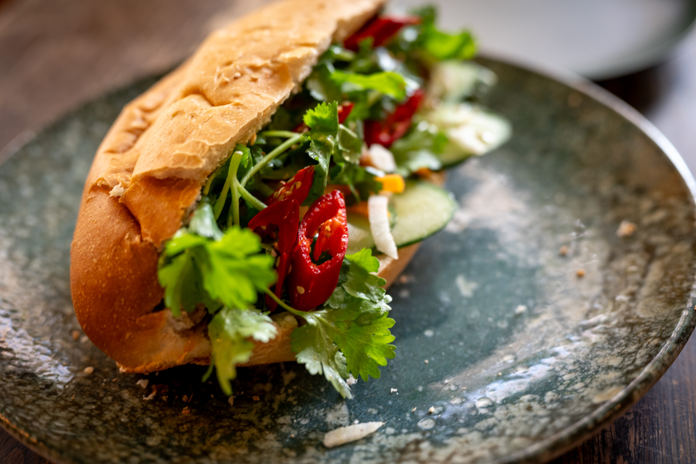

At the higher end, I had some of the most memorable food I've had all year. There's a lot to take inspiration from.

I couldn't help thinking of _The Bear_ at one restaurant where they served a riff on apples with thyme for dessert. The apples were prepared four ways --- raw, dried, purée, and in a sorbet --- on a bed of salted caramel with fresh thyme and thyme oil. It sounded a bit weird, but I think it worked well.

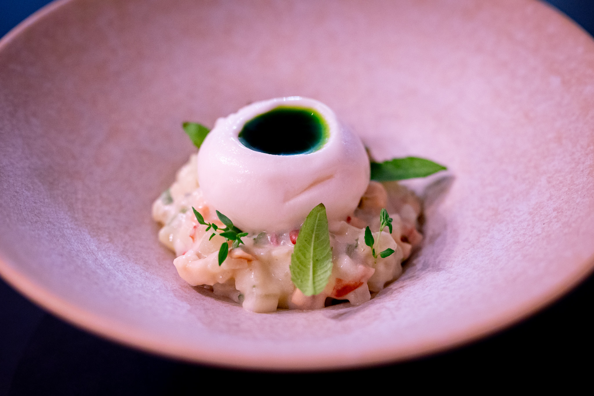

Probably the single most interesting dish I had was a beef tartare on one of the set menus. It's not something I'd usually order. But it came as part of the package, and I was keeping an open mind. It was great. Possibly the best beef tartare I've ever eaten.

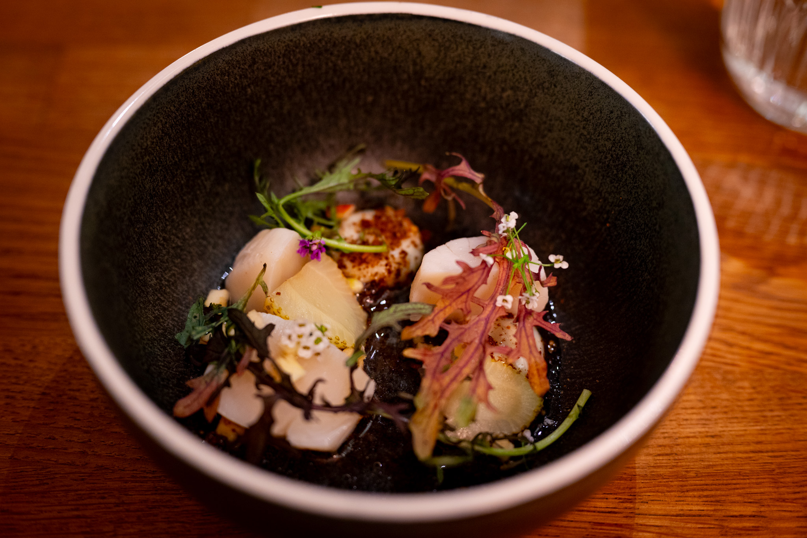

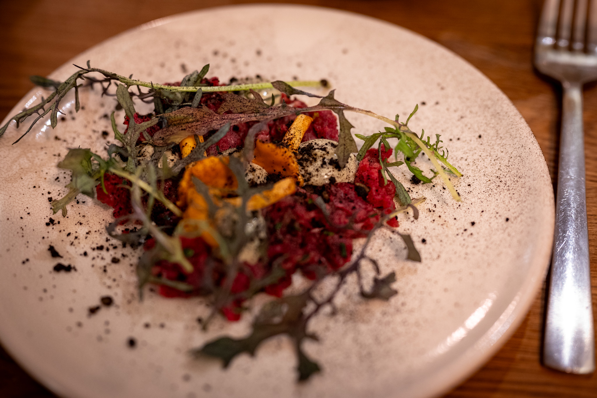

I also managed to find what must be the highest-concept place to get smørrebrød. The prices were definitely a bit steep. But it's hard to deny that they made the most interesting open-faced sandwiches I've ever had. One was a take on tomato: a freeze-dried tomato with tomato powder over some of the best cherry tomatoes I've ever eaten, all on top of a yuzu cream.

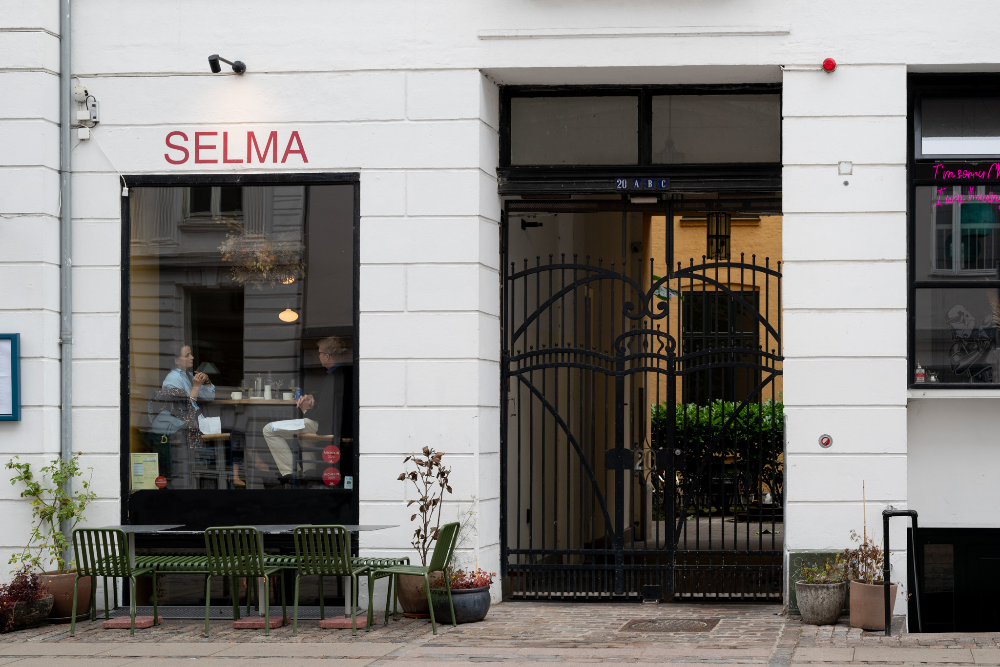

Being completely honest, Stockholm wasn't quite on Copenhagen's level in terms of food. I didn't come away with a million ideas to try out in the same way I did in Copenhagen. But I still managed to eat well.

In a funny way, I really enjoyed a lunch at a Neapolitan pizza shop simply because I had a chance to chat with the staff in Italian. As nice as it is that everyone in Scandinavia speaks weirdly impressive English, it felt good to speak with some people in their native language. The pizza was good, too.

Staying with the Italian theme, at another place I had a fun artichoke starter --- they cut it in half an fried it --- and a slightly too sweet but still fun poached pear in a hazelnut chocolate sauce.

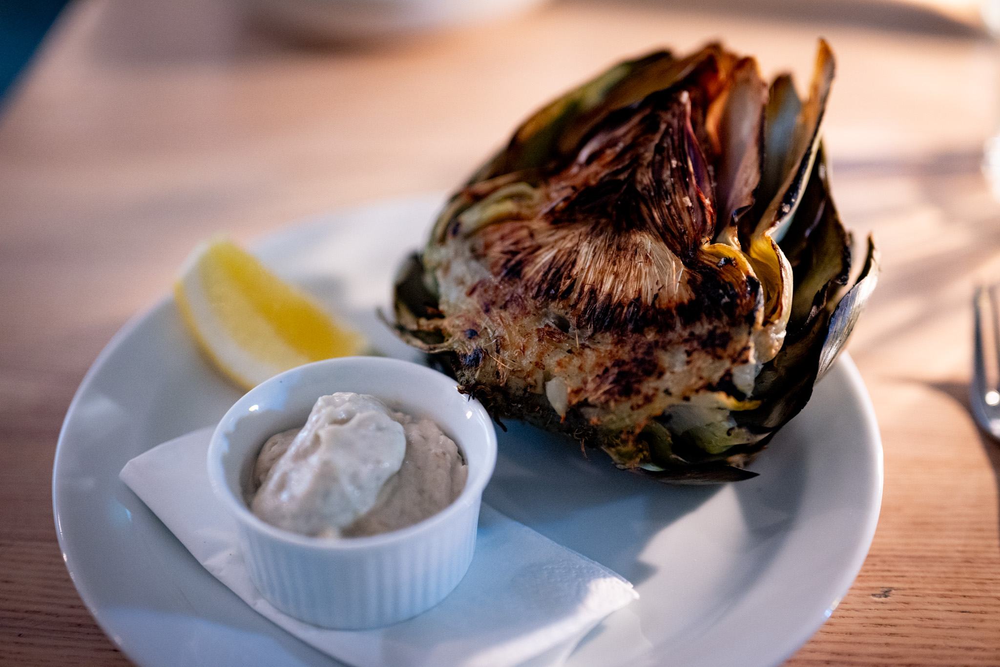

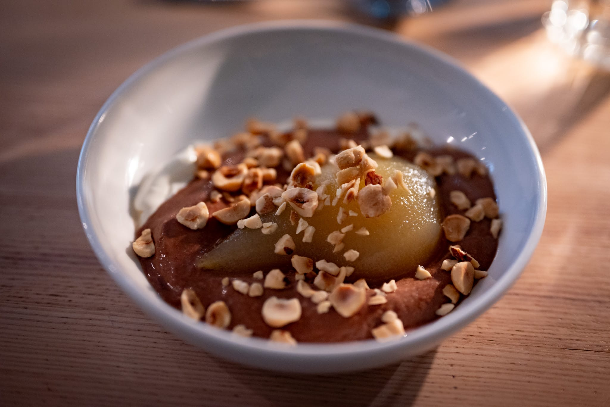

One of my highlights in Sweden was an excellent bakery a friend of mine took me to. It was genuinely great. And all the better that I was able to try one of their famous off-menu sandwiches.

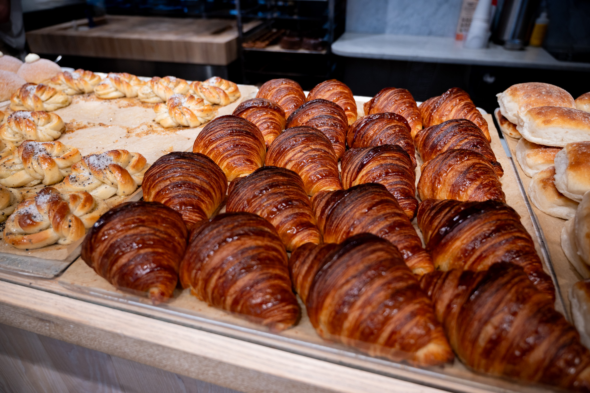

I did try one place in Stockholm that piqued my interest. I didn't get a picture of my favorite dish --- a fermented herring dish with a frozen sour cream shell --- but I did get one of a fantastic and really nicely cooked arctic char dish.

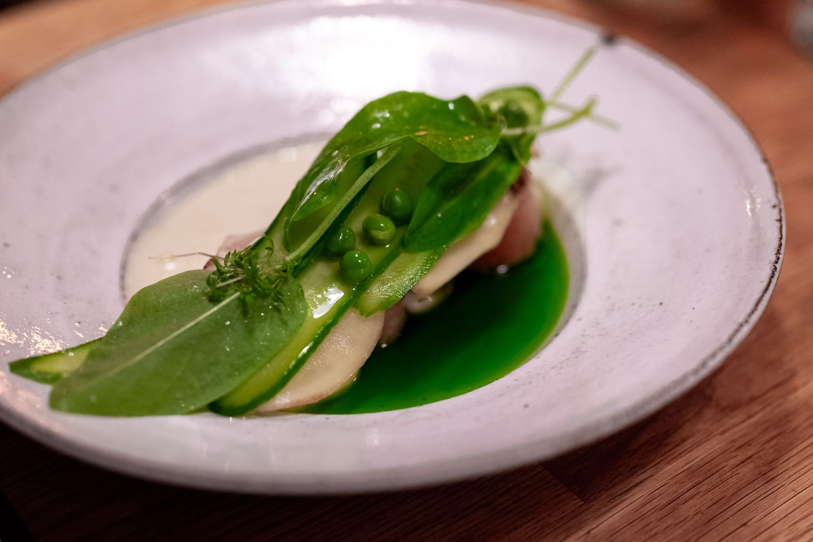

Back home, I couldn't help noodling around with ideas from my travels.

The Scandinavians take their butter seriously. When they brought the bread and butter "course" at the better places, it was clear they put a lot of time and attention into both pieces. I had an especially interesting bread course at one Copenhagen restaurant, and spent some time trying to reverse engineer that from memory and a handful of photos I took as I was eating.

Taking inspiration from these "fine dining"-style experiences does have the problem that there's a very different effort-reward calculus when you're at home. There's nothing in the food I ate in Copenhagen that I can't do at home, in terms of technique or ingredients. If I really tried, I could get super high-grade organic beef to recreate that amazing tartare. But there is a barrier in that even I don't have the willpower to spend hours delicately preparing ingredients for a four-bite starter on a random weeknight.

By way of example, I really loved a dish at Uformel that combined cucumber and hiramasa (sushi-grade yellowtail) with a tomato vinagrette and dashi sauce, topped with micro herbs and fish roe. I can make each of these components. But it's really not a whole meal or something I'd want to eat more than once or twice a week, and it would take hours to make each of those components.

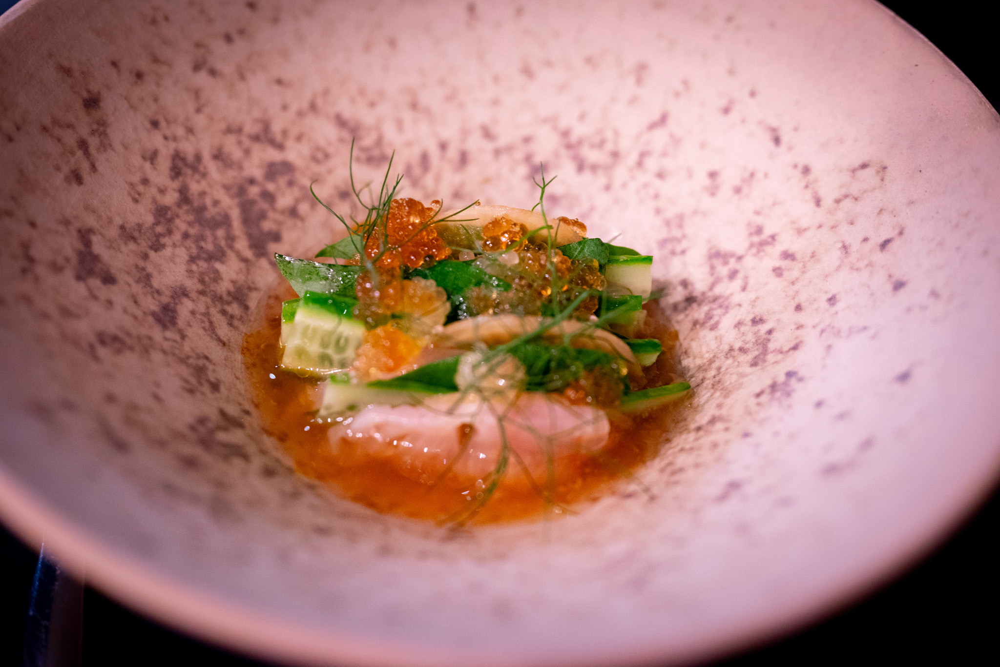

But I'm trying to take inspiration where I can. I managed to get great wild-caught coho salmon and did a fun Danish-inspired mustard cream foam with chives.

While I didn't have a chance to try Noma, my time in Copenhagen did persuade me to get a copy of [_The Noma Guide to Fermentation_](https://www.hachettebookgroup.com/titles/rene-redzepi/the-noma-guide-to-fermentation/9781579657185/) and start messing around with some of those techniques. Many (most) of them are a bit intimidating for me, at least at this stage of my journey. I'm not quite ready to buy a speed rack and a PID-controlled heater to build a fermentation chamber.

There are a few lacto ferments early in the book that looked more approachable. In a perfect world, I'd have liked to follow the directions in the book to the letter. But I wasn't very impressed with the plums I could get my hands on, and I couldn't find blueberries at all. Fortunately I managed to get my hands on the last gasp of the local strawberries, and tried a lacto ferment of those. I'm a big fan of preserved lemons --- which are fermented with the same microbes --- so I was optimistic about doing another fruit.

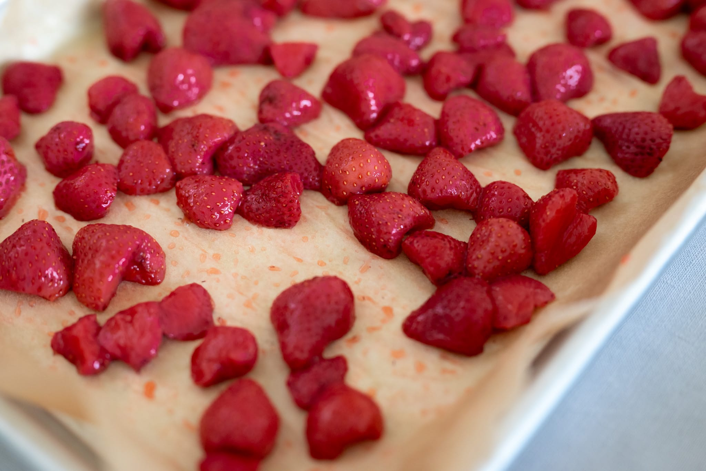

Unusually, I think I got it right on my first try. Or at least I was very happy with the results. I can see why some people wouldn't like lacto-fermented fruit. I'm now a very big fan. They still taste like strawberries, but with a little bit of extra complexity. Your lips pucker a bit from the acid, the salt used to catalyze the fermentation adds seasoning, and there's a little alcoholic fizz from the fermentation process. The salt drawing out water from the berries also helps concentrate the flavor.

The liquid from the ferment is almost as good as the strawberries themselves. They're great on yogurt, and I'm hoping to try them out with some seafood in a savory capacity, too.

The trip to Europe also gave me a way to continue investigating the elusive madeleines that I've been tinkering with for so long. I'm still trying to understand why the French recipes I've tried don't quite work when I follow them to the letter. One of the few variables I haven't been able to control for is the leavening. So I took the chance in Stockholm to pick up some Swedish baking powder. It's not perfect --- I'd really like some from France --- but I figured it might be worth trying out.

I haven't had a chance to try madeleines with the Swedish baking powder yet. I have used it now to do several batches of pancakes. The results raise more questions than they answer. The pancakes I did with the Swedish baking powder were consistently much worse than the ones I made using my usual US product. They were flat, tough, and chewy. Not qualities you want in a fluffy pancake. Without access to serious lab equipment, I can't really compare the chemical raising agents being used. It does seem possible that the differences in the bulking agent --- corn flour in the US baking powder, potato starch in the Swedish one --- might be the cause. Further investigation is needed.

In a completely different direction, I decided to start experimenting with Roman-style pizza _al taglio_. I like pizza, but it can be a bit of a production to do my approximation of Neapolitan-style pizza at home. I'm not sure I've completely cracked the process on this new style of pizza, but, like croissants, it's really difficult to make something that isn't reasonably tasty.

There's a balance I haven't quite managed to find in terms of the time that the bread (basically a focaccia) needs to bake properly and when to add the toppings so they don't overcook.

Last but not least (and perhaps rather predictably), I tried another Ottolenghi recipe from his team's [weekly _Guardian_ column](https://www.theguardian.com/food/2023/oct/07/how-to-cook-with-vinegar-yotam-ottolenghi-harissa-chicory-chicken-hot-sauce-scrambled-paneer-recipes). In particular, a sort of North African twist on _poulet au vinaigre_. I'd recommend it. I don't know that I'd recommend the brand of harissa that I bought when my favorite was sold out.

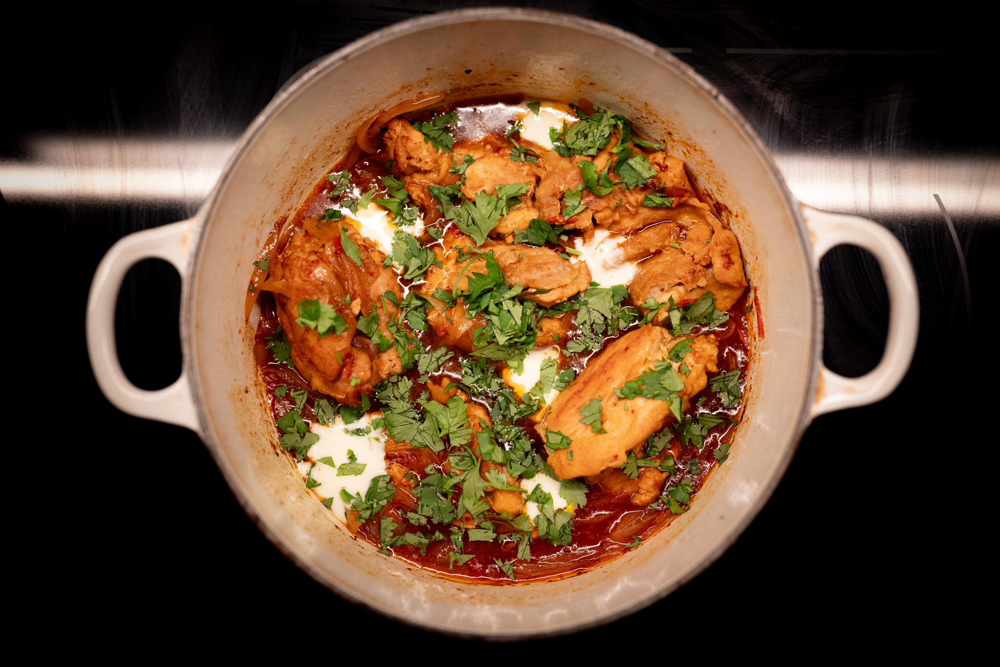

Looking forward to the month ahead, I'd say we've now officially transitioned to fall, and so I'm changing my menus accordingly. My heat came on for the first time since the summer last week.

It's nice to feel like I can get back into making and experimenting with soups without being completely ridiculous. All my time in these fine dining places in Copenhagen (and from my trip to Europe earlier in the year), I really have a yen to do ultra silky velouté of pumpkin or some other squash. Taking the time to pass everything through a sieve is not my favorite activity, but the results are worth it.



For reasons I don't entirely understand, my neighborhood takes Halloween very seriously. The streets on the hill are closed to cars, and some of my neighbors truly go all-out with the decorations. (It's very much a shibboleth: the neighborhood very pointedly does not do the same at Christmas.)

Without compromising my operational security, there isn't really anything festive I can do to contribute in an outward-facing way. Building on a tradition that I kind of fell into last year, I'm very tempted to make a sort of Halloween gingerbread house, substituting chocolate for ginger.

When I was doing the vinegar chicken, I had the idea to pair it with some [lavash](https://www.seriouseats.com/lavash-armenian-flatbread-5206283). I'm not really sure why. The chicken recipe sits culturally somewhere between France and the Maghreb. Lavash is more from places like Armenia or Turkey. Either way, I couldn't quite summon the energy to go through the process when the idea struck.



But I love a nice lavash, so I'm hoping I can find the time (and energy and willpower) in the month ahead to try it out and begin incorporating it into my repertoire.

Similarly on the bread front, spending so much time in Denmark and Sweden, it was hard not to eat a few cardamom buns. I never had one that struck me as exceptional. Still, I've become a huge fan of cardamom as a flavor. I got a tutorial for cardamom buns during the pandemic (over Zoom!) from a friend in 2020. I'm not sure how much of that knowledge I've retained. But I have to start somewhere in my quest to make one that really hits all the right notes.

### Experimental: What I'm Reading and Watching

* In _The Guardian_, leading voices in the food industry are [turning away from farmed salmon](https://www.theguardian.com/environment/2023/oct/14/its-a-poor-product-leading-uk-chefs-join-campaign-to-cast-farmed-salmon-off-menu)

* I've become a fan of the [_Carte Blanche_ newsletter](https://carteblanche.substack.com) from Vanity Fair France lifestyle editor Constance Dovergne. In the best way possible, it's definitely a lifestyle newsletter, but it feels a lot more intellectually sophisticated than the usual lifestyle newsletter. (Fair warning, this is in French!)

* On Hulu, I finally got around to watching [_The Bear_](https://www.themoviedb.org/tv/136315-the-bear). There are a lot of great details buried in there. Of course, you have to cut the tape.

* In a similar vein, the team behind _Boiling Point_ has adapted the characters into [a TV series](https://www.bbc.co.uk/iplayer/episodes/p0g5h206/boiling-point) of the same name.

_[Subscribe](https://landing.mailerlite.com/webforms/landing/k5w5z0) to get notified every month when new issues go out_
