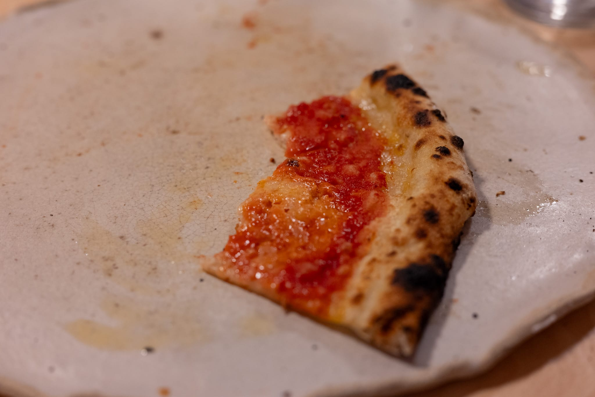
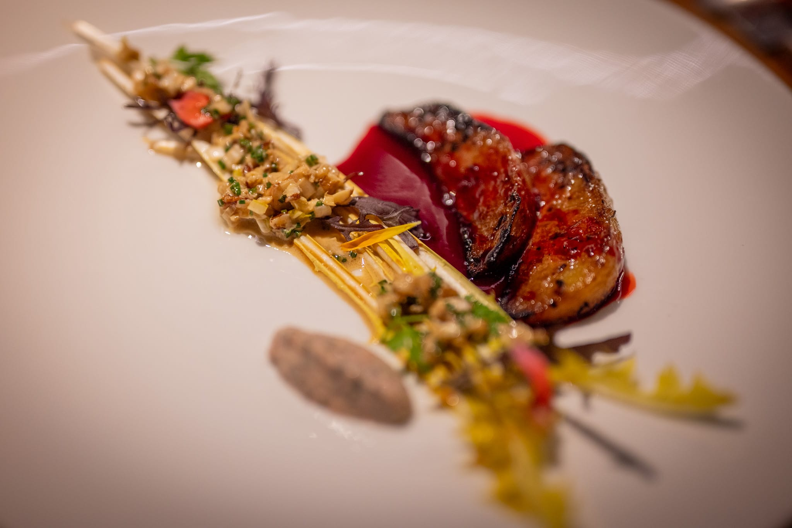

This has been a month of two halves. I spent most of the second half of September meandering around the UK and France with a very brief jump across the Swiss border. As usual, I tried to do too much on my trip. When I got back, I really reveled in the calmness of not running around from place to place and restaurant to restaurant.

In London I didn't have the time to revisit all of my favorites or try everything on my list. I'm trying to learn the lesson of every other trip I've been on and not commit myself to too much.

I made an obligatory stop at The River Cafe for lunch, always bemusing minor celebrity sighting included. (In this instance, a famous food person who shall remain nameless.) The weather was superlatively nice. I got very lucky. And I managed to find a path through three courses at lunch so I could be sure to have dessert.

Everything was great. My inner puritanical American wouldn't let me have a real cocktail at lunch, so I opted for something very tasty from their zero proof selection. The fig and arugula salad was amazing. The figs in particular were probably the best I've ever eaten. I'm also really eager to try recreating the deceptively simple pork pasta I had for a main course. As usual, I came away from the dessert thinking I really need to buy bigger cake pans. There's something really great about the incredibly substantial wedges of cake they serve, which you can't do by only cutting more "degrees" of a cake.

Did I love paying over $50 for a simple plate of pasta? No. Equally, you really can't deny it was basically faultless. You go to other Italian restaurants and you wonder why they can't do something as good for the $8 they're charging. Until you realize that execution that good is incredibly difficult.

In a (slightly) more avant garde direction, I made a trip to an Ottolenghi restaurant, Rovi. It was one of those fantastic experiences where you left feeling taken care of. My highlight was a very simple dish of chickpeas in a loose hummus-like sauce. Looking at the dish, you'd have been forgiven for thinking someone poured a can of chickpeas into a bowl with some hummus. On tasting it, that was very much not what it was.

I had a chance to try private equity success story Gail's as well. I'm of two minds. It's not the most incredible bakery I've ever tried. Nor do I think the people running the business think it's of that caliber. And there's a slightly rebellious part of me that bristles at the idea of a chain. On the other hand, I think the world would be a better place with more Gail's bakeries than, say, yet another bubble tea shop. If they opened one near me in Boston, I'd be a regular.

There was a surprising concentration of fun Japanese restaurants near where I was staying as well. My highlight was an ochazuke at a small Japanese café. It's the kind of food I wish I could get at a neighborhood restaurant near me at home. Tasty, convenient, and reasonably priced.

The second leg of my trip was in France, first in Annecy with a quick day trip to Geneva, and then in Paris. While France has a deserved reputation for caring about food, finding inspiring food isn't as easy as walking down the street and picking at random.

While it's nice there are decent options (read: not an over-seasoned kebab) at 11:30 in the evening in the capital, I didn't love paying about 30€ for a very mediocre meal after a delayed train got me into Paris a bit late.

Likewise, my meal at Flocon was good, not great. You'd struggle to find something better in Boston or New York at the price, but it didn't impress me. I left satisfied, but still thinking I would have been happier paying three times as much to have eaten a second time at The River Cafe.

More often than not I wound up getting a quick sandwich somewhere for lunch. I can't eat two "serious" meals at two serious restaurants in a day, putting aside the financial guilt of what would be spending upwards of $200 a day eating out. One highlight was a hip lunch place in Annecy that sits somewhere at the nexus of the US, Australia, and UK food. I had some tasty not-really-but-called-that Turkish eggs.

My more "serious" choices in Annecy also paid dividends. Bloomer was really lovely. They did a fun crudo of féra --- a local lake fish in the region --- that was pleasingly well-seasoned. I'd also go back to Choral, probably the most serious serious restaurant I tried in Annecy. The whole meal there was really outstanding. That team is going places. It's a good sign when your biggest complaint is not getting enough of the chocolate tart.

In Geneva I was both so tired and so shocked by the prices, I didn't try anything of note. If I ever go back, I'll need to really save my pennies. My extremely run-of-the-mill lunch at a chain that shall remain nameless was almost $50 after the currency conversion. I'm pretty sure I've never paid as much --- outside a super specialized tea room --- for a generic cup of good jasmine tea, even at places that have Michelin stars and set prices accordingly.

I couldn't get a table at my one must-try restaurant in Paris, Datil. That will have to wait for another time. I was tempted to put myself on the waiting list, but I didn't like the idea of either having to cancel on another restaurant or having to eat a terrible dinner at a tourist trap restaurant.

I did manage to snag a table at the pizza place _le tout Paris_ is obsessing over, Oobatz. It was very good to be sure. Even so, it wasn't the revelatory travel-to-the-other-side-of-the-world experience I thought it was going to be. Most telling, I spotted a copy of _Elements of Pizza_ --- from Ken Forkish, of Ken's Artisan Pizza --- on the bookshelf. Call it nostalgia. Call it snobbishness. While Oobatz is good, I think Ken's edges them out. (Though Oobatz definitely has a better beverage program.) I was intrigued that Oobatz uses pretty standard deck ovens rather than the cozy-romantic wood-fired oven they use at Ken's.

For lunch one afternoon I got a table at The Crying Tiger, what turned out to be a very on-trend Thai restaurant. At least, that's what I deduced from the fact that, had I arrived about 10 minutes later than I did, there's no way I could've gotten a table without having made a reservation. It was somewhere at the nexus of a hip brunch place in Williamsburg and the kind of cheap and cheerful Thai restaurant you find in the US. Really nothing to write home about, but I really can't eat French bistro food twice a day for that long. Eventually you want some rice or noodles. It was fine, if unremarkable: cheap and cheerful food with on-trend decor.

In the more positive-effusive column, I found a really lovely Japanese restaurant called Sanjo to feed my yen for rice. At some point I'll visit Japan. Until then, some of the best Japanese food I've ever eaten has been in Paris. Sanjo does ramen and rice bowls, and I thought does a very good job. While you couldn't accuse them of being inauthentic --- I'm fairly certain everyone working at the restaurant was from Japan, as one indication --- the cooking had flair. Everything was done with a level of execution beyond what I normally encounter. The poached egg on my rice bowl was incredible. I'm going to steal their technique of shredding the cabbage extremely finely rather than giving it a rough chop.

Without question the most technical and challenging food I had was at the current iteration of Fulgurances. I did the full eight-course set menu, which, as it happened, was almost entirely vegetarian. (A few sauces and garnishes were based on meat and fish. I may have also eaten a mussel or two.) When I had a quick conversation with the chef at the end of the meal, he said they tried the menu with meat and fish, and it didn't work as well.

Everything was great. You finished every dish wanting more, which is always a good sign. The first course was super fun, and it's good my server gave me clear instructions. It was a sort of xiaolongbao with a Western vegetable twist. Instead of a meaty, gelatin-rich interior, the dumpling was an explosion of late summer vegetables distilled into a mouthful of super flavorful liquid. Not what I was expecting. Very tasty. And it would've been a disaster if you hadn't consumed it in one. I was also a big fan of the tofu dish, which was served with a tomato foam and a bunch of other elements I've since forgotten.

Both desserts were definitely desserts, though played with savory flavors. I was scared when the first one came out and it centered around a cucumber sorbet. The second involved a dehydrated tomato. Yet both were definitely desserts --- that is, sweet rather than savory. The second was especially fun and challenging. It played with koji-fermented rice, one of the components used to make miso.

If I'm completely honest, there was a part of me that wanted some true pastry at the end in one of the dessert courses. A slice of cake. A biscuit. Maybe a tart of some sort. But that's splitting hairs. It was an excellent meal.

It was an almost hilarious contrast with the next dinner I ate on the flight back home. Both in terms of the caliber of cooking and the conservatism. There's nothing safer than chicken and green beans with a tarragon sauce. Though it must be said the food on Air France is (by airplane food standards) pretty decent.

Because I could, I brought back some bread from one of the great bakeries near my hotel. There's something wonderfully excessive about the idea of making toast in the morning with a loaf of bread from the other side of the world.

By the time I was back home, I was very ready to eat something other than all these technically complicated whiz-bang dishes. Fall also very much arrived shortly after my return. I think we've had our last day over 20 degrees until 2025.

While I'll lament the shorter days until after the solstice, I try to compensate by embracing the seasonal produce. I got my hands on some fun mini butternut squash and roasted those with olive oil and a tiny bit of honey, and served them with a tahini sauce and fennel fronds. Mostly for color, though it also lent the dish a nice whiff of anise flavor.

On my stop in London I picked up a copy of the new Ottolenghi cookbook, _Comfort_. There's a part of me that got a kick for having a copy before it was officially published in the US.

The Ottolenghi twist on a shakshuka was pleasingly nice. The tamarind in the recipe was a nice touch. It was a slightly disappointing reminder that it's a lot harder to buy curry leaves in the US than it is in UK supermarkets. I had to skip that component.



After enjoying it so much, I tried recreating the pasta dish I had at The River Cafe. It was a reminder that simplicity can be incredibly complicated. I got the flavor more or less right, but the texture was all wrong. The pork was too rubbery --- overcooked --- and I couldn't get the sauce to be as silky smooth and emulsified as the original. It's possible I need to add more fat. I think it's more likely that my pasta water isn't as starchy as what you'd get in a restaurant making portion after portion of pasta for all the guests. Further iteration is required.

The produce also reminded me we've definitively left summer. More specifically, I learned the hard way that I need to respect the seasons when it comes to certain products. I bought more of the expensive local strawberries. They weren't bad, but they weren't ambrosial either.

Looking to the month ahead, I've resolved to get back into working on the _tourte auvergnate_. I've gotten reasonably good at doing bread with a standard all-wheat flour dough. I love the texture and flavor you get from the rye flour, and I like a challenge.



This may finally nudge me over the line into buying a few proving baskets. I'm so space-constrained, I'm loathe to buy equipment that's so single purpose. It may be worth the sacrifice it in this case. I've gotten pretty far using a colander and lining it with a linen dishcloth, but I can do better.

Trying to embrace the change of seasons, I'm thinking of doing an apple dessert at some point when I have a good excuse or opportunity. There's the great tart that I've done a number of times due to Raymond Blanc, or I'm very tempted by the apple and blackberry tart that I had in London and that (coincidentally) got included in the new Ottolenghi cookbook, too.

I also like the idea of doing something with celeriac root, very much of the time of year. It's something I've had many times at restaurants, and enjoy. At least here in the US, however, it's really not something that's common enough to have really entered my repertoire in a meaningful way. As I was thinking about it more, I'm not sure I've ever actually cooked it myself at home.

### What I'm Reading and Watching

* Trends in [communal dining](https://www.ft.com/content/97f8abab-da0d-4235-8574-43a185895f5b) in Copenhagen

* Enterprising Australians [tried and failed](https://www.bbc.com/news/articles/cvglmr40lzlo) to bring back Crumbl(e) cookies from Hawaii and pass them off as first-party

* Also in Copenhagen, [a rave review](https://www.ft.com/content/fb483193-6c14-4518-a945-d6f3564d0f35) of a new fine dining experience

* A dive into the [true cost of our food](https://www.nytimes.com/interactive/2024/09/19/climate/food-costs-protein-environment.html) in The New York _Times_

* Might [portion sizes](https://www.nytimes.com/2024/09/24/dining/restaurant-portions.html) in US restaurants really be coming down?

* The Financial Times asks us [how hot or cold](https://www.ft.com/content/2d4273c4-79d8-456e-8a3e-fa6df6473f17) our food should be

_[Subscribe](/subscribe) to get notified every month when new issues go out_
