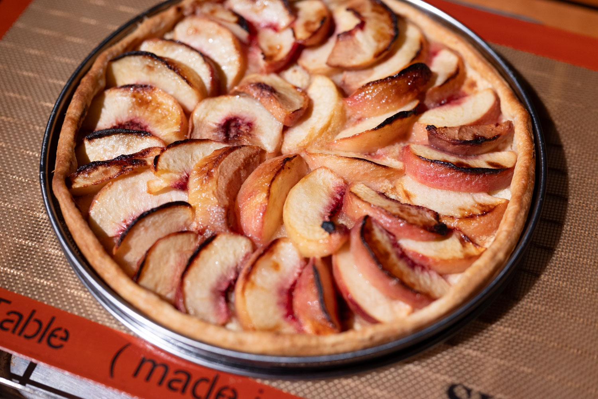
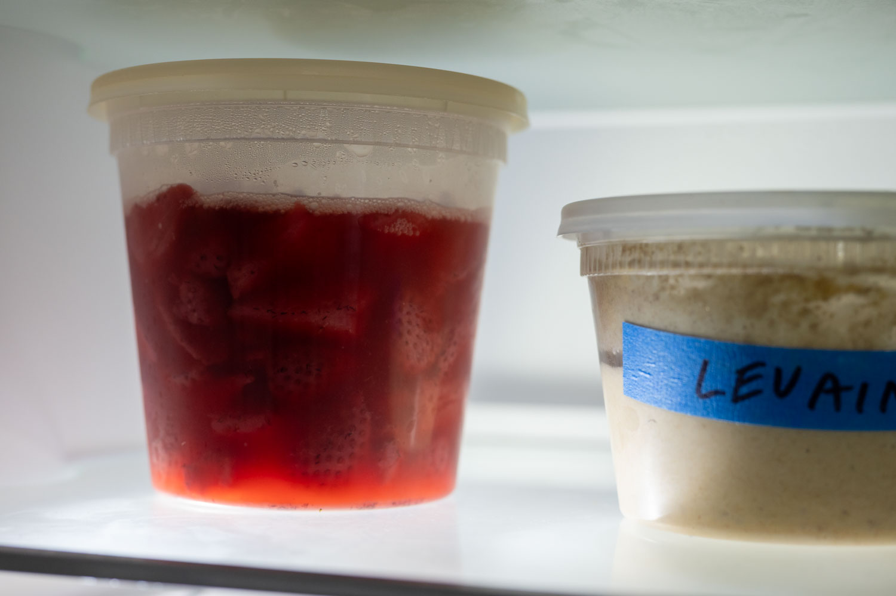
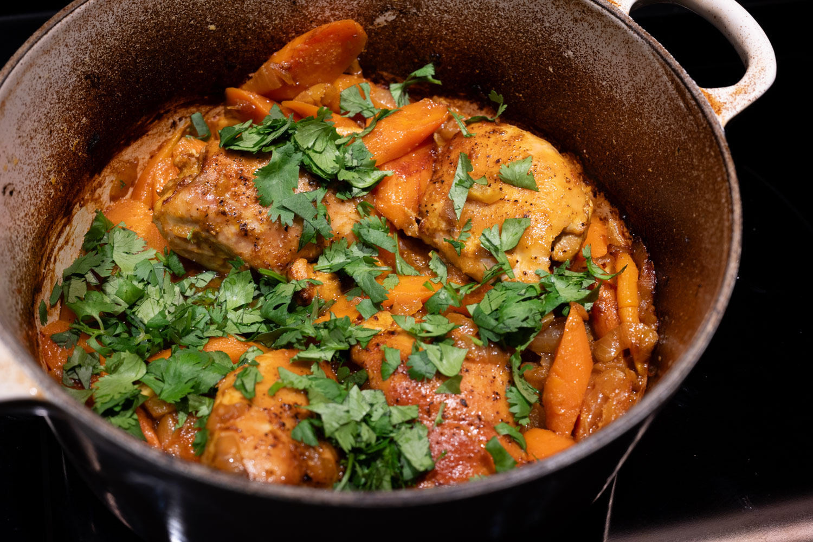
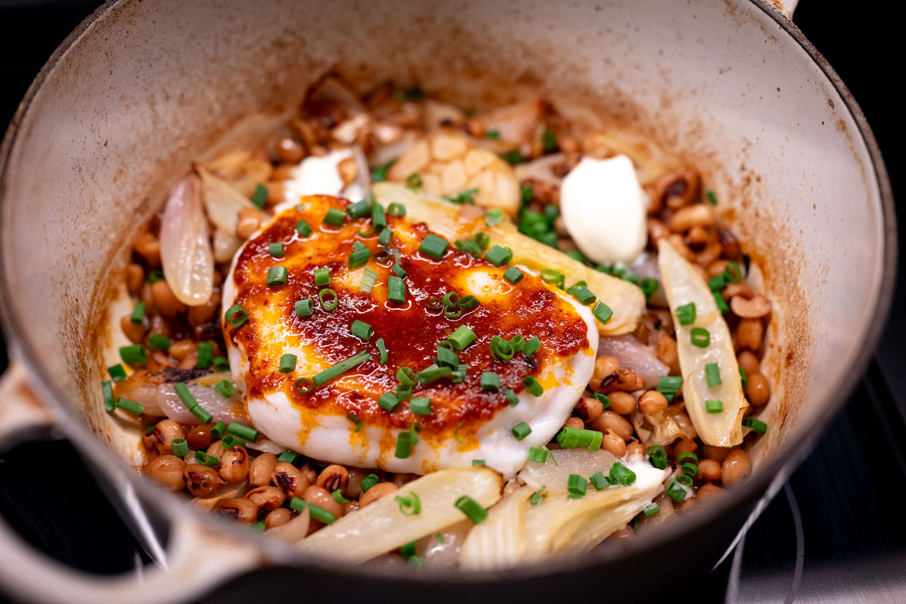
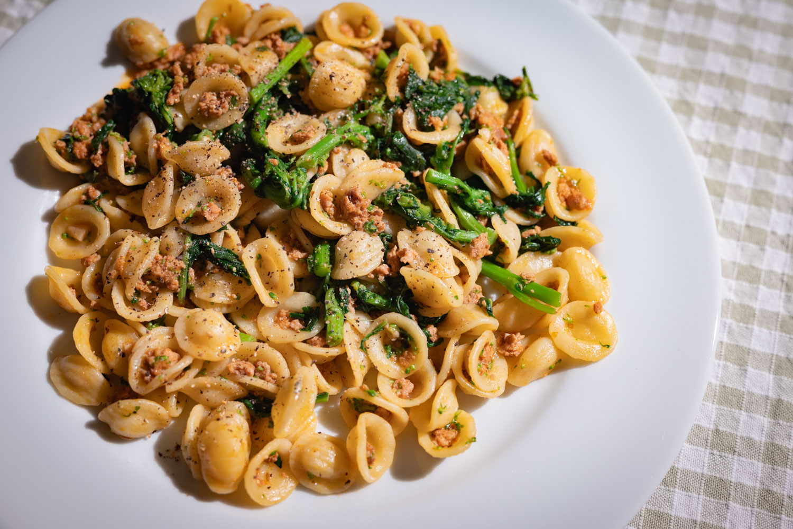
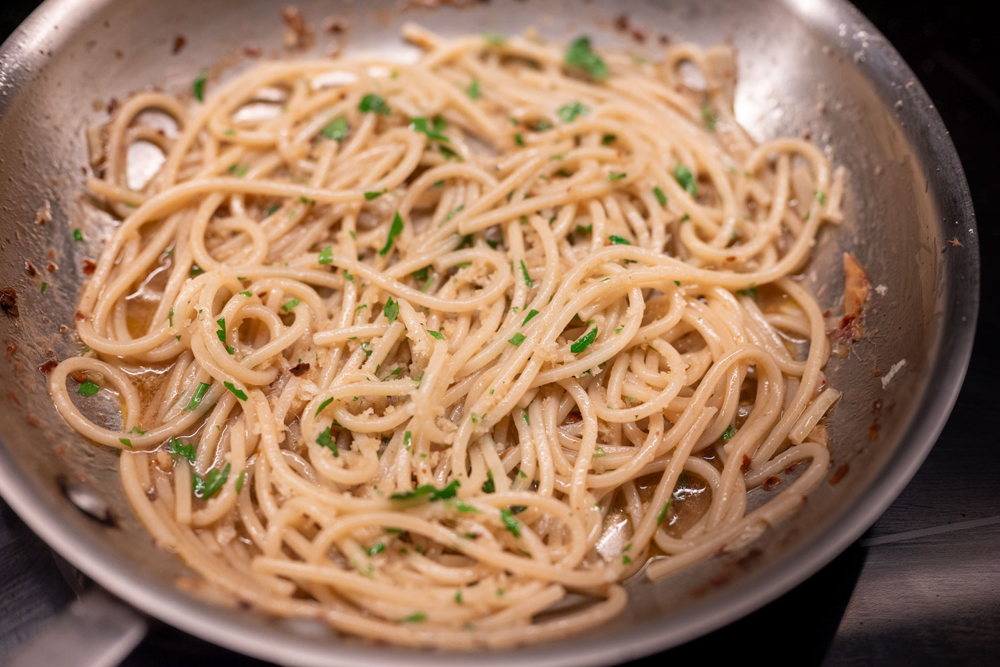
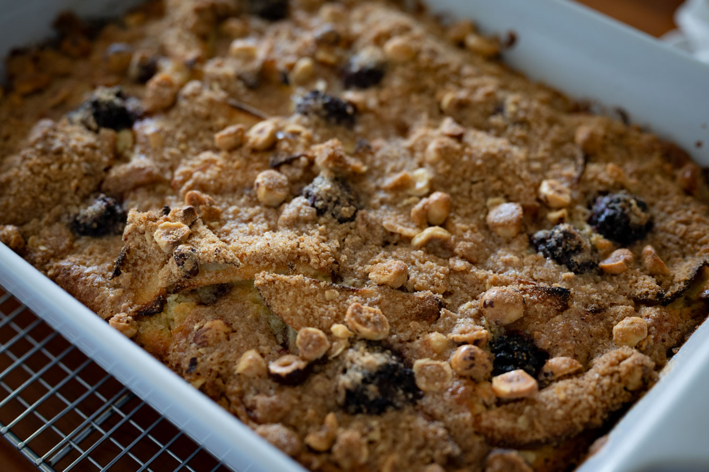
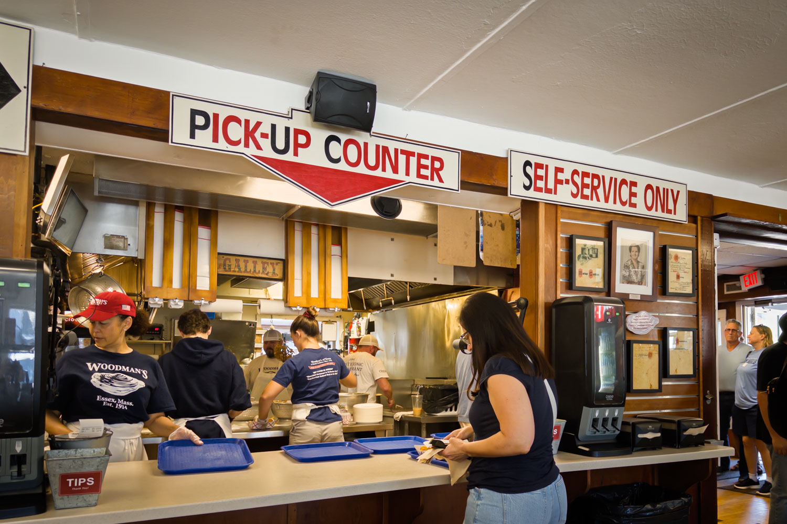

This blog is almost a diary of the weather as much as it is one about food. But then there's of course such a deep link between the seasons and what's good to eat.

All of which is to say, there was a surprisingly warm meteorological coda to close out September and as the debut to October. I'm not sure how much that really changed what was available to buy, but it certainly changed what I was in the mood for.

On the pastry side, this meant I could continue tugging at my summer fruit dessert thread. Starting with a couple of peach tarts, always a treat. There's still a bit of magic dust that I haven't been able to recapture from the one I had by the side of the road in Nice now over a decade ago. But I've got a good foundation to continue tinkering.

The good strawberries have also held out. It seems almost criminal to me to cook them, whether through baking or something like jam making. There's really not much better than a shortcake or a pavlova to really let them shine when they're good.

Fearing the end of strawberry season, I did yet another batch of lacto strawberries, mostly as a nice kick for breakfast when the mood strikes, but also in more creative applications.

I've been trying not to think to much about what my strawberry budget has been for the last few months.

The figs, by contrast, have been disappointing. I've paid some ridiculous prices, and nothing really brought me joy. Not that New England or the Northeastern US is really prime fig growing territory. But neither is this really a place to grow great peaches 

Returning to the lacto-fermentation angle, my latest batch of preserved lemons was ready to use by the end of September, so I did a bit of a North African-style chicken tagine. I'm sure what I make is more poulet basquaise than something a grandmother in the Maghreb would approve of. But it's still a nice weekday dinner, and the preserved lemons really do add a bit of something extra.

I tried another recipe from last fall's latest Ottolenghi cookbook, _Comfort_ that caught my eye.

The 'ndjuia-spiked fish with beans was definitely tasty. For my taste, the 'ndjuia butter suggested overpowered the fish. Next time, I'll probably forgo it, or at the very least dial it back. My favorite part was really the pleasant surprise of sometimes getting a wonderfully roasted clove of garlic among the beans. Good, but perhaps not a favorite I'm dying to make again.

Sometimes weeknights also mean that I don't have a ton of energy. If I have the tiny bit of foresight to pick up some broccoli rabe, I've really become a fan of the classic sausage-broccoli rabe combination as a truly effort-free weeknight meal. It really comes together in about 10 minutes, and I don't feel like it needs a salad or anything extra with a big helping of punchy bitter brassica in the mix.

Over the past few years I've become a real polenta obsessive. I'm not sure I've really mastered the technique. An Italian friend seemed almost scandalized by my suggestion that cheese be added, as in the recipe that I've been using for years from original blue-cover River Cafe cookbook.

Either way, I restocked and put my polenta supply to good use.

For a group dinner, I decided to adapt the wonderful summer ragù recipe that I discovered a couple months ago into something slightly more polished as a "topping" (for want of a better term) over polenta. I thought doing a simple swap of ground pork for pork shoulder would dress it up. While it tasted just fine, I didn't quite get the timing right. The pork wasn't quite fork tender by the time I needed to serve, and the sauce hadn't reduced quite the way I'd hoped.

My apple crumble cake (also from _Comfort_) was much more successful. This was the second or third time I've made it, and it's always a hit.

Out of the house, I made an impromptu beach trip with a friend on one of the year's last truly warm summer days. We needed lunch, and so stopped at (new to me) North Shore staple, Woodman's. As a clam chowder fiend, I had to try theirs. It was pretty good.

For November, we're creeping up to true entertaining season. I'm trying not to think about Thanksgiving yet; that will come in the December issue. But especially since I don't have meaningful outdoor space, there's a better congruence to hosting when the summer chapter closes for the year.

Especially when I'm cooking solo for a group, I've really come around to the idea of keeping it simple and doing dishes that I can do ahead of time.

Though if I can muster the energy, I really want to try revisiting the Josh Niland cookbook I got as a gift a few years ago. If I had to pick one restaurant to try, time and money no object, his place, Saint Peter, would be at the top of my list.



The techniques in his book are not for the faint of heart. They evoke the times I've tried more ambitious Thomas Keller recipes, like the French Laundry lobster "macaroni and cheese," or the time a friend and I did his version of lobster rolls from scratch. In both cases, incredibly delicious, but utterly exhausting.

Really looking ahead, I have an inexplicable yen to do some kind of cookie or biscuit using traditional wood presses.

In the past, I've been disappointed with the selection (if they were stocked at all) at usual sources like the small kitchenware store in my neighborhood. I'm trying to get ahead of this by doing my research and building in lots of lead time for a product from (say) a forgotten corner on Etsy.

Last but not least, I'm really hoping that, despite the tariffs and trade barriers, I can get my hands on the new Mokonuts cookbook.

### What I'm Reading and Watching

* An interesting investigation of the [rising popularity of the _bouillon_](https://www.youtube.com/watch?v=z9HywCy2PUM), sort of the Ryanair of restaurant formats in France

* Samin Nosrat was on _Fresh Air_ to promote her new book, and had a great conversation about the nature of success and home cooking with Sam Briger

* From Jay Rayner, the [banal-ification of high-end dining](https://www.ft.com/content/94d9659a-0a0f-4dff-92a8-77cbd0b14a49)

_[Subscribe](/subscribe) to get notified every month when new issues go out_

