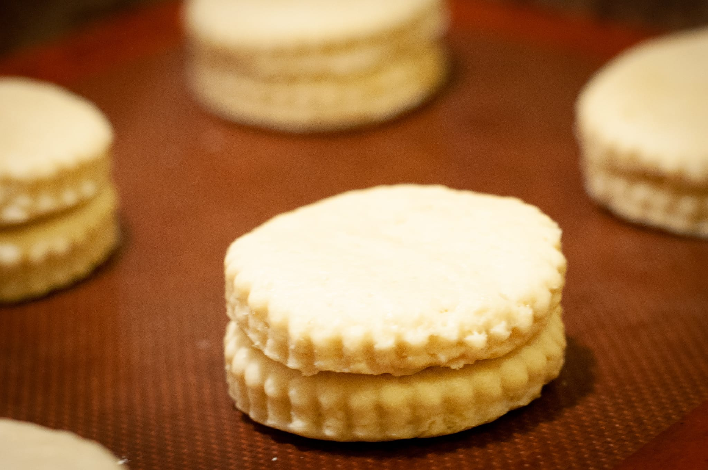
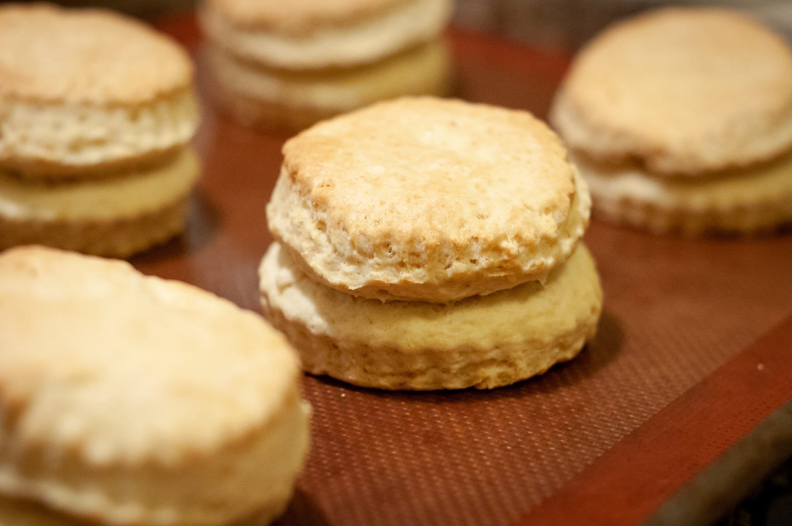

I've managed to avoid catching another bug, Covid or otherwise, over the last few weeks. It's been nice to get back to normal in that sense. Though in another sense, I feel like I haven't profited enough of the summer. Now that the delta variant is causing problems, I'm afraid to venture far beyond the protective Massachusetts bubble. The delta variant (and my fellow citizens' poor response to the whole situation), may also scupper my plans for a fall vacation in Europe.

Photo-wise, I've just about talked myself into buying a new camera. My trusty Nikon D90 has lasted more than a decade, amazingly enough. It's time to move into the world of mirrorless. I'm likely going with a Nikon Z5 and then can take the savings versus the Z6II and put it to new lenses. This should mean more and better food photos as well as the potential for some video content.

There is also, of course, the looming possibility this newsletter will turn into something altogether more fun when my kitchen renovation project gets going. Unfortunately, I'm [feeling pessimistic about that](https://jkibe.github.io/kitchen145/). Suffice to say that everything is more expensive than either I or my architects had predicted. There's a chance it will happen relatively soon, and a chance that it may wait for the spring.

With travel relatively limited and indoor dining seeming like a less great idea than a couple of months ago, I haven't tried anywhere especially interesting to eat. In that sense, we're almost back to confinement cooking.

Much of what I've been up to has been relatively unexciting. I've been big on summer staples that, in an ideal world, make a lot more sense outdoors than in my very urban apartment setting. That is to say, dishes like linguine with shellfish, seafood paella, tacos of all sorts, and lots pizza. I'm increasingly happy with my ability to consistently execute a deeply-flavored paella in under 30 minutes. I also splashed out a couple of times for some very pricey (but delicious) peak-season king salmon from Alaska, served, of course, with some salsa verde.

For sweets, I kept taking advantage of the very brief window I could get truly great strawberries. I shudder to think how much butter and cream I ate with all the shortcake that I baked at the end of August, but I think it was worth it.

After a forced hiatus when my sourdough culture collapsed, I'm slowly getting my bread situation back to where I'd like it to be as well. I did the best baguettes I've done in months this afternoon.

Less rosily, the people at Ottolenghi let me down. Not in a big way, but more in an underwhelming way. I tried one of their recipes for a mushroom-orzo dish, which, however much they suggested gussying it up, was exactly what it sounded like. Which is fine: nicely roasted mushrooms with the not pilaf-pilaf quality of the orzo was nice. But it wasn't quite as much of a revelation as something like the black pepper tofu that I tired a few months ago.

There was also an incidentally vegan cashew curry that was equally underwhelming. To the extent I didn't bother to write down the provenance.

My annual peach tart experiment still didn't hit the level of the original. Though it was good enough that when I sat down to write this newsletter, I realized I had forgotten to take photos in my eagerness to try it. My new hunch is that it needs more intense heat to really caramelize the peaches.

As summer winds down, I'm feeling emboldened to dip my toes into more autumnal dishes.

The most obvious place to start is a nice ragù so I can finally try out the cascatelli pasta I've had sitting around for months. Much as I love a rich tomato sauce, it felt wrong to do in the summer, even with air conditioning. Not to mention, that it crowds out even summer pasta dishes like a nice linguine with mussels.

Assuming I can get my hands on a copy, I'm looking forward to the new Ottolenghi cookbook, [Shelf Love](https://www.waterstones.com/book/ottolenghi-test-kitchen-shelf-love/yotam-ottolenghi/noor-murad/9781529109481). Partly because an Ottolenghi cookbook is always a good source of inspiration, but also partly because I suspect it will be easier to get other people excited about these recipes. The book was written with the constraints of lockdown biting, and so they promise to be a bit less demanding than the usual Ottolenghi fare. It may just escape my "no new stuff" rule imposed since my kitchen project became a serious prospect.

Cooler weather makes hot soups --- a favorite genre --- more of a possibility. I suspect I may need to restock on dried beans from the people at Rancho Gordo. It might be a little premature, but I love a nice pasta e fagioli (pasta and bean soup). That also makes me think of excellent ways to use legumes like borlotti beans for a nice autumnal bruschetta.

It's apple season in New England, so there's a possibility of getting apples that are both local and delicious, in my continuing seasonal dessert theme. They're great in a galette. I may also try my hand at recreating the legendary tarte aux pommes from one of my favorite bakeries in Paris. I'm also a big fan of Italian-style apple cake, which is one of the easiest desserts to whip together on a whim.

The cooler weather also opens the door to dipping my toes back into the subtle world of the croissant. I've been working on getting those down for two years now, and I'm getting closer. They're a lot easier to pull off when it's not incredibly hot and the butter melts more easily than you'd like. Stayed tuned for photos there.

Last but not least, I should have more adventures to report on. I'll be making a trip somewhere interesting for both buisness and pleasure next month, which should be a great excuse to try great places to eat.
