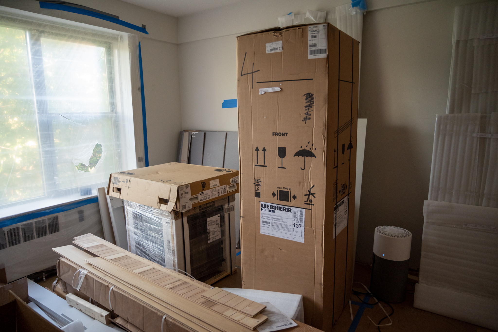

At this point, it should surprise no one that [the kitchen](https://jkibe.github.io/kitchen145/) (still) isn't done. It feels tantalizingly close, yet remains elusive. In the last week, nothing happened on site. Which is not necessarily to say that nothing has happened at all. There are elements of Greek drama I'm sure, unseen actions taken off-site that I'm not even aware of.

Still left to do: everything from the countertops to the finish plumbing and electric. It would be really nice to get my fridge-freezer installed. Most of my major appliances were delivered a few weeks ago. They're all sitting in my living room, ready to be installed, taunting me.

I'm not even going to try predicting when the project will be completed at this point. 

In the meantime, I had a few interesting food-relevant outings.

I went to [Sarma](http://sarmarestaurant.com) for the first time in ages. It's one of those places that everyone knows is good, and so I'm always wary going without a reservation. That itself tends to require more advance planning than I can do right now. As it turned out, it was pretty easy to get a table on a weeknight.

It's as good as ever. Probably my favorite dish of the evening was a honey-inflected Middle Eastern cornbread.

A friend of mine has developed a deep interest in barbecue, and I had a chance to try some of her barbecue exploits as well. It was clear a lot of thought and effort had gone into it. It was excellent, very much not something an amateur can make at home, and frankly better than a lot of what you can get in restaurants in Massachusetts. It's always fun to see another person applying the scientific method to cooking.

I also took a slightly impromptu trip up to Montréal. The French influence in Québec goes deeper than the language and extends to the food culture. While it's not exactly like being in France --- the size of the cars on the road are the biggest tell --- people don't have the same kind of transactional relationship with food that I feel like most people have in the anglophone world. It's a simple pleasure rather than something that has to be binned as either super healthy or likely to kill you.

Less philosophically, I went back to one of my favorite bakeries in the city. After so many months without an oven of my own, it was indescribably nice to have a nice loaf of bread.

Looking forward to the month ahead, it goes without saying I'd love to get back into the kitchen. My optimism has been pretty beaten down through the renovation project. I'm hoping to be pleasantly surprised by progress as everything plods along. I'm dying to try out my fancy new oven with its steam injection system.

For now, I have to live vicariously through others or the rare opportunity to cook in friends' kitchens.

If you do have a kitchen, I'm very excited for the latest release from the Ottolenghi team. They're back with a follow up to _Shelf Love_ called [_Extra Good Things_](https://www.waterstones.com/book/ottolenghi-test-kitchen-extra-good-things/yotam-ottolenghi/noor-murad/9781529109474). As it won't go on sale for another couple of weeks, my opinion is based purely on reputation and the handful of [new videos](https://www.youtube.com/watch?v=C-qdoBuugIg) they've released taken from the book. In usual Ottolenghi fashion, I'm certainly intrigued.
